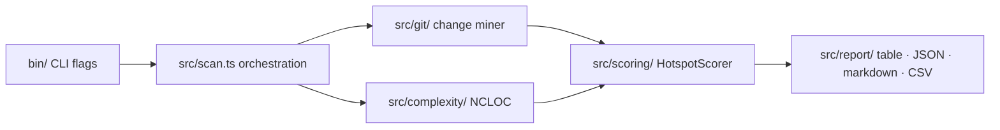

# Design

**Goal**: Define HOW to build it. Architecture, components, what to reuse.

**Skip this phase when:** The change is straightforward — no architectural decisions, no new patterns, no component interactions to plan. For simple features, design happens inline during Execute.

## Process

### 1. Load Context

Read `.specs/features/<slug>/spec.md` before designing. If `.specs/features/<slug>/context.md` exists, load it too — it contains implementation decisions that constrain the design (layout choices, behavior preferences, interaction patterns). Decisions marked as "Agent's Discretion" are yours to decide.

### 1.5. Research (Optional but Recommended)

If the feature involves unfamiliar technology, patterns, or integrations, research before designing. Document findings briefly in the design doc or as inline notes. This prevents incorrect assumptions from propagating into tasks.

Follow the **Knowledge Verification Chain** ([SKILL.md](../SKILL.md) § Knowledge verification) in strict order:

```
Codebase → AGENTS / vitals-project / .specs/codebase → Official docs → Flag as uncertain
```

**CRITICAL: NEVER assume or fabricate information.** If you cannot find an answer through the chain, explicitly say "I don't know" or "I couldn't find documentation for this". Inventing an API, a pattern, or a behavior that doesn't exist is far worse than admitting uncertainty. Wrong assumptions propagate through design → tasks → implementation and cause cascading failures.

Good triggers for research: new libraries, unfamiliar `git` / Node APIs, performance-sensitive pipeline stages, patterns you haven't used in this codebase before. Domain context: [`vitals-pipeline-domain`](../../vitals-pipeline-domain/SKILL.md).

### 2. Define Architecture

Overview of how components interact along the pipeline (`git log` → NCLOC → scoring → report). Use mermaid diagrams when helpful.

### 3. Identify Code Reuse

**CRITICAL**: What existing code can we leverage? This saves tokens and reduces errors.

If `.specs/codebase/CONCERNS.md` exists, check it before designing. Any component flagged as fragile, carrying tech debt, or having test coverage gaps requires extra care in the design — document how the design mitigates those concerns.

### 4. Define Components and Interfaces

Each component: Purpose, Location, Interfaces, Dependencies, What it reuses.

### 5. Define Data Models

If the feature involves data, define models before implementation.

---

## Template: `.specs/features/<slug>/design.md`

````markdown
# [Feature] Design

**Spec**: [`.specs/features/<slug>/spec.md`](./spec.md)
**Status**: Draft | Planned | Approved | Done

---

## Architecture Overview

[Brief description of the architecture approach — where the change sits in the pipeline]



---

## Code Reuse Analysis

### Existing Components to Leverage

| Component          | Location                    | How to Use                |
| ------------------ | --------------------------- | ------------------------- |
| [Existing module]  | `src/git/aggregate.ts`      | [Extend/Import/Reference] |
| [Existing helper]  | `src/report/table.ts`       | [How it helps]            |
| [Existing pattern] | `src/config/load-config.ts` | [Apply same pattern]      |

### Integration Points

| System                            | Integration Method                                  |
| --------------------------------- | --------------------------------------------------- |
| `git log` (child process)         | [How the new feature consumes the stream]           |
| `.hotspot-scanner.json` config    | [New keys; precedence CLI > config > defaults]      |
| JSON contract (`schemas/`)        | [Additive field? contract `version` impact?]        |
| CLI surface (`bin/`)              | [New flags, exit codes — docs/cli-reference.md]     |

---

## Components

### [Module Name]

- **Purpose**: [What this module does - one sentence]
- **Location**: `src/<owner>/` (per implementer-routing.md)
- **Interfaces**:
  - `functionName(param: Type): ReturnType` - [description]
  - `functionName(param: Type): ReturnType` - [description]
- **Dependencies**: [What it needs to function]
- **Reuses**: [Existing code this builds upon]

### [Module Name]

- **Purpose**: [What this module does]
- **Location**: `src/<owner>/`
- **Interfaces**:
  - `functionName(param: Type): ReturnType`
- **Dependencies**: [Dependencies]
- **Reuses**: [Existing code]

---

## Data Models (if applicable)

Domain types live in `src/types/` — no runtime logic.

```typescript
/** [One-line purpose, matching the JSDoc style in src/types/domain.ts]. */
export interface NewMetricResult {
  filePath: string;
  value: number;
}
```

**Relationships**: [How this relates to `FileChangeStats` / `ComplexityResult` / `HotspotScore` and to the JSON contract fields]

---

## Error Handling Strategy

| Error Scenario                  | Handling                        | User Impact (stderr / exit code)     |
| ------------------------------- | ------------------------------- | ------------------------------------ |
| [Not a git repository]          | [How handled]                   | [Message + exit code]                |
| [Empty scan scope]              | [How handled]                   | [Warning + exit code]                |

Exit codes SoT: `docs/cli-reference.md` § Exit codes.

---

## Tech Decisions (only non-obvious ones)

| Decision          | Choice          | Rationale     |
| ----------------- | --------------- | ------------- |
| [What we decided] | [What we chose] | [Why - brief] |
````

---

## Tips

- **Load context first** — If context.md exists, decisions there are locked
- **Research when uncertain** — 5 minutes of research prevents hours of rework
- **Reuse is king** — Every component should reference existing patterns
- **Interfaces first** — Define contracts before implementation
- **Keep it visual** — A mermaid flowchart of the affected pipeline stages saves 1000 words
- **Small modules** — If a module does 3+ things, split it
- **Respect module owners** — [implementer-routing.md](../../vitals-common/references/implementer-routing.md)
- **Check CONCERNS.md** — If it exists, flag fragile areas the design must address
- **Confirm before Tasks** — User approves design before breaking into tasks
