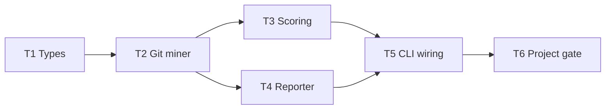

# Tasks

**Goal**: Break into GRANULAR, ATOMIC tasks. Clear dependencies. Module owners. Parallel execution plan.

**Skip this phase when:** the work is a ≤3-file, one-sentence change — run it through [quick-mode.md](quick-mode.md) instead of writing a `tasks.md`. Safety valve: if informal steps exceed 5 or gain complex dependencies, come back and write the tasks.

## Why Granular Tasks?

| Vague Task (BAD)          | Granular Tasks (GOOD)                                            |
| ------------------------- | ---------------------------------------------------------------- |
| "Add churn reporting"     | T1: Aggregate commit counts per file in `src/git/aggregate.ts`   |
|                           | T2: Expose churn in `HotspotScorer` inputs (`src/scoring/`)      |
|                           | T3: Add churn column to the table reporter (`src/report/`)       |
|                           | T4: Wire the flag in `bin/scan-actions.ts`                       |
| "Improve NCLOC analyzer"  | T1: Add indentation metric to `src/complexity/`                  |
|                           | T2: Extend the analyzer result type in `src/types/`              |
|                           | T3: Emit the new field in JSON report (`src/report/` + `schemas/`) |

**Benefits of granular:**

- **Agents don't err** - Single focus, no ambiguity
- **Easy to test** - Each task = one verifiable outcome
- **Parallelizable** - Independent tasks run simultaneously
- **Errors isolated** - One failure doesn't block everything

**Rule**: One task = ONE of these:

- One module change under a single owner prefix ([implementer-routing.md](../../vitals-common/references/implementer-routing.md))
- One function or exported helper
- One CLI flag + its wiring
- One file change

---

## Process

### 1. Review Design

Read `.specs/features/<slug>/design.md` before creating tasks.

### 1.5. Load Test Coverage Matrix

Read [TESTING.md](../../../../.specs/codebase/TESTING.md) before creating tasks — its Test Coverage Matrix and Parallelism Assessment drive two decisions:

**Co-located tests:** every task that creates or modifies a code layer with a required test type MUST include writing/updating those tests in the same task. Tests are NOT separate tasks. Canonical rules + validation table: [task-validation.md](task-validation.md) § Check 3.

**Parallelism flags:** keep `[P]` only when the task's required test type is parallel-safe per TESTING.md § Parallelism assessment; otherwise strip it. A task with no tests depends only on code dependencies. Full constraint list: § Parallelism below.

### 1.6. Gate per task (no tiers)

This project has **one** product gate — `pnpm verify`
([quality-gates.mdc](../../../rules/quality-gates.mdc), [TESTING.md](../../../../.specs/codebase/TESTING.md) § Quality gate).
Equivalent to `pnpm build && pnpm test && pnpm lint && pnpm format:check`. There are **no** Quick / Full / Build tiers.

| Task position           | `Gate` field                                                              |
| ----------------------- | ------------------------------------------------------------------------- |
| Any implementation task | Targeted Vitest run, e.g. `pnpm exec vitest run src/git/aggregate.test.ts` |
| Docs-only task          | `none beyond review (project gate in the final task)`                     |
| Final task of a feature | `pnpm verify`                                                             |

Every feature ends with a task whose gate is the project gate — nothing is Done without it.

### 2. Break Into Atomic Tasks

**Task = ONE deliverable**. Examples:

- ✅ "Add `renameConfidence` to the git miner result type" (one file, one concept)
- ❌ "Improve rename handling" (too vague, multiple modules)

### 3. Define Dependencies

What MUST be done before this task can start?

### 4. Create Execution Plan

Group tasks into phases. Identify what can run in parallel.

### 5. Validate Before Presenting (MANDATORY)

Before showing tasks to the user, run **all** pre-approval checks in [task-validation.md](task-validation.md) (granularity, diagram cross-check, test co-location, path conflict). Output validation tables with the tasks. Any ❌ → restructure — do not present failing tasks for approval.

### 6. Set Status and Hand Off

Planning ends here: set `Status: Planned` and deliver the handoff message per [planning-session-boundary.md](planning-session-boundary.md). Do not start Execute in this session.

---

## Template: `.specs/features/<slug>/tasks.md`

````markdown
# [Feature] Tasks

**Spec**: [`.specs/features/<slug>/spec.md`](./spec.md)
**Design**: [`.specs/features/<slug>/design.md`](./design.md)
**Status**: Draft | Planned | Approved | In Progress | Done

---

## Execution Plan

### Phase 1: Foundation (Sequential)

Tasks that must be done first, in order.

```
T1 → T2
```

### Phase 2: Core Implementation (Parallel OK)

After foundation, these can run in parallel (disjoint module owners).

```
T2 ──┬→ T3 [P] ─┬──→ T5
     └→ T4 [P] ─┘
```

### Phase 3: Wiring + gate (Sequential)

```
T5 → T6
```



---

## Task Breakdown

### T1: Extend the analyzer result type

**What**: [One sentence: exact deliverable]
**Where**: `src/types/domain.ts`
**Depends on**: None
**Reuses**: Existing `FileChangeStats` / `ComplexityResult` shapes
**Requirement**: HOTSPOT-NNN

**Done when**:

- [ ] Field added and re-exported via `src/types/index.ts`
- [ ] No JSON schema / contract change (or schema updated in the reporter task)
- [ ] Consumers typecheck

**Tests**: none (types layer — excluded from coverage)
**Gate**: `pnpm exec tsc -p tsconfig.json --noEmit`

---

### T2: Aggregate per-file commit counts in the git miner

**What**: [Exact deliverable]
**Where**: `src/git/aggregate.ts`, `src/git/aggregate.test.ts`
**Depends on**: T1
**Reuses**: Existing streaming `git log` parser (`src/git/parse.ts`)
**Requirement**: HOTSPOT-NNN

**Done when**:

- [ ] Counts match the fixture repo expectations
- [ ] Rename chains attribute churn to the current path
- [ ] Gate passes: `pnpm exec vitest run src/git/aggregate.test.ts`
- [ ] Test count: [N] tests pass (no silent deletions)

**Tests**: unit
**Gate**: `pnpm exec vitest run src/git/aggregate.test.ts`

---

### T3: Feed churn into the hotspot score [P]

**What**: [Exact deliverable]
**Where**: `src/scoring/hotspot-scorer.ts`, `src/scoring/hotspot-scorer.test.ts`
**Depends on**: T2
**Reuses**: Existing `HotspotScorer` normalization helpers
**Requirement**: HOTSPOT-NNN

**Done when**:

- [ ] Ranking matches the design's worked example
- [ ] Empty-churn input degrades gracefully
- [ ] Gate passes: `pnpm exec vitest run src/scoring/hotspot-scorer.test.ts`
- [ ] Test count: [N] tests pass (no silent deletions)

**Tests**: unit
**Gate**: `pnpm exec vitest run src/scoring/hotspot-scorer.test.ts`

---

### T4: Render the new column in the table reporter [P]

**What**: [Exact deliverable]
**Where**: `src/report/table.ts`, `src/report/table.test.ts`
**Depends on**: T2
**Reuses**: Existing column-width helpers
**Requirement**: HOTSPOT-NNN

**Done when**:

- [ ] Column renders with and without color (TTY / non-TTY)
- [ ] Gate passes: `pnpm exec vitest run src/report/table.test.ts`
- [ ] Test count: [N] tests pass (no silent deletions)

**Tests**: unit
**Gate**: `pnpm exec vitest run src/report/table.test.ts`

---

### T5: Wire the flag in the CLI

**What**: [Exact deliverable]
**Where**: `bin/scan-actions.ts`, `bin/hotspot-scanner.test.ts`
**Depends on**: T3, T4
**Reuses**: Existing flag parsing + config merge (CLI > config > defaults)
**Requirement**: HOTSPOT-NNN

**Done when**:

- [ ] Flag documented in `docs/cli-reference.md`
- [ ] Exit codes unchanged
- [ ] Gate passes: `pnpm exec vitest run bin/hotspot-scanner.test.ts`
- [ ] Test count: [N] tests pass (no silent deletions)

**Tests**: unit (CLI validation via `vitals-cli-validation` before Done)
**Gate**: `pnpm exec vitest run bin/hotspot-scanner.test.ts`

**Commit**: `feat([scope]): [description]`

---

### T6: Project gate

**What**: Run the project gate and record the result
**Where**: none (verification)
**Depends on**: T5
**Requirement**: (verification)

**Done when**:

- [ ] `pnpm verify` passes with coverage thresholds met

**Tests**: none
**Gate**: `pnpm verify`
````

---

## Parallelism

A task marked `[P]` must have ALL of these:

- No unfinished dependencies
- Disjoint module owner prefixes ([implementer-routing.md](../../vitals-common/references/implementer-routing.md))
- Required test type is parallel-safe (per TESTING.md § Parallelism assessment)
- No shared mutable state with other `[P]` tasks in the same phase

Never parallelize two tasks that both touch `src/scan.ts`, `bin/hotspot-scanner.ts`, or `schemas/`. If a task's tests are NOT parallel-safe it runs sequentially even when its implementation code has no dependencies — test execution is the bottleneck.

How `[P]` tasks are dispatched is an Execute-session concern: [`vitals-execute`](../../vitals-execute/SKILL.md).

---

## Pre-approval validation

Canonical checks (granularity, diagram, test co-location, path conflict, Done when / Verify standards): **[task-validation.md](task-validation.md)**.

## Tips

- **[P] = Parallel OK** — Mark tasks that can run simultaneously
- **Reuses = Token saver** — Always reference existing code
- **One module owner per task** — [implementer-routing.md](../../vitals-common/references/implementer-routing.md)
- **Dependencies are gates** — Clear what blocks what
- **Done when = Testable** — If you can't verify it, rewrite it
- **Requirement ID = Traceable** — Every task traces back to a spec requirement (`HOTSPOT-*`)
- **One gate, one final task** — Targeted Vitest per task; `pnpm verify` closes the feature
- **One commit per task** — Plan the commit message format in advance
