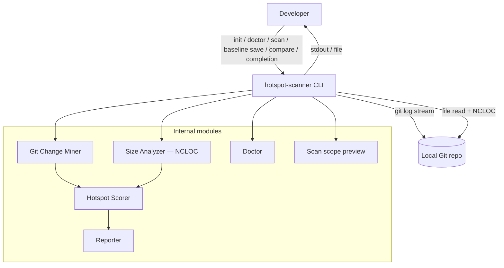
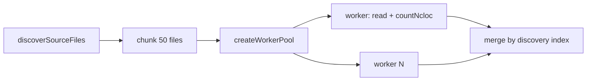

# ARCHITECTURE — @vitals/hotspot-scanner

## Container view



## Pipeline (M57)

```
git log (streaming numstat) → NCLOC size analysis (file-level) → hotspot score → report
```

Optional `--baseline` → compare → delta report. JSON contract **`version: "3.0"`** with `ncloc` on each hotspot. **File hotspots only** — no function granularity, no McCabe, no `ts-morph`.

## CLI commands (M39–M40)

Multi-command CLI via Commander in `bin/hotspot-scanner.ts` with shared wiring in `bin/scan-actions.ts` (flags, I/O, exit mapping only — no domain logic):

| Command | Module | Behavior |
| ------- | ------ | -------- |
| `init [dir]` | `src/config/exemplar.ts` (`writeInitConfig`) | Writes locked exemplar `.hotspot-scanner.json`; refuses overwrite without `--force` |
| `doctor [path]` | `src/doctor/` (`runDoctor`, `formatDoctorJsonReport`) | Pre-flight checks: Node `engines`, git on PATH, git repo via shared `resolveScanPipelineContext`, config discovery/validity, **`scope`** inventory (`previewScanScope` — eligible count parity with `scan --dry-run`), tsconfig/jsconfig info; optional `--include-tests`; `-f, --format text\|json`; aggregate exit policy; **does not** invoke Git Change Miner, size analyzer, scorers, or Reporter |
| `scan [path]` | `src/scan.ts` (`runScan`) via `bin/scan-actions.ts` | Full pipeline (see [Data flow (scan)](#data-flow-scan)); optional `--baseline` → compare path |
| `scan --dry-run` | `src/scan-preview.ts` (`previewScanScope`) | Merges config, validates repo + git, builds `PathScope`, counts via `discoverSourceFiles` — **does not** mine git or run NCLOC |
| `baseline save <path>` | `runScan()` + `bin/scan-actions.ts` | Runs full scan, writes loadable `ScanResult` JSON; `--output` default `./hotspot-baseline.json` |
| `compare <path> --baseline <file>` | `runScan()` + `src/compare/` + `src/report/` via `bin/scan-actions.ts` | Same compare-and-render sequence as `scan --baseline` |
| `completion <shell>` | `bin/completion-scripts.ts` (`getCompletionScript`) | Static bash/zsh/fish completion script to stdout |

`--dry-run` rejects `--baseline` (`CliUsageError`); `--format` / `--output` are ignored (plain-text preview on stdout).

## Data flow (scan)

1. CLI dispatches commands; shared scan/compare wiring in `bin/scan-actions.ts`. Scan flags include `--since`; `-f` / `--format`; `-t` / `--top`; `--include` / `--exclude`; `--config`; `--concurrency`; `-o` / `--output`; `--baseline`; `--only`; `--no-triage-hints`; `--no-color`; `--explain`; `--strict`; `--dry-run`; `--quiet`; `--no-progress`; `--verbose`; `--sequential` / `--no-overlap`.
2. **Monorepo path resolve + config (M43 + M21 + M30)** — `resolveScanPipelineContext()`:
   - `validateRepoPath` → `resolveMonorepoScanPath` → `loadHotspotScannerConfig` (walk from request path) → `mergeScanOptions` (CLI > config > defaults for `since`, `include`, `exclude`, `top`, `concurrency`)
   - Auto-include `{packagePrefix}/**` when remounted and CLI `include` unset
   - Unknown config keys → warn-only `UNKNOWN_CONFIG_KEY` (leftover `granularity` from pre-M57 configs is ignored)
3. **`runScan()`** builds `PathScope`, then:
   - **Overlap (default)** — `GitMiner.mine` (numstat) ∥ `ComplexityAnalyzer.analyze` (NCLOC) under shared `AbortController`; sibling abort on first failure
   - **Sequential opt-out** — `--sequential` / `--no-overlap` runs git then size analysis sequentially
   - **Git Change Miner** — one `git log -M --numstat` stream → `FileChangeStats`; `PathAliasMap` for renames; `filterGitMinerResult()` by `PathScope`; `onProgress({ phase: "git", commitsProcessed })`
   - **Size analyzer (`src/complexity/`)** — discovers in-scope TS/JS files (`git ls-files` preferred, walk fallback); reads file text; `countNcloc()` per file; optional worker-thread pool (`--concurrency`); unreadable files → `READ_FAILED` warning + skip (omit from hotspots); `onProgress({ phase: "complexity", filesProcessed, batchesProcessed, … })`
   - **Post-barrier** — `createHotspotScorer().score(fileStats, nclocResults)` → `ScanResult.hotspots`; `meta.timings` (`gitMs`, `complexityMs`, `totalMs`)
4. CLI passes `ScanResult` to **Reporter** (`--top` at render time for table/markdown only)
5. With `--baseline` or `compare`, loads baseline, `compareScanResults()`, `renderCompare()`
6. With `--explain <path>`, file-path breakdown on stderr after report (compare mode: delta classification)

### Config file (M21 + M30)

- **Filename:** `.hotspot-scanner.json` only
- **Keys:** `since`, `include`, `exclude`, `top`, `concurrency` — map to CLI semantics
- **CLI-only:** `format`, `output`, `baseline`, `--only`, `--no-triage-hints`, `--no-color`, `--explain`, `--strict`, `quiet`, `no-progress`, `verbose`, `sequential`, `includeTests`, `version`
- **Removed (M57):** `granularity` — unknown key, warn-only

### Path scoping (M7 + M30 + M43 + M46 + M48)

- **Eligible extensions:** `.ts`, `.tsx`, `.js`, `.jsx`, `.mjs`, `.cjs` (`ELIGIBLE_EXTENSIONS` in `src/complexity/discover.ts`)
- Default artifact and test excludes; `--include-tests` lifts test globs only
- **No ignore file (M54):** use config `exclude` / CLI `--exclude`
- **Monorepo remount (M43):** nested package cwd → git root + auto-include unless CLI `--include` set

## Key constraints

- Single **numstat** Git log pass for file churn (ADR-2026-020)
- Find-renames (`-M`) on numstat spawn; **no** global `git log --follow`
- Working-tree source only (not historical file versions)
- Unreadable source: `READ_FAILED` warning + skip file (no stub hotspot row)
- Streaming required for large repos (RT-001)
- NCLOC batches via persistent `worker_threads` pool when `concurrency > 1` (M15 + M31)

## Rename confidence (M26, RT-003)

File git miner uses `PathAliasMap` (`src/git/rename.ts`) and `src/git/rename-warnings.ts`. M50 heuristic linking for unlinked delete+add pairs. Warnings use `code: "RENAME_HISTORY_INCOMPLETE"`. M42 appends next-step sentences — codes unchanged.

### Git argv

| Miner | Spawn builder | find-renames | `--follow` |
| ----- | ------------- | ------------ | ---------- |
| File (numstat) | `buildGitLogArgv` in `src/git/spawn.ts` | `-M` | **forbidden** |

## Diagnostics (M28 + M51)

Module: `src/diagnostics/` (`logger.ts`).

### Progress phases

| `phase` | Emitter | Counter |
| ------- | ------- | ------- |
| `git` | `GitMiner` numstat stream | `commitsProcessed` |
| `complexity` | Size analyzer / worker pool | `filesProcessed`, `batchesProcessed`, optional `totalFiles` / `totalBatches`; `commitsProcessed` is `0` |

### Stage timings

```ts
interface ScanStageTimings {
  gitMs: number;
  complexityMs: number;
  totalMs: number;
}
```

File-mode overlap: `gitMs` + `complexityMs` may sum above `totalMs`.

### Stable warning codes (M28+ / M57)

| Code | Emitter | Operator interpretation |
| ---- | ------- | ----------------------- |
| `EMPTY_SINCE_WINDOW` | git | No commits in `--since`; widen window |
| `RENAME_HISTORY_INCOMPLETE` | git | Rename tracking incomplete |
| `READ_FAILED` | size analyzer | File I/O failed — file omitted from hotspots |
| `COMPARE_SINCE_MISMATCH` | compare | Baseline/current `since` differ — `--strict` exits `1` after report |
| `MONOREPO_PATH_REMOUNT` | scan prelude | Remounted to git root; auto-include when applicable |
| `UNKNOWN_CONFIG_KEY` | config load | Unknown key(s) — not applied; includes legacy `granularity` |

### Explain breakdown (M42 + M53)

`--explain <path>` — file path only (repo-relative or absolute under repo). Compare mode explains delta sections (`new` / `removed` / `rank-changed`). `path:function` syntax rejected (`CliUsageError`).

## Size analysis stage (M57)



- **Module:** `src/complexity/ncloc.ts` (`countNcloc`), `analyze-file.ts`, `analyze-batch.ts`, `pool.ts`, `worker.ts`
- **NCLOC definition (RT-005):** single-pass state machine — blank lines and comment-only lines do not count; code + trailing `//` counts; `//` inside strings still counts when line has code
- **No AST:** plain text read; no parse-failed stubs

## Orchestration

`src/scan.ts` overlaps git mining and NCLOC analysis by default (M34); `--sequential` opts out (M49). Function mode, function-churn patch stream, and McCabe paths **removed** (M57).

## Hotspot output schema (M57)

Each `HotspotScore` in `ScanResult.hotspots`:

| Field | Source | JSON | Table |
| ----- | ------ | ---- | ----- |
| `filePath` | size result | yes | yes |
| `hotspotScore` | harmonic mean of normalized c/h | yes | yes |
| `complexityNormalized` | log1p+min-max on NCLOC | yes | yes (NLOCN) |
| `churnNormalized` | log1p+min-max | yes | yes (ChurnN) |
| `ncloc` | `ComplexityResult` | yes | yes (NLOC) |
| `commitCount` | `FileChangeStats` | yes | yes (Churn) |
| `linesChanged` | `FileChangeStats` | yes | markdown |
| `authorCount` | `FileChangeStats.authors.size` | yes | yes (Authors) |

JSON `version` is **`"3.0"`**. Field name `complexityNormalized` retained for the normalized size axis `c` (harmonic formula unchanged).

## Export formats (M10, M17, M18, M41, M53)

- **Scan CSV bundle:** `{stem}.meta.json` + `{stem}.hotspots.csv` only (no functions sidecar)
- **Compare CSV bundle:** `compare.meta.json` + hotspot delta trio (`new`, `removed`, `rank-changed`)
- **`--only hotspots`** — only valid section (functions rejected)
- **Triage:** scan rule `dual-signal-hotspot`; compare rules `new-dual-signal`, `rank-worsened`

## JSON Contract (M20 + M57)

| File | Root type |
| ---- | --------- |
| `schemas/scan-result.json` | `ScanResult` |
| `schemas/compare-result.json` | `CompareResult` |

- **`version: "3.0"`** — `hotspots` + `meta` only; no `functions`, no `granularity`, no `coupling`
- **Baseline reject:** `1.0`, `2.0`, top-level `coupling`, `cyclomaticComplexity`, `functions`, `parseFailed`, `functionCount` → `BaselineError` + re-scan
- **Contract tests:** `tests/contract/json-schema.test.ts`

## Scan compare (M13, M40)

- `baseline save`, `compare --baseline`, `scan --baseline` — hotspots-only deltas
- Entity key: file path
- `since` mismatch → `COMPARE_SINCE_MISMATCH` in `meta.warnings`
- `--top` slices table/markdown only; JSON/CSV full deltas
