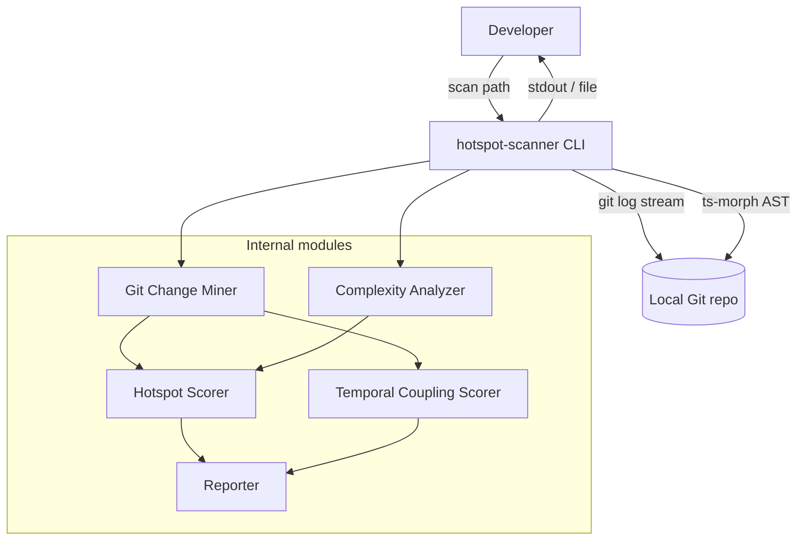

# ARCHITECTURE — @vitals/hotspot-scanner

Design SoT: [specifications/IMPL-2026-003-hotspot-scanner.md](../../specifications/IMPL-2026-003-hotspot-scanner.md) §4.

## Container view

## Data flow (scan)

1. CLI parses flags (`--since`, `--format`, `--top`, `--min-cochange`)
2. **Git Change Miner** runs one `git log --numstat --name-only` in streaming mode → `FileChangeStats` + `CoChangeEvent[]`
3. **Complexity Analyzer** loads current working-tree TS/JS files via ts-morph → `ComplexityResult` per file
4. **Hotspot Scorer** normalizes and combines complexity + churn → ranked `HotspotScore[]`
5. **Temporal Coupling Scorer** computes pair strengths from co-change events
6. **Reporter** outputs CLI tables or JSON

## Key constraints

- Single Git log pass (ADR-2026-020)
- Working-tree AST only (not historical file versions)
- Invalid TS/JS: warn and skip — do not abort scan
- Streaming required for large repos (RT-001)

## Orchestration

`src/scan.ts` coordinates the pipeline. `bin/hotspot-scanner.ts` is a thin CLI wrapper (flags only, no domain logic).
