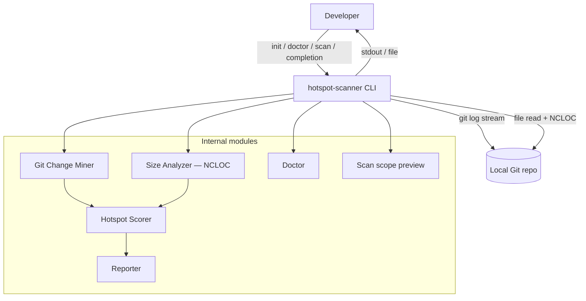

# ARCHITECTURE — @vitals/hotspot-scanner

## Container view



## Pipeline (M57 + M71)

```
git log (streaming numstat) → NCLOC size analysis (file-level) → hotspot score → report
```

JSON contract **`version: "3.0"`** with `ncloc` on each hotspot. **File hotspots only** — no function granularity, no McCabe, no `ts-morph`. Compare/baseline removed in M71; `parseScanResult` retained under `src/scan-result/` for library consumers.

## CLI commands (M39–M40, M71)

Multi-command CLI via Commander in `bin/hotspot-scanner.ts` with shared wiring in `bin/scan-actions.ts` (flags, I/O, exit mapping only — no domain logic):

| Command | Module | Behavior |
| ------- | ------ | -------- |
| `init [dir]` | `src/config/exemplar.ts` (`writeInitConfig`) | Writes schema-linked exemplar `.hotspot-scanner.json` (`$schema`, `$comments`, realistic `include`/`exclude`); refuses overwrite without `--force` |
| `config validate [path]` | `src/config/validate-config.ts` (`validateHotspotScannerConfigFile`) | Parse/validate config file or directory walk; exit `0` valid / `2` invalid or missing; **does not** require git |
| `config print [path]` | `src/config/print-config.ts` + `merge-options.ts` (`loadMergedScanConfigWithSources`) | Effective merged `since`/`include`/`exclude`/`top`/`concurrency` with per-field `cli` \| `config` \| `default` source tags; `-f, --format text\|json`; scan-like CLI overrides (`--since`, `--include`, `--exclude`, `--top`, `--concurrency`, `--config`); **does not** require git or invoke pipeline stages |
| `doctor [path]` | `src/doctor/` (`runDoctor`, `formatDoctorTextReport`, `formatDoctorJsonReport`) | Pre-flight checks: Node `engines`, git on PATH, git repo via shared `resolveScanPipelineContext`, config discovery/validity (unknown keys soft-warn), **`since`** preflight via `probeSinceWindow` (pass / empty warn / git-reject fail), **`scope`** inventory (`previewScanScope` — eligible count parity with `scan --dry-run`), tsconfig/jsconfig info; optional `--include-tests`; `-f, --format text\|json`; `--no-color` (CLI-only, subcommand flag); text output colors `pass:`/`warn:`/`fail:` prefixes via `paintDoctorStatus` when `resolveDoctorColor` allows; aggregate exit policy; **does not** invoke Git Change Miner, size analyzer, scorers, or Reporter |
| `trend <file>` | `src/trend/` (`runComplexityTrend`, `classifyGrowthPattern`) via `bin/trend-actions.ts` | Per-file Git history (`listFileRevisions` / `showFileAtRevision`; `--follow` default, not echoed in output); indentation metrics (`indentMean`, etc.) + NCLOC per revision; uniform `--max-revisions` sample; always-on `classifyGrowthPattern` → `meta.growthPattern` + table `Pattern:` line above sparklines; ASCII sparklines; `table` \| `json` \| `csv`; separate JSON contract `version: "3.0"` / `kind: "complexity-trend"` with required `meta.growthPattern` + `meta.metricLegend` (CSV metric-only — no pattern column); **does not** load config or invoke scan pipeline |
| `scan [path]` | `src/scan.ts` (`runScan`) via `bin/scan-actions.ts` | Full pipeline (see [Data flow (scan)](#data-flow-scan)) |
| `scan --dry-run` | `src/scan-preview.ts` (`previewScanScope`) | Merges config, validates repo + git, builds `PathScope`, counts via `discoverSourceFiles`; prints config file path (or `none`), remount message when present, unknown config keys when present — **does not** mine git or run NCLOC |
| `completion <shell>` | `bin/completion-scripts.ts` (`getCompletionScript`) | Static bash/zsh/fish completion script to stdout |

**Path-first argv (M63).** `maybeRewritePathToScan()` in `bin/hotspot-scanner.ts` rewrites `hotspot-scanner <path> …` to `hotspot-scanner scan <path> …` when the first token is `.`, `./…`, absolute, or an existing directory (not a known subcommand, help/version, or flag). Bare invocation (`argv.length <= 2`) still throws help `CliUsageError` (exit `2`).

**Shell completion drift control (M54 + M63).** `bin/completion-scripts.ts` owns bash/zsh/fish scripts; zsh and fish long-flag lists must stay aligned with bash `SCAN_FLAGS`. Unit tests assert representative flags in all three shells when adding CLI surface.

`--dry-run` ignores `--format` / `--output` (plain-text preview on stdout).

**Removed (M71):** `baseline save`, `compare`, `scan --baseline`, `--strict` — unknown command/option → exit `2`.

## Data flow (scan)

1. CLI dispatches commands; shared scan wiring in `bin/scan-actions.ts`. Scan flags include `--since`; `-f` / `--format`; `-t` / `--top`; `--include` / `--exclude`; `--config`; `--concurrency`; `-o` / `--output`; `--only`; `--no-triage-hints`; `--no-color`; `--explain`; `--fail-on-explain-miss`; `--dry-run`; `--quiet`; `--no-progress`; `--verbose`; `--warnings`; `--csv-single-file`; `--sequential` / `--no-overlap`.
2. **Monorepo path resolve + config (M43 + M21 + M30)** — `resolveScanPipelineContext()`:
   - `validateRepoPath` → `resolveMonorepoScanPath` → `loadHotspotScannerConfig` (walk from request path) → `mergeScanOptions` (CLI > config > defaults for `since`, `include`, `exclude`, `top`, `concurrency`)
   - Auto-include `{packagePrefix}/**` when remounted and CLI `include` unset
   - Unknown config keys → warn-only `UNKNOWN_CONFIG_KEY` (leftover `granularity` from pre-M57 configs is ignored)
3. **`runScan()`** builds `PathScope`, then:
   - **Overlap (default)** — `GitMiner.mine` (numstat) ∥ `ComplexityAnalyzer.analyze` (NCLOC) under shared `AbortController`; sibling abort on first failure
   - **Sequential opt-out** — `--sequential` / `--no-overlap` runs git then size analysis sequentially
   - **Git Change Miner** — one `git log -M --numstat` stream → `FileChangeStats`; `PathAliasMap` for renames; `filterGitMinerResult()` by `PathScope`; `onProgress({ phase: "git", commitsProcessed })`
   - **Size analyzer (`src/complexity/`)** — discovers in-scope TS/JS files (`git ls-files` preferred, walk fallback); reads file text; `countNcloc()` per file; optional worker-thread pool (`--concurrency`); unreadable files → `READ_FAILED` warning + skip (omit from hotspots); `onProgress({ phase: "complexity", filesProcessed, batchesProcessed, … })`
   - **Post-barrier** — `createHotspotScorer().score(fileStats, nclocResults)` → `ScanResult.hotspots`; `meta.timings` (`gitMs`, `complexityMs`, `totalMs`); `meta.scannerVersion` from cached `getPackageVersion()` (`src/package-meta.ts`)
4. CLI passes `ScanResult` to **Reporter** (`--top` at render time for table/markdown only)
5. With `--explain <path>`, file-path breakdown on stderr after report

### Config file (M21 + M30 + M64)

- **Filename:** `.hotspot-scanner.json` only
- **Keys:** `since`, `include`, `exclude`, `top`, `concurrency` — map to CLI semantics
- **Reserved meta (M64):** `$schema`, `$comment`, `$comments` — name-based skip in `parseHotspotScannerConfig`; not merged, not listed in `unknownKeys`, never emit `UNKNOWN_CONFIG_KEY`
- **Load path:** `LoadedHotspotScannerConfig.path` — absolute path when discovered or explicit; `null` when none
- **Schema:** `schemas/hotspot-scanner-config.json` (`$id` `https://vitals.dev/hotspot-scanner/schemas/hotspot-scanner-config.json`); package export `./schemas/hotspot-scanner-config.json`; init exemplar links `$schema` to that URI
- **CLI-only:** `format`, `output`, `--only`, `--no-triage-hints`, `--no-color`, `--explain`, `--fail-on-explain-miss`, `quiet`, `no-progress`, `verbose`, `warnings`, `csv-single-file`, `sequential`, `includeTests`, `version`
- **Removed (M57):** `granularity` — unknown key, warn-only

### Path scoping (M7 + M30 + M43 + M46 + M67)

- **Eligible extensions:** `.ts`, `.tsx`, `.js`, `.jsx`, `.mjs`, `.cjs`, `.mts`, `.cts` (`ELIGIBLE_EXTENSIONS` in `src/complexity/discover.ts`)
- Default artifact and test excludes; `--include-tests` lifts test globs only
- **Built-in test globs:** `DEFAULT_TEST_EXCLUDE_PATTERNS` in `src/paths/scope.ts` — legacy `.ts`/`.tsx`/`.js`/`.jsx` test/spec patterns, `__tests__/`, plus mjs/cjs/mts/cts test/spec parity patterns (M67)
- **No ignore file (M54):** use config `exclude` / CLI `--exclude`
- **Monorepo remount (M43):** nested package cwd → git root + auto-include unless CLI `--include` set

## Key constraints

- Single **numstat** Git log pass for file churn (ADR-2026-020)
- Find-renames (`-M`) on numstat spawn; **no** global `git log --follow`
- Working-tree source only (not historical file versions)
- Unreadable source: `READ_FAILED` warning + skip file (no stub hotspot row)
- Streaming required for large repos (RT-001)
- NCLOC batches via persistent `worker_threads` pool when `concurrency > 1` (M15 + M31)

## Rename confidence (M26, RT-003)

File git miner uses `PathAliasMap` (`src/git/rename.ts`) and `src/git/rename-warnings.ts`. M50 heuristic linking for unlinked delete+add pairs. Warnings use `code: "RENAME_HISTORY_INCOMPLETE"`. M42 appends next-step sentences — codes unchanged.

### Git argv

| Miner | Spawn builder | find-renames | `--follow` |
| ----- | ------------- | ------------ | ---------- |
| File (numstat) | `buildGitLogArgv` in `src/git/spawn.ts` | `-M` | **forbidden** |

### Git spawn failure hints (M65)

When `git log` or `git ls-files` spawn exits non-zero, `GitLogError` (`src/git/spawn.ts`) and `GitLsFilesError` (`src/git/ls-files.ts`) build `message` via `formatGitStderrHint` in `src/git/git-error-hint.ts`:

- **since/date** → fix `--since` or config `since` (relative window or ISO date)
- **shallow** → deepen clone or re-clone without depth limits
- **corrupt / bad-object** → `git fsck` or re-clone

First-match priority: since/date → shallow → corrupt. Unmatched or empty stderr: no `Hint:` line (message shape unchanged). The `stderr` property stays raw git text; only `message` is enriched.

**CLI:** bin prints `error.message` only — no git stderr pattern switches in `bin/`. Exit code for spawn failures remains **1**.

**Sister boundaries (do not duplicate):** M38 `Hint:` tone on resolve-repo not-a-git and `CliUsageError` / `ConfigError` paths; M64 doctor `since` preflight via `probeSinceWindow` (catches invalid `since` before scan). M65 covers scan-time hard spawn failures only — no dedicated not-a-git pattern.

## Diagnostics (M28 + M51 + M58 + M59 + M61 + M63)

Module: `src/diagnostics/` (`logger.ts`, `warning-summary.ts`).

### CLI stderr warning sink (M58 + M63)

`createCliDiagnosticHandlers({ quiet, noProgress, warningsMode, stderrIsTTY?, stderrColumns? })` is **presentation-only**:

- Pipeline / miner still emit the full `ScanWarning[]` into `meta.warnings` and programmatic `onWarning`.
- CLI `--warnings summary` (default) buffers warning/error during the scan. After report write, `flushWarnings()` emits one aggregated stderr line per `(code, subKind)` group. Warnings/Timing rollups appear only in table/markdown executive summaries (M73 top-only rollups).
- `--warnings full` logs each warning immediately (after clearing any live progress line); `flushWarnings()` clears live progress only — does not re-emit streamed lines.
- `--warnings json` (M63) buffers warnings; `flushWarnings()` after write writes one JSON document to stderr: `{"warnings":ScanWarning[]}` (empty → `{"warnings":[]}`); no teaser. `--quiet` still suppresses info-level entries before buffering.
- Not a config key; does not change the JSON contract.

### Ephemeral TTY progress (M59 + M61)

When `stderrIsTTY` is true (default: `process.stderr.isTTY === true`, injectable in tests):

- Progress for `git`, `complexity`, and `finalize` phases overwrites **one live stderr line** (`\x1b[2K\r` + text; no trailing newline while live).
- **Complexity** (M61): inline fill bar when `totalFiles` is known — TTY `█`/`░`, non-TTY `#`/`-`; honest `filesProcessed/totalFiles` (+ batch when known); omit bar when total unknown; no overall scan percentage.
- **Git** (M61): indeterminate counter only (`git N commits…`); no bar or fake %.
- **Finalize** (M61): body `Finalizing…`; emitted once post-barrier in `runScan`; bypasses throttle; survives through score / render until deferred flush.
- Bar width from `stderrColumns` (default `process.stderr.columns`, injectable) via `resolveProgressBarWidth` (clamped 10–40; fallback 80 columns).
- The live line is cleared on `flushWarnings()`, before handler-driven warning/error/info stderr writes (`warnings=full`), and on phase switch.
- Non-TTY (piped/CI) keeps `\n`-terminated progress lines unchanged (ASCII bar on complexity when total known).
- `--quiet` / `--no-progress` suppress progress entirely (TTY or not), including finalize. Git/complexity throttle intervals unchanged.

### Deferred progress flush (M61 + M73)

`executeScan` returns `flushWarnings` without calling it before render/write:

| Path | Order (success) |
| ---- | ----------------- |
| `scan` | write → `flushWarnings()` → `--explain` |

M58 clear-before-warning/error/info unchanged. `flushWarnings()` clears live progress and emits buffered warnings under `summary`/`json` after write.

### Table File column (M60)

Scan **table** format uses `src/report/path-column.ts` for the File column:

- **Middle-ellipsis** (Unicode `…`) keeps a path prefix and basename when the path exceeds the column width (e.g. `src/api/v1/…/schema.ts`).
- **Width** derives from `process.stdout.columns` minus a fixed non-File budget (56 chars for scan numeric columns), clamped 16–64; fallback **24** when columns are missing/invalid (pipes, CI).
- Injectable `stdoutColumns` on `renderTable` options for tests (parity with M59 `stderrIsTTY`).
- Markdown / JSON / CSV emit full paths unchanged.

### CLI ANSI colors (M41 + M74)

Bin resolves color gates into a boolean before calling pure report formatters (`color: boolean`). Helpers live in `src/report/color.ts` (`paintScore`, `paintStaticDep`, `paintDoctorStatus`, `stripAnsi`). No color dependency; no `FORCE_COLOR`.

| Surface | Resolver | Enabled when |
| ------- | -------- | ------------ |
| Scan table | `resolveTableColor` | `format === "table"`, stdout TTY, no `--output`, scan `--no-color` unset, `NO_COLOR` unset or empty |
| Doctor text | `resolveDoctorColor` | `format === "text"`, stdout TTY, doctor `--no-color` unset, `NO_COLOR` unset or empty |

Markdown, JSON, and CSV (scan) and doctor JSON are always plain. Scan and doctor each expose their own `--no-color` on the subcommand (not a global parent flag, not a config key). Doctor text colors **only** the `pass:` / `warn:` / `fail:` prefix; message bodies stay plain.

### Progress phases

| `phase` | Emitter | Counter / body |
| ------- | ------- | -------------- |
| `git` | `GitMiner` numstat stream | `commitsProcessed` — indeterminate counter, no bar |
| `complexity` | Size analyzer / worker pool | `filesProcessed`, `batchesProcessed`, optional `totalFiles` / `totalBatches`; fill bar when total known; `commitsProcessed` is `0` |
| `finalize` | `runScan` post-barrier (once) | `commitsProcessed: 0`; body `Finalizing…`; through score / render until deferred flush |

### Stage timings

```ts
interface ScanStageTimings {
  gitMs: number;
  complexityMs: number;
  totalMs: number;
}
```

File-mode overlap: `gitMs` + `complexityMs` may sum above `totalMs`.

**Presentation (HOTSPOT-1042, M73):** Table and markdown executive summaries include Warnings and Timing lines when applicable; no brief stderr timing echo after successful scans. JSON and CSV payloads unchanged.

### Stable warning codes (M28+ / M57 / M71)

| Code | Emitter | Operator interpretation |
| ---- | ------- | ----------------------- |
| `EMPTY_SINCE_WINDOW` | git | No commits in `--since`; widen window |
| `RENAME_HISTORY_INCOMPLETE` | git | Rename tracking incomplete |
| `READ_FAILED` | size analyzer | File I/O failed — file omitted from hotspots |
| `MONOREPO_PATH_REMOUNT` | scan prelude | Remounted to git root; auto-include when applicable |
| `UNKNOWN_CONFIG_KEY` | config load | Unknown key(s) — not applied; includes legacy `granularity` |

**Removed (M71):** `COMPARE_SINCE_MISMATCH`.

### Explain breakdown (M42 + M53 + M63 + M75)

`--explain <path>` — file path only (repo-relative or absolute under repo). Explains current file hotspot ranking. `path:function` syntax rejected (`CliUsageError`). Default miss prints not-found on stderr and exits `0` on success; `--fail-on-explain-miss` (M63) exits `1` when target missing (requires `--explain`).

**Explain→trend bridge (M75):** On explain hit, `formatTrendNextStep` (`src/report/explain.ts`) appends `next: hotspot-scanner trend <posix-path>` to stderr after the breakdown (suppressed under `--quiet`). Miss omits the line; exit codes unchanged.

### Complexity trend + growth pattern (M72 + M75)

Separate from scan pipeline. `runComplexityTrend` (`src/trend/run-trend.ts`) samples file revisions, computes indentation + NCLOC per point, then `classifyGrowthPattern` (`src/trend/classify.ts`) labels the series:

| `kind` | Heuristic (sampled series) |
| ------ | -------------------------- |
| `refactored` | Peak `indentMean` not at last index; drop from peak ≥ 18% |
| `deteriorating` | First→last `indentMean` rise ≥ 10% (summary notes mean vs `ncloc` when relevant) |
| `stable` | Relative `indentMean` range ≤ 8% |
| `inconclusive` | `< 5` points or no rule match |

Priority: refactored (peak-then-drop) before deteriorating before stable. Classifier runs on the **sampled** series; truncated history may append `(sampled history)` to `summary`. Table: `renderTrendTable` prints `Pattern: <kind> — <summary>` above sparklines. JSON: `meta.growthPattern` required under `version: "3.0"`. Mass reformat / Prettier cliffs can mislabel — documented in CONCERNS + recipes; no special detector.

### CSV single-file write path (M63)

`--csv-single-file` with `--format csv` and `--output` is a **bin write-path** choice in `writeRenderedOutput` (not a new `renderCsv` layout): scan writes `hotspots.csv` bundle key to exact `--output`. Default M18 stem bundle unchanged when flag omitted.

## Size analysis stage (M57)


- **Module:** `src/complexity/ncloc.ts` (`countNcloc`), `analyze-file.ts`, `analyze-batch.ts`, `pool.ts`, `worker.ts`
- **NCLOC definition (RT-005):** single-pass state machine — blank lines and comment-only lines do not count; code + trailing `//` counts; `//` inside strings still counts when line has code
- **No AST:** plain text read; no parse-failed stubs

## Orchestration

`src/scan.ts` overlaps git mining and NCLOC analysis by default (M34); `--sequential` opts out (M49). Function mode, function-churn patch stream, and McCabe paths **removed** (M57).

## Hotspot output schema (M57)

Each `HotspotScore` in `ScanResult.hotspots`:

| Field | Source | JSON | Table |
| ----- | ------ | ---- | ----- |
| `filePath` | size result | yes | yes |
| `hotspotScore` | harmonic mean of normalized c/h | yes | yes |
| `complexityNormalized` | log1p+min-max on NCLOC | yes | yes (NLOCN) |
| `churnNormalized` | log1p+min-max | yes | yes (ChurnN) |
| `ncloc` | `ComplexityResult` | yes | yes (NLOC) |
| `commitCount` | `FileChangeStats` | yes | yes (Churn) |
| `linesChanged` | `FileChangeStats` | yes | markdown |
| `authorCount` | `FileChangeStats.authors.size` | yes | yes (Authors) |

JSON `version` is **`"3.0"`**. Field name `complexityNormalized` retained for the normalized size axis `c` (harmonic formula unchanged).

## Export formats (M10, M17, M18, M41, M53)

- **Scan CSV bundle:** `{stem}.meta.json` + `{stem}.hotspots.csv` only (no functions sidecar)
- **`--only hotspots`** — only valid section (functions rejected)
- **Triage:** scan rule `dual-signal-hotspot`

## JSON Contract (M20 + M57 + M64 + M66 + M71)

| File | Root type |
| ---- | --------- |
| `schemas/scan-result.json` | `ScanResult` |
| `schemas/hotspot-scanner-config.json` | `.hotspot-scanner.json` config (known keys + reserved meta) |

- **Scan `version: "3.0"`** — `hotspots` + `meta` only; no `functions`, no `granularity`, no `coupling`. **No version bump for M66** — enrichments are additive under `"3.0"` (same pattern as M51 `meta.timings`).
- **Config schema (M64):** documents known keys and reserved meta; `additionalProperties: true` (runtime still warns unknowns); package exports both schema subpaths
- **Contract tests:** `tests/contract/json-schema.test.ts` (scan, config)
- **Removed (M71):** `schemas/compare-result.json`, compare contract tests

### Additive fields under `3.0` (M66)

| Field | Where | Emission / read |
| ----- | ----- | --------------- |
| `meta.scannerVersion` | `ScanMeta` | Always on fresh scan (`getPackageVersion()`); optional in schema; preserved when string on parse |
| Top-level `$schema` | JSON render only | `renderJson` injects URL matching schema `$id`; not on in-memory domain types; ignored on `parseScanResult` |

**`$schema` URL** (`src/report/schema-urls.ts`): `https://vitals.dev/hotspot-scanner/schemas/scan-result.json`

**Parse tolerance:** `parseScanResult` accepts `3.0` scans without `scannerVersion` or top-level `$schema`; when `scannerVersion` is present as a string it is preserved on parsed `ScanMeta` (parity with optional `timings`). Non-string `scannerVersion` when the key is present → `ScanResultParseError`. Rejects `1.0`/`2.0`, `coupling`, `functions`, `cyclomaticComplexity`.

## Scan-result parse (M71)

- **Module:** `src/scan-result/parse-scan-result.ts`
- **Public API:** `parseScanResult(raw: unknown): ScanResult`, `ScanResultParseError`
- **Use:** programmatic validation of scan JSON — no CLI loader path
