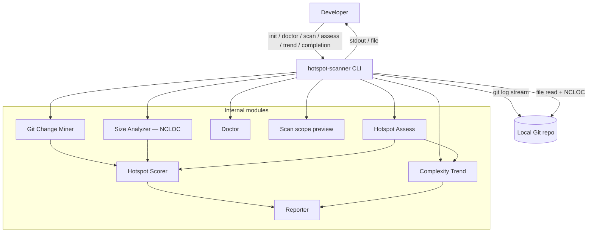
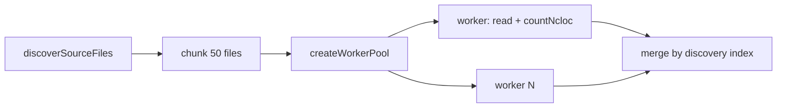

# ARCHITECTURE — @vitals/hotspot-scanner

Design SoT for modules, pipelines, contracts, and ownership boundaries. Fragile risks: [CONCERNS.md](CONCERNS.md). External adapters: [INTEGRATIONS.md](INTEGRATIONS.md).

## Container view



## Pipeline

Scan pipeline:

```
git log (streaming numstat) → NCLOC size analysis (file-level) → hotspot score → report
```

JSON scan contract **`version: "3.0"`** with `ncloc` on each hotspot. File hotspots only — no function granularity, no McCabe, no `ts-morph`. No compare/baseline CLI; `parseScanResult` retained under `src/scan-result/` for library consumers.

Sibling commands (separate from the scan pipeline): `trend` (per-file revision history) and `assess` (scan → filter → sequential trends).

## CLI commands

Multi-command CLI via Commander in `bin/hotspot-scanner.ts`. Shared wiring in `bin/scan-actions.ts`, `bin/trend-actions.ts`, `bin/assess-actions.ts` (flags, I/O, exit mapping only — no domain logic):

| Command | Module | Behavior |
| ------- | ------ | -------- |
| `init [dir]` | `src/config/exemplar.ts` | Writes schema-linked exemplar `.hotspot-scanner.json`; refuses overwrite without `--force` |
| `config validate [path]` | `src/config/validate-config.ts` | Parse/validate config; exit `0` / `2`; does not require git |
| `config print [path]` | `src/config/print-config.ts` | Effective merged scan options with `cli` \| `config` \| `default` provenance; does not invoke pipeline |
| `doctor [path]` | `src/doctor/` | Pre-flight (Node, git, repo via `resolveScanPipelineContext`, config, `since` probe, scope inventory, tsconfig); text or JSON; does not mine/score |
| `trend <file>` | `src/trend/` | Per-file Git history + indentation/NCLOC series + growth pattern; own JSON contract; does not load scan config |
| `assess [path]` | `src/assess/` | `runScan` → filter/slice → sequential `runComplexityTrend`; own JSON contract |
| `scan [path]` | `src/scan.ts` | Full scan pipeline (see [Data flow (scan)](#data-flow-scan)) |
| `scan --dry-run` | `src/scan-preview.ts` | Scope preview only — no mine/NCLOC |
| `completion <shell>` | `bin/completion-scripts.ts` | Static bash/zsh/fish script to stdout |

- **Path-first argv:** `maybeRewritePathToScan()` rewrites `hotspot-scanner <path> …` → `scan <path> …` when the first token looks like a path (not a known subcommand/flag). Bare invocation still throws help `CliUsageError` (exit `2`).
- **Completion drift:** zsh/fish long-flag lists must stay aligned with bash `SCAN_FLAGS` in `bin/completion-scripts.ts`.
- `--dry-run` ignores `--format` / `--output` (plain-text preview on stdout).
- **Not in CLI surface:** `baseline save`, `compare`, `scan --baseline`, `--strict` — unknown command/option → exit `2`.

## Data flow (scan)

1. CLI dispatches; shared wiring in `bin/scan-actions.ts`. Scan flags include `--since`, `--format`, `--top`, `--include` / `--exclude`, `--config`, `--concurrency`, `--output`, `--only`, `--no-triage-hints`, `--no-color`, `--explain`, `--fail-on-explain-miss`, `--dry-run`, `--quiet`, `--no-progress`, `--verbose`, `--warnings`, `--csv-single-file`, `--sequential` / `--no-overlap`, `--include-tests`.
2. **Monorepo path resolve + config** — `resolveScanPipelineContext()`:
   - `validateRepoPath` → `resolveMonorepoScanPath` → `loadHotspotScannerConfig` (walk from request path) → `mergeScanOptions` (CLI > config > defaults for `since`, `include`, `exclude`, `top`, `concurrency`)
   - Auto-include `{packagePrefix}/**` when remounted and CLI `include` unset
   - Unknown config keys → warn-only `UNKNOWN_CONFIG_KEY`
3. **`runScan()`** builds `PathScope`, then:
   - **Overlap (default)** — `GitMiner.mine` (numstat) ∥ `ComplexityAnalyzer.analyze` (NCLOC) under shared `AbortController`; sibling abort on first failure
   - **Sequential opt-out** — `--sequential` / `--no-overlap` runs git then size analysis sequentially
   - **Git Change Miner** — one `git log -M --numstat` stream → `FileChangeStats`; `PathAliasMap` for renames; `filterGitMinerResult()` by `PathScope`; `onProgress({ phase: "git", commitsProcessed })`
   - **Size analyzer (`src/complexity/`)** — discovers in-scope TS/JS files (`git ls-files` preferred, walk fallback); `countNcloc()` per file; optional worker pool (`--concurrency`); unreadable files → `READ_FAILED` + skip; `onProgress({ phase: "complexity", … })`
   - **Post-barrier** — `createHotspotScorer().score(fileStats, nclocResults)` → `ScanResult.hotspots`; `meta.timings`; `meta.scannerVersion` from `getPackageVersion()` (`src/package-meta.ts`)
4. CLI passes `ScanResult` to **Reporter** (`--top` at render time for table/markdown only)
5. With `--explain <path>`, file-path breakdown on stderr after report

### Config file

- **Filename:** `.hotspot-scanner.json` only
- **Known keys:** `since`, `include`, `exclude`, `top`, `concurrency`
- **Reserved meta:** `$schema`, `$comment`, `$comments` — skipped in parse; not merged; never `UNKNOWN_CONFIG_KEY`
- **Unknown keys (warn-only):** e.g. `granularity`, `minCochange`, `megaCommitThreshold` — not applied
- **Load path:** `LoadedHotspotScannerConfig.path` — absolute when discovered/explicit; `null` when none
- **Schema:** `schemas/hotspot-scanner-config.json`; package export `./schemas/hotspot-scanner-config.json`
- **CLI-only:** `format`, `output`, `--only`, `--no-triage-hints`, `--no-color`, `--explain`, `--fail-on-explain-miss`, `quiet`, `no-progress`, `verbose`, `warnings`, `csv-single-file`, `sequential`, `includeTests`, `version`

### Path scoping

- **Eligible extensions:** `.ts`, `.tsx`, `.js`, `.jsx`, `.mjs`, `.cjs`, `.mts`, `.cts` (`ELIGIBLE_EXTENSIONS` in `src/complexity/discover.ts`)
- Default artifact and test excludes; `--include-tests` lifts test globs only
- **Built-in test globs:** `DEFAULT_TEST_EXCLUDE_PATTERNS` in `src/paths/scope.ts` (test/spec patterns including mjs/cjs/mts/cts + `__tests__/`)
- **No ignore file:** use config `exclude` / CLI `--exclude`
- **Monorepo remount:** nested package cwd → git root + auto-include unless CLI `--include` set

## Key constraints

- Single **numstat** Git log pass for file churn (ADR-2026-020)
- Find-renames (`-M`) on numstat spawn; **no** global `git log --follow` on the scan miner
- Scan size analysis uses working-tree source only (not historical blobs — those are trend-only)
- Unreadable source: `READ_FAILED` warning + skip file (no stub hotspot row)
- Streaming required for large repos (RT-001)
- NCLOC batches via persistent `worker_threads` pool when `concurrency > 1`

## Git Change Miner

### Rename model (RT-003)

File miner uses `PathAliasMap` (`src/git/rename.ts`) and `src/git/rename-warnings.ts`, including heuristic linking for unlinked delete+add pairs. Warnings use `code: "RENAME_HISTORY_INCOMPLETE"`. Explain may append next-step copy; warning codes stay unchanged.

### Git argv

| Miner | Spawn builder | find-renames | `--follow` |
| ----- | ------------- | ------------ | ---------- |
| File (numstat) | `buildGitLogArgv` in `src/git/spawn.ts` | `-M` | **forbidden** |

Trend file history (`src/git/file-history.ts`) may use `--follow` / `git show` — must not leak into scan numstat argv.

### Spawn failure ownership

`GitLogError` / `GitLsFilesError` may enrich `message` via `formatGitStderrHint` in `src/git/` only. Bin prints `error.message` — no git-stderr pattern switches in `bin/`. Not-a-git hints stay on `resolve-repo`; doctor `since` preflight stays on `probeSinceWindow`. Detail: [INTEGRATIONS.md](INTEGRATIONS.md).

## Size analysis stage



- **Module:** `src/complexity/ncloc.ts` (`countNcloc`), `analyze-file.ts`, `analyze-batch.ts`, `pool.ts`, `worker.ts`
- **NCLOC definition (RT-005):** single-pass state machine — blank and comment-only lines excluded; code + trailing `//` counts; `//` inside strings still counts when the line has code
- **No AST:** plain text read; no parse-failed stubs

## Orchestration

`src/scan.ts` overlaps git mining and NCLOC analysis by default; `--sequential` / `--no-overlap` opts out. No function-mode, function-churn patch stream, or McCabe paths in the product surface.

## Diagnostics

Module: `src/diagnostics/` (`logger.ts`, `warning-summary.ts`).

### Warning presentation vs contract

- Pipeline emits full `ScanWarning[]` into `meta.warnings` and programmatic `onWarning`.
- CLI `--warnings summary|full|json` is **presentation-only** (not a config key; does not change JSON). Default `summary` aggregates on stderr after write via `flushWarnings()`; `full` streams during scan; `json` emits one stderr document after write.
- Stable warning `code`s: [docs/warning-codes.md](../../docs/warning-codes.md).

### Progress and flush order

When stderr is a TTY, progress for `git`, `complexity`, and `finalize` overwrites one live line and clears on `flushWarnings()`, before handler-driven warning stderr (`warnings=full`), and on phase switch. Non-TTY keeps newline logs. `--quiet` / `--no-progress` suppress progress.

| Path | Order (success) |
| ---- | ----------------- |
| `scan` | write → `flushWarnings()` → `--explain` |

### Progress phases

| `phase` | Emitter | Counter / body |
| ------- | ------- | -------------- |
| `git` | `GitMiner` numstat stream | `commitsProcessed` — indeterminate counter |
| `complexity` | Size analyzer / worker pool | `filesProcessed`, `batchesProcessed`, optional totals; fill bar when total known |
| `finalize` | `runScan` post-barrier (once) | body `Finalizing…`; through score / render until deferred flush |

### Stage timings

```ts
interface ScanStageTimings {
  gitMs: number;
  complexityMs: number;
  totalMs: number;
}
```

Under overlap, `gitMs` + `complexityMs` may sum above `totalMs`. Table/markdown executive summaries may include Warnings and Timing lines; JSON/CSV payloads unchanged (no brief stderr timing echo).

### Explain

`--explain <path>` — file path only (`path:function` → `CliUsageError`). Lookup uses full `ScanResult` arrays. Default miss → stderr not-found, exit `0`; `--fail-on-explain-miss` → exit `1` when missing. On hit, `formatTrendNextStep` may append `next: hotspot-scanner trend <path>` (suppressed under `--quiet`).

### ANSI color ownership

Bin resolves a boolean `color` before calling pure report formatters. Helpers in `src/report/color.ts`. No color dependency; no `FORCE_COLOR`. Each subcommand owns its `--no-color` flag (not global, not config).

| Surface | Resolver | Enabled when |
| ------- | -------- | ------------ |
| Scan table | `resolveTableColor` | `format === "table"`, stdout TTY, no `--output`, `--no-color` unset, `NO_COLOR` unset/empty |
| Doctor text | `resolveDoctorColor` | `format === "text"`, stdout TTY, `--no-color` unset, `NO_COLOR` unset/empty |
| Trend table | `resolveTrendColor` | `format === "table"`, stdout TTY, no `--output`, `--no-color` unset, `NO_COLOR` unset/empty |
| Assess table | `resolveAssessColor` | `format === "table"`, stdout TTY, no `--output`, `--no-color` unset, `NO_COLOR` unset/empty |

Markdown, JSON, and CSV (and doctor JSON) are always plain.

## Complexity trend + growth pattern

Separate from scan. `runComplexityTrend` (`src/trend/run-trend.ts`) samples file revisions, computes indentation + NCLOC per point, then `classifyGrowthPattern` (`src/trend/classify.ts`):

| `kind` | Heuristic (sampled series) |
| ------ | -------------------------- |
| `refactored` | Peak `indentMean` not at last index; drop from peak ≥ 18% |
| `deteriorating` | First→last `indentMean` rise ≥ 10% |
| `stable` | Relative `indentMean` range ≤ 8% |
| `inconclusive` | `< 5` points or no rule match |

Priority: refactored → deteriorating → stable. Classifier runs on the **sampled** series. JSON: `version: "3.0"` / `kind: "complexity-trend"` with required `meta.growthPattern`. Mass reformat cliffs: [CONCERNS.md](CONCERNS.md).

## Hotspot assess

`runAssess` (`src/assess/run-assess.ts`):

```
runScan → selectAssessCandidates(minHotspotScore, top) → sequential runComplexityTrend per candidate
```

| Step | Module | Notes |
| ---- | ------ | ----- |
| Scan | `runScan` | Full file-hotspot pipeline; warnings preserved on `AssessResult.meta.warnings` |
| Select | `selectAssessCandidates` | Filter `hotspotScore >= minHotspotScore`, sort desc, slice `top` |
| Trend batch | `runComplexityTrend` | Sequential; soft-continue on per-file failure (`skipped` / `error`) |
| Report | `src/report/assess-*.ts` | Summary counts + deteriorating detail; JSON via `renderAssessJson` |

**Schema isolation:** `schemas/hotspot-assess.json` — `version: "1.0"`, `kind: "hotspot-assess"`. Candidates carry `growthPattern` without embedding trend `points`. Scan `3.0` and complexity-trend `3.0` unchanged. Formats: `table` \| `json` \| `markdown` (no CSV).

## Hotspot output schema

Each `HotspotScore` in `ScanResult.hotspots`:

| Field | Source | JSON | Table |
| ----- | ------ | ---- | ----- |
| `filePath` | size result | yes | yes |
| `hotspotScore` | harmonic mean of normalized c/h | yes | yes |
| `complexityNormalized` | log1p+min-max on NCLOC | yes | yes (NLOCN) |
| `churnNormalized` | log1p+min-max | yes | yes (ChurnN) |
| `ncloc` | `ComplexityResult` | yes | yes (NLOC) |
| `commitCount` | `FileChangeStats` | yes | yes (Churn) |
| `linesChanged` | `FileChangeStats` | yes | yes (Lines) |
| `authorCount` | `FileChangeStats.authors.size` | yes | yes (Authors) |

JSON `version` is **`"3.0"`**. Field name `complexityNormalized` retained for normalized size axis `c` (harmonic formula unchanged).

## Export formats

- **Scan CSV bundle:** `{stem}.meta.json` + `{stem}.hotspots.csv` (default stem expansion from `--output`)
- **`--csv-single-file`:** bin write-path writes the hotspots CSV to the exact `--output` path (bundle layout unchanged when omitted)
- **`--only hotspots`** — only valid section
- **Triage:** scan rule `dual-signal-hotspot`

## JSON Contract

| File | Root type |
| ---- | --------- |
| `schemas/scan-result.json` | `ScanResult` (`version: "3.0"`) |
| `schemas/hotspot-scanner-config.json` | `.hotspot-scanner.json` config |
| `schemas/complexity-trend.json` | `ComplexityTrendResult` (`kind: "complexity-trend"`, `version: "3.0"`) |
| `schemas/hotspot-assess.json` | `AssessResult` (`kind: "hotspot-assess"`, `version: "1.0"`) |

- **Scan `version: "3.0"`** — `hotspots` + `meta` only; no `functions`, no `granularity`, no `coupling`. Additive enrichments stay under `"3.0"` without a version bump.
- **Config schema:** known keys + reserved meta; `additionalProperties: true` (runtime still warns unknowns)
- **Contract tests:** `tests/contract/json-schema.test.ts`
- No compare schema in the product surface

### Additive fields under scan `3.0`

| Field | Where | Emission / read |
| ----- | ----- | --------------- |
| `meta.scannerVersion` | `ScanMeta` | Always on fresh scan (`getPackageVersion()`); optional in schema; preserved when string on parse |
| Top-level `$schema` | JSON render only | `renderJson` injects URL matching schema `$id`; not on in-memory domain types; ignored on `parseScanResult` |

**`$schema` URL** (`src/report/schema-urls.ts`): `https://vitals.dev/hotspot-scanner/schemas/scan-result.json`

**Parse tolerance:** `parseScanResult` accepts `3.0` scans without `scannerVersion` or top-level `$schema`; preserves string `scannerVersion` when present. Non-string `scannerVersion` → `ScanResultParseError`. Rejects `1.0`/`2.0`, `coupling`, `functions`, `cyclomaticComplexity`.

## Scan-result parse

- **Module:** `src/scan-result/parse-scan-result.ts`
- **Public API:** `parseScanResult(raw: unknown): ScanResult`, `ScanResultParseError`
- **Use:** programmatic validation of scan JSON — no CLI loader path

## Exit codes

Canonical table: [AGENTS.md](../../AGENTS.md) § Validation (CLI) — `0` success, `1` explain-miss with `--fail-on-explain-miss`, `2` usage/config, `130`/`143` cancel.
