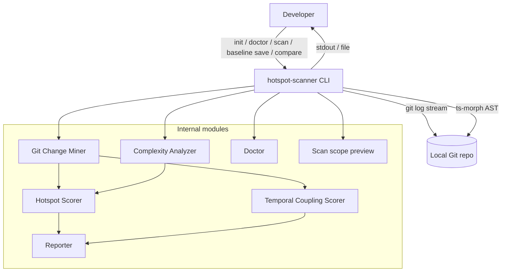
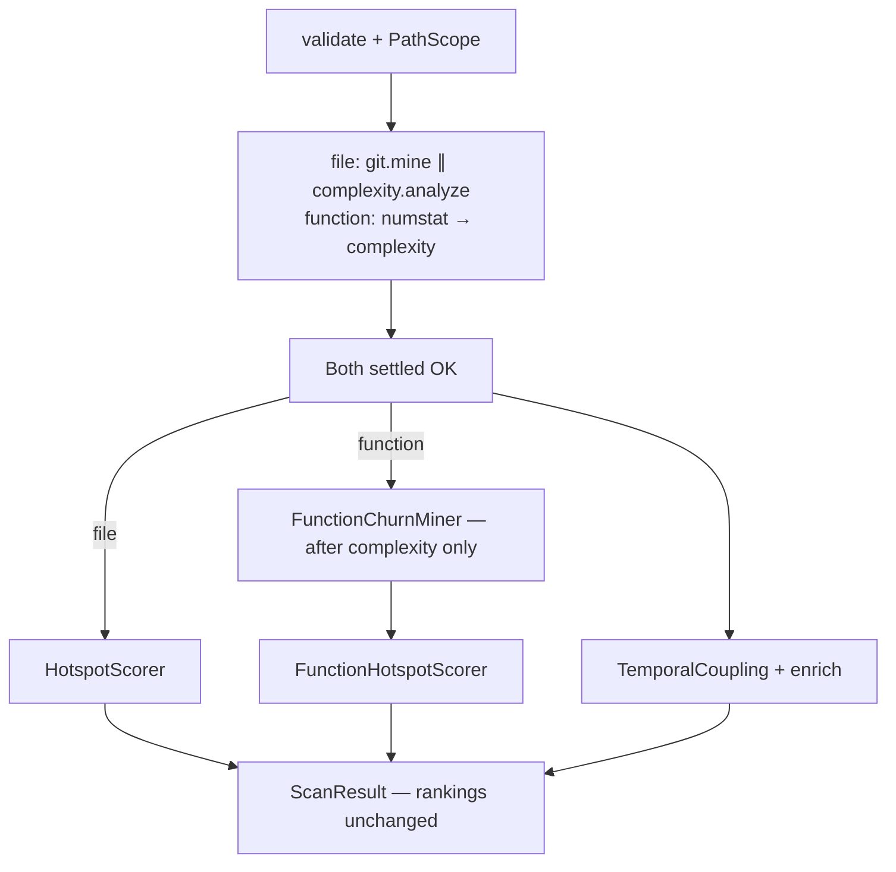

# ARCHITECTURE — @vitals/hotspot-scanner

## Container view



## CLI commands (M39–M40)

Multi-command CLI via Commander in `bin/hotspot-scanner.ts` with shared wiring in `bin/scan-actions.ts` (flags, I/O, exit mapping only — no domain logic):

| Command | Module | Behavior |
| ------- | ------ | -------- |
| `init [dir]` | `src/config/exemplar.ts` (`writeInitConfig`) | Writes locked exemplar `.hotspot-scanner.json`; refuses overwrite without `--force` |
| `doctor [path]` | `src/doctor/` (`runDoctor`) | Pre-flight checks: Node `engines`, git on PATH, git repo, config discovery/validity, tsconfig/jsconfig info; aggregate exit policy (hard `1`, config `2`, soft warn `0`) |
| `scan [path]` | `src/scan.ts` (`runScan`) via `bin/scan-actions.ts` | Full pipeline (see [Data flow (scan)](#data-flow-scan)); optional `--baseline` → compare path (see [Scan compare (M13, M40)](#scan-compare-m13-m40)) |
| `scan --dry-run` | `src/scan-preview.ts` (`previewScanScope`) | Merges config, validates repo + git, builds `PathScope`, counts via `discoverSourceFiles` — **does not** invoke Git Change Miner, Complexity Analyzer, scorers, or Reporter ranking |
| `baseline save <path>` | `runScan()` + `bin/scan-actions.ts` | Runs full scan, writes loadable `ScanResult` JSON; `--output` default `./hotspot-baseline.json` (cwd-relative); no `--format` / `--baseline` on this command |
| `compare <path> --baseline <file>` | `runScan()` + `src/compare/` + `src/report/` via `bin/scan-actions.ts` | Same compare-and-render sequence as `scan --baseline` (`validateBaselinePath` → `loadBaseline` → `compareScanResults` → `renderCompare`); `--baseline` required |

`--dry-run` rejects `--baseline` (`CliUsageError`); `--format` / `--output` are ignored (plain-text preview on stdout). Invalid repo/config fail the same prelude as `runScan()` before preview.

## Data flow (scan)

1. CLI (`bin/hotspot-scanner.ts`) dispatches `init`, `doctor`, `scan [path]`, `baseline save <path>`, or `compare <path> --baseline <file>` (optional repo `path`, default `.`). Program-level `-V` / `--version` prints package `version` without running a command. Shared scan/compare wiring lives in `bin/scan-actions.ts` (`executeScan`, `executeCompareAndRender`, `writeBaselineJson`, path validators). For `scan`, flags include `--since`; `-f` / `--format`; `-g` / `--granularity`; `-t` / `--top`; `--min-cochange`; `--include` / `--exclude`; `--config`; `--concurrency`; `-o` / `--output`; `--baseline`; `--only`; `--no-triage-hints`; `--no-color`; `--explain`; `--dry-run`; `--quiet`; `--no-progress` (CLI-only — no config keys). `--dry-run` routes to `previewScanScope()` (see [CLI commands (M39)](#cli-commands-m39)); otherwise calls `runScan()` in `src/scan.ts`. `--quiet` suppresses progress plus info-level `ScanWarning` stderr; `--no-progress` suppresses progress only; both leave report output and warning/error diagnostics. Common errors append actionable `Hint:` lines (non-git path, csv without output, baseline path/content, missing explicit config).
2. **Monorepo path resolve + config (M43 + M21 + M30)** — `resolveScanPipelineContext()` (`src/scan.ts`) runs before pipeline stages (also used by `scan --dry-run` via `previewScanScope()`):
   - `validateRepoPath(options.repoPath)` on the **original request path**
   - `resolveMonorepoScanPath(requestPath)` (`src/paths/resolve-repo.ts`) via `git -C <requestPath> rev-parse --show-toplevel` → `{ repoPath (git root), packagePrefix?, remounted }`; request path already at git root → `remounted: false`; not in a work tree → same error class as today
   - `loadHotspotScannerConfig(options.repoPath, { configPath? })` — discovery walk starts from the **original request path**, not the remounted git root (M30 unchanged). When `configPath` is set, that file is read only (parent walk skipped); missing explicit path → `ConfigError`. Otherwise walk upward from request path for `.hotspot-scanner.json` (nearest wins); walk miss → built-in defaults only (not an error)
   - CLI overrides from `ScanOptions`; when `remounted && options.include === undefined`, inject synthetic CLI `include: ["{packagePrefix}/**"]` (beats config `include` via merge precedence)
   - `mergeScanOptions()` applies **CLI > config > defaults** for `since`, `include`, `exclude`, `granularity`, `minCochange`, `top`, `concurrency`
   - `validateGitRepository(resolved.repoPath)` on the **git root** (not the nested package directory)
   - When `remounted`, push `MONOREPO_PATH_REMOUNT` info `ScanWarning` (message names git root; mentions auto-include pattern only when applied)
   - **YAGNI:** path-only heuristic — no `pnpm-workspace.yaml` / nx / turborepo parsers; no `--no-remount` flag
   - `format`, `output`, `baseline`, `--only`, `--no-triage-hints`, `--no-color`, `quiet`, `no-progress`, and `version` remain CLI-only (not config keys). Invalid JSON or bad types throw `ConfigError` (non-zero exit). Unknown keys are ignored. Bin pre-merge for `top` uses the same `configPath` / discovery args as `runScan()` (request path).
3. **`runScan()`** builds a shared `PathScope` from merged include/exclude (`src/paths/`), then runs mining/analysis on `pipelineRepoPath` (git root when remounted) with **M34 overlap** and post-barrier scoring (rankings and JSON contract unchanged):
   - **Overlap window (file mode)** — `GitMiner.mine` (numstat) and `ComplexityAnalyzer.analyze` start concurrently under a shared orchestrator `AbortController`; on first rejection, abort the sibling (`child.kill` / worker terminate), `Promise.allSettled` both promises, rethrow the **original** error — no hotspot/function/coupling scoring on failure
   - **Git Change Miner** — one `git log -M --numstat` stream → `FileChangeStats` + aggregated coupling pair counts (`pair → coChangeCount`, M32); `PathAliasMap` links renames; optional `isPathInScope` predicate applied during aggregation (mega-guard counts unique in-scope paths only); commits with **> 100** unique in-scope files skip coupling increments but still update churn (`MEGA_COMMIT_SKIPPED` warnings); rename blind-spot warnings as `ScanWarning[]` with `RENAME_HISTORY_INCOMPLETE` (M26 messages, M28 routing); output filtered by `PathScope` via `filterGitMinerResult()`; forwards warnings and phased `onProgress({ phase: "git", commitsProcessed })` during the overlap window
   - **Complexity Analyzer** — discovers in-scope TS/JS files on the main thread (prefers `git ls-files` + extension/PathScope filter in Git repos, with filesystem walk fallback); **function mode (M35)** waits for numstat to settle, then passes optional `pathAllowlist` (scoped numstat churn ∩ eligible extensions) so AST runs only on churned eligible paths — file mode omits the option (full discovery, concurrent with numstat); chunks into batches of 50, dispatches batches to a bounded persistent `worker_threads` pool (`createWorkerPool`, concurrency from merged config — default `min(availableParallelism(), 8)`); each worker (or inline session when `concurrency === 1`) reuses one ts-morph `Project` across batches with source files cleared between `loadBatch` calls; parse gating uses syntactic diagnostics only → merged `ComplexityResult[]` + `FunctionComplexityResult[]` in discovery order; `PARSE_FAILED` warnings on skip; phased `onProgress({ phase: "complexity", filesProcessed, batchesProcessed, totalFiles, totalBatches, commitsProcessed: 0 })` after each batch (inline and worker paths); forwards warnings
   - **Post-barrier (both stages settled OK)** — aggregate warnings in deterministic order (git, then complexity); then scoring branch on `granularity` (default `file`):
     - **file** — `createHotspotScorer()` → `ScanResult.hotspots` (no patch spawn)
     - **function** — `buildFunctionModePathAllowlist()` from scoped `fileStats` → `createFunctionChurnMiner({ paths })` **after** complexity only (never concurrent with numstat; pathspec-restricted `git log -p` when under threshold; empty allowlist → no patch spawn); interval-indexed hunk overlap in `aggregatePatchCommit`; phased `onProgress({ phase: "function-churn", commitsProcessed })` → `createFunctionHotspotScorer()` → `ScanResult.functions`
   - **Temporal Coupling Scorer** — file-pair ranked `coupling` from pre-aggregated pair counts (starts only after numstat + complexity barrier; unchanged formula/ranking below mega-guard; unchanged in both modes)
   - **Static coupling enricher** — `enrichCouplingStaticDeps()` builds a per-call peer-scoped edge cache (one read/parse per unique participant file; O(1) pair labeling) and sets static-dependency fields from resolvable static `import`/`export … from`/`require` edges (relative + tsconfig/jsconfig `paths`/`baseUrl`; direction and edge-kind flags; missing/unreadable source → no edge; does not change ranking)
   - **Aggregate diagnostics** — `runScan()` collects stage `ScanWarning[]` into `ScanResult.meta.warnings` (always present, possibly empty); forwards each via `onWarning`
4. CLI passes `ScanResult` to **Reporter** for table, JSON, markdown, or CSV output (`--top` applied at render time for table/markdown only; ignored for JSON and CSV). M41 interpretation options (`--only`, `--no-triage-hints`, `--no-color`) are resolved in the bin and passed as `ReporterOptions` (see [Export formats](#export-formats-m10-m17-m18-m41))
5. With `--output <path>`, CLI writes the rendered report to file (UTF-8) instead of stdout; stderr diagnostics unchanged
6. With `--baseline <file>` on `scan`, or via `compare <path> --baseline <file>`, CLI loads a prior `ScanResult` JSON, runs `compareScanResults()`, and renders a **CompareResult** delta via `renderCompare()` (same format/output transport as normal scan). `baseline save <path>` writes a baseline file via `runScan()` + `JSON.stringify` of the full `ScanResult` (default `./hotspot-baseline.json`; `--top` does not truncate the saved file)
7. With `--explain <target>` (M42), after the report is written to stdout or `--output`, the CLI prints a human-readable score breakdown to **stderr** only — full scan and report unchanged; lookup uses full `ScanResult` arrays (ignores `--top` truncation). See [Explain breakdown (M42)](#explain-breakdown-m42)

### Config file (M21 + M30)

- **Filename:** `.hotspot-scanner.json` only — not `.hotspotrc`, not dual lookup on discovery walk
- **Discovery (default):** From `repoPath`, walk parents for `.hotspot-scanner.json`; nearest file wins; filesystem root with no file → `null` (defaults only, not an error)
- **Explicit path:** `--config <path>` / `ScanOptions.configPath` loads that file only (skips walk); ENOENT or unreadable explicit path → `ConfigError`; relative path resolves from process cwd
- **Keys:** `since`, `include`, `exclude`, `granularity`, `minCochange`, `top`, `concurrency` — map to the same semantics as CLI flags
- **Precedence:** CLI flag explicitly provided → config key present → built-in default (`DEFAULT_SINCE`, `DEFAULT_TOP`, `DEFAULT_MIN_COCHANGE`, `DEFAULT_WORKER_CONCURRENCY`, granularity `file`). `--config` selects which file is read only — option merge precedence unchanged.
- **CLI-only:** `format`, `output`, `baseline`, `--only`, `--no-triage-hints`, `--no-color`, `--explain`, `quiet`, `no-progress`, `version` (program flag; not in `.hotspot-scanner.json`)
- **Module:** `src/config/` (`load-config.ts`, `merge-options.ts`, `exemplar.ts` for `init`); `ConfigError` on invalid JSON or value types; unknown keys ignored

### Path scoping (M7 + M30 + M43)

- **Default excludes** (always active, non-disableable): `node_modules`, `.git`, `dist`, `coverage`, `build`, `.next`, `out`, `vendor`, `storybook-static`, `__snapshots__` (M30 patterns use `**/<name>/**` for nested monorepo artifacts; M7 entries unchanged)
- **`--include <glob>`** (repeatable): narrows scope — path must match at least one include pattern
- **`--exclude <glob>`** (repeatable): additive excludes on top of defaults
- **Semantics**: exclude wins over include; same `PathScope` instance filters both git stats and complexity discovery
- **Monorepo package cwd (M43):** when `requestPath` is a nested directory inside a git workspace, `resolveMonorepoScanPath()` remounts pipeline `repoPath` to `git rev-parse --show-toplevel` and auto-injects CLI-level `{posixRelativePrefix}/**` unless `ScanOptions.include` / CLI `--include` was explicitly set (config `include` does **not** suppress auto-include). Config discovery stays on the original request path. Git-root scans unchanged (no remount, no auto-include). Nested path that is its own git root (separate `.git`) remounts only to that nested root. Emits `MONOREPO_PATH_REMOUNT` info warning when remounted. No workspace-tool manifest parsing (YAGNI).
- **Module**: `src/paths/` (`resolveMonorepoScanPath`, `buildAutoIncludePattern`, `createPathScope`, `isPathInScope`, `filterGitMinerResult`); glob matching via `picomatch`

## Key constraints

- Single **numstat** Git log pass for file churn and coupling (ADR-2026-020); function mode adds a **second** patch stream (`git log -p --unified=0`) only for per-function churn attribution — **pathspec-restricted** to the function-mode allowlist when under `PATCH_PATHSPEC_FALLBACK_THRESHOLD` (1000); empty allowlist skips spawn; file mode never spawns the patch stream (M35)
- Both git spawns enable **find-renames** (`-M`) so git can emit `old => new` rename metadata for `PathAliasMap`; **do not** add global `git log --follow` (per-file follow is incompatible with a single numstat pass — see CONCERNS)
- Working-tree AST only (not historical file versions)
- Invalid TS/JS: warn and skip — do not abort scan
- Streaming required for large repos (RT-001)
- Complexity batches processed in parallel via persistent `worker_threads` pool (M15 + M31); file discovery and merge remain on main thread

## Rename confidence (M26, RT-003)

File and function git miners share rename linking via `PathAliasMap` (`src/git/rename.ts`) and actionable warnings via `src/git/rename-warnings.ts`. M28 routes existing M26 message families into structured `ScanWarning` objects (`code: "RENAME_HISTORY_INCOMPLETE"`, `severity: "warning"`) — aggregated in `ScanResult.meta.warnings`, forwarded through `onWarning`, and printed to stderr via `src/diagnostics/` (`info:` / `warning:` / `error:` prefixes). **M28 does not add new rename-confidence message families** beyond M26; deeper rename UX remains RT-003 scope.

### Git argv

| Miner | Spawn builder | find-renames | `--follow` |
| ----- | ------------- | ------------ | ---------- |
| File (numstat) | `buildGitLogArgv` in `src/git/spawn.ts` | `-M` | **forbidden** |
| Function (patch) | `buildGitPatchLogArgv` in `src/git/function-churn/spawn.ts` | `-M` | **forbidden** |

Function patch argv (M35): when `paths` is non-empty and `paths.length ≤ PATCH_PATHSPEC_FALLBACK_THRESHOLD` (1000), append `--` + pathspecs after `--since`; otherwise fall back to unrestricted patch stream (correctness over ARG_MAX risk). Empty `paths` → miner does not spawn. `-M`, `-p`, `--unified=0`, and optional `--since` are always preserved when pathspecs are applied.

### PathAliasMap

Parse `old => new` lines from the log stream, `link()` chains, `canonicalizeFileStats` + `canonicalizePairCounts` at end of mine. Ambiguous paths (multiple competing rename targets) keep the existing incomplete-history prefix.

### File-miner warning families

Emitted from `createGitMiner().mine()` after the streaming aggregate loop (noise control: families only when their signals apply):

| Family | Trigger | Stable prefix / pattern | Next step (M42) |
| ------ | ------- | ----------------------- | ----------------- |
| Ambiguous rename | `PathAliasMap.getAmbiguousPaths()` | `Rename history may be incomplete for: …` | Verify rename detection or widen `--since` |
| Unlinked suspected rename | Same-commit delete+add with basename relatedness, no `renameFrom` / `=>` | `Suspected unlinked rename (no git rename metadata): …` (capped, max 5 pairs + summary) | Ensure git records renames (`-M` enabled) or widen `--since` |
| `--since` truncation | `since` set **and** at least one in-window rename link recorded | `Rename history before the --since window (…) may be missing under canonical paths` | Widen `--since` to include pre-window rename history |
| Mega-commit coupling skip (M32) | Unique in-scope canonical paths in commit `> MEGA_COMMIT_UNIQUE_FILE_THRESHOLD` (100) | `Mega-commit skipped for coupling (N unique in-scope files > 100): <hash>` (capped, max 5 detail + summary) | — |

### Function-mode pós-rename overlap warning

When function-churn mining observes at least one rename link **or** ambiguous path, append **once**: overlap uses current working-tree `[line, endLine]` vs historical hunk lines; confidence may be reduced after renames/moves; message appends next step to treat function ranks cautiously after moves (prefer file mode or wider `--since`). File mode does **not** emit this warning. No historical AST or blame-based attribution. Emitted as `RENAME_HISTORY_INCOMPLETE` in `meta.warnings`. M42 appends next-step sentences only — **`code` values unchanged** (`RENAME_HISTORY_INCOMPLETE`, `EMPTY_SINCE_WINDOW`).

## Diagnostics (M28)

Operator-facing concurrency, progress, and warning UX. Module: `src/diagnostics/` (`logger.ts`).

### Concurrency override

| Surface | Detail |
| ------- | ------ |
| CLI | `--concurrency <n>` — positive integer ≥ 1; invalid → `CliUsageError` |
| Config | `concurrency` in `.hotspot-scanner.json`; invalid → `ConfigError` |
| Default | `DEFAULT_WORKER_CONCURRENCY` = `min(availableParallelism(), 8)` in `src/complexity/pool.ts` |
| Precedence | CLI > config > default |
| Wiring | `mergeScanOptions()` → `runScan()` → `createComplexityAnalyzer({ concurrency })` |

Batch size (`DEFAULT_BATCH_SIZE` = 50) stays internal (M15); not exposed in M28.

### Progress phases

| `phase` | Emitter | Counter |
| ------- | ------- | ------- |
| `git` | `GitMiner` numstat stream | `commitsProcessed` — commits in numstat pass |
| `function-churn` | `FunctionChurnMiner` patch stream | `commitsProcessed` — commits in patch pass |
| `complexity` | `ComplexityAnalyzer` / worker pool (M42) | `filesProcessed`, `batchesProcessed`, optional `totalFiles` / `totalBatches`; `commitsProcessed` is `0` |

Stderr formats:

- Git phases (throttled every 1,000 commits): `Processing <phase> commit <N>...`
- Complexity (throttled on `filesProcessed` interval = `DEFAULT_BATCH_SIZE` 50, plus final partial batch): `Processing complexity batch <N>/<totalBatches> (<filesProcessed>/<totalFiles> files)...`

`runScan()` wires `onProgress` through git miners and complexity (`src/scan.ts` → `ComplexityAnalyzer.analyze` → pool `runBatches`). CLI `--no-progress` (M38) passes a no-op `onProgress` via `createCliDiagnosticHandlers()` — complexity progress silences through the same hook without a separate complexity flag. `--quiet` also filters info-level warning stderr (M38).

### Structured warnings (`ScanWarning`)

```ts
type DiagnosticSeverity = "info" | "warning" | "error";

interface ScanWarning {
  severity: DiagnosticSeverity;
  message: string;
  code?: string;
}
```

- `ScanResult.meta.warnings: ScanWarning[]` — required, may be empty; `version` stays `"1.0"`
- `CompareResult.meta.warnings: ScanWarning[]` — same shape (compare consumers must read objects, not bare strings)
- `onWarning?: (warning: ScanWarning) => void` — programmatic callback
- **Severity vs exit code:** severity is diagnostic only; successful scans exit `0` with warnings present

### Explain breakdown (M42)

CLI-only `--explain <target>` (`src/report/explain.ts`, wired in `bin/hotspot-scanner.ts`). Always runs the **full scan** and normal report first; explain block prints to **stderr** after report write (stdout / `--output` unchanged — safe with `--format json|csv`).

**Grammar** (single option value):

| Form | Meaning |
| ---- | ------- |
| `<path>` | File path (repo-relative or absolute under repo; leading `./` stripped) |
| `<path>:<functionName>` | Function target — suffix after the **last** `:` matching `/^(?:[A-Za-z_$][\w$]*)(?:\.[A-Za-z_$][\w$]*)*$/`; if suffix does not match, entire string is treated as a path |

**Granularity rules:**

| `--granularity` | Target | Lookup |
| --------------- | ------ | ------ |
| `file` (default) | `<path>` | `ScanResult.hotspots` by `filePath` |
| `file` | `<path>:<functionName>` | `CliUsageError` — suggest `--granularity function` |
| `function` | `<path>` | All `ScanResult.functions` rows for `filePath` (rank order) |
| `function` | `<path>:<functionName>` | Single matching `FunctionHotspotScore` |

Lookup uses **full** `ScanResult` arrays (pre-`--top` truncation). Not found → stderr message (`explain: no hotspot ranking for …` / `explain: no function ranking for …`), scan still exits `0`. Breakdown reads ranked fields only — no score recomputation; no JSON schema change.

### M28 warning code catalog

| Code | Emitter | Operator interpretation |
| ---- | ------- | ----------------------- |
| `EMPTY_SINCE_WINDOW` | git / function-churn | No commits in `--since`; widen window |
| `RENAME_HISTORY_INCOMPLETE` | git / function-churn | Rename tracking incomplete — see [Rename confidence (M26)](#rename-confidence-m26-rt-003) |
| `PARSE_FAILED` | complexity | File skipped on parse failure |
| `COMPARE_SINCE_MISMATCH` | compare | Baseline/current `since` differ |
| `MEGA_COMMIT_SKIPPED` | git miner | One or more commits exceeded 100 unique in-scope files; those commits did not contribute to coupling pair counts. Churn still counted. Consider splitting bulk commits or narrowing scope. |
| `MONOREPO_PATH_REMOUNT` | `resolveScanPipelineContext` | Scan path remounted to git root; auto-include pattern applied unless CLI `--include` was set |

## Complexity stage parallelism (M15 + M31)


- **Unit of work:** batch (≤50 files), not individual files — heap stays batch-bounded by clearing prior `SourceFile`s between `loadBatch` calls (M3 D7)
- **Persistent pool (M31):** `concurrency > 1` spawns at most `min(concurrency, batches.length)` long-lived workers per `runBatches` call; workers pull batches from a queue and are terminated when the call settles (M15 introduced bounded parallelism; M31 removed per-batch `new Worker()`)
- **Project reuse (M31):** each worker and the inline path hold one `TsMorphProjectAdapter` / underlying `Project` for the session; `analyzeBatch` accepts an optional shared adapter
- **Parse gating:** `getProgram().getSyntacticDiagnostics(sourceFile)` only — no semantic or pre-emit diagnostics (RT-005 safe)
- **Modules:** `project.ts` (adapter + reuse), `analyze-batch.ts` (shared logic), `worker.ts` (persistent message loop), `pool.ts` (queue dispatch)
- **Inline fallback:** `concurrency === 1` or single batch — no worker spawn; still reuses one Project across the sequential batch loop
- **Injectable:** `ComplexityAnalyzerDependencies.createWorkerPool` and `concurrency` for tests; production value from merged scan config (M28 CLI/config override)

## Orchestration

`src/scan.ts` is the pipeline orchestrator: **file mode** overlaps `createGitMiner` ∥ `createComplexityAnalyzer` (M34); **function mode** runs numstat first (allowlist), then complexity, then `createFunctionChurnMiner` (never ∥ numstat), then `createFunctionHotspotScorer`; both modes barrier before `createTemporalCouplingScorer` → `enrichCouplingStaticDeps`. Hotspot/function scoring formulas and `ScanResult` / JSON `version: "1.0"` semantics are unchanged. `src/scan-preview.ts` shares config/repo prelude helpers with `runScan()` but stops after `discoverSourceFiles` count (no mine/AST/scoring). `bin/hotspot-scanner.ts` registers Commander commands; `bin/scan-actions.ts` holds shared scan/compare I/O helpers (command dispatch, flags, exit codes — no domain logic).

### Pipeline stage overlap (M34)



- **Peak memory:** overlapping file-mode stages hold git stream aggregates and complexity worker/AST batches concurrently — higher peak RSS than sequential `mine` → `analyze` (see CONCERNS § Performance)
- **Cancel:** orchestrator-owned `AbortSignal` on git spawn and complexity pool; sibling abort on first failure; no partial rankings
- **Progress:** `ScanProgress.phase` is `"git" | "function-churn" | "complexity"` — complexity emits during the overlap window (file mode) or after numstat settles (function mode); no new git overlap phases

Integration validation: `tests/fixtures/repos/small-ts/` (see [TESTING.md](./TESTING.md) § Integration).

## Hotspot output schema (M9)

Each `HotspotScore` entry in `ScanResult.hotspots` carries normalized scores plus raw metrics:

| Field                  | Source                          | JSON | Table         |
| ---------------------- | ------------------------------- | ---- | ------------- |
| `filePath`             | complexity entry                | yes  | yes           |
| `hotspotScore`         | harmonic mean of normalized c/h | yes  | yes           |
| `complexityNormalized` | log1p+min-max                   | yes  | yes (CpxN)    |
| `churnNormalized`      | log1p+min-max                   | yes  | yes (ChurnN)  |
| `cyclomaticComplexity` | `ComplexityResult`              | yes  | yes (Cpx)     |
| `functionCount`        | `ComplexityResult`              | yes  | yes (Funcs)   |
| `commitCount`          | `FileChangeStats`               | yes  | yes (Churn)   |
| `linesChanged`         | `FileChangeStats`               | yes  | no            |
| `authorCount`          | `FileChangeStats.authors.size`  | yes  | yes (Authors) |

JSON `version` remains `"1.0"` (additive fields).

## Enriched coupling (M14, M27, M33, M44)

After temporal coupling scoring, `enrichCouplingStaticDeps()` (`src/scoring/enrich-coupling-static.ts`) inspects working-tree sources under `repoPath` and sets static-dependency fields on each `CouplingPair`. Ranking (`couplingStrength`, `coChangeCount`, order) is unchanged — enrichment is post-score only. Path-alias resolution uses `TsconfigPathMap` (`src/scoring/tsconfig-path-map.ts`); in-repo package entry points use `PackageExportsMap` (`src/scoring/package-exports-map.ts`); display helpers live in `src/report/coupling-format.ts`.

**Per-pass edge cache (M33):** each enrich call collects the unique paths from `pairs` (peer set), then `buildStaticEdgeGraph()` reads and regex-parses each supported source **at most once**, resolves specifiers to peers under M14/M27/M44 rules, and records directed edges with OR-aggregated kind flags. Pair labeling is **O(1)** adjacency lookup into that in-memory graph — not a per-pair re-read or re-extract of either file. Empty `pairs` returns `[]` without building the graph or reading sources.

| Field                               | Source                                  | JSON            | Table / markdown                | CSV                  |
| ----------------------------------- | --------------------------------------- | --------------- | ------------------------------- | -------------------- |
| `fileA`, `fileB`                    | coupling scorer                         | yes             | yes                             | yes                  |
| `coChangeCount`, `couplingStrength` | coupling scorer                         | yes             | yes                             | yes                  |
| `hasStaticDependency`               | static import/export/require resolution | yes (`boolean`) | yes (`yes`/`no` as `StaticDep`) | yes (`true`/`false`) |
| `staticDependencyDirection`         | edge direction (`fileA`/`fileB` identity) | yes (enum)    | yes (`none` / `a→b` / `b→a` / `both`) | yes          |
| `hasRuntimeStaticDependency`        | value import / `require` / value re-export | yes (`boolean`) | yes (in `Kinds` list)      | yes (`true`/`false`) |
| `hasTypeOnlyStaticDependency`       | `import type` / `export type … from`    | yes (`boolean`) | yes (in `Kinds` list)         | yes (`true`/`false`) |
| `hasReExportStaticDependency`       | `export … from` / `export * from`       | yes (`boolean`) | yes (in `Kinds` list)         | yes (`true`/`false`) |

**Invariants (every pair):** `hasStaticDependency === (hasRuntimeStaticDependency || hasTypeOnlyStaticDependency)`; `staticDependencyDirection === "none"` ⇔ all static flags are `false`; direction uses pair field names (`"a-to-b"` = `fileA` references `fileB`, not lexicographic path order).

- **Detection:** resolvable static `import`/`export … from`/`require` string literals from either file to the other; dynamic non-literal `import(expr)` / `require` unchanged (ignored); bare package specifiers resolve only when indexed as in-repo peers (see M44) or via tsconfig alias (M27) — external / `node_modules`-only names do not set the flag
- **Resolution (relative, M14):** `./` / `../` specifiers → extensionless + common TS/JS extensions / `index`
- **Resolution (aliases, M27):** non-relative specifiers → nearest `tsconfig.json` / `jsconfig.json` walking up from the importer to `repoPath`; shallow `extends` merge for `compilerOptions.baseUrl` / `paths` (JSONC comments stripped); single-`*` path patterns; first existing candidate matching the peer path wins; no config / parse failure / unresolved alias → treat as miss (scan continues)
- **Resolution (package exports, M44):** after relative and alias misses, `PackageExportsMap` resolves peer-scoped in-repo packages only — no `node_modules` walk. `#` specifiers → nearest `package.json` `"imports"` (exact + single-`*`); other bare/scoped names → peer index built from coupling participants' owning packages, then `"exports"` expansion (string/object/conditions/array/single-`*`) with `"main"` fallback when `exports` absent; first existing candidate matching the peer path wins; malformed JSON / external name / unresolved target → miss (scan continues). `package.json` reads are cached per enrich call alongside M33 source reads.
- **Edge kinds:** runtime vs type-only vs re-export classified from import/export form; mixed pairs set both runtime and type-only flags when applicable
- **Out of scope:** PathAliasMap / rename graph (M26 boundary — renamed-but-unlinked paths may still report `false`); full `node_modules` / publish-map resolution
- **Errors:** missing or unreadable source → no edge from that side; scan continues (optional `onWarning`)
- **Downstream:** JSON Schema requires all five static fields on coupling items — see [JSON Contract (M20)](#json-contract-m20)

## Function granularity (M11, M23)

`--granularity file|function` (default `file`) selects the active ranking array in `ScanResult`:

| Mode       | Active array                        | Inactive array  | `meta.granularity` |
| ---------- | ----------------------------------- | --------------- | ------------------ |
| `file`     | `hotspots: HotspotScore[]`          | `functions: []` | `"file"`           |
| `function` | `functions: FunctionHotspotScore[]` | `hotspots: []`  | `"function"`       |

Each `FunctionHotspotScore` entry carries per-function McCabe plus **per-function churn** (M23 hunk overlap):

| Field                                                     | Source                                                                                                          |
| --------------------------------------------------------- | --------------------------------------------------------------------------------------------------------------- |
| `filePath`, `functionName`, `line`, `complexity`          | `FunctionComplexityResult` from complexity analyzer (`endLine` is pipeline-internal for overlap)                |
| `hotspotScore`, `complexityNormalized`, `churnNormalized` | harmonic combiner over all functions (same formula as file mode)                                                |
| `commitCount`, `linesChanged`, `authorCount`              | `FunctionChangeStats` from hunk-overlap miner (`src/git/function-churn/`) — **not** inherited parent file stats |

**Function-mode git:** after complexity, `createFunctionChurnMiner()` streams `git log -M -p --unified=0` (pathspec-restricted when allowlist non-empty and under threshold), attributes commits whose hunks intersect each function's current `[line, endLine]` via an interval index (`functionsIntersectingHunk` / sort-sweep over sorted `[line, endLine]` ranges — equivalence-tested vs `hunkIntersectsFunction`), then `scoreFunctionHotspots()` consumes the per-function map. When renames or ambiguous paths were observed, the miner adds the pós-rename overlap confidence warning (see [Rename confidence (M26)](#rename-confidence-m26-rt-003)). File mode does **not** spawn the patch stream.

### Function-mode scan efficiency (M35)

Function mode limits I/O and CPU without historical AST or blame-based attribution.

| Stage | File mode | Function mode |
| ----- | --------- | ------------- |
| AST / complexity | Full in-scope discovery | `pathAllowlist` = scoped numstat keys ∩ `ELIGIBLE_EXTENSIONS` (`buildFunctionModePathAllowlist` in `scan.ts`); discover ∩ allowlist; empty intersection → no workers / empty functions |
| Patch stream | **Not spawned** | `paths` = same allowlist; `--` pathspecs when `paths.length ≤ 1000`; empty `paths` → early exit (no spawn); over threshold → unrestricted stream (streaming preserved) |
| Hunk overlap | N/A | Interval index in `aggregatePatchCommit` — nested/overlapping ranges still credit **all** intersecting functions; `linesChanged` still sums full intersecting hunk deltas (M23 unchanged) |

**Intentional ranking edge:** eligible source files with **zero** scoped file-level churn in the scan window are omitted from AST and from `ScanResult.functions` (they no longer appear with `hotspotScore === 0`). Normalization universe excludes those rows — acceptable for triage; see CONCERNS.

**Rename + pathspec (best-effort):** pathspecs use current/canonical paths from scoped numstat with `-M` find-renames; overlap still uses working-tree `[line, endLine]` vs historical hunk lines. Post-rename line imprecision and M26 `RENAME_HISTORY_INCOMPLETE` warning behavior are **unchanged** — no historical AST.

**Typical rankings:** functions in files with in-window churn keep expected relative order on churned fixtures (e.g. `tests/fixtures/repos/small-ts`); integration tests lock smoke parity.

`coupling` remains file-pair ranked in both modes. `--top` slices the active ranking array at render time via `sliceScanResult` for **table and markdown only**; JSON and CSV receive full arrays.

### Function AST collection (M22, M29)

`collectFunctionsInScope` in `analyze-file.ts` enumerates callable bodies for per-function McCabe and file-level sums. M22 and M29 extended collection beyond M11 without changing the McCabe decision-node definition in `mccabe.ts` (RT-005) — only **which** nodes are collected.

| Construct                                             | Collected | `functionName`                                                   |
| ----------------------------------------------------- | --------- | ---------------------------------------------------------------- |
| `function foo()`                                      | yes (M11) | `foo`                                                            |
| `class Foo { bar() {} }`                              | yes (M11) | `bar`                                                            |
| `constructor() {}`                                    | yes (M11) | `constructor`                                                    |
| `const foo = () => {}`                                | yes (M11) | `foo`                                                            |
| Anonymous arrow / function expression                 | yes (M11) | `<anonymous>:L{line}`                                            |
| Class `get foo()` / `set foo()`                       | yes (M22) | `foo` (bare accessor name; disambiguate getter/setter by `line`) |
| `class C { foo = () => {} }` or `foo = function() {}` | yes (M22) | `foo`                                                            |
| `const o = { bar() {} }`                              | yes (M22) | `bar`                                                            |
| `const o = { baz: () => {} }`                         | yes (M22) | `baz`                                                            |
| Object property anonymous function                    | yes (M22) | `<anonymous>:L{line}`                                            |
| `const C = class { bar() {} }` (ClassExpression)      | yes (M29) | same as `ClassDeclaration` members (`bar`, `constructor`, accessor/field names) |
| `const o = { get foo() {}, set foo(v) {} }`           | yes (M29) | `foo` (bare accessor name; disambiguate getter/setter by `line`) |
| `handler = function named() {}`                       | yes (M29) | `handler` (LHS Identifier; inner `FunctionExpression` name ignored) |
| `obj.fn = () => {}` / `exports.foo = function() {}`   | yes (M29) | PropertyAccess rightmost name (`fn`, `foo`)                      |
| `obj[expr] = () => {}`                                | yes (M29) | `<anonymous>:L{line}`                                            |
| Body-less non-abstract overload / ambient stubs       | no (M29)  | — (signature-only `function foo();` / body-less methods skipped; implementations and abstract empty-body accessors remain) |

Assignment RHS collection uses plain `=` only (`||=`, `&&=`, `??=` out of scope). Nested object literals and class expressions recurse with the same policy as nested functions. Non-callable property initializers are skipped. Fixtures with manually verified complexities: M22 — `getters-setters.ts`, `class-field-arrows.ts`, `object-literal-methods.ts`; M29 — `class-expressions.ts`, `object-literal-accessors.ts`, `assignment-callables.ts`, `overloads.ts`, `namespace-module.ts`. Naming SoT: [function-granularity/context.md](../features/function-granularity/context.md) (M11 base) + [function-ast-coverage/context.md](../features/function-ast-coverage/context.md) (M22) + [function-ast-coverage-plus/context.md](../features/function-ast-coverage-plus/context.md) (M29).

## Export formats (M10, M17, M18, M41)

- **`--format markdown`** — GFM report with hotspot and coupling tables (includes `linesChanged` column)
- **`--format csv`** — multi-file CSV bundle (M18): `renderCsv()` / `renderCompareCsv()` return a `CsvBundle` (`Record<suffix, content>`); CLI derives stem from `--output` and writes `{stem}.meta.json` plus ranking/coupling CSVs; **requires `--output`**; `--top` ignored (full export); no section title rows
- **Scan bundle** (`--output out/report.csv`): `out/report.meta.json`, `out/report.hotspots.csv` or `out/report.functions.csv`, `out/report.coupling.csv`
- **Compare bundle** (`--output out/compare.csv`): `out/compare.meta.json` plus six data CSVs (`hotspots.*` or `functions.*`, plus `coupling.*`); empty sections are header-only files
- **`--output <path>`** — write report to file (`table`, `json`, `markdown`, `csv`); stdout silent for report content; csv is the only format that **requires** `--output`
- **Reporter module**: `CsvBundle` type in `src/report/csv-bundle.ts`; `renderCsv()` / `renderCompareCsv()` in `csv.ts` / `compare-csv.ts`; `createReporter()` returns `string | CsvBundle` (JSON and CSV bypass slice helpers; table/markdown slice via `sliceScanResult` / `sliceCompareResult`). M41 pure helpers: `only.ts` (section filter), `summary.ts` (executive summary), `glossary.ts` (legend / how-to-read SoT), `triage.ts` (conservative hints), `color.ts` (manual ANSI for table cells)
- **`ReporterOptions`** (M41): `format`, `top`, `only?: ReportSection[]`, `triageHints?: boolean` (default `true` for scan table/markdown), `color?: boolean` (table only; default `false` unless bin enables via `resolveTableColor()`)
- **Path validation**: parent directory must exist; directory targets rejected; overwrite is default

### Output interpretation UX (M41)

Human-facing interpretation layers apply to **scan** and **compare** reports where noted. The scan pipeline and JSON schemas are unchanged; rankings and scores are identical when interpretation flags use defaults.

| Layer | Formats | Scan | Compare |
| ----- | ------- | ---- | ------- |
| Executive summary | table, markdown | yes | yes |
| Legend / how-to-read | table footer, markdown `## How to read this` | yes | yes |
| Triage hints | table, markdown | yes (default on) | **no** |
| `--only` section filter | all | yes | yes |
| ANSI colors | table only | yes | yes |

**Executive summary** (`summary.ts`): Short block at the **top** of table and markdown. Totals (coupling pair count, static-dep-false count on scan, delta class counts on compare) come from the **full** `ScanResult` / `CompareResult` before `--top` slicing; shown-vs-total lines reflect the **displayed** row counts after slice. Not emitted in JSON or CSV.

**Legend / glossary** (`glossary.ts`): Single SoT — `renderTableGlossary()` appends a footer after all tables in table output; `renderMarkdownHowToRead()` emits `## How to read this` after the summary and before ranking tables in markdown. Defines locked metric terms (Score, normalized columns, StaticDep, etc.).

**Triage hints** (`triage.ts`): Advisory section for **scan** table and markdown only (`Triage hints` / `## Triage hints`), placed after ranking tables and before the table legend. Evaluated on the **displayed** (sliced + `--only` filtered) rows; omitted when no rule matches. Disable with `--no-triage-hints`. Three deterministic rules (thresholds exported as constants in `triage.ts`):

| Rule ID | Condition |
| ------- | --------- |
| `dual-signal-hotspot` | `hotspotScore ≥ 0.7` and `complexityNormalized ≥ 0.5` and `churnNormalized ≥ 0.5` |
| `coupled-with-static` | `couplingStrength ≥ 0.5` and `hasStaticDependency === true` |
| `coupled-without-static` | `couplingStrength ≥ 0.5` and `hasStaticDependency === false` |

Cap **3 matches per rule** (highest score/strength first). Full rule text and placement: [output-interpretation-ux/context.md](../features/output-interpretation-ux/context.md) § D4.

**`--only hotspots|coupling|functions`** (`only.ts`): Repeatable CLI flag (CLI-only, not config). Union of distinct values; invalid value → `CliUsageError` (exit 2). Excluded sections are **omitted** (no header/placeholder) in table and markdown; JSON omits top-level keys; CSV bundle omits data files (`meta.json` always retained). Filtered JSON is an intentional partial export — **not** a valid `--baseline`; `scan --help` and README warn operators. Unfiltered JSON remains schema-complete per [JSON Contract (M20)](#json-contract-m20).

**Table colors** (`color.ts` + `resolveTableColor()` in bin): Enabled only when `format === "table"` and **all** of: stdout is a TTY, `--no-color` not set, `NO_COLOR` unset or empty, `--output` not used. Colors score/strength bands (red ≥ 0.7, yellow ≥ 0.4) and StaticDep yes/no (dim green / dim yellow). No color for markdown, JSON, or CSV. No new runtime color dependency.

## JSON Contract (M20)

Published JSON Schema files under `schemas/` define the CLI JSON contract:

| File                          | Root type       |
| ----------------------------- | --------------- |
| `schemas/scan-result.json`    | `ScanResult`    |
| `schemas/compare-result.json` | `CompareResult` |

- **Coupling items** require `hasStaticDependency` plus M27 enrichment fields (`staticDependencyDirection`, `hasRuntimeStaticDependency`, `hasTypeOnlyStaticDependency`, `hasReExportStaticDependency`) in both schemas
- **`additionalProperties: true`** on objects for forward compatibility; `required` lists enforce the minimum contract
- **`ScanMeta.warnings`** — required `ScanWarning[]` on scan results (M28); compare meta uses the same `$defs.ScanWarning`
- **Contract tests** (`tests/contract/`) validate scan and compare JSON against these schemas in CI
- **Baseline loading** (`loadBaseline()` / `parseScanResult()` in `src/compare/load-baseline.ts`): strong structural validation on nested hotspot, function, and coupling items — not only top-level keys. Wrong types or missing required fields (including all coupling static fields) throw `BaselineError` with a path-specific message; coupling items missing any required static field instruct the user to re-scan with a current scanner version. Pre-M14 / pre-M27 baselines are not auto-migrated.

## Scan compare (M13, M40)

- **`baseline save <path>`** (M40) — `runScan()` then write full `ScanResult` JSON; default output `./hotspot-baseline.json` when `--output` omitted; accepts scan options (`since`, `granularity`, `include`/`exclude`, etc.) but not `--format` or `--baseline`
- **`compare <path> --baseline <file>`** (M40) — explicit compare verb; same wiring as `scan --baseline` (required `--baseline`; format/output/top/csv rules identical)
- **`scan --baseline <path>`** (M13, retained) — compare current scan against a saved `ScanResult` JSON (from `baseline save`, or a prior `--format json --output` run)
- **Compare module** (`src/compare/`): `loadBaseline()` validates and parses baseline JSON (see [JSON Contract (M20)](#json-contract-m20)); `compareScanResults()` classifies entities as `new`, `removed`, or `rankChanged`
- **CompareResult** schema (`version: "1.0"`): separate from `ScanResult`; sections for hotspots/functions (mode-dependent) and coupling pairs
- **Entity keys**: file path for hotspots; `filePath + functionName + line` for functions; canonical `(fileA, fileB)` for coupling
- **Guards**: granularity mismatch → hard error; `since` mismatch → `ScanWarning` with `COMPARE_SINCE_MISMATCH` in `meta.warnings` (stderr + report)
- **`--top`** on compare output slices delta arrays at render time via `sliceCompareResult()` for **table and markdown only** — classification uses full rankings; JSON and CSV receive unsliced deltas
- **Reporter**: `createReporter().renderCompare()` dispatches to `compare-table`, `compare-json`, `compare-markdown`, `compare-csv` (JSON and CSV bypass slice helpers; `--top` ignored)
