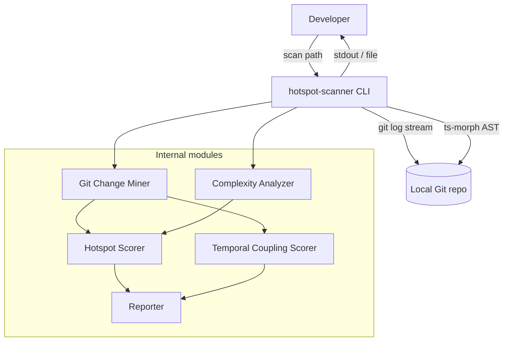

# ARCHITECTURE — @vitals/hotspot-scanner

## Container view

## Data flow (scan)

1. CLI parses flags (`--since`, `--format`, `--granularity`, `--top`, `--min-cochange`, `--include`, `--exclude`, `--output`, `--baseline`) and calls `runScan()` in `src/scan.ts`
2. **`runScan()`** validates `repoPath`, checks `.git` exists, builds a shared `PathScope` (`src/paths/`), then runs stages sequentially:
   - **Git Change Miner** — one `git log --numstat` stream → `FileChangeStats` + `CoChangeEvent[]`; output filtered by `PathScope` via `filterGitMinerResult()`; forwards warnings and `onProgress`
   - **Complexity Analyzer** — discovers in-scope TS/JS files (directory prune + file filter) via ts-morph → `ComplexityResult[]` + `FunctionComplexityResult[]`; forwards warnings
   - **Scoring branch** on `granularity` (default `file`):
     - **file** — `createHotspotScorer()` → `ScanResult.hotspots`
     - **function** — `createFunctionHotspotScorer()` with inherited file churn → `ScanResult.functions`
   - **Temporal Coupling Scorer** — file-pair ranked `coupling` (unchanged in both modes)
3. CLI passes `ScanResult` to **Reporter** for table, JSON, or markdown output (`--top` applied at render time)
4. With `--output <path>`, CLI writes the rendered report to file (UTF-8) instead of stdout; stderr diagnostics unchanged
5. With `--baseline <file>`, CLI loads a prior `ScanResult` JSON, runs `compareScanResults()`, and renders a **CompareResult** delta via `renderCompare()` (same format/output transport as normal scan)

### Path scoping (M7)

- **Default excludes** (always active): `node_modules`, `.git`, `dist`, `coverage`, `build`
- **`--include <glob>`** (repeatable): narrows scope — path must match at least one include pattern
- **`--exclude <glob>`** (repeatable): additive excludes on top of defaults
- **Semantics**: exclude wins over include; same `PathScope` instance filters both git stats and complexity discovery
- **Module**: `src/paths/` (`createPathScope`, `isPathInScope`, `filterGitMinerResult`); glob matching via `picomatch`

## Key constraints

- Single Git log pass (ADR-2026-020)
- Working-tree AST only (not historical file versions)
- Invalid TS/JS: warn and skip — do not abort scan
- Streaming required for large repos (RT-001)

## Orchestration

`src/scan.ts` is the pipeline orchestrator: `createGitMiner` → `createComplexityAnalyzer` → (`createHotspotScorer` | `createFunctionHotspotScorer`) + `createTemporalCouplingScorer`. It returns a typed `ScanResult` with full ranked lists. `bin/hotspot-scanner.ts` is a thin CLI wrapper (flags only, no domain logic).

Integration validation: `tests/fixtures/repos/small-ts/` (see [TESTING.md](./TESTING.md) § Integration).

## Hotspot output schema (M9)

Each `HotspotScore` entry in `ScanResult.hotspots` carries normalized scores plus raw metrics:

| Field | Source | JSON | Table |
| ----- | ------ | ---- | ----- |
| `filePath` | complexity entry | yes | yes |
| `hotspotScore` | harmonic mean of normalized c/h | yes | yes |
| `complexityNormalized` | log1p+min-max | yes | yes (CpxN) |
| `churnNormalized` | log1p+min-max | yes | yes (ChurnN) |
| `cyclomaticComplexity` | `ComplexityResult` | yes | yes (Cpx) |
| `functionCount` | `ComplexityResult` | yes | yes (Funcs) |
| `commitCount` | `FileChangeStats` | yes | yes (Churn) |
| `linesChanged` | `FileChangeStats` | yes | no |
| `authorCount` | `FileChangeStats.authors.size` | yes | yes (Authors) |

JSON `version` remains `"1.0"` (additive fields). Coupling schema unchanged from M5.

## Function granularity (M11)

`--granularity file|function` (default `file`) selects the active ranking array in `ScanResult`:

| Mode | Active array | Inactive array | `meta.granularity` |
| ---- | ------------ | -------------- | ------------------ |
| `file` | `hotspots: HotspotScore[]` | `functions: []` | `"file"` |
| `function` | `functions: FunctionHotspotScore[]` | `hotspots: []` | `"function"` |

Each `FunctionHotspotScore` entry carries per-function McCabe plus inherited file churn:

| Field | Source |
| ----- | ------ |
| `filePath`, `functionName`, `line`, `complexity` | `FunctionComplexityResult` from complexity analyzer |
| `hotspotScore`, `complexityNormalized`, `churnNormalized` | harmonic combiner over all functions (same formula as file mode) |
| `commitCount`, `linesChanged`, `authorCount` | parent file `FileChangeStats` (inherited) |

`coupling` remains file-pair ranked in both modes. `--top` slices the active ranking array at render time via `sliceScanResult`.

## Export formats (M10)

- **`--format markdown`** — GFM report with hotspot and coupling tables (includes `linesChanged` column)
- **`--output <path>`** — write report to file for any format (`table`, `json`, `markdown`); stdout silent for report content
- **Reporter module**: `renderMarkdown()` in `src/report/markdown.ts`; `createReporter()` dispatches by format
- **Path validation**: parent directory must exist; directory targets rejected; overwrite is default

## Scan compare (M13)

- **`--baseline <path>`** — compare current scan against a saved `ScanResult` JSON (from a prior `--format json --output` run)
- **Compare module** (`src/compare/`): `loadBaseline()` validates and parses baseline JSON; `compareScanResults()` classifies entities as `new`, `removed`, or `rankChanged`
- **CompareResult** schema (`version: "1.0"`): separate from `ScanResult`; sections for hotspots/functions (mode-dependent) and coupling pairs
- **Entity keys**: file path for hotspots; `filePath + functionName + line` for functions; canonical `(fileA, fileB)` for coupling
- **Guards**: granularity mismatch → hard error; `since` mismatch → warning in `meta.warnings` (stderr + report)
- **`--top`** on compare output slices delta arrays at render time via `sliceCompareResult()` — classification uses full rankings
- **Reporter**: `createReporter().renderCompare()` dispatches to `compare-table`, `compare-json`, `compare-markdown`
