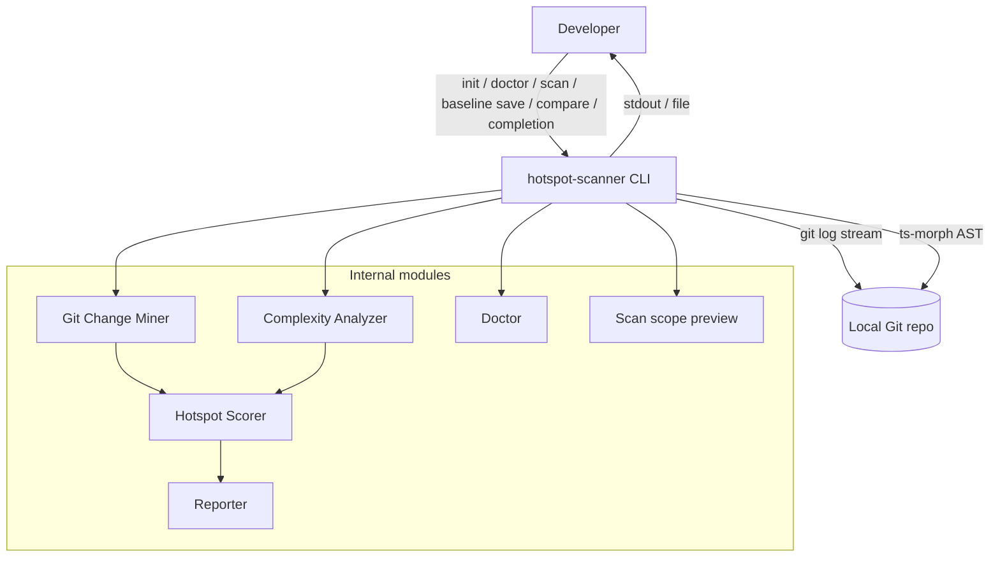
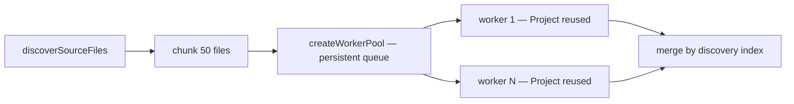
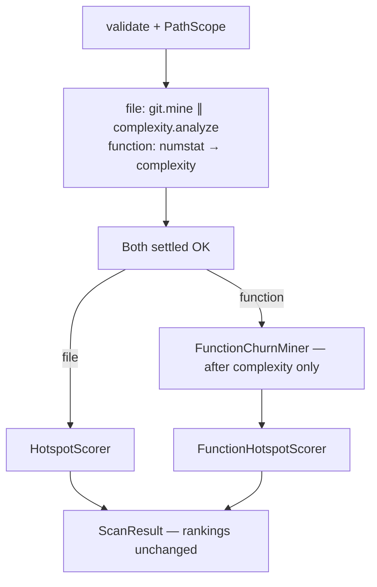

# ARCHITECTURE — @vitals/hotspot-scanner

## Container view



## CLI commands (M39–M40)

Multi-command CLI via Commander in `bin/hotspot-scanner.ts` with shared wiring in `bin/scan-actions.ts` (flags, I/O, exit mapping only — no domain logic):

| Command | Module | Behavior |
| ------- | ------ | -------- |
| `init [dir]` | `src/config/exemplar.ts` (`writeInitConfig`) | Writes locked exemplar `.hotspot-scanner.json`; refuses overwrite without `--force` |
| `doctor [path]` | `src/doctor/` (`runDoctor`, `formatDoctorJsonReport`) | Pre-flight checks: Node `engines`, git on PATH, git repo via shared `resolveScanPipelineContext` (M43 remount on nested package cwd), config discovery/validity, **`scope`** inventory (`previewScanScope` — eligible count parity with `scan --dry-run`), tsconfig/jsconfig info; optional `--include-tests`; `-f, --format text|json` (default `text`; invalid → `CliUsageError` exit `2`; JSON stdout includes `exitCode` even on failure); aggregate exit policy (hard `1`, config `2`, soft warn `0`); **does not** invoke Git Change Miner, Complexity Analyzer, scorers, or Reporter (see [Data flow (doctor)](#data-flow-doctor)) |
| `scan [path]` | `src/scan.ts` (`runScan`) via `bin/scan-actions.ts` | Full pipeline (see [Data flow (scan)](#data-flow-scan)); optional `--baseline` → compare path (see [Scan compare (M13, M40)](#scan-compare-m13-m40)) |
| `scan --dry-run` | `src/scan-preview.ts` (`previewScanScope`) | Merges config, validates repo + git, builds `PathScope`, counts via `discoverSourceFiles` — **does not** invoke Git Change Miner, Complexity Analyzer, scorers, or Reporter ranking; when `eligibleFileCount > PATCH_PATHSPEC_FALLBACK_THRESHOLD` (1000), preview text includes a pathspec-scale warning (function mode will batch patch pathspecs) |
| `baseline save <path>` | `runScan()` + `bin/scan-actions.ts` | Runs full scan, writes loadable `ScanResult` JSON; `--output` default `./hotspot-baseline.json` (cwd-relative); no `--format` / `--baseline` on this command |
| `compare <path> --baseline <file>` | `runScan()` + `src/compare/` + `src/report/` via `bin/scan-actions.ts` | Same compare-and-render sequence as `scan --baseline` (`validateBaselinePath` → `loadBaseline` → `compareScanResults` → `renderCompare`); `--baseline` required |
| `completion <shell>` | `bin/completion-scripts.ts` (`getCompletionScript`) | Prints static bash/zsh/fish completion script to **stdout**; exit `0`; invalid shell → `CliUsageError` (exit `2`) listing allowed shells. **Does not** invoke `runScan`, git mining, or AST analysis |

`--dry-run` rejects `--baseline` (`CliUsageError`); `--format` / `--output` are ignored (plain-text preview on stdout). Invalid repo/config fail the same prelude as `runScan()` before preview.

## Data flow (doctor)

1. CLI (`bin/hotspot-scanner.ts`) dispatches `doctor [path]` (default `.`) with optional `--config` and `--include-tests` (`RunDoctorOptions.includeTests` → shared PathScope / preview).
2. **Environment checks (M39, unchanged order)** — Node `engines` policy and `git` on PATH run before any scan prelude.
3. **Target validation** — request path must exist and be a directory; otherwise `git-repo` fail (exit `1`).
4. **Shared prelude (M43 + M30 + M46)** — `resolveScanPipelineContext()` on `ScanOptions` shaped from doctor input (`repoPath` = resolved target, `configPath?`, `includeTests?`):
   - Same remount, config walk-from-request-path, merge, and git validation on **pipeline git root** as `runScan()` / `previewScanScope()` (see step 2 under [Data flow (scan)](#data-flow-scan))
   - Success → `git-repo` pass naming pipeline `repoPath` (remount / auto-include noted when applicable)
   - Not in a git work tree or prelude failure → `git-repo` fail; **`scope` is not emitted**
5. **Config finding (M39)** — request-path discovery / explicit `--config` pass, soft warn, or fail (exit `2` on invalid/missing explicit config); semantics unchanged when prelude remounts.
6. **Scope inventory (M52)** — on prelude success, `previewScanScope(same options)` → `scope` pass with `eligible files: N` where `N` matches dry-run for identical options; zero eligible still pass; message includes pipeline `repoPath` and remount note when present.
7. **tsconfig/jsconfig** — informational walk from **request path** (unchanged).
8. **`aggregateExitCode`** — M39 policy unchanged (`scope` never drives exit alone).
9. **Output** — `text` (default): `status: message` per finding; `json`: `formatDoctorJsonReport()` → `{ version: "1.0", findings, exitCode }` on stdout (printed even when exit ≠ 0).
10. **No pipeline stages** — doctor does not call Git Change Miner, Complexity Analyzer, hotspot scorers, or report ranking.

## Data flow (scan)

1. CLI (`bin/hotspot-scanner.ts`) dispatches `init`, `doctor`, `scan [path]`, `baseline save <path>`, `compare <path> --baseline <file>`, or `completion <shell>` (optional repo `path` on scan/compare/baseline/doctor, default `.`). Program-level `-V` / `--version` prints package `version` without running a command. Shared scan/compare wiring lives in `bin/scan-actions.ts` (`executeScan`, `executeCompareAndRender`, `writeBaselineJson`, `runWithScanCancelSignals`, `createVerboseSpawnArgvHandler`, path validators). For `scan` / `compare`, flags include `--since`; `-f` / `--format`; `-g` / `--granularity`; `-t` / `--top`; `--include` / `--exclude`; `--config`; `--concurrency`; `-o` / `--output`; `--baseline`; `--only`; `--no-triage-hints`; `--no-color`; `--explain`; `--strict` (M53 — compare only; see [Compare strict (M53)](#compare-strict-m53)); `--dry-run`; `--quiet`; `--no-progress`; `--verbose` (CLI-only — git spawn argv trace; suppressed when `--quiet`). `--dry-run` routes to `previewScanScope()` (see [CLI commands (M39)](#cli-commands-m39)); otherwise `runWithScanCancelSignals()` passes an `AbortSignal` into `runScan()` (see [User cancel (M51)](#user-cancel-m51)). `--quiet` suppresses progress plus info-level `ScanWarning` stderr and disables verbose git traces; `--no-progress` suppresses progress only; both leave report output and warning/error diagnostics. Common errors append actionable `Hint:` lines (non-git path, csv without output, baseline path/content, missing explicit config).
2. **Monorepo path resolve + config (M43 + M21 + M30)** — `resolveScanPipelineContext()` (`src/scan.ts`) runs before pipeline stages (also used by `scan --dry-run` via `previewScanScope()` and by `runDoctor()` for remount-aware `git-repo` + `scope` inventory):
   - `validateRepoPath(options.repoPath)` on the **original request path**
   - `resolveMonorepoScanPath(requestPath)` (`src/paths/resolve-repo.ts`) via `git -C <requestPath> rev-parse --show-toplevel` → `{ repoPath (git root), packagePrefix?, remounted }`; request path already at git root → `remounted: false`; not in a work tree → same error class as today
   - `loadHotspotScannerConfig(options.repoPath, { configPath? })` — discovery walk starts from the **original request path**, not the remounted git root (M30 unchanged). When `configPath` is set, that file is read only (parent walk skipped); missing explicit path → `ConfigError`. Otherwise walk upward from request path for `.hotspot-scanner.json` (nearest wins); walk miss → built-in defaults only (not an error)
   - CLI overrides from `ScanOptions`; when `remounted && options.include === undefined`, inject synthetic CLI `include: ["{packagePrefix}/**"]` (beats config `include` via merge precedence)
   - `mergeScanOptions()` applies **CLI > config > defaults** for `since`, `include`, `exclude`, `granularity`, `top`, `concurrency`
   - `validateGitRepository(resolved.repoPath)` on the **git root** (not the nested package directory)
   - When `remounted`, push `MONOREPO_PATH_REMOUNT` info `ScanWarning` (message names git root; mentions auto-include pattern only when applied)
   - **YAGNI:** path-only heuristic — no `pnpm-workspace.yaml` / nx / turborepo parsers; no `--no-remount` flag
   - `format`, `output`, `baseline`, `--only`, `--no-triage-hints`, `--no-color`, `quiet`, `no-progress`, `verbose`, `sequential` (`--sequential` / `--no-overlap`), and `version` remain CLI-only (not config keys). Invalid JSON or bad types throw `ConfigError` (non-zero exit). Unknown keys are not applied to merge (forward-compatible) but emit a warn-only `UNKNOWN_CONFIG_KEY` diagnostic (never fail). Bin pre-merge for `top` uses the same `configPath` / discovery args as `runScan()` (request path).
3. **`runScan()`** builds `PathScope` via `createScanPathScope(merged, { includeTests? })` (`src/scan.ts` — shared with `previewScanScope` / doctor scope inventory), then runs mining/analysis on `pipelineRepoPath` (git root when remounted) with **M34 overlap by default** (or sequential opt-out when `ScanOptions.sequential === true`) and post-barrier scoring (rankings and JSON contract unchanged):
   - **Overlap window (file mode, default)** — `GitMiner.mine` (numstat) and `ComplexityAnalyzer.analyze` start concurrently under a shared orchestrator `AbortController`; on first rejection, abort the sibling (`child.kill` / worker terminate), `Promise.allSettled` both promises, rethrow the **original** error — no hotspot/function scoring on failure
   - **Sequential opt-out (M49, file mode)** — when `ScanOptions.sequential === true` (CLI `--sequential` primary, `--no-overlap` alias on `scan`, `compare`, and `baseline save`), `await` git mine then `await` complexity analyze — stages are not concurrently in-flight; lowers peak RSS and yields deterministic stage order; rankings and JSON contract unchanged; function mode already sequences numstat before complexity (flag accepted, no extra effect on M35 boundaries)
   - **Git Change Miner** — one `git log -M --numstat` stream → `FileChangeStats`; `PathAliasMap` links renames; optional `isPathInScope` predicate applied during aggregation; rename blind-spot warnings as `ScanWarning[]` with `RENAME_HISTORY_INCOMPLETE` (M26 messages, M28 routing); output filtered by `PathScope` via `filterGitMinerResult()`; forwards warnings and phased `onProgress({ phase: "git", commitsProcessed })` during the overlap window
   - **Complexity Analyzer** — discovers in-scope TS/JS files on the main thread (prefers `git ls-files` + extension/PathScope filter in Git repos, with filesystem walk fallback); **function mode (M35 + M50)** waits for numstat to settle, then runs **full in-scope discovery** (no churn `pathAllowlist` on complexity — M50 revisit of M35 D6); file mode uses full discovery concurrently with numstat; chunks into batches of 50, dispatches batches to a bounded persistent `worker_threads` pool (`createWorkerPool`, concurrency from merged config — default `min(availableParallelism(), 8)`); each worker (or inline session when `concurrency === 1`) reuses one ts-morph `Project` across batches with source files cleared between `loadBatch` calls; parse gating uses syntactic diagnostics only → merged `ComplexityResult[]` + `FunctionComplexityResult[]` in discovery order; parse failures emit stub `ComplexityResult` rows (`parseFailed: true`) plus `PARSE_FAILED` warnings (M50); phased `onProgress({ phase: "complexity", filesProcessed, batchesProcessed, totalFiles, totalBatches, commitsProcessed: 0 })` after each batch (inline and worker paths); forwards warnings
   - **Post-barrier (both stages settled OK)** — aggregate warnings in deterministic order (git, then complexity); then scoring branch on `granularity` (default `file`):
     - **file** — `createHotspotScorer()` → `ScanResult.hotspots` (no patch spawn)
     - **function** — `buildFunctionModePathAllowlist()` from scoped `fileStats` → `createFunctionChurnMiner({ paths })` **after** complexity only (never concurrent with numstat; pathspec-restricted `git log -p` per batch when allowlist non-empty — `≤ 1000` paths → single spawn, `> 1000` → stable-sorted chunks of `≤ PATCH_PATHSPEC_FALLBACK_THRESHOLD` run **sequentially**; empty allowlist → no patch spawn; ARG_MAX emergency → half-size retry then unrestricted remainder + `PATHSPEC_ARG_MAX_FALLBACK`); interval-indexed hunk overlap in `aggregatePatchCommit`; phased `onProgress({ phase: "function-churn", commitsProcessed })` → `createFunctionHotspotScorer()` → `ScanResult.functions`
   - **Aggregate diagnostics** — `runScan()` collects stage `ScanWarning[]` into `ScanResult.meta.warnings` (always present, possibly empty); forwards each via `onWarning`; on successful scans, records `ScanResult.meta.timings` (`gitMs`, `complexityMs`, optional `functionChurnMs`, `totalMs` — see [Stage timings (M51)](#stage-timings-m51))
4. CLI passes `ScanResult` to **Reporter** for table, JSON, markdown, or CSV output (`--top` applied at render time for table/markdown only; ignored for JSON and CSV). M41 interpretation options (`--only`, `--no-triage-hints`, `--no-color`) are resolved in the bin and passed as `ReporterOptions` (see [Export formats](#export-formats-m10-m17-m18-m41))
5. With `--output <path>`, CLI writes the rendered report to file (UTF-8) instead of stdout; stderr diagnostics unchanged
6. With `--baseline <file>` on `scan`, or via `compare <path> --baseline <file>`, CLI loads a prior `ScanResult` JSON, runs `compareScanResults()`, and renders a **CompareResult** delta via `renderCompare()` (same format/output transport as normal scan). `baseline save <path>` writes a baseline file via `runScan()` + `JSON.stringify` of the full `ScanResult` (default `./hotspot-baseline.json`; `--top` does not truncate the saved file). With `--strict` (M53), after a successful compare + report write, exit `1` when `meta.warnings` contains `COMPARE_SINCE_MISMATCH` (see [Compare strict (M53)](#compare-strict-m53))
7. With `--explain <target>` (M42 + M53), after the report is written to stdout or `--output`, the CLI prints a human-readable breakdown to **stderr** only — full scan/compare and report unchanged. **Scan-only** (`scan` without `--baseline`): lookup on full `ScanResult` arrays (ignores `--top` truncation). **Compare mode** (`scan --baseline` or `compare`): lookup on full `CompareResult` delta sections (`new` / `removed` / `rankChanged`) with classification and rank fields. See [Explain breakdown (M42)](#explain-breakdown-m42) and [Compare explain (M53)](#compare-explain-m53)

### Config file (M21 + M30)

- **Filename:** `.hotspot-scanner.json` only — not `.hotspotrc`, not dual lookup on discovery walk
- **Discovery (default):** From `repoPath`, walk parents for `.hotspot-scanner.json`; nearest file wins; filesystem root with no file → `null` (defaults only, not an error)
- **Explicit path:** `--config <path>` / `ScanOptions.configPath` loads that file only (skips walk); ENOENT or unreadable explicit path → `ConfigError`; relative path resolves from process cwd
- **Keys:** `since`, `include`, `exclude`, `granularity`, `top`, `concurrency` — map to the same semantics as CLI flags
- **Precedence:** CLI flag explicitly provided → config key present → built-in default (`DEFAULT_SINCE`, `DEFAULT_TOP`, granularity `file`). `--config` selects which file is read only — option merge precedence unchanged.
- **CLI-only:** `format`, `output`, `baseline`, `--only`, `--no-triage-hints`, `--no-color`, `--explain`, `--strict` (M53 compare exit policy), `quiet`, `no-progress`, `verbose`, `sequential` (`--sequential` / `--no-overlap`), `includeTests` (`--include-tests`), `version` (program flag; not in `.hotspot-scanner.json`)
- **Module:** `src/config/` (`load-config.ts`, `merge-options.ts`, `exemplar.ts` for `init`); `ConfigError` on invalid JSON or value types; unknown keys → warn-only `UNKNOWN_CONFIG_KEY` (not applied to merge; never fail)

### Path scoping (M7 + M30 + M43 + M46 + M48)

- **Eligible extensions** (M48): `.ts`, `.tsx`, `.js`, `.jsx`, `.mjs`, `.cjs` (`ELIGIBLE_EXTENSIONS` in `src/complexity/discover.ts` — SoT for discovery, function-mode allowlist, static enrich peer resolution); `.mts`/`.cts` not eligible
- **Default artifact excludes** (always active, non-disableable; not lifted by `--include-tests`): `node_modules`, `.git`, `dist`, `coverage`, `build`, `.next`, `out`, `vendor`, `storybook-static`, `__snapshots__`, `.turbo`, `.vercel`, `.cache`, `.nuxt`, `.output`, `.parcel-cache`, `tmp` (`DEFAULT_ARTIFACT_EXCLUDE_PATTERNS`; M30/M48 patterns use `**/<name>/**` for nested monorepo artifacts; M7 entries unchanged)
- **Default test excludes** (active unless opted in): `**/*.test.ts`, `**/*.test.tsx`, `**/*.test.js`, `**/*.test.jsx`, `**/*.spec.ts`, `**/*.spec.tsx`, `**/*.spec.js`, `**/*.spec.jsx`, `**/__tests__/**` (`DEFAULT_TEST_EXCLUDE_PATTERNS`; M46)
- **Residual test globs (M48):** after `.mjs`/`.cjs` eligibility, co-located `*.test.mjs`, `*.spec.cjs`, and similar are **not** in `DEFAULT_TEST_EXCLUDE_PATTERNS` (M46 ownership) — they may appear in scope unless user `--exclude` or a future test-glob follow-up; see CONCERNS
- **`--include-tests` / `ScanOptions.includeTests`**: lifts **only** built-in test patterns — compiled excludes become artifact defaults + user/config `exclude`; artifact defaults and user excludes remain additive and still apply
- **`--include <glob>`** (repeatable): narrows scope — path must match at least one include pattern
- **`--exclude <glob>`** (repeatable): additive excludes on top of defaults (including when `--include-tests` is set)
- **No ignore file (M54):** `.hotspotignore` and `.gitignore`-style ignore files are **not** supported — use config `exclude` and/or CLI `--exclude` (see `docs/recipes.md`). No planned loader for a separate ignore-file format.
- **Semantics**: exclude wins over include; same `PathScope` instance filters both git stats and complexity discovery; dry-run preview surfaces `test files: excluded` or `test files: included`
- **Monorepo package cwd (M43):** when `requestPath` is a nested directory inside a git workspace, `resolveMonorepoScanPath()` remounts pipeline `repoPath` to `git rev-parse --show-toplevel` and auto-injects CLI-level `{posixRelativePrefix}/**` unless `ScanOptions.include` / CLI `--include` was explicitly set (config `include` does **not** suppress auto-include). Config discovery stays on the original request path. Git-root scans unchanged (no remount, no auto-include). Nested path that is its own git root (separate `.git`) remounts only to that nested root. Emits `MONOREPO_PATH_REMOUNT` info warning when remounted. No workspace-tool manifest parsing (YAGNI).
- **`createScanPathScope()`** (`src/scan.ts`): single PathScope construction site for `runScan`, `previewScanScope`, and doctor `scope` inventory — forwards merged `include`/`exclude` and optional `includeTests` (M46) to `createPathScope`
- **Module**: `src/paths/` (`resolveMonorepoScanPath`, `buildAutoIncludePattern`, `createPathScope`, `isPathInScope`, `filterGitMinerResult`); glob matching via `picomatch`

## Key constraints

- Single **numstat** Git log pass for file churn (ADR-2026-020); function mode adds **sequential** pathspec-restricted patch streams (`git log -p --unified=0`) for per-function churn attribution — allowlist `≤ PATCH_PATHSPEC_FALLBACK_THRESHOLD` (1000) → one spawn; allowlist `> 1000` → stable-sorted batches of `≤ 1000` (M47); empty allowlist skips spawn; unrestricted patch I/O only on documented ARG_MAX emergency (`PATHSPEC_ARG_MAX_FALLBACK`); file mode never spawns the patch stream (M35)
- Both git spawns enable **find-renames** (`-M`) so git can emit `old => new` rename metadata for `PathAliasMap`; **do not** add global `git log --follow` (per-file follow is incompatible with a single numstat pass — see CONCERNS)
- Working-tree AST only (not historical file versions)
- Invalid TS/JS: emit `PARSE_FAILED` + stub `ComplexityResult` / hotspot with `parseFailed: true`, `hotspotScore: 0` (M50); do not abort scan
- Streaming required for large repos (RT-001)
- Complexity batches processed in parallel via persistent `worker_threads` pool (M15 + M31); file discovery and merge remain on main thread

## Rename confidence (M26, M50, RT-003)

File and function git miners share rename linking via `PathAliasMap` (`src/git/rename.ts`) and actionable warnings via `src/git/rename-warnings.ts`. M28 routes existing M26 message families into structured `ScanWarning` objects (`code: "RENAME_HISTORY_INCOMPLETE"`, `severity: "warning"`) — aggregated in `ScanResult.meta.warnings`, forwarded through `onWarning`, and printed to stderr via `src/diagnostics/` (`info:` / `warning:` / `error:` prefixes). **M28 does not add new rename-confidence message families** beyond M26; deeper rename UX remains RT-003 scope.

**M50 heuristic linking:** when a commit has same-commit delete+add paths with strengthened relatedness (identical basename, or identical stem with eligible extensions, per `pathsLookLikeRename` in `rename-warnings.ts`) and no git `=>` / `renameFrom` metadata, the miner calls `PathAliasMap.link(from, to)` before aggregation/canonicalize so churn unifies under the new path. `RENAME_HISTORY_INCOMPLETE` warnings (`Suspected unlinked rename…`, cap preserved) still emit — stable `code`; message may note heuristic link. Deterministic pairing: lexicographic sort, first unused related add per delete. Still no global `--follow` or historical AST.

### Git argv

| Miner | Spawn builder | find-renames | `--follow` |
| ----- | ------------- | ------------ | ---------- |
| File (numstat) | `buildGitLogArgv` in `src/git/spawn.ts` | `-M` | **forbidden** |
| Function (patch) | `buildGitPatchLogArgv` in `src/git/function-churn/spawn.ts` | `-M` | **forbidden** |

Function patch argv (M35 + M47): `buildGitPatchLogArgv` always appends `--` + pathspecs when the caller passes a non-empty `paths` chunk (one batch at a time). `partitionPathspecs` stable-sorts and chunks allowlists `> PATCH_PATHSPEC_FALLBACK_THRESHOLD` (1000); `createFunctionChurnMiner` runs one sequential `streamGitPatchLog` per chunk. Empty `paths` → miner does not spawn. On ARG_MAX / `E2BIG`-class spawn failure: retry once with half chunk size (min 1), then unrestricted stream for the failing remainder + `PATHSPEC_ARG_MAX_FALLBACK` warning. `-M`, `-p`, `--unified=0`, and optional `--since` are always preserved when pathspecs are applied.

### PathAliasMap

Parse `old => new` lines from the log stream, `link()` chains, `canonicalizeFileStats` at end of mine. Ambiguous paths (multiple competing rename targets) keep the existing incomplete-history prefix.

### File-miner warning families

Emitted from `createGitMiner().mine()` after the streaming aggregate loop (noise control: families only when their signals apply):

| Family | Trigger | Stable prefix / pattern | Next step (M42) |
| ------ | ------- | ----------------------- | ----------------- |
| Ambiguous rename | `PathAliasMap.getAmbiguousPaths()` | `Rename history may be incomplete for: …` | Verify rename detection or widen `--since` |
| Unlinked suspected rename | Same-commit delete+add with basename relatedness, no `renameFrom` / `=>` | `Suspected unlinked rename (no git rename metadata): …` (capped, max 5 pairs + summary) | Ensure git records renames (`-M` enabled) or widen `--since` |
| `--since` truncation | `since` set **and** at least one in-window rename link recorded | `Rename history before the --since window (…) may be missing under canonical paths` | Widen `--since` to include pre-window rename history |

### Function-mode pós-rename overlap warning

When function-churn mining observes at least one rename link **or** ambiguous path, append **once**: overlap uses current working-tree `[line, endLine]` vs historical hunk lines; confidence may be reduced after renames/moves; message appends next step to treat function ranks cautiously after moves (prefer file mode or wider `--since`). File mode does **not** emit this warning. No historical AST or blame-based attribution. Emitted as `RENAME_HISTORY_INCOMPLETE` in `meta.warnings`. M42 appends next-step sentences only — **`code` values unchanged** (`RENAME_HISTORY_INCOMPLETE`, `EMPTY_SINCE_WINDOW`).

## Diagnostics (M28)

Operator-facing concurrency, progress, and warning UX. Module: `src/diagnostics/` (`logger.ts`).

### Concurrency override

| Surface | Detail |
| ------- | ------ |
| CLI | `--concurrency <n>` — positive integer ≥ 1; invalid → `CliUsageError` |
| Config | `concurrency` in `.hotspot-scanner.json`; invalid → `ConfigError` |
| Default | `DEFAULT_WORKER_CONCURRENCY` = `min(availableParallelism(), 8)` in `src/complexity/pool.ts` |
| Precedence | CLI > config > default |
| Wiring | `mergeScanOptions()` → `runScan()` → `createComplexityAnalyzer({ concurrency })` |

Batch size (`DEFAULT_BATCH_SIZE` = 50) stays internal (M15); not exposed in M28.

### Progress phases

| `phase` | Emitter | Counter |
| ------- | ------- | ------- |
| `git` | `GitMiner` numstat stream | `commitsProcessed` — commits in numstat pass |
| `function-churn` | `FunctionChurnMiner` patch stream | `commitsProcessed` — commits in patch pass |
| `complexity` | `ComplexityAnalyzer` / worker pool (M42) | `filesProcessed`, `batchesProcessed`, optional `totalFiles` / `totalBatches`; `commitsProcessed` is `0` |

Stderr formats:

- Git phases (throttled every 1,000 commits): `Processing <phase> commit <N>...`
- Complexity (throttled on `filesProcessed` interval = `DEFAULT_BATCH_SIZE` 50, plus final partial batch): `Processing complexity batch <N>/<totalBatches> (<filesProcessed>/<totalFiles> files)...`

`runScan()` wires `onProgress` through git miners and complexity (`src/scan.ts` → `ComplexityAnalyzer.analyze` → pool `runBatches`). CLI `--no-progress` (M38) passes a no-op `onProgress` via `createCliDiagnosticHandlers()` — complexity progress silences through the same hook without a separate complexity flag. `--quiet` also filters info-level warning stderr (M38) and suppresses `--verbose` git argv traces (M51).

### User cancel (M51)

| Surface | Detail |
| ------- | ------ |
| CLI | `runWithScanCancelSignals()` in `bin/scan-actions.ts` — listeners on `SIGINT` / `SIGTERM` during `scan` / `compare` (paths that call `runScan`) |
| API | `ScanOptions.signal?: AbortSignal` — linked to orchestrator `AbortController` via `linkAbortSignal()` in `src/scan.ts` |
| Stages | External abort propagates to numstat spawn, complexity pool, and function-churn patch spawn (`child.kill` / worker terminate — same M34 settlement path as sibling failure) |
| Outcome | No `ScanResult` / compare report on cancel; stderr `warning: scan cancelled`; exit `130` (`SIGINT`) or `143` (`SIGTERM`) |
| Sibling failure | Non-signal abort unchanged — original error rethrown, existing non-zero exit semantics |

First signal: `abort()` shared controller, remove listeners, do not re-raise. Await git/worker settlement before process exit.

### Verbose git argv (M51)

| Surface | Detail |
| ------- | ------ |
| CLI | `--verbose` on `scan` / `compare` only; not a config key |
| Hook | `createVerboseSpawnArgvHandler({ verbose, quiet })` → `ScanOptions.onSpawnArgv` — one stderr line per spawn: `verbose: git <argv…>` |
| Scope | Numstat and function-churn patch argv only — not AST, progress, or scoring |
| Quiet | `--quiet` suppresses verbose lines (handler not installed) |

Spawn helpers (`src/git/spawn.ts`, `src/git/function-churn/spawn.ts`) invoke `onSpawnArgv` once with argv before `spawn`.

### Stage timings (M51)

Successful `runScan()` always sets `ScanMeta.timings` (additive under JSON `version: "1.0"`):

```ts
interface ScanStageTimings {
  gitMs: number;
  complexityMs: number;
  functionChurnMs?: number; // function mode only; omitted in file mode
  totalMs: number;
}
```

- Wall-clock ms (`performance.now()`), integers ≥ 0; `totalMs` spans full `runScan()` body through scoring (no separate `scoringMs`)
- **File-mode overlap:** `gitMs` and `complexityMs` are each stage's duration while M34 overlap runs — sums may exceed `totalMs`; `totalMs` is wall clock for the overlapped window plus post-barrier work
- **Function mode:** adds `functionChurnMs` after complexity barrier; numstat still completes before complexity starts
- Baselines without `timings` remain loadable (`loadBaseline` optional field)
- Human table/markdown: executive summary includes warning count line (M51); timings primarily for JSON/CSV `meta.json` consumers

### Structured warnings (`ScanWarning`)

```ts
type DiagnosticSeverity = "info" | "warning" | "error";

interface ScanWarning {
  severity: DiagnosticSeverity;
  message: string;
  code?: string;
}
```

- `ScanResult.meta.warnings: ScanWarning[]` — required, may be empty; `version` stays `"2.0"`
- `CompareResult.meta.warnings: ScanWarning[]` — same shape (compare consumers must read objects, not bare strings)
- `onWarning?: (warning: ScanWarning) => void` — programmatic callback
- **Severity vs exit code:** severity is diagnostic only; successful scans exit `0` with warnings present

### Explain breakdown (M42)

CLI-only `--explain <target>` (`src/report/explain.ts`, wired in `bin/hotspot-scanner.ts`). Always runs the **full scan** and normal report first; explain block prints to **stderr** after report write (stdout / `--output` unchanged — safe with `--format json|csv`).

**Grammar** (single option value):

| Form | Meaning |
| ---- | ------- |
| `<path>` | File path (repo-relative or absolute under repo; leading `./` stripped) |
| `<path>:<functionName>` | Function target — suffix after the **last** `:` matching `/^(?:[A-Za-z_$][\w$]*)(?:\.[A-Za-z_$][\w$]*)*$/`; if suffix does not match, entire string is treated as a path |

**Granularity rules:**

| `--granularity` | Target | Lookup |
| --------------- | ------ | ------ |
| `file` (default) | `<path>` | `ScanResult.hotspots` by `filePath` |
| `file` | `<path>:<functionName>` | `CliUsageError` — suggest `--granularity function` |
| `function` | `<path>` | All `ScanResult.functions` rows for `filePath` (rank order) |
| `function` | `<path>:<functionName>` | Single matching `FunctionHotspotScore` |

Lookup uses **full** `ScanResult` arrays (pre-`--top` truncation). Not found → stderr message (`explain: no hotspot ranking for …` / `explain: no function ranking for …`), scan still exits `0`. Breakdown reads ranked fields only — no score recomputation; no JSON schema change.

### Compare explain (M53)

When compare mode is active (`scan --baseline` or `compare` command) and `--explain <target>` is set, the CLI explains against **`CompareResult`** delta sections — not the bare current `ScanResult`. Module: `src/report/explain-compare.ts` (path grammar reuses `parseExplainTarget` / `normalizeExplainPath` from `explain.ts`).

**Lookup order** per target: `new` → `removed` → `rankChanged` within the active granularity section (`hotspots` or `functions`).

**Explain block** includes classification (`new` | `removed` | `rank-changed`), entity identity, score fields from the entity (M42 field set — no recomputation), and for rank-changed: `baselineRank`, `currentRank`, `rankDelta`. Lookup uses **full** compare arrays (pre-`--top` slice). Not found → `explain: no compare delta for <target>` on stderr; compare still exits `0` on success unless `--strict` fails independently.

Without `--baseline` / not on the `compare` command, M42 scan explain is unchanged.

### Compare strict (M53)

CLI-only `--strict` on `scan` and `compare`. After successful compare + report write, if `CompareResult.meta.warnings` contains any entry with `code === "COMPARE_SINCE_MISMATCH"`, the process exits **`1`**. Default (no `--strict`) preserves M13 warn-and-continue — warning on stderr + `meta.warnings`, exit `0` on success. Other warning codes do **not** alone cause a hard fail under `--strict`. Enforced in `bin/hotspot-scanner.ts` via `enforceStrictCompare()` after `executeCompareAndRender()`; `compareScanResults()` stays pure.

### Stable warning codes (M28+)

| Code | Emitter | Operator interpretation |
| ---- | ------- | ----------------------- |
| `EMPTY_SINCE_WINDOW` | git / function-churn | No commits in `--since`; widen window |
| `RENAME_HISTORY_INCOMPLETE` | git / function-churn | Rename tracking incomplete — see [Rename confidence (M26)](#rename-confidence-m26-rt-003) |
| `PARSE_FAILED` | complexity | File failed parse — stub hotspot row with `parseFailed: true`, `hotspotScore: 0`; excluded from successful-file normalization universe (M50) |
| `COMPARE_SINCE_MISMATCH` | compare | Baseline/current `since` differ — default warn-and-continue (exit `0`); use `--strict` to exit `1` after report write (M53) |
| `PATHSPEC_ARG_MAX_FALLBACK` | function-churn miner | Patch pathspec batch exceeded argv limits after half-size retry; miner fell back to unrestricted stream for the failing remainder — rankings remain correct; expect higher patch I/O |
| `MONOREPO_PATH_REMOUNT` | `resolveScanPipelineContext` | Scan path remounted to git root; auto-include pattern applied unless CLI `--include` was set |
| `UNKNOWN_CONFIG_KEY` | config load | Unknown key(s) in `.hotspot-scanner.json` — not applied to merge; warn-only (never fail); fix typos or move CLI-only keys to flags |

## Complexity stage parallelism (M15 + M31)



- **Unit of work:** batch (≤50 files), not individual files — heap stays batch-bounded by clearing prior `SourceFile`s between `loadBatch` calls (M3 D7)
- **Persistent pool (M31):** `concurrency > 1` spawns at most `min(concurrency, batches.length)` long-lived workers per `runBatches` call; workers pull batches from a queue and are terminated when the call settles (M15 introduced bounded parallelism; M31 removed per-batch `new Worker()`)
- **Project reuse (M31):** each worker and the inline path hold one `TsMorphProjectAdapter` / underlying `Project` for the session; `analyzeBatch` accepts an optional shared adapter
- **Parse gating:** `getProgram().getSyntacticDiagnostics(sourceFile)` only — no semantic or pre-emit diagnostics (RT-005 safe)
- **Modules:** `project.ts` (adapter + reuse), `analyze-batch.ts` (shared logic), `worker.ts` (persistent message loop), `pool.ts` (queue dispatch)
- **Inline fallback:** `concurrency === 1` or single batch — no worker spawn; still reuses one Project across the sequential batch loop
- **Injectable:** `ComplexityAnalyzerDependencies.createWorkerPool` and `concurrency` for tests; production value from merged scan config (M28 CLI/config override)

## Orchestration

`src/scan.ts` is the pipeline orchestrator: **file mode** overlaps `createGitMiner` ∥ `createComplexityAnalyzer` (M34) by default, or runs them sequentially when `ScanOptions.sequential === true` (CLI `--sequential` / `--no-overlap`); **function mode** runs numstat first (allowlist), then complexity, then `createFunctionChurnMiner` (never ∥ numstat), then `createFunctionHotspotScorer`. Hotspot/function scoring formulas and `ScanResult` / JSON `version: "2.0"` semantics are unchanged. `src/scan-preview.ts` shares config/repo prelude helpers with `runScan()` but stops after `discoverSourceFiles` count (no mine/AST/scoring). `bin/hotspot-scanner.ts` registers Commander commands; `bin/scan-actions.ts` holds shared scan/compare I/O helpers (command dispatch, flags, exit codes — no domain logic).

### Pipeline stage overlap (M34)



- **Default:** file mode overlaps git mining and complexity analysis (M34); function mode always sequences numstat before complexity (M35)
- **Sequential opt-out (M49):** `--sequential` (primary) / `--no-overlap` (alias) on `scan`, `compare`, and `baseline save` set CLI-only `ScanOptions.sequential` — file mode runs `await mine` then `await analyze` (not concurrently in-flight); rankings and JSON contract unchanged; function mode accepts the flag without error (no change to M35 sequencing)
- **Peak memory:** overlapping file-mode stages hold git stream aggregates and complexity worker/AST batches concurrently — higher peak RSS than sequential `mine` → `analyze`; use `--sequential` when peak RSS or deterministic stage order matters (see CONCERNS § Performance)
- **Cancel (sibling failure):** orchestrator-owned `AbortSignal` on git spawn and complexity pool; sibling abort on first failure (overlap path only); `Promise.allSettled` settlement; no partial rankings; sequential path fails closed on first stage error without sibling abort
- **Cancel (user signal, M51):** external `ScanOptions.signal` linked to the same controller; function-churn patch spawn honors signal; CLI maps `SIGINT`/`SIGTERM` → exit `130`/`143` with no report body
- **Progress:** `ScanProgress.phase` is `"git" | "function-churn" | "complexity"` — complexity emits during the overlap window (file mode) or after numstat settles (function mode); no new git overlap phases

Integration validation: `tests/fixtures/repos/small-ts/` (see [TESTING.md](./TESTING.md) § Integration).

## Hotspot output schema (M9)

Each `HotspotScore` entry in `ScanResult.hotspots` carries normalized scores plus raw metrics:

| Field                  | Source                          | JSON | Table         |
| ---------------------- | ------------------------------- | ---- | ------------- |
| `filePath`             | complexity entry                | yes  | yes           |
| `hotspotScore`         | harmonic mean of normalized c/h | yes  | yes           |
| `complexityNormalized` | log1p+min-max                   | yes  | yes (CpxN)    |
| `churnNormalized`      | log1p+min-max                   | yes  | yes (ChurnN)  |
| `cyclomaticComplexity` | `ComplexityResult`              | yes  | yes (Cpx)     |
| `functionCount`        | `ComplexityResult`              | yes  | yes (Funcs)   |
| `commitCount`          | `FileChangeStats`               | yes  | yes (Churn)   |
| `linesChanged`         | `FileChangeStats`               | yes  | no            |
| `authorCount`          | `FileChangeStats.authors.size`  | yes  | yes (Authors) |
| `parseFailed`          | complexity stub marker (M50)    | yes  | yes (`ParseFail` yes/no) |

JSON `version` is `"2.0"` (additive fields on entities). Parse-failed rows use `hotspotScore: 0`, `complexityNormalized: 0`, `churnNormalized: 0`; churn display fields may be non-zero when `fileStats` has history. Successful-file relative order is computed as if parse-failed rows were absent from the normalization universe.

## Function granularity (M11, M23)

`--granularity file|function` (default `file`) selects the active ranking array in `ScanResult`:

| Mode       | Active array                        | Inactive array  | `meta.granularity` |
| ---------- | ----------------------------------- | --------------- | ------------------ |
| `file`     | `hotspots: HotspotScore[]`          | `functions: []` | `"file"`           |
| `function` | `functions: FunctionHotspotScore[]` | `hotspots: []`  | `"function"`       |

Each `FunctionHotspotScore` entry carries per-function McCabe plus **per-function churn** (M23 hunk overlap):

| Field                                                     | Source                                                                                                          |
| --------------------------------------------------------- | --------------------------------------------------------------------------------------------------------------- |
| `filePath`, `functionName`, `line`, `complexity`          | `FunctionComplexityResult` from complexity analyzer (`endLine` is pipeline-internal for overlap)                |
| `hotspotScore`, `complexityNormalized`, `churnNormalized` | harmonic combiner over all functions (same formula as file mode)                                                |
| `commitCount`, `linesChanged`, `authorCount`              | `FunctionChangeStats` from hunk-overlap miner (`src/git/function-churn/`) — **not** inherited parent file stats |

**Function-mode git:** after complexity, `createFunctionChurnMiner()` streams `git log -M -p --unified=0` (pathspec-restricted per batch when allowlist non-empty; batched sequentially when `> 1000` paths), attributes commits whose hunks intersect each function's current `[line, endLine]` via an interval index (`functionsIntersectingHunk` / sort-sweep over sorted `[line, endLine]` ranges — equivalence-tested vs `hunkIntersectsFunction`), then `scoreFunctionHotspots()` consumes the per-function map. When renames or ambiguous paths were observed, the miner adds the pós-rename overlap confidence warning (see [Rename confidence (M26)](#rename-confidence-m26-rt-003)). File mode does **not** spawn the patch stream.

### Function-mode scan efficiency (M35)

Function mode limits I/O and CPU without historical AST or blame-based attribution.

| Stage | File mode | Function mode |
| ----- | --------- | ------------- |
| AST / complexity | Full in-scope discovery | **Full in-scope discovery** (M50 — no churn `pathAllowlist` on complexity; same discovery as file mode) |
| Patch stream | **Not spawned** | `paths` = scoped numstat churn ∩ `ELIGIBLE_EXTENSIONS` (`buildFunctionModePathAllowlist` in `scan.ts`); `--` pathspecs per batch (`≤ 1000` per argv); empty `paths` → early exit (no spawn); allowlist `> 1000` → sequential batched spawns (M47); ARG_MAX emergency → half-size retry then unrestricted + `PATHSPEC_ARG_MAX_FALLBACK` |
| Hunk overlap | N/A | Interval index in `aggregatePatchCommit` — nested/overlapping ranges still credit **all** intersecting functions; `linesChanged` still sums full intersecting hunk deltas (M23 unchanged) |

**M50 ranking impact (revisit M35 D6):** eligible source files with **zero** scoped file-level churn in the scan window **are included** in AST and `ScanResult.functions` (typically `hotspotScore === 0`, `commitCount === 0`). The function hotspot normalization universe **includes** these rows — may dilute churn/complexity norms vs pre-M50; intentional accuracy trade-off. Patch pathspec restriction preserves M35 git I/O efficiency.

**Rename + pathspec (best-effort):** pathspecs use current/canonical paths from scoped numstat with `-M` find-renames; overlap still uses working-tree `[line, endLine]` vs historical hunk lines. Post-rename line imprecision and M26 `RENAME_HISTORY_INCOMPLETE` warning behavior are **unchanged** — no historical AST.

**Typical rankings:** functions in files with in-window churn keep expected relative order on churned fixtures (e.g. `tests/fixtures/repos/small-ts`); integration tests lock smoke parity.

`--top` slices the active ranking array at render time via `sliceScanResult` for **table and markdown only**; JSON and CSV receive full arrays.

### Function AST collection (M22, M29)

`collectFunctionsInScope` in `analyze-file.ts` enumerates callable bodies for per-function McCabe and file-level sums. M22 and M29 extended collection beyond M11 without changing the McCabe decision-node definition in `mccabe.ts` (RT-005) — only **which** nodes are collected.

| Construct                                             | Collected | `functionName`                                                   |
| ----------------------------------------------------- | --------- | ---------------------------------------------------------------- |
| `function foo()`                                      | yes (M11) | `foo`                                                            |
| `class Foo { bar() {} }`                              | yes (M11) | `bar`                                                            |
| `constructor() {}`                                    | yes (M11) | `constructor`                                                    |
| `const foo = () => {}`                                | yes (M11) | `foo`                                                            |
| Anonymous arrow / function expression                 | yes (M11) | `<anonymous>:L{line}`                                            |
| Class `get foo()` / `set foo()`                       | yes (M22) | `foo` (bare accessor name; disambiguate getter/setter by `line`) |
| `class C { foo = () => {} }` or `foo = function() {}` | yes (M22) | `foo`                                                            |
| `const o = { bar() {} }`                              | yes (M22) | `bar`                                                            |
| `const o = { baz: () => {} }`                         | yes (M22) | `baz`                                                            |
| Object property anonymous function                    | yes (M22) | `<anonymous>:L{line}`                                            |
| `const C = class { bar() {} }` (ClassExpression)      | yes (M29) | same as `ClassDeclaration` members (`bar`, `constructor`, accessor/field names) |
| `const o = { get foo() {}, set foo(v) {} }`           | yes (M29) | `foo` (bare accessor name; disambiguate getter/setter by `line`) |
| `handler = function named() {}`                       | yes (M29) | `handler` (LHS Identifier; inner `FunctionExpression` name ignored) |
| `obj.fn = () => {}` / `exports.foo = function() {}`   | yes (M29) | PropertyAccess rightmost name (`fn`, `foo`)                      |
| `obj[expr] = () => {}`                                | yes (M29) | `<anonymous>:L{line}`                                            |
| Body-less non-abstract overload / ambient stubs       | no (M29)  | — (signature-only `function foo();` / body-less methods skipped; implementations and abstract empty-body accessors remain) |
| Call arg `ArrowFunction` / `FunctionExpression`       | yes (M50) | `<anonymous>:L{line}` unless parent naming applies |
| IIFE `(function () {})()` / `(() => {})()`            | yes (M50) | `<anonymous>:L{line}` (expression start line) |

Assignment RHS collection uses plain `=` only (`||=`, `&&=`, `??=` out of scope). Nested object literals and class expressions recurse with the same policy as nested functions. Non-callable property initializers are skipped. Nodes already collected via variable/property initializer are not double-collected. Fixtures with manually verified complexities: M22 — `getters-setters.ts`, `class-field-arrows.ts`, `object-literal-methods.ts`; M29 — `class-expressions.ts`, `object-literal-accessors.ts`, `assignment-callables.ts`, `overloads.ts`, `namespace-module.ts`; M50 — `callbacks-iife.ts`. Naming SoT: [function-granularity/context.md](../features/function-granularity/context.md) (M11 base) + [function-ast-coverage/context.md](../features/function-ast-coverage/context.md) (M22) + [function-ast-coverage-plus/context.md](../features/function-ast-coverage-plus/context.md) (M29) + [ranking-accuracy-plus/context.md](../features/ranking-accuracy-plus/context.md) (M50 callbacks/IIFEs).

## Export formats (M10, M17, M18, M41)

- **`--format markdown`** — GFM report with hotspot tables (includes `linesChanged` column)
- **`--format csv`** — multi-file CSV bundle (M18): `renderCsv()` / `renderCompareCsv()` return a `CsvBundle` (`Record<suffix, content>`); CLI derives stem from `--output` and writes `{stem}.meta.json` plus ranking CSVs; **requires `--output`**; `--top` ignored (full export); no section title rows
- **Scan bundle** (`--output out/report.csv`): `out/report.meta.json`, `out/report.hotspots.csv` or `out/report.functions.csv`
- **Compare bundle** (`--output out/compare.csv`): `out/compare.meta.json` plus hotspot/function delta CSVs (`hotspots.*` or `functions.*`); empty sections are header-only files
- **`--output <path>`** — write report to file (`table`, `json`, `markdown`, `csv`); stdout silent for report content; csv is the only format that **requires** `--output`
- **Reporter module**: `CsvBundle` type in `src/report/csv-bundle.ts`; `renderCsv()` / `renderCompareCsv()` in `csv.ts` / `compare-csv.ts`; `createReporter()` returns `string | CsvBundle` (JSON and CSV bypass slice helpers; table/markdown slice via `sliceScanResult` / `sliceCompareResult`). M41 pure helpers: `only.ts` (section filter), `summary.ts` (executive summary), `glossary.ts` (legend / how-to-read SoT), `triage.ts` (scan conservative hints), `compare-triage.ts` (M53 delta-aware compare hints), `explain-compare.ts` (M53 compare-mode explain), `color.ts` (manual ANSI for table cells)
- **`ReporterOptions`** (M41): `format`, `top`, `only?: ReportSection[]`, `triageHints?: boolean` (default `true` for scan table/markdown), `color?: boolean` (table only; default `false` unless bin enables via `resolveTableColor()`)
- **Path validation**: parent directory must exist; directory targets rejected; overwrite is default

### Output interpretation UX (M41)

Human-facing interpretation layers apply to **scan** and **compare** reports where noted. The scan pipeline and JSON schemas are unchanged; rankings and scores are identical when interpretation flags use defaults.

| Layer | Formats | Scan | Compare |
| ----- | ------- | ---- | ------- |
| Executive summary | table, markdown | yes | yes |
| Legend / how-to-read | table footer, markdown `## How to read this` | yes | yes |
| Triage hints | table, markdown | yes (default on; M41 absolute rules) | yes (default on; M53 delta-aware rules — intentional override of M41 “no compare triage”) |
| `--only` section filter | all | yes | yes |
| ANSI colors | table only | yes | yes |

**Executive summary** (`summary.ts`): Short block at the **top** of table and markdown. Totals come from the **full** `ScanResult` / `CompareResult` before `--top` slicing; shown-vs-total lines reflect the **displayed** row counts after slice. Includes **warning summary** line (`Warnings: 0` or `Warnings: N total (CODE: n, …)` with sorted codes and `(uncoded): k` for warnings without `code`; compare uses `CompareResult.meta.warnings` only). Not emitted in JSON or CSV.

**Legend / glossary** (`glossary.ts`): Single SoT — `renderTableGlossary()` appends a footer after all tables in table output; `renderMarkdownHowToRead()` emits `## How to read this` after the summary and before ranking tables in markdown. Defines locked metric terms (Score, normalized columns, etc.).

**Triage hints** (`triage.ts`): Advisory section for **scan** table and markdown only (`Triage hints` / `## Triage hints`), placed after ranking tables and before the table legend. Evaluated on the **displayed** (sliced + `--only` filtered) rows; omitted when no rule matches. Disable with `--no-triage-hints`. One deterministic rule (threshold exported as constant in `triage.ts`):

| Rule ID | Condition |
| ------- | --------- |
| `dual-signal-hotspot` | `hotspotScore ≥ 0.7` and `complexityNormalized ≥ 0.5` and `churnNormalized ≥ 0.5` |

Cap **3 matches per rule** (highest score first). Full rule text and placement: [output-interpretation-ux/context.md](../features/output-interpretation-ux/context.md) § D4.

**Compare triage hints** (`compare-triage.ts`, M53): Advisory section for **compare** table and markdown (`Triage hints` / `## Triage hints`), placed after delta tables and before the glossary. Evaluated on the **displayed** (sliced + `--only` filtered) `CompareResult`; omitted when no rule matches. Disable with `--no-triage-hints` (same flag as scan — effective for compare since M53). Never emitted in json/csv. Rankings, scores, and JSON/CSV payloads unchanged. Two delta-aware rules (thresholds exported as constants):

| Rule ID | Condition |
| ------- | --------- |
| `new-dual-signal` | Entity in `hotspots.new` or `functions.new` with `hotspotScore ≥ 0.7` and both normalized complexity and churn ≥ 0.5 |
| `rank-worsened` | Entry in `hotspots.rankChanged` or `functions.rankChanged` with `rankDelta ≥ 5` (worse rank) and `entity.hotspotScore ≥ 0.5` |

Cap **3 matches per rule** (highest metric first). Full rule text: [compare-interpretation/context.md](../features/compare-interpretation/context.md).

**`--only hotspots|functions`** (`only.ts`): Repeatable CLI flag (CLI-only, not config). Union of distinct values; invalid value → `CliUsageError` (exit 2). Excluded sections are **omitted** (no header/placeholder) in table and markdown; JSON omits top-level keys; CSV bundle omits data files (`meta.json` always retained). Filtered JSON is an intentional partial export — **not** a valid `--baseline`; `scan --help` and README warn operators. Unfiltered JSON remains schema-complete per [JSON Contract (M20)](#json-contract-m20).

**Table colors** (`color.ts` + `resolveTableColor()` in bin): Enabled only when `format === "table"` and **all** of: stdout is a TTY, `--no-color` not set, `NO_COLOR` unset or empty, `--output` not used. Colors score bands (red ≥ 0.7, yellow ≥ 0.4). No color for markdown, JSON, or CSV. No new runtime color dependency.

## JSON Contract (M20)

Published JSON Schema files under `schemas/` define the CLI JSON contract:

| File                          | Root type       |
| ----------------------------- | --------------- |
| `schemas/scan-result.json`    | `ScanResult`    |
| `schemas/compare-result.json` | `CompareResult` |

- **`version: "2.0"`** — no top-level `coupling`; baselines at `1.0` or with `coupling` key rejected
- **`additionalProperties: true`** on objects for forward compatibility; `required` lists enforce the minimum contract
- **`ScanMeta.warnings`** — required `ScanWarning[]` on scan results (M28); compare meta uses the same `$defs.ScanWarning`
- **`ScanMeta.timings`** — optional `ScanStageTimings` on successful scans (M51); declared in schema; not required for baseline-era documents
- **Contract tests** (`tests/contract/`) validate scan and compare JSON against these schemas in CI
- **Baseline loading** (`loadBaseline()` / `parseScanResult()` in `src/compare/load-baseline.ts`): strong structural validation on nested hotspot and function items — not only top-level keys. Wrong types or missing required fields throw `BaselineError` with a path-specific message. Pre-M56 baselines (`version: "1.0"` or with `coupling`) are not auto-migrated — re-scan required.

## Scan compare (M13, M40)

- **`baseline save <path>`** (M40) — `runScan()` then write full `ScanResult` JSON; default output `./hotspot-baseline.json` when `--output` omitted; accepts scan options (`since`, `granularity`, `include`/`exclude`, etc.) but not `--format` or `--baseline`
- **`compare <path> --baseline <file>`** (M40) — explicit compare verb; same wiring as `scan --baseline` (required `--baseline`; format/output/top/csv rules identical)
- **`scan --baseline <path>`** (M13, retained) — compare current scan against a saved `ScanResult` JSON (from `baseline save`, or a prior `--format json --output` run)
- **Compare module** (`src/compare/`): `loadBaseline()` validates and parses baseline JSON (see [JSON Contract (M20)](#json-contract-m20)); `compareScanResults()` classifies entities as `new`, `removed`, or `rankChanged`
- **CompareResult** schema (`version: "2.0"`): separate from `ScanResult`; sections for hotspots/functions (mode-dependent) only
- **Entity keys**: file path for hotspots; `filePath + functionName + line` for functions
- **Guards**: granularity mismatch → hard error; `since` mismatch → `ScanWarning` with `COMPARE_SINCE_MISMATCH` in `meta.warnings` (stderr + report)
- **`--top`** on compare output slices delta arrays at render time via `sliceCompareResult()` for **table and markdown only** — classification uses full rankings; JSON and CSV receive unsliced deltas
- **Reporter**: `createReporter().renderCompare()` dispatches to `compare-table`, `compare-json`, `compare-markdown`, `compare-csv` (JSON and CSV bypass slice helpers; `--top` ignored). Table/markdown include M53 delta triage when `triageHints` is true (default); `compare` command and `scan --baseline` support `--explain` (stderr) and `--strict` (exit policy on `COMPARE_SINCE_MISMATCH`)
