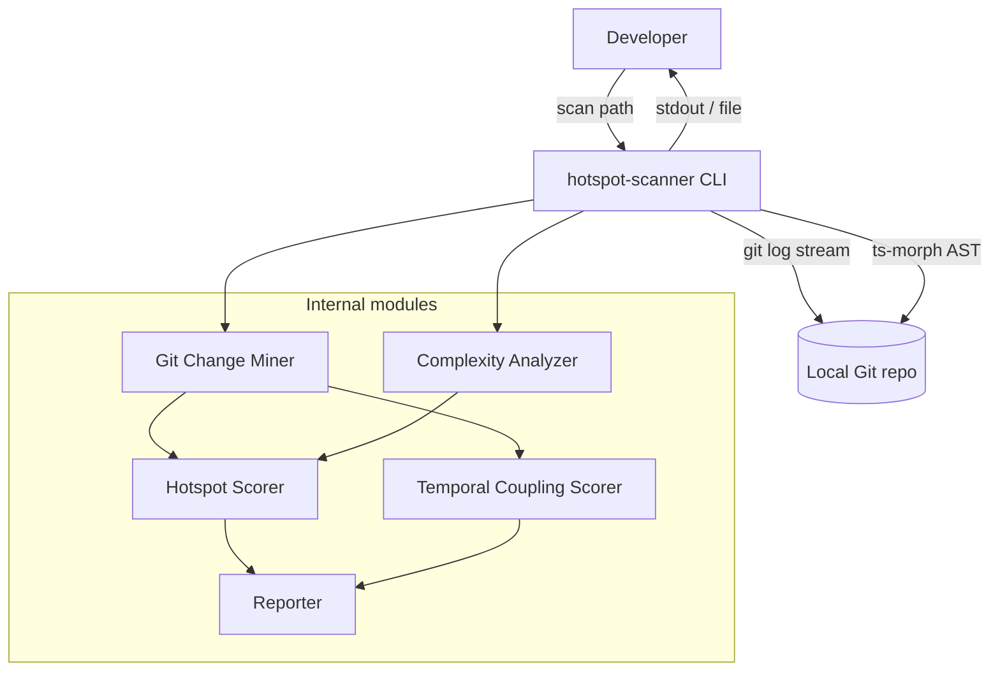

# ARCHITECTURE — @vitals/hotspot-scanner

## Container view

## Data flow (scan)

1. CLI parses flags (`--since`, `--format`, `--granularity`, `--top`, `--min-cochange`, `--include`, `--exclude`, `--output`, `--baseline`) and calls `runScan()` in `src/scan.ts`
2. **Config resolution (M21)** — before pipeline stages, `runScan()` loads `<repoPath>/.hotspot-scanner.json` via `loadHotspotScannerConfig()` (`src/config/`). Missing file → built-in defaults only (not an error). CLI builds explicit overrides separately; `mergeScanOptions()` applies **CLI > config > defaults** for `since`, `include`, `exclude`, `granularity`, `minCochange`, `top`. `format`, `output`, and `baseline` are CLI-only. Invalid JSON or bad types throw `ConfigError` (non-zero exit). Unknown keys are ignored.
3. **`runScan()`** validates `repoPath`, checks `.git` exists, builds a shared `PathScope` (`src/paths/`), then runs stages sequentially:
   - **Git Change Miner** — one `git log --numstat` stream → `FileChangeStats` + `CoChangeEvent[]`; output filtered by `PathScope` via `filterGitMinerResult()`; forwards warnings and `onProgress`
   - **Complexity Analyzer** — discovers in-scope TS/JS files on the main thread (directory prune + file filter), chunks into batches of 50, dispatches batches to a bounded `worker_threads` pool (`createWorkerPool`, default concurrency `min(availableParallelism(), 4)`), each worker runs a fresh ts-morph `Project` per batch → merged `ComplexityResult[]` + `FunctionComplexityResult[]` in discovery order; forwards warnings
   - **Scoring branch** on `granularity` (default `file`):
     - **file** — `createHotspotScorer()` → `ScanResult.hotspots`
     - **function** — `createFunctionChurnMiner()` (patch stream, hunk overlap) → `createFunctionHotspotScorer()` with per-function churn → `ScanResult.functions`
   - **Temporal Coupling Scorer** — file-pair ranked `coupling` (unchanged in both modes)
   - **Static coupling enricher** — `enrichCouplingStaticDeps()` sets `hasStaticDependency` on each pair by scanning working-tree sources for resolvable static `import`/`export … from`/`require` edges (relative resolution only; missing/unreadable source → `false`; does not change ranking)
4. CLI passes `ScanResult` to **Reporter** for table, JSON, markdown, or CSV output (`--top` applied at render time for table/markdown only; ignored for JSON and CSV)
5. With `--output <path>`, CLI writes the rendered report to file (UTF-8) instead of stdout; stderr diagnostics unchanged
6. With `--baseline <file>`, CLI loads a prior `ScanResult` JSON, runs `compareScanResults()`, and renders a **CompareResult** delta via `renderCompare()` (same format/output transport as normal scan)

### Config file (M21)

- **Filename:** `.hotspot-scanner.json` only — not `.hotspotrc`, not dual lookup
- **Discovery:** `<repoPath>/.hotspot-scanner.json` — no parent-directory walk
- **Keys:** `since`, `include`, `exclude`, `granularity`, `minCochange`, `top` — map to the same semantics as CLI flags
- **Precedence:** CLI flag explicitly provided → config key present → built-in default (`DEFAULT_SINCE`, `DEFAULT_TOP`, `DEFAULT_MIN_COCHANGE`, granularity `file`)
- **CLI-only:** `format`, `output`, `baseline`
- **Module:** `src/config/` (`load-config.ts`, `merge-options.ts`); `ConfigError` on invalid JSON or value types; unknown keys ignored

### Path scoping (M7)

- **Default excludes** (always active): `node_modules`, `.git`, `dist`, `coverage`, `build`
- **`--include <glob>`** (repeatable): narrows scope — path must match at least one include pattern
- **`--exclude <glob>`** (repeatable): additive excludes on top of defaults
- **Semantics**: exclude wins over include; same `PathScope` instance filters both git stats and complexity discovery
- **Module**: `src/paths/` (`createPathScope`, `isPathInScope`, `filterGitMinerResult`); glob matching via `picomatch`

## Key constraints

- Single **numstat** Git log pass for file churn and coupling (ADR-2026-020); function mode adds a **second** patch stream (`git log -p --unified=0`) only for per-function churn attribution
- Working-tree AST only (not historical file versions)
- Invalid TS/JS: warn and skip — do not abort scan
- Streaming required for large repos (RT-001)
- Complexity batches processed in parallel via `worker_threads` (M15); file discovery and merge remain on main thread

## Complexity stage parallelism (M15)

- **Unit of work:** batch (≤50 files), not individual files — each worker instantiates a fresh ts-morph `Project` (M3 D7)
- **Modules:** `analyze-batch.ts` (shared logic), `worker.ts` (thread entry), `pool.ts` (bounded dispatch)
- **Inline fallback:** `concurrency === 1` or single batch — no worker spawn
- **Injectable:** `ComplexityAnalyzerDependencies.createWorkerPool` and `concurrency` for tests

## Orchestration

`src/scan.ts` is the pipeline orchestrator: `createGitMiner` → `createComplexityAnalyzer` → (`createHotspotScorer` | `createFunctionHotspotScorer`) + `createTemporalCouplingScorer` → `enrichCouplingStaticDeps`. It returns a typed `ScanResult` with full ranked lists. `bin/hotspot-scanner.ts` is a thin CLI wrapper (flags only, no domain logic).

Integration validation: `tests/fixtures/repos/small-ts/` (see [TESTING.md](./TESTING.md) § Integration).

## Hotspot output schema (M9)

Each `HotspotScore` entry in `ScanResult.hotspots` carries normalized scores plus raw metrics:

| Field                  | Source                          | JSON | Table         |
| ---------------------- | ------------------------------- | ---- | ------------- |
| `filePath`             | complexity entry                | yes  | yes           |
| `hotspotScore`         | harmonic mean of normalized c/h | yes  | yes           |
| `complexityNormalized` | log1p+min-max                   | yes  | yes (CpxN)    |
| `churnNormalized`      | log1p+min-max                   | yes  | yes (ChurnN)  |
| `cyclomaticComplexity` | `ComplexityResult`              | yes  | yes (Cpx)     |
| `functionCount`        | `ComplexityResult`              | yes  | yes (Funcs)   |
| `commitCount`          | `FileChangeStats`               | yes  | yes (Churn)   |
| `linesChanged`         | `FileChangeStats`               | yes  | no            |
| `authorCount`          | `FileChangeStats.authors.size`  | yes  | yes (Authors) |

JSON `version` remains `"1.0"` (additive fields).

## Enriched coupling (M14)

After temporal coupling scoring, `enrichCouplingStaticDeps()` (`src/scoring/enrich-coupling-static.ts`) inspects working-tree sources under `repoPath` and sets `hasStaticDependency` on each `CouplingPair`. Ranking (`couplingStrength`, `coChangeCount`, order) is unchanged — enrichment is post-score only.

| Field                               | Source                                  | JSON            | Table / markdown                | CSV                  |
| ----------------------------------- | --------------------------------------- | --------------- | ------------------------------- | -------------------- |
| `fileA`, `fileB`                    | coupling scorer                         | yes             | yes                             | yes                  |
| `coChangeCount`, `couplingStrength` | coupling scorer                         | yes             | yes                             | yes                  |
| `hasStaticDependency`               | static import/export/require resolution | yes (`boolean`) | yes (`yes`/`no` as `StaticDep`) | yes (`true`/`false`) |

- **Detection:** resolvable static `import`/`export … from`/`require` string from either file to the other; bare package specifiers alone do not set the flag
- **Resolution:** relative paths only (extensionless + common TS/JS extensions / `index`); no tsconfig `paths` or package `exports`
- **Errors:** missing or unreadable source → `false`; scan continues (optional `onWarning`)
- **Downstream:** JSON Schema requires `hasStaticDependency` on coupling items — see [JSON Contract (M20)](#json-contract-m20)

## Function granularity (M11, M23)

`--granularity file|function` (default `file`) selects the active ranking array in `ScanResult`:

| Mode       | Active array                        | Inactive array  | `meta.granularity` |
| ---------- | ----------------------------------- | --------------- | ------------------ |
| `file`     | `hotspots: HotspotScore[]`          | `functions: []` | `"file"`           |
| `function` | `functions: FunctionHotspotScore[]` | `hotspots: []`  | `"function"`       |

Each `FunctionHotspotScore` entry carries per-function McCabe plus **per-function churn** (M23 hunk overlap):

| Field                                                     | Source                                                                                                          |
| --------------------------------------------------------- | --------------------------------------------------------------------------------------------------------------- |
| `filePath`, `functionName`, `line`, `complexity`          | `FunctionComplexityResult` from complexity analyzer (`endLine` is pipeline-internal for overlap)                |
| `hotspotScore`, `complexityNormalized`, `churnNormalized` | harmonic combiner over all functions (same formula as file mode)                                                |
| `commitCount`, `linesChanged`, `authorCount`              | `FunctionChangeStats` from hunk-overlap miner (`src/git/function-churn/`) — **not** inherited parent file stats |

**Function-mode git:** after complexity, `createFunctionChurnMiner()` streams `git log -p --unified=0`, attributes commits whose hunks intersect each function's current `[line, endLine]`, then `scoreFunctionHotspots()` consumes the per-function map. File mode does **not** spawn the patch stream.

`coupling` remains file-pair ranked in both modes. `--top` slices the active ranking array at render time via `sliceScanResult` for **table and markdown only**; JSON and CSV receive full arrays.

### Function AST collection (M22)

`collectFunctionsInScope` in `analyze-file.ts` enumerates callable bodies for per-function McCabe and file-level sums. M22 extended collection beyond M11 without changing the McCabe decision-node definition in `mccabe.ts` — only **which** nodes are collected.

| Construct                                             | Collected | `functionName`                                                   |
| ----------------------------------------------------- | --------- | ---------------------------------------------------------------- |
| `function foo()`                                      | yes (M11) | `foo`                                                            |
| `class Foo { bar() {} }`                              | yes (M11) | `bar`                                                            |
| `constructor() {}`                                    | yes (M11) | `constructor`                                                    |
| `const foo = () => {}`                                | yes (M11) | `foo`                                                            |
| Anonymous arrow / function expression                 | yes (M11) | `<anonymous>:L{line}`                                            |
| `get foo()` / `set foo()`                             | yes (M22) | `foo` (bare accessor name; disambiguate getter/setter by `line`) |
| `class C { foo = () => {} }` or `foo = function() {}` | yes (M22) | `foo`                                                            |
| `const o = { bar() {} }`                              | yes (M22) | `bar`                                                            |
| `const o = { baz: () => {} }`                         | yes (M22) | `baz`                                                            |
| Object property anonymous function                    | yes (M22) | `<anonymous>:L{line}`                                            |

Nested object literals recurse with the same policy as nested functions. Non-callable property initializers are skipped. Fixtures with manually verified complexities: `tests/fixtures/complexity/getters-setters.ts`, `class-field-arrows.ts`, `object-literal-methods.ts`. Naming SoT: [function-granularity/context.md](../features/function-granularity/context.md) (M11 base) + [function-ast-coverage/context.md](../features/function-ast-coverage/context.md) (M22 extensions).

## Export formats (M10, M17, M18)

- **`--format markdown`** — GFM report with hotspot and coupling tables (includes `linesChanged` column)
- **`--format csv`** — multi-file CSV bundle (M18): `renderCsv()` / `renderCompareCsv()` return a `CsvBundle` (`Record<suffix, content>`); CLI derives stem from `--output` and writes `{stem}.meta.json` plus ranking/coupling CSVs; **requires `--output`**; `--top` ignored (full export); no section title rows
- **Scan bundle** (`--output out/report.csv`): `out/report.meta.json`, `out/report.hotspots.csv` or `out/report.functions.csv`, `out/report.coupling.csv`
- **Compare bundle** (`--output out/compare.csv`): `out/compare.meta.json` plus six data CSVs (`hotspots.*` or `functions.*`, plus `coupling.*`); empty sections are header-only files
- **`--output <path>`** — write report to file (`table`, `json`, `markdown`, `csv`); stdout silent for report content; csv is the only format that **requires** `--output`
- **Reporter module**: `CsvBundle` type in `src/report/csv-bundle.ts`; `renderCsv()` / `renderCompareCsv()` in `csv.ts` / `compare-csv.ts`; `createReporter()` returns `string | CsvBundle` (JSON and CSV bypass slice helpers; table/markdown slice via `sliceScanResult` / `sliceCompareResult`)
- **Path validation**: parent directory must exist; directory targets rejected; overwrite is default

## JSON Contract (M20)

Published JSON Schema files under `schemas/` define the CLI JSON contract:

| File                          | Root type       |
| ----------------------------- | --------------- |
| `schemas/scan-result.json`    | `ScanResult`    |
| `schemas/compare-result.json` | `CompareResult` |

- **Coupling items** require `hasStaticDependency` (boolean) in both schemas
- **`additionalProperties: true`** on objects for forward compatibility; `required` lists enforce the minimum contract
- **Contract tests** (`tests/contract/`) validate scan and compare JSON against these schemas in CI
- **Baseline loading** (`loadBaseline()` / `parseScanResult()` in `src/compare/load-baseline.ts`): strong structural validation on nested hotspot, function, and coupling items — not only top-level keys. Wrong types or missing required fields (including `hasStaticDependency`) throw `BaselineError` with a path-specific message; coupling items missing `hasStaticDependency` instruct the user to re-scan with a current scanner version. Pre-M14 baselines are not auto-migrated.

## Scan compare (M13)

- **`--baseline <path>`** — compare current scan against a saved `ScanResult` JSON (from a prior `--format json --output` run)
- **Compare module** (`src/compare/`): `loadBaseline()` validates and parses baseline JSON (see [JSON Contract (M20)](#json-contract-m20)); `compareScanResults()` classifies entities as `new`, `removed`, or `rankChanged`
- **CompareResult** schema (`version: "1.0"`): separate from `ScanResult`; sections for hotspots/functions (mode-dependent) and coupling pairs
- **Entity keys**: file path for hotspots; `filePath + functionName + line` for functions; canonical `(fileA, fileB)` for coupling
- **Guards**: granularity mismatch → hard error; `since` mismatch → warning in `meta.warnings` (stderr + report)
- **`--top`** on compare output slices delta arrays at render time via `sliceCompareResult()` for **table and markdown only** — classification uses full rankings; JSON and CSV receive unsliced deltas
- **Reporter**: `createReporter().renderCompare()` dispatches to `compare-table`, `compare-json`, `compare-markdown`, `compare-csv` (JSON and CSV bypass slice helpers; `--top` ignored)
