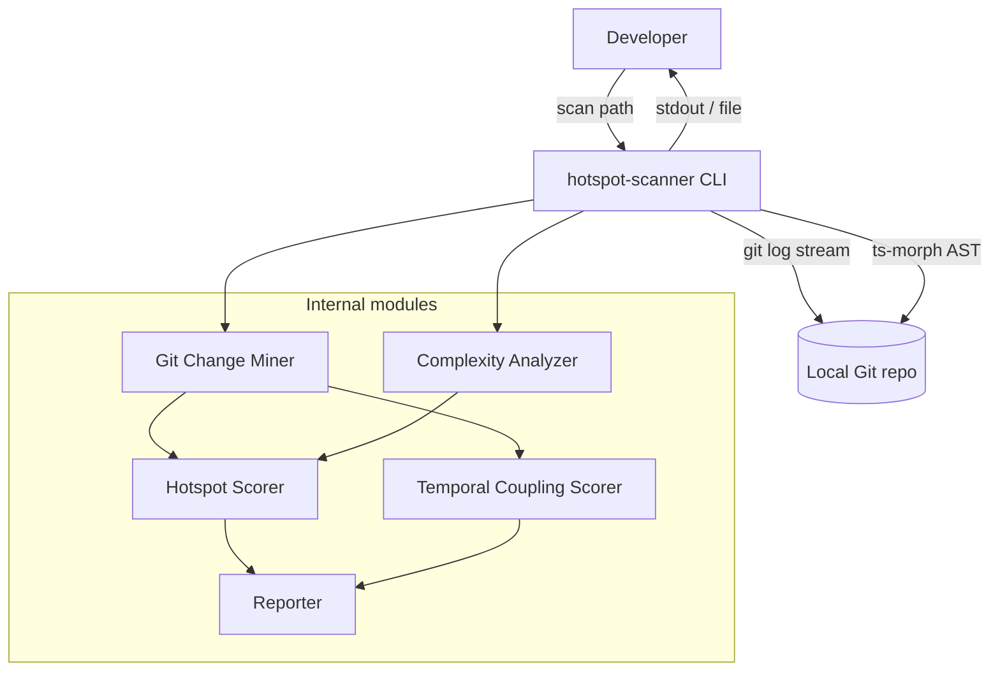

# ARCHITECTURE — @vitals/hotspot-scanner

Design SoT: [specifications/IMPL-2026-003-hotspot-scanner.md](../../specifications/IMPL-2026-003-hotspot-scanner.md) §4.

## Container view

## Data flow (scan)

1. CLI parses flags (`--since`, `--format`, `--top`, `--min-cochange`) and calls `runScan()` in `src/scan.ts`
2. **`runScan()`** validates `repoPath`, then runs stages sequentially:
   - **Git Change Miner** — one `git log --numstat` stream → `FileChangeStats` + `CoChangeEvent[]`; forwards warnings and `onProgress`
   - **Complexity Analyzer** — working-tree TS/JS via ts-morph → `ComplexityResult[]`; forwards warnings
   - **Hotspot Scorer** + **Temporal Coupling Scorer** — full sorted arrays (no `--top` slicing)
3. CLI passes `ScanResult` to **Reporter** for table or JSON output (`--top` applied at render time)

## Key constraints

- Single Git log pass (ADR-2026-020)
- Working-tree AST only (not historical file versions)
- Invalid TS/JS: warn and skip — do not abort scan
- Streaming required for large repos (RT-001)

## Orchestration

`src/scan.ts` is the pipeline orchestrator: `createGitMiner` → `createComplexityAnalyzer` → `createHotspotScorer` + `createTemporalCouplingScorer`. It returns a typed `ScanResult` with full ranked lists. `bin/hotspot-scanner.ts` is a thin CLI wrapper (flags only, no domain logic).

Integration validation: `tests/fixtures/repos/small-ts/` (see [TESTING.md](./TESTING.md) § Integration).
