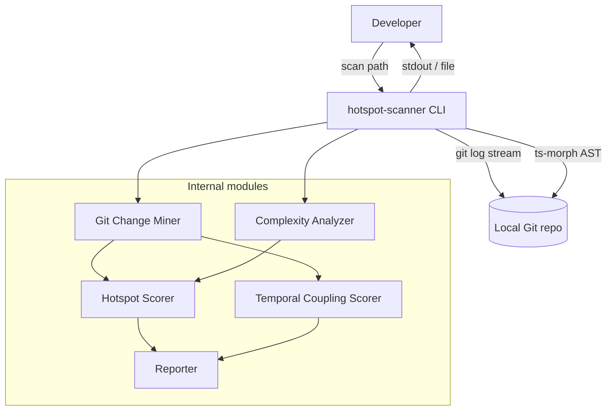

# ARCHITECTURE — @vitals/hotspot-scanner

## Container view

## Data flow (scan)

1. CLI parses flags (`--since`, `--format`, `--top`, `--min-cochange`, `--include`, `--exclude`) and calls `runScan()` in `src/scan.ts`
2. **`runScan()`** validates `repoPath`, checks `.git` exists, builds a shared `PathScope` (`src/paths/`), then runs stages sequentially:
   - **Git Change Miner** — one `git log --numstat` stream → `FileChangeStats` + `CoChangeEvent[]`; output filtered by `PathScope` via `filterGitMinerResult()`; forwards warnings and `onProgress`
   - **Complexity Analyzer** — discovers in-scope TS/JS files (directory prune + file filter) via ts-morph → `ComplexityResult[]`; forwards warnings
   - **Hotspot Scorer** + **Temporal Coupling Scorer** — full sorted arrays (no `--top` slicing)
3. CLI passes `ScanResult` to **Reporter** for table or JSON output (`--top` applied at render time)

### Path scoping (M7)

- **Default excludes** (always active): `node_modules`, `.git`, `dist`, `coverage`, `build`
- **`--include <glob>`** (repeatable): narrows scope — path must match at least one include pattern
- **`--exclude <glob>`** (repeatable): additive excludes on top of defaults
- **Semantics**: exclude wins over include; same `PathScope` instance filters both git stats and complexity discovery
- **Module**: `src/paths/` (`createPathScope`, `isPathInScope`, `filterGitMinerResult`); glob matching via `picomatch`

## Key constraints

- Single Git log pass (ADR-2026-020)
- Working-tree AST only (not historical file versions)
- Invalid TS/JS: warn and skip — do not abort scan
- Streaming required for large repos (RT-001)

## Orchestration

`src/scan.ts` is the pipeline orchestrator: `createGitMiner` → `createComplexityAnalyzer` → `createHotspotScorer` + `createTemporalCouplingScorer`. It returns a typed `ScanResult` with full ranked lists. `bin/hotspot-scanner.ts` is a thin CLI wrapper (flags only, no domain logic).

Integration validation: `tests/fixtures/repos/small-ts/` (see [TESTING.md](./TESTING.md) § Integration).

## Hotspot output schema (M9)

Each `HotspotScore` entry in `ScanResult.hotspots` carries normalized scores plus raw metrics:

| Field | Source | JSON | Table |
| ----- | ------ | ---- | ----- |
| `filePath` | complexity entry | yes | yes |
| `hotspotScore` | harmonic mean of normalized c/h | yes | yes |
| `complexityNormalized` | log1p+min-max | yes | yes (CpxN) |
| `churnNormalized` | log1p+min-max | yes | yes (ChurnN) |
| `cyclomaticComplexity` | `ComplexityResult` | yes | yes (Cpx) |
| `functionCount` | `ComplexityResult` | yes | yes (Funcs) |
| `commitCount` | `FileChangeStats` | yes | yes (Churn) |
| `linesChanged` | `FileChangeStats` | yes | no |
| `authorCount` | `FileChangeStats.authors.size` | yes | yes (Authors) |

JSON `version` remains `"1.0"` (additive fields). Coupling schema unchanged from M5.
