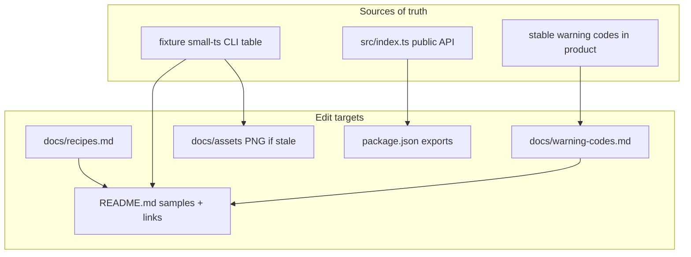

# Milestone 45 — Adoption Docs & Package Exports Design

**Spec**: [`.specs/features/adoption-docs-package-exports/spec.md`](./spec.md)  
**Context**: [`.specs/features/adoption-docs-package-exports/context.md`](./context.md)  
**Status**: Planned  
**Depth**: Thin (Medium — docs + `package.json` only; no `src/` architecture change)  
**Sister**: [readme-adoption-dx](../readme-adoption-dx/design.md) (M37)

---

## Architecture Overview

M45 does **not** change the scan pipeline. It adds secondary adoption docs under `docs/`, fixes README sample drift against fixture CLI output, and adds Node package `"exports"` metadata for the existing public entry (`src/index.ts` → `dist/index.js`).



| Concern | Owner | Action |
| ------- | ----- | ------ |
| Day-2 cookbooks | `docs/recipes.md` | Four short sections + commands |
| Sample drift | `README.md` | One capture → Quick start + Table section |
| Visual proof | `docs/assets/` | Refresh PNG only if needed |
| Warning lookup | `docs/warning-codes.md` | Short cheatsheet; README links |
| Resolution prep | `package.json` | `"exports"` for `.` → dist index |

---

## Code Reuse Analysis

| Component | Location | How to use |
| --------- | -------- | ---------- |
| Fixture CLI capture | M37 Quick start + `docs/assets/cli-table-small-ts.png` | Re-run same command; replace stale mid-doc sample |
| Warning code table | README Advanced § Warning codes | Lift/align into cheatsheet; keep codes identical |
| “Use this when…” | README | Expand into recipes; leave short table + link |
| Public API | `src/index.ts` | Map only what already exports — no new symbols |
| Config monorepo notes | README Configuration | Recipe cites parent-walk + include/exclude patterns |

### Integration points

| System | Integration |
| ------ | ----------- |
| Node package resolution | `"exports"."."` → `./dist/index.js` + types; keep `main`/`types`/`bin` |
| GitHub readers | `docs/*.md` via clone; README TOC/section links |
| CLI | Unchanged; recipes document existing flags only |

---

## Components

### `docs/recipes.md`

- **Purpose**: Short cookbooks for four locked workflows
- **Location**: `docs/recipes.md` (new)
- **Content outline**:
  1. **Weekly triage** — `--since`, `--top`, optional `--include`
  2. **PR markdown report** — `--format markdown --output`
  3. **Monorepo config** — `.hotspot-scanner.json` + parent discovery / package `include`/`exclude` / `--config`
  4. **Baseline / compare** — save JSON → `--baseline` (+ optional markdown/CSV compare note)
- **Reuses**: README Configuration + Use this when… examples

### `docs/warning-codes.md`

- **Purpose**: One-page lookup for stable `ScanWarning.code` values
- **Location**: `docs/warning-codes.md` (new)
- **Codes (minimum SoT from product docs)**:
  - `EMPTY_SINCE_WINDOW`
  - `RENAME_HISTORY_INCOMPLETE`
  - `PARSE_FAILED`
  - `COMPARE_SINCE_MISMATCH`
  - `MEGA_COMMIT_SKIPPED`
- **Note**: severity ≠ exit code on successful scan
- **Reuses**: README Advanced warning table

### README sample sync

- **Purpose**: Single SoT capture from `pnpm exec hotspot-scanner scan tests/fixtures/repos/small-ts`
- **Targets**: Quick start fenced sample + Output formats → Table fenced sample; PNG if drifted
- **Constraint**: Same columns as current rich table (Score, Cpx, CpxN, Churn, ChurnN, Funcs, Authors + coupling columns)

### `package.json` `"exports"`

- **Purpose**: Publish-prep resolution map for public library entry
- **Locked shape** (Execute may adjust condition keys if Node/TS tooling requires):

```json
"exports": {
  ".": {
    "types": "./dist/index.d.ts",
    "import": "./dist/index.js"
  }
}
```

- **Keep**: `"main"`, `"types"`, `"bin"`, existing `"imports"` (internal `#` aliases)
- **Do not**: publish, add registry install docs, export internal `#scan` etc. as public package subpaths

---

## Error Handling Strategy

| Scenario | Handling | User impact |
| -------- | -------- | ----------- |
| Fixture output differs from both samples | Re-capture; update both fences + asset if needed | Consistent docs |
| `"exports"` breaks bin | Keep `"bin"`; verify `pnpm exec hotspot-scanner` after build | CLI unchanged |
| Unknown warning codes in tests only | Omit from cheatsheet | No false product codes |

---

## Tech Decisions

| Decision | Choice | Rationale |
| -------- | ------ | --------- |
| Cheatsheet location | `docs/warning-codes.md` | Dedicated short page; avoids recipes sprawl |
| Recipes location | `docs/recipes.md` | Locked; secondary docs without splitting primary README |
| Sample SoT | Live `small-ts` CLI table | Eliminates documented drift |
| exports scope | `.` only → dist index | Matches `src/index.ts`; YAGNI |
| npm publish | Out of scope | STATE deferred |

---

## Risks

| Risk | Mitigation |
| ---- | ---------- |
| Triple docs drift (README table × cheatsheet × recipes) | Cheatsheet owns code list; README links; recipes do not re-list all codes |
| Confusing M44 “package exports” naming | Spec/ROADMAP call out M44 = coupling enrich; M45 = npm `"exports"` map |
| Timestamp noise in samples | Label as fixture example; allow different ISO timestamps if both samples regenerated together OR normalize to one pasted capture |

---

## Testing notes

Docs + `package.json` metadata → **Tests: none** per coverage matrix (no `src/`/`bin/` behavior change). Final task runs **Gate:** `pnpm build && pnpm test` plus CLI smoke (`pnpm exec hotspot-scanner scan tests/fixtures/repos/small-ts`).
