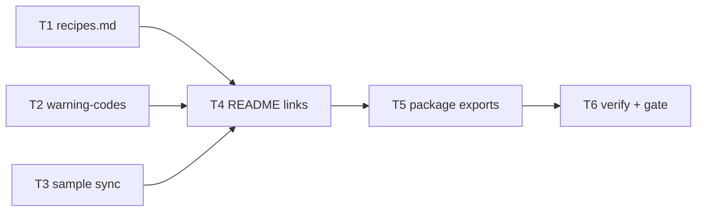

# Milestone 45 — Adoption Docs & Package Exports Tasks

**Spec**: [`.specs/features/adoption-docs-package-exports/spec.md`](./spec.md)  
**Design**: [`.specs/features/adoption-docs-package-exports/design.md`](./design.md)  
**Context**: [`.specs/features/adoption-docs-package-exports/context.md`](./context.md)  
**Status**: Planned  
**Note**: Medium / docs + `package.json` — thin design; sister [readme-adoption-dx](../readme-adoption-dx/tasks.md). **Do not Execute in the planning session.**

---

## Execution Plan

```
T1 recipes.md [P] ──┐
T2 warning-codes [P]┼→ T4 README links
T3 sample sync [P] ─┘      │
                           ├→ T5 package.json exports → T6 verify + gate
```



### Diagram-Definition Cross-Check

| Task | Depends on | Diagram | Match |
| ---- | ---------- | ------- | ----- |
| T1 | None | Root | ✅ |
| T2 | None | Root | ✅ |
| T3 | None | Root | ✅ |
| T4 | T1, T2, T3 | T1/T2/T3 → T4 | ✅ |
| T5 | T4 | T4 → T5 | ✅ |
| T6 | T5 | T5 → T6 | ✅ |

### Path Conflict Check (Check 5)

| Task | Module owner | Paths | Conflict |
| ---- | ------------ | ----- | -------- |
| T1 | docs | `docs/recipes.md` (new) | None — `[P]` with T2/T3 |
| T2 | docs | `docs/warning-codes.md` (new) | None — `[P]` with T1/T3 |
| T3 | docs | `README.md` (table sample fences only), `docs/assets/cli-table-small-ts.png` (if refresh) | Sequential before T4 README link edits |
| T4 | docs | `README.md` (TOC / Use this when / Advanced warnings / optional API one-liner) | After T1–T3; owns remaining README link edits |
| T5 | package | `package.json` (`exports` only; keep main/types/bin) | After T4 |
| T6 | docs + package | verify greps + ROADMAP/STATE Execute notes + gate | After T5 |

T3 and T4 both touch `README.md` — **not** `[P]` with each other. T1 ‖ T2 ‖ T3 only (T3’s README edits are sample fences; T4 adds links afterward).

### Test Co-location Validation

| Task | Code layer | Matrix requires | Task says | Match |
| ---- | ---------- | --------------- | --------- | ----- |
| T1–T4 | Docs | none | none (grep / preview / fixture CLI for samples) | ✅ |
| T5 | package.json metadata | none | none + build path check | ✅ |
| T6 | Docs + metadata | none | none + Gate `pnpm build && pnpm test` | ✅ |

### Granularity Check

| Task | Scope | Status |
| ---- | ----- | ------ |
| T1 | One recipes file | ✅ Granular |
| T2 | One cheatsheet file | ✅ Granular |
| T3 | Sample sync (+ optional asset) | ✅ Cohesive |
| T4 | README discovery links | ✅ Granular |
| T5 | package.json exports map | ✅ Granular |
| T6 | Verify + project gate | ✅ Granular |

---

## Task Breakdown

### T1: Create `docs/recipes.md` cookbooks [P]

**What**: Add `docs/recipes.md` with four short cookbooks: weekly triage, PR markdown report, monorepo config, baseline/compare.
**Where**: `docs/recipes.md` (new)
**Depends on**: None
**Reuses**: README “Use this when…”, Configuration, CLI examples
**Requirement**: HOTSPOT-620, HOTSPOT-621, HOTSPOT-622, HOTSPOT-623, HOTSPOT-624  
**Module owner**: docs

**Tools**:

- MCP: NONE
- Skill: `coding-guidelines` (keep short; no overengineering)

**Done when**:

- [ ] `docs/recipes.md` exists with four clearly headed sections matching locked recipes
- [ ] Each section has copy-pasteable `hotspot-scanner` / `pnpm exec` commands (monorepo includes config JSON and/or include/exclude examples aligned with existing config docs)
- [ ] No npm/npx install story; clone/build path OK if mentioned
- [ ] No new CLI flags or config keys invented

**Tests**: none  
**Gate**: none (docs-only; verified in T6)  
**Verify**: Open file; four headings; spot-check commands against README flag table

**Commit**: `docs(adoption): add recipes cookbooks`

---

### T2: Create `docs/warning-codes.md` cheatsheet [P]

**What**: Add a short warning-codes cheatsheet listing stable product `ScanWarning.code` values with one-line interpretations and severity-vs-exit-code note.
**Where**: `docs/warning-codes.md` (new)
**Depends on**: None
**Reuses**: README Advanced § Warning codes
**Requirement**: HOTSPOT-629, HOTSPOT-630, HOTSPOT-632  
**Module owner**: docs

**Tools**:

- MCP: NONE
- Skill: NONE

**Done when**:

- [ ] File lists at least: `EMPTY_SINCE_WINDOW`, `RENAME_HISTORY_INCOMPLETE`, `PARSE_FAILED`, `COMPARE_SINCE_MISMATCH`, `MEGA_COMMIT_SKIPPED`
- [ ] Notes that `severity` does not force non-zero exit on successful scan
- [ ] No invented codes; test-only stub codes omitted
- [ ] Short page (cheatsheet, not Advanced prose dump)

**Tests**: none  
**Gate**: none (docs-only; verified in T6)  
**Verify**: Diff codes vs README Advanced table / known emitters

**Commit**: `docs(adoption): add warning-codes cheatsheet`

---

### T3: Sync README CLI table samples with `small-ts` [P]

**What**: Re-run fixture scan and replace Quick start + Output formats → Table samples so both match the same capture; refresh PNG if the visual is stale.
**Where**: `README.md` (sample fences only); optionally `docs/assets/cli-table-small-ts.png`
**Depends on**: None
**Reuses**: M37 capture command / asset path
**Requirement**: HOTSPOT-625, HOTSPOT-626, HOTSPOT-627, HOTSPOT-628  
**Module owner**: docs

**Tools**:

- MCP: NONE
- Skill: `vitals-cli-validation` (fixture scan for capture)

**Done when**:

- [ ] Ran `pnpm exec hotspot-scanner scan tests/fixtures/repos/small-ts` (build first if needed)
- [ ] Quick start “Example output” and Output formats → Table fences share the same column headers and the same ranked hotspot/coupling rows from that capture (no obsolete Complexity/Churn-only mid-doc sample)
- [ ] Samples still labeled as fixture/`small-ts` examples
- [ ] PNG refreshed if it no longer matches the regenerated table; otherwise left as-is with samples matching

**Tests**: none  
**Gate**: none (docs; CLI capture is verification)  
**Verify**: Visual/diff of two fences; headers include Cpx/ChurnN/Funcs/Authors style rich columns

**Commit**: `docs(readme): sync small-ts table samples`

---

### T4: Wire README links to recipes and cheatsheet

**What**: Add discoverable README links to `docs/recipes.md` and `docs/warning-codes.md` (TOC and/or Use this when… / Advanced warnings); optional one-liner that `"exports"` maps the public entry (no npm install story).
**Where**: `README.md`
**Depends on**: T1, T2, T3
**Reuses**: Existing TOC / Advanced warning section
**Requirement**: HOTSPOT-631, HOTSPOT-637, HOTSPOT-638  
**Module owner**: docs

**Tools**:

- MCP: NONE
- Skill: NONE

**Done when**:

- [ ] `rg 'docs/recipes.md' README.md` matches
- [ ] `rg 'docs/warning-codes.md' README.md` matches
- [ ] Advanced Warning codes section links to cheatsheet and does not list contradictory codes
- [ ] No M37 structural rewrite (links + minimal surrounding edits only)

**Tests**: none  
**Gate**: none  
**Verify**: Grep links; skim TOC

**Commit**: `docs(readme): link recipes and warning-codes`

---

### T5: Add `package.json` `"exports"` map

**What**: Add `"exports"` for `"."` → `./dist/index.js` with types `./dist/index.d.ts`; keep `main`, `types`, and `bin` unchanged in role.
**Where**: `package.json`
**Depends on**: T4
**Reuses**: `src/index.ts` / existing `main`/`types` paths
**Requirement**: HOTSPOT-633, HOTSPOT-634, HOTSPOT-635, HOTSPOT-636  
**Module owner**: package

**Tools**:

- MCP: NONE
- Skill: `coding-guidelines`

**Done when**:

- [ ] `"exports"."."` resolves to dist index JS + types (ESM `import` condition)
- [ ] `"main"`, `"types"`, `"bin"` still present and consistent
- [ ] No public export of internal `"imports"` `#` subpaths
- [ ] No publish / registry docs added
- [ ] `pnpm build` leaves `dist/index.js` and `dist/index.d.ts` present for mapped paths

**Tests**: none  
**Gate**: `pnpm build` (smoke; full gate in T6)  
**Verify**: Inspect `package.json`; `test -f dist/index.js && test -f dist/index.d.ts`

**Commit**: `chore(package): add exports map for public entry`

---

### T6: Verify adoption docs + quality gate

**What**: Run verification greps, fixture CLI smoke, update ROADMAP/STATE for Execute completion notes when Done, and run the project gate.
**Where**: verify only (+ `.specs/project/ROADMAP.md` / `STATE.md` when marking feature Done at end of Execute)
**Depends on**: T5
**Reuses**: AGENTS.md gate; M37 verify pattern
**Requirement**: HOTSPOT-639  
**Module owner**: docs + package

**Tools**:

- MCP: NONE
- Skill: `vitals-cli-validation`; agent `verifier-quality-gates` for gate

**Done when**:

- [ ] `test -f docs/recipes.md && test -f docs/warning-codes.md`
- [ ] README links present; sample fences agree (spot-check)
- [ ] `package.json` has `"exports"`; `pnpm exec hotspot-scanner scan tests/fixtures/repos/small-ts` exits 0
- [ ] Gate check passes: `pnpm build && pnpm test`
- [ ] ROADMAP M45 checkboxes / Specs status updated when feature marked Done; STATE Active/Decisions note as appropriate

**Tests**: none  
**Gate**: full — `pnpm build && pnpm test`  
**Verify**:

```bash
pnpm build && pnpm test
pnpm exec hotspot-scanner scan tests/fixtures/repos/small-ts
rg 'docs/recipes.md|docs/warning-codes.md|"exports"' README.md package.json
```

**Commit**: `docs(m45): mark adoption-docs-package-exports complete` (or fold status into final task commit per Execute practice)

---

## Parallel Execution Map

```
Phase 1 (Parallel):
  ├── T1 [P] docs/recipes.md
  ├── T2 [P] docs/warning-codes.md
  └── T3 [P] README sample sync (+ asset if needed)

Phase 2 (Sequential):
  T4 README links ──→ T5 package.json exports ──→ T6 verify + gate
```

**Parallelism constraint:** T1–T3 disjoint paths except T3 owns sample fences in README; T4 must not start until T3 finishes those fences.

---

## Suggested commit sequence (Execute)

1. `docs(adoption): add recipes cookbooks`
2. `docs(adoption): add warning-codes cheatsheet`
3. `docs(readme): sync small-ts table samples`
4. `docs(readme): link recipes and warning-codes`
5. `chore(package): add exports map for public entry`
6. Status/ROADMAP sync commit after gate (only if user asks to commit)
