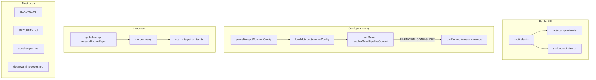

# Milestone 55 — API Trust Docs Design

**Spec**: [spec.md](./spec.md)  
**Context**: [context.md](./context.md)  
**Status**: Planned  
**Depth**: Small — thin design (docs + re-exports + config warn channel + fixture wire)

---

## Architecture Overview

Four independent slices that share no pipeline ranking changes:



No new runtime dependencies. No schema / JSON `version` bump.

---

## Code Reuse Analysis

### Existing Components to Leverage

| Component                                  | Location                                        | How to Use                                            |
| ------------------------------------------ | ----------------------------------------------- | ----------------------------------------------------- |
| `previewScanScope` / `ScanScopePreview`    | `src/scan-preview.ts`                           | Re-export from `src/index.ts`                         |
| `runDoctor` + doctor types                 | `src/doctor/index.ts`                           | Re-export from `src/index.ts`                         |
| `KNOWN_KEYS` / `parseHotspotScannerConfig` | `src/config/load-config.ts`                     | Collect unknown keys while parsing                    |
| `createScanWarning`                        | `src/diagnostics/logger.ts`                     | Build `UNKNOWN_CONFIG_KEY` warning                    |
| `runScan` warning collection               | `src/scan.ts`                                   | Forward config unknowns early (with remount warnings) |
| `ensureFixtureRepo`                        | `tests/fixtures/repos/ensure-fixture-repo.ts`   | Bootstrap `merge-heavy` in globalSetup                |
| Integration describe pattern               | `src/scan.integration.test.ts` (`with-renames`) | Clone for `merge-heavy`                               |
| M45 `"exports"`                            | `package.json`                                  | Leave `"."` map; grow entry surface only              |
| M41 `--only` baseline warning              | README Output formats                           | Cross-link from recipes                               |

### Integration Points

| System       | Method                                                                                                      |
| ------------ | ----------------------------------------------------------------------------------------------------------- |
| Config load  | Return or thread `unknownKeys: string[]` from parse/load into scan prelude                                  |
| CLI stderr   | Existing `createCliDiagnosticHandlers` / `onWarning` — no new logger                                        |
| Doctor       | When config loads with unknowns, surface same code in config finding message or stderr (context discretion) |
| Publish prep | Add `SECURITY.md` to `package.json` `files` (M24 pattern)                                                   |

---

## Components

### Public entry re-exports

- **Purpose**: Expose preview + doctor on the package root
- **Location**: `src/index.ts`
- **Interfaces**:
  - `export { previewScanScope } from "./scan-preview.js"`
  - `export type { ScanScopePreview } from "./scan-preview.js"`
  - `export { runDoctor } from "./doctor/index.js"`
  - `export type { DoctorFinding, DoctorFindingId, DoctorFindingStatus, DoctorResult, RunDoctorOptions } from "./doctor/index.js"`
- **Dependencies**: Existing modules only
- **Reuses**: M45 entry + `"exports"`

### Unknown-key detection

- **Purpose**: Detect keys ∉ `KNOWN_KEYS` without applying them
- **Location**: `src/config/load-config.ts` (+ tests)
- **Interfaces** (implementer choice, pick one cohesive shape):
  - Prefer: `parseHotspotScannerConfig` returns `{ config: HotspotScannerConfig; unknownKeys: string[] }` **or** keep parse return + add `parseHotspotScannerConfigWithMeta` — avoid dual silent paths
  - `loadHotspotScannerConfig` threads `unknownKeys` to callers (extend return type or parallel result object used only internally by scan)
- **Dependencies**: None new
- **Reuses**: `KNOWN_KEYS` set

### Warning emission

- **Purpose**: Emit warn-only `UNKNOWN_CONFIG_KEY`
- **Location**: `src/scan.ts` (primary); optional doctor soft note
- **Interfaces**:
  - `createScanWarning("UNKNOWN_CONFIG_KEY", message, "warning")`
  - Message example: `Unknown config key(s) ignored: format, output` (sorted)
- **Dependencies**: diagnostics helper
- **Reuses**: remount-warning early emission pattern in `runScan`

### merge-heavy integration

- **Purpose**: E2E cover merge + delete history
- **Location**: `tests/fixtures/repos/global-setup.ts`, `src/scan.integration.test.ts`, `.specs/codebase/TESTING.md`
- **Interfaces**: `ensureFixtureRepo(join(reposDir, "merge-heavy"))`; describe asserting keep/remove paths
- **Dependencies**: Existing fixture bootstrap
- **Reuses**: `with-renames` describe style

### Trust docs

- **Purpose**: Evaluator trust + operator safety
- **Location**: `README.md`, `SECURITY.md` (new), `docs/recipes.md`, `docs/warning-codes.md`, `package.json` `files`
- **Reuses**: Existing Privacy callout; M41 `--only` wording; M45 recipes Baseline section

---

## Data Models

### `UNKNOWN_CONFIG_KEY` warning

```typescript
// ScanWarning — existing shape
{
  code: "UNKNOWN_CONFIG_KEY";
  severity: "warning";
  message: string; // lists sorted unknown keys; values ignored
}
```

No schema change: `code` is already optional string on `ScanWarning`.

### Load result (illustrative)

```typescript
interface LoadedHotspotConfig {
  config: HotspotScannerConfig | null;
  unknownKeys: string[]; // empty when no file or no unknowns
}
```

Exact type name is implementer discretion; behavior is locked in context.

---

## Error Handling Strategy

| Scenario                    | Handling                  | User impact                                 |
| --------------------------- | ------------------------- | ------------------------------------------- |
| Unknown config keys         | Warn + ignore             | stderr / `meta.warnings`; exit 0 on success |
| Invalid known key type      | `ConfigError` (unchanged) | Exit 2                                      |
| Invalid JSON                | `ConfigError` (unchanged) | Exit 2                                      |
| Missing explicit `--config` | `ConfigError` (unchanged) | Exit 2                                      |
| merge-heavy bootstrap fail  | Test fail                 | CI red — fix fixture                        |

---

## Tech Decisions

| Decision              | Choice                                                   | Rationale                                                             |
| --------------------- | -------------------------------------------------------- | --------------------------------------------------------------------- |
| Public surface        | Re-export only listed symbols                            | YAGNI; M45 single entry                                               |
| Unknown keys          | Warn-only, one warning, sorted names                     | Forward-compat; low noise                                             |
| Warning code          | `UNKNOWN_CONFIG_KEY`                                     | Stable for cheatsheet / filters                                       |
| Fail on unknown?      | No                                                       | Locked; older configs with future keys must not break                 |
| merge-heavy           | globalSetup + integration describe                       | Same as small-ts ensure pattern                                       |
| SECURITY.md reporting | GitHub Security Advisories for `taranti/hotspot-scanner` | Matches `package.json` repository URL; no invent email if none exists |
| Baseline artifacts    | Docs-only path examples                                  | No new CLI flag                                                       |

---

## Risks / CONCERNS

| Risk                                                                 | Mitigation                                                                       |
| -------------------------------------------------------------------- | -------------------------------------------------------------------------------- |
| Breaking internal callers of `parseHotspotScannerConfig` return type | Prefer additive API or update all call sites in same task; keep unit tests green |
| Doctor/dry-run miss warning                                          | Spec allows doctor note; scan path is mandatory for `meta.warnings`              |
| README Privacy duplication                                           | Strengthen one callout; link SECURITY — do not add three conflicting blurbs      |
| Fixture flaky without bootstrap                                      | Always `ensureFixtureRepo` in globalSetup                                        |

---

## Test Plan (by slice)

| Slice        | Tests                                                                  |
| ------------ | ---------------------------------------------------------------------- |
| Exports      | Build + typecheck via gate; optional assert `src/index.ts` export list |
| Unknown keys | `src/config/load-config.test.ts` (+ scan test for `meta.warnings`)     |
| merge-heavy  | `src/scan.integration.test.ts`                                         |
| Docs         | Grep / file existence in final verify task                             |

Gate: `pnpm build && pnpm test`
