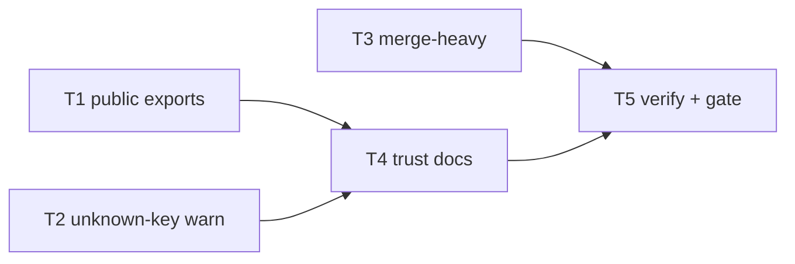

# Milestone 55 — API Trust Docs Tasks

**Spec**: [spec.md](./spec.md)  
**Design**: [design.md](./design.md)  
**Context**: [context.md](./context.md)  
**Status**: Done  
**Note**: Small / docs + exports + thin config warn + fixture wire. **Do not Execute in the planning session.**

---

## Execution Plan

```
T1 index exports [P] ──┐
T2 unknown-key warn [P]┼→ T4 trust docs [P with T3 after code?]
T3 merge-heavy wire [P]┘      │
                              └→ T5 verify + full gate
```

Preferred parallelism: **T1 ‖ T2 ‖ T3**, then **T4** (docs may reference warning code + new API — after T1/T2), then **T5**.



### Diagram-Definition Cross-Check

| Task | Depends on (body) | Diagram shows | Status   |
| ---- | ----------------- | ------------- | -------- |
| T1   | None              | Root          | ✅ Match |
| T2   | None              | Root          | ✅ Match |
| T3   | None              | Root          | ✅ Match |
| T4   | T1, T2            | T1/T2 → T4    | ✅ Match |
| T5   | T3, T4            | T3/T4 → T5    | ✅ Match |

### Path Conflict Check (Check 5)

| Task | Module owner                              | Paths                                                                                          | Conflict                                                    |
| ---- | ----------------------------------------- | ---------------------------------------------------------------------------------------------- | ----------------------------------------------------------- |
| T1   | `src/index.ts`                            | `src/index.ts` only (+ README Programmatic snippet OK to defer to T4)                          | None — `[P]` with T2/T3                                     |
| T2   | `src/config/` (+ thin `src/scan.ts` emit) | `load-config.ts`, `load-config.test.ts`, `scan.ts` / scan test for meta.warnings               | None vs T1/T3 if T3 only touches integration + global-setup |
| T3   | fixtures + integration                    | `global-setup.ts`, `src/scan.integration.test.ts`, `TESTING.md`                                | Do not edit `src/scan.ts` in T3                             |
| T4   | docs                                      | `README.md`, `SECURITY.md`, `docs/recipes.md`, `docs/warning-codes.md`, `package.json` `files` | After T1/T2; sole README owner for trust prose              |
| T5   | verify                                    | greps + ROADMAP/STATE Execute notes deferred + gate                                            | After T3+T4                                                 |

**Parallel rule:** T1 ‖ T2 ‖ T3. T4 after T1+T2 (may mention exports + `UNKNOWN_CONFIG_KEY`). T3 may finish before T4; T5 waits for both T3 and T4.

### Test Co-location Validation

| Task | Code layer                     | Matrix / TESTING.md        | Task Tests         | Status |
| ---- | ------------------------------ | -------------------------- | ------------------ | ------ |
| T1   | `src/index.ts` re-exports      | none required beyond build | none (build types) | ✅ OK  |
| T2   | `src/config/` + scan warn wire | unit co-located            | unit               | ✅ OK  |
| T3   | Integration fixture            | integration                | integration        | ✅ OK  |
| T4   | Docs / package metadata        | none                       | none               | ✅ OK  |
| T5   | Project gate                   | full                       | none + Gate full   | ✅ OK  |

### Granularity Check

| Task | Scope                                  | Status                   |
| ---- | -------------------------------------- | ------------------------ |
| T1   | Entry re-exports                       | ✅ Granular              |
| T2   | Unknown-key detect + emit + unit tests | ✅ Cohesive config slice |
| T3   | Fixture wire + one describe            | ✅ Granular              |
| T4   | Trust docs package                     | ✅ Cohesive docs slice   |
| T5   | Verify + project gate                  | ✅ Granular              |

---

## Task Breakdown

### T1: Export `previewScanScope` + `runDoctor` from package entry [P]

**What**: Re-export `previewScanScope`, `ScanScopePreview`, `runDoctor`, and locked doctor types from `src/index.ts`.

**Where**: `src/index.ts`

**Depends on**: None

**Reuses**: `src/scan-preview.ts`, `src/doctor/index.ts`; M45 `"exports"` map

**Requirement**: HOTSPOT-860, HOTSPOT-861, HOTSPOT-862, HOTSPOT-863, HOTSPOT-865, HOTSPOT-866

**Module owner**: package entry (`src/index.ts`)

**Tools**:

- MCP: NONE
- Skill: `coding-guidelines`

**Done when**:

- [x] `previewScanScope` and type `ScanScopePreview` exported from `src/index.ts`
- [x] `runDoctor` and types `DoctorFinding`, `DoctorFindingId`, `DoctorFindingStatus`, `DoctorResult`, `RunDoctorOptions` exported
- [x] No `formatScanScopePreview` / doctor helper sprawl on the public surface
- [x] `package.json` `"exports"."."` still points at `dist/index.js` / `dist/index.d.ts`
- [x] `pnpm build` succeeds and `dist/index.d.ts` declares the new exports

**Tests**: none (type surface; covered by build)  
**Gate**: `pnpm build`  
**Verify**: `rg "previewScanScope|runDoctor" src/index.ts dist/index.d.ts`

**Commit**: `feat(api): export previewScanScope and runDoctor from package entry`

---

### T2: Warn-only unknown config keys [P]

**What**: Detect keys outside `KNOWN_KEYS`, keep ignore-for-merge, emit `UNKNOWN_CONFIG_KEY` via `onWarning` + `meta.warnings` on `runScan` (warn-only; never fail).

**Where**: `src/config/load-config.ts`, `src/config/load-config.test.ts`, thin wire in `src/scan.ts` (+ co-located scan/config test as needed)

**Depends on**: None

**Reuses**: `KNOWN_KEYS`, `createScanWarning`, early warning emission pattern in `runScan`

**Requirement**: HOTSPOT-867, HOTSPOT-868, HOTSPOT-869, HOTSPOT-870, HOTSPOT-872 (cheatsheet may land in T4; unit + code here)

**Module owner**: `src/config/` (scan emit only)

**Tools**:

- MCP: NONE
- Skill: `coding-guidelines`, `vitals-pipeline-domain`

**Done when**:

- [x] Unknown keys are collected (sorted) and not applied to `HotspotScannerConfig`
- [x] Successful `runScan` with unknown keys includes `meta.warnings` entry `code: "UNKNOWN_CONFIG_KEY"` and invokes `onWarning` when set
- [x] Unknown keys alone never throw `ConfigError` / never force non-zero exit
- [x] Invalid known-key types still throw `ConfigError`
- [x] Existing “ignores unknown keys” unit test updated to assert warn path / unknownKeys collection
- [x] Gate check passes: `pnpm test -- src/config/load-config.test.ts` (and any new/updated scan warn test path)

**Tests**: unit  
**Gate**: `pnpm test -- src/config/load-config.test.ts`  
**Verify**: Temp config with `format`/`unknownKey` → warning present; scan exit 0

**Commit**: `feat(config): warn on unknown .hotspot-scanner.json keys`

---

### T3: Wire `merge-heavy` into integration suite [P]

**What**: Bootstrap `merge-heavy` in Vitest global setup and add integration assertions per fixture README.

**Where**: `tests/fixtures/repos/global-setup.ts`, `src/scan.integration.test.ts`, `.specs/codebase/TESTING.md`

**Depends on**: None

**Reuses**: `ensureFixtureRepo`, `with-renames` describe pattern, fixture README expected outcomes

**Requirement**: HOTSPOT-873, HOTSPOT-874, HOTSPOT-875, HOTSPOT-876

**Module owner**: fixtures + integration tests

**Tools**:

- MCP: NONE
- Skill: `coding-guidelines`, `vitals-cli-validation` (optional spot-check)

**Done when**:

- [x] `ensureFixtureRepo(.../merge-heavy)` runs from global setup (or equivalent guaranteed bootstrap)
- [x] `describe("runScan integration — merge-heavy fixture")` (or clear name) scans successfully
- [x] Asserts `src/keep.ts` present in hotspots; `src/remove.ts` absent
- [x] TESTING.md Integration layer documents `merge-heavy` as wired E2E
- [x] Gate check passes: `pnpm test -- src/scan.integration.test.ts`

**Tests**: integration  
**Gate**: `pnpm test -- src/scan.integration.test.ts`  
**Verify**: `pnpm exec hotspot-scanner scan tests/fixtures/repos/merge-heavy` exits 0

**Commit**: `test(fixtures): wire merge-heavy into scan integration suite`

---

### T4: Trust docs — zero network, SECURITY, baseline artifacts, `--only`

**What**: Strengthen README zero-network callout; add `SECURITY.md` + links; baseline-in-artifacts + `--only` ≠ baseline in recipes/README; document `UNKNOWN_CONFIG_KEY`; update Programmatic API for T1 exports; add `SECURITY.md` to `package.json` `files`.

**Where**: `README.md`, `SECURITY.md` (new), `docs/recipes.md`, `docs/warning-codes.md`, `package.json`

**Depends on**: T1, T2

**Reuses**: Existing Privacy callout; M41 `--only` baseline warning; M45 recipes Baseline section; M24 `files` allowlist

**Requirement**: HOTSPOT-864, HOTSPOT-871, HOTSPOT-872, HOTSPOT-877, HOTSPOT-878, HOTSPOT-879, HOTSPOT-880, HOTSPOT-881, HOTSPOT-882

**Module owner**: docs

**Tools**:

- MCP: NONE
- Skill: `coding-guidelines`

**Done when**:

- [x] README has clear zero-network / local-only scan callout (no contradiction with clone/install network)
- [x] `SECURITY.md` exists with trust model + vulnerability reporting (GitHub Security Advisories for repo URL)
- [x] README TOC (or adjacent) links to `SECURITY.md`
- [x] Programmatic API sample imports `previewScanScope` / `runDoctor` (+ types)
- [x] Configuration docs say unknown keys → warn-only `UNKNOWN_CONFIG_KEY` (not silent ignore)
- [x] `docs/warning-codes.md` lists `UNKNOWN_CONFIG_KEY`
- [x] Recipes/README baseline guidance recommends CI **artifacts** storage example
- [x] Recipes/README restate `--only` filtered JSON ≠ baseline (cross-link M41 / section filter)
- [x] `package.json` `files` includes `SECURITY.md`

**Tests**: none  
**Gate**: none (docs; verified in T5)  
**Verify**: `test -f SECURITY.md`; `rg 'UNKNOWN_CONFIG_KEY|SECURITY.md|zero network|artifact' README.md docs/recipes.md docs/warning-codes.md`

**Commit**: `docs: add SECURITY.md and API trust callouts`

---

### T5: Verify + project gate

**What**: Confirm all acceptance greps and run the full quality gate; leave ROADMAP checklist `[x]` for Execute Done (orchestrator) — planner leaves Planned.

**Where**: verification only (no product code); optional STATE/ROADMAP Execute notes belong to orchestrator on Done

**Depends on**: T3, T4

**Reuses**: Project gate from TESTING.md / AGENTS.md

**Requirement**: All P1 success criteria

**Module owner**: verify

**Tools**:

- MCP: NONE
- Skill: `vitals-cli-validation` (optional)

**Done when**:

- [x] Exports present in `src/index.ts` / `dist/index.d.ts`
- [x] `UNKNOWN_CONFIG_KEY` covered by unit test + cheatsheet
- [x] merge-heavy integration describe passes
- [x] `SECURITY.md` + README/recipes trust docs present
- [x] Gate check passes: `pnpm build && pnpm test`
- [x] Test count: no silent deletions vs pre-change baseline

**Tests**: none (full suite)  
**Gate**: `pnpm build && pnpm test`  
**Verify**: Full gate green; spot-check CLI scan on `merge-heavy`

**Commit**: _(none required — verify task; or `chore: verify api-trust-docs gate` if tree dirty only from docs sync)_

---

## Parallel Execution Map

```
Phase 1 (Parallel):
  ├── T1 [P] public exports
  ├── T2 [P] unknown-key warn
  └── T3 [P] merge-heavy wire

Phase 2 (Sequential):
  T1 + T2 complete → T4 trust docs

Phase 3 (Sequential):
  T3 + T4 complete → T5 verify + full gate
```

**Recommended module owners for orchestrator:** T1 entry · T2 config · T3 fixtures/integration · T4 docs · T5 verifier-quality-gates

---

## Requirement → Task Mapping

| Requirement IDs               | Task     |
| ----------------------------- | -------- |
| HOTSPOT-860–863, 865–866      | T1       |
| HOTSPOT-867–870               | T2       |
| HOTSPOT-873–876               | T3       |
| HOTSPOT-864, 871–872, 877–882 | T4       |
| All success criteria          | T5       |
| HOTSPOT-883–889               | Reserved |

---

## Handoff

Status **Planned**. Promote to `Approved` / `Ready for Execute` in a **new development session**, then invoke `orchestrator-implementer`.

Gate final esperado: `pnpm build && pnpm test`
