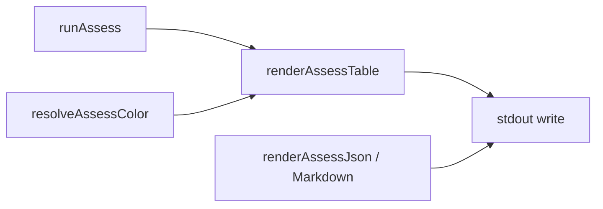

# Milestone 78 — Assess Color UX Design

**Spec**: [`.specs/features/assess-color-ux/spec.md`](./spec.md)  
**Context**: [`.specs/features/assess-color-ux/context.md`](./context.md)  
**Status**: Specs Done

---

## Architecture Overview

Presentation-only change for assess **table** output. Domain result from `runAssess` / `AssessResult` stays unchanged. Color/bold paint lives with existing ANSI helpers; `renderAssessTable` accepts `color`; bin resolves enablement and passes it through `assess-actions`.



**Data flow:**

```
runAssess → AssessResult
resolveAssessColor(format, outputPath, noColor, envNoColor, stdoutIsTTY) → color: boolean
renderAssessTable(result, { color }) → string → stdout | --output file
```

JSON/markdown paths unchanged: `renderAssessJson` / `renderAssessMarkdown` — never receive color.

**M76 dependency:** Prefer Execute after M76 so `paintGrowthPattern` already exists. If absent at Execute, implement it in `color.ts` as the shared helper (M76 remains compatible).

---

## Code Reuse Analysis

| Component                         | Location                                                           | How to use                                                                   |
| --------------------------------- | ------------------------------------------------------------------ | ---------------------------------------------------------------------------- |
| ANSI + `stripAnsi` + `paintScore` | `src/report/color.ts`                                              | Add `paintBold`; reuse/add `paintGrowthPattern`; reuse `paintScore`          |
| Table color gate                  | `bin/hotspot-scanner.ts` `resolveTableColor` / `resolveTrendColor` | Mirror as `resolveAssessColor` (`format === "table"` + `outputPath`)         |
| Assess table                      | `src/report/assess-table.ts`                                       | Add optional `{ color?: boolean }`; paint locked tokens only                 |
| Assess actions                    | `bin/assess-actions.ts`                                            | Accept `color` in `executeAssess` / `renderAssessOutput`; pass to table only |
| Assess CLI tests                  | `bin/hotspot-scanner.test.ts`                                      | Extend assess cases; use `stripAnsi` where needed                            |

### Fragile / concerns

| Concern                                          | Mitigation                                                     |
| ------------------------------------------------ | -------------------------------------------------------------- |
| Existing assess table assertions break with ANSI | Prefer `stripAnsi` then assert                                 |
| Summary line has four kinds                      | Paint each kind token once; leave `=` and digits plain         |
| M76 not yet Done                                 | Implement `paintGrowthPattern` in T1 if missing; shared export |
| Scan vs assess `--no-color`                      | Separate commander options; document all four surfaces         |
| Bold + color on same token                       | Forbidden by D1 — bold structure only; color semantics only    |

---

## Components and Interfaces

### 1. `paintBold`

**Location:** `src/report/color.ts`

```ts
const BOLD = "\x1b[1m";

export function paintBold(text: string, enabled: boolean): string {
  if (!enabled) return text;
  return `${BOLD}${text}${RESET}`;
}
```

### 2. `paintGrowthPattern` (reuse or add)

**Location:** `src/report/color.ts` — same signature/palette as M76 design (deteriorating red, refactored green, inconclusive yellow, stable plain).

### 3. `renderAssessTable` color option

**Location:** `src/report/assess-table.ts`

```ts
export function renderAssessTable(
  result: AssessResult,
  options?: { color?: boolean },
): string {
  const color = options?.color === true;
  // title: paintBold("Hotspot assess", color)
  // Pattern counts line: paintGrowthPattern each kind token when color
  // section: paintBold("Deteriorating", color)
  // detail: score via paintScore(...); Pattern kind via paintGrowthPattern(...)
}
```

Default / omitted `color` remains plain (backward compatible).

**Summary kind painting:** In `Pattern counts: deteriorating=N  refactored=N  …`, wrap only the kind name substrings — not the `=N` digits.

### 4. `resolveAssessColor`

**Location:** `bin/hotspot-scanner.ts` (export for unit tests)

```ts
export function resolveAssessColor(opts: {
  format: "table" | "json" | "markdown";
  outputPath?: string;
  noColor: boolean;
  envNoColor: string | undefined;
  stdoutIsTTY: boolean | undefined;
}): boolean {
  if (opts.format !== "table") return false;
  if (opts.noColor) return false;
  if (opts.envNoColor !== undefined && opts.envNoColor.length > 0) return false;
  if (opts.outputPath !== undefined) return false;
  if (opts.stdoutIsTTY !== true) return false;
  return true;
}
```

### 5. Assess command + actions wiring

- `.option("--no-color", "Disable ANSI colors in assess table output")` on `assess`
- Resolve color in assess action; pass into `executeAssess({ …, color })`
- `renderAssessOutput(result, format, color?)` — only table path uses color

Commander maps `--no-color` to `options.color === false` — match scan/doctor/trend wiring.

---

## Test Plan

| Layer                                                           | Coverage                                                                                        |
| --------------------------------------------------------------- | ----------------------------------------------------------------------------------------------- |
| Unit `src/report/color.test.ts`                                 | `paintBold` on/off; `paintGrowthPattern` if added here                                          |
| Unit `src/report/assess-format.test.ts` (or assess-table tests) | `renderAssessTable` color true/false; `stripAnsi` equality; title/section/summary/detail tokens |
| Unit bin                                                        | `resolveAssessColor` matrix (table/json/markdown, TTY, noColor, NO_COLOR, outputPath)           |
| CLI `bin/hotspot-scanner.test.ts`                               | assess `--no-color`; json/markdown no ANSI; help lists flag; TTY → ANSI when injectable         |

Gate: `pnpm build && pnpm test`

---

## Hard Boundaries

- Do **not** change `runAssess`, assess schema, or candidate selection
- Do **not** add color deps to `package.json`
- Do **not** implement `FORCE_COLOR`
- Do **not** color markdown/JSON, paths, or stderr warnings
- Do **not** change scan/doctor/trend color behavior in this milestone (except shared `paintGrowthPattern` if added for reuse)
- Do **not** bold colored kind tokens
