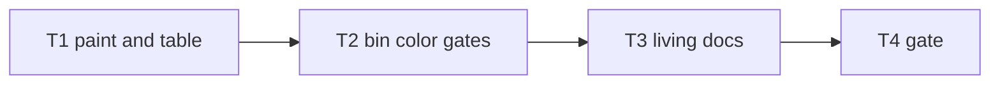

# Milestone 78 — Assess Color UX Tasks

**Design**: [`.specs/features/assess-color-ux/design.md`](./design.md)  
**Spec**: [`.specs/features/assess-color-ux/spec.md`](./spec.md)  
**Context**: [`.specs/features/assess-color-ux/context.md`](./context.md)  
**Status**: Done  
**Note**: Medium feature — paint helpers + assess table + bin gates + docs. STOP at Planned; Execute in a separate session via `orchestrator-implementer` after Status promotion. Prefer M76 Done first for `paintGrowthPattern`; if missing, implement shared helper in T1. Do **not** change assess schema or selection here.

---

## Execution Plan

### Phase 1: Paint + assess table

```
T1 paintBold (+ paintGrowthPattern if missing) + renderAssessTable({ color }) + unit tests
```

### Phase 2: Bin wiring

```
T1 → T2 resolveAssessColor + assess --no-color + assess-actions + CLI tests
```

### Phase 3: Docs + gate

```
T2 → T3 README / ARCHITECTURE
T3 → T4 project gate
```



### Diagram-Definition Cross-Check

| Task | Depends on (body) | Diagram shows | Status |
| ---- | ----------------- | ------------- | ------ |
| T1 | None | Root | Match |
| T2 | T1 | T1→T2 | Match |
| T3 | T2 | T2→T3 | Match |
| T4 | T3 | T3→T4 | Match |

### Path Conflict Check (Check 5)

| Task | Module owner | Paths | Conflict |
| ---- | ------------ | ----- | -------- |
| T1 | report | `src/report/color.ts`, `src/report/color.test.ts`, `src/report/assess-table.ts`, `src/report/assess-format.test.ts` | Sole paint/table owner |
| T2 | bin | `bin/hotspot-scanner.ts`, `bin/assess-actions.ts`, `bin/hotspot-scanner.test.ts`, optionally `bin/completion-scripts.ts` | Sole CLI owner |
| T3 | docs | `README.md`, `.specs/codebase/ARCHITECTURE.md` (CONVENTIONS brief if needed) | After T2 |
| T4 | gate | none | After T3 |

No `[P]` — sequential owners.

### Test Co-location Validation

| Task | Code layer | TESTING.md expectation | Task Tests | Status |
| ---- | ---------- | ---------------------- | ---------- | ------ |
| T1 | `src/report/` | unit | unit | OK |
| T2 | `bin/` | unit | unit | OK |
| T3 | docs | none | review checklist | OK |
| T4 | full project | gate | `pnpm build && pnpm test` | OK |

### Granularity Check

| Task | Scope | Status |
| ---- | ----- | ------ |
| T1 | Paint + assess table + unit tests | Cohesive |
| T2 | Color resolve + `--no-color` + actions + CLI tests | Cohesive |
| T3 | Living docs only | Cohesive |
| T4 | Project gate | Granular |

---

## Task Breakdown

### T1: `paintBold` + `renderAssessTable({ color })`

**What:** Add `paintBold` in `src/report/color.ts`. Reuse `paintGrowthPattern` if present (M76); otherwise add it with the locked palette. Reuse `paintScore`. Extend `renderAssessTable(result, { color })` to: bold title + `Deteriorating` section; color summary kind tokens; color detail Pattern kind + score. Unit-test paint and table; assert `stripAnsi(colored) === plain`. Do not change JSON/markdown renderers.  
**Where:** `src/report/color.ts`, `src/report/color.test.ts`, `src/report/assess-table.ts`, `src/report/assess-format.test.ts`  
**Depends on:** None (soft prefer M76 for `paintGrowthPattern`)  
**Reuses:** Existing ANSI constants / `stripAnsi` / `paintScore` in `color.ts`; assess table builders  
**Requirement:** HOTSPOT-1680, HOTSPOT-1681, HOTSPOT-1682, HOTSPOT-1683, HOTSPOT-1684  
**Module owner:** `src/report/`

**Tools:**

- MCP: NONE
- Skill: `coding-guidelines`, `vitals-pipeline-domain` (light — report/assess table only)

**Done when:**

- [x] `paintBold` wraps text when enabled; plain when disabled
- [x] `paintGrowthPattern` available and used for summary + detail kinds; stable always plain
- [x] Detail scores use `paintScore` when color enabled
- [x] `stripAnsi(renderAssessTable(r, { color: true })) === renderAssessTable(r, { color: false })`
- [x] Default / omitted `color` remains plain (backward compatible)
- [x] Paths / summaries / meta lines uncolored
- [x] Gate check passes: `pnpm test -- src/report/color.test.ts src/report/assess-format.test.ts`
- [x] Test count: no silent deletions

**Tests:** unit  
**Gate:** `pnpm test -- src/report/color.test.ts src/report/assess-format.test.ts`

**Verify:** Manual unit run; inspect colored title has bold CSI, Pattern kinds have color CSI, stripAnsi equals plain.

**Commit:** `feat(report): paint assess table bold and pattern colors`

---

### T2: `resolveAssessColor` + assess `--no-color` + CLI wiring

**What:** Export `resolveAssessColor` (table + TTY + `--no-color` + `NO_COLOR` + no `--output`). Add `--no-color` on the assess command. Wire `executeAssess` / `renderAssessOutput` to pass resolved color into `renderAssessTable` only. Unit-test resolver matrix; extend assess CLI tests (TTY on → ANSI when injectable; `--no-color` / `NO_COLOR` / `--output` / json / markdown → plain; help lists flag). Update completion scripts if assess flags are enumerated. Prefer injecting stdout TTY the same way other bin tests inject env.  
**Where:** `bin/hotspot-scanner.ts`, `bin/assess-actions.ts`, `bin/hotspot-scanner.test.ts`, optionally `bin/completion-scripts.ts` / `bin/completion-scripts.test.ts`  
**Depends on:** T1  
**Reuses:** `resolveTableColor` / `resolveTrendColor` pattern; scan/doctor `--no-color` commander wiring  
**Requirement:** HOTSPOT-1685, HOTSPOT-1686, HOTSPOT-1687, HOTSPOT-1688, HOTSPOT-1689, HOTSPOT-1690, HOTSPOT-1691  
**Module owner:** `bin/`

**Tools:**

- MCP: NONE
- Skill: `coding-guidelines`, `vitals-cli-validation`

**Done when:**

- [x] `resolveAssessColor` matrix covered (table/json/markdown, TTY, noColor, NO_COLOR empty vs set, outputPath)
- [x] Assess `--no-color` registered and disables color on TTY
- [x] JSON/markdown assess output has no ANSI
- [x] Existing assess table assertions updated with `stripAnsi` if needed
- [x] Gate check passes: `pnpm test -- bin/hotspot-scanner.test.ts`
- [x] Test count: no silent deletions

**Tests:** unit  
**Gate:** `pnpm test -- bin/hotspot-scanner.test.ts`

**Verify:** `pnpm exec hotspot-scanner assess --help` lists `--no-color`; CLI tests green.

**Commit:** `feat(cli): add assess --no-color and TTY table colors`

---

### T3: Living docs (README + codebase)

**What:** Document assess TTY bold + Pattern/score colors and disable rules (`--no-color`, `NO_COLOR`, non-TTY, `--output`, json/markdown plain) in README assess / Colors sections; brief note in ARCHITECTURE § CLI ANSI colors (add assess row). Update CONVENTIONS only if it already lists color surfaces. Remove contradictory “assess has no color” claims from living docs (historical M77 design “No color in MVP” may stay as historical).  
**Where:** `README.md`, `.specs/codebase/ARCHITECTURE.md`, optionally `.specs/codebase/CONVENTIONS.md`  
**Depends on:** T2  
**Reuses:** Existing README “Colors” / doctor / trend wording  
**Requirement:** HOTSPOT-1692, HOTSPOT-1693  
**Module owner:** docs

**Tools:**

- MCP: NONE
- Skill: `coding-guidelines`

**Done when:**

- [x] README mentions assess table bold/colors + disable gates
- [x] ARCHITECTURE notes assess color briefly in CLI ANSI section
- [x] No contradictory living-doc claim that assess never colors
- [x] Gate check: docs-only review (no code gate required beyond T4)

**Tests:** none  
**Gate:** review checklist

**Verify:** Grep README for assess + color / `--no-color`.

**Commit:** `docs: document assess TTY table colors`

---

### T4: Project quality gate

**What:** Run full project gate.  
**Where:** repo root  
**Depends on:** T3  
**Reuses:** AGENTS.md quality gate  
**Requirement:** (milestone success — all HOTSPOT-1680–1693)  
**Module owner:** gate

**Tools:**

- MCP: NONE
- Skill: none — invoke `verifier-quality-gates` or run gate inline

**Done when:**

- [x] `pnpm build && pnpm test` passes
- [x] Test count: no silent deletions vs pre-milestone baseline

**Tests:** full suite  
**Gate:** `pnpm build && pnpm test`

**Verify:** Gate output green.

**Commit:** (none — verification only; or chore if docs-only fixups needed)

---

## Parallelization Summary

| Flag | Tasks | Reason |
| ---- | ----- | ------ |
| none | T1→T2→T3→T4 | Sequential module ownership |

**Max parallel workers:** 1

---

## Requirement Coverage

| ID | Task |
| -- | ---- |
| HOTSPOT-1680 | T1 |
| HOTSPOT-1681 | T1 |
| HOTSPOT-1682 | T1 |
| HOTSPOT-1683 | T1 |
| HOTSPOT-1684 | T1 |
| HOTSPOT-1685 | T2 |
| HOTSPOT-1686 | T2 |
| HOTSPOT-1687 | T2 |
| HOTSPOT-1688 | T2 |
| HOTSPOT-1689 | T2 |
| HOTSPOT-1690 | T2 |
| HOTSPOT-1691 | T2 |
| HOTSPOT-1692 | T3 |
| HOTSPOT-1693 | T3 |

All mapped. Buffer/reserved IDs unassigned.
