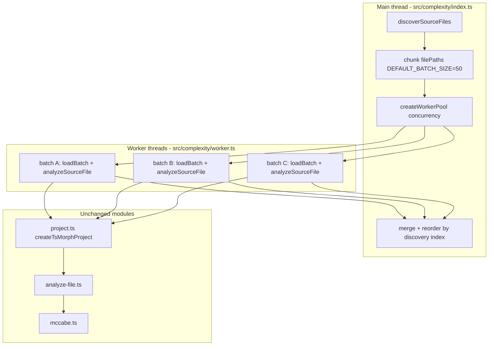

# Milestone 15 — AST Parallelization Design

**Spec**: [`.specs/features/ast-parallelization/spec.md`](./spec.md)  
**Context**: [`.specs/features/ast-parallelization/context.md`](./context.md)  
**Status**: Done

---

## Architecture Overview

M15 replaces the sequential batch loop in `createComplexityAnalyzer()` with a bounded worker pool. File discovery and chunking remain on the main thread; each worker processes one batch with a fresh `ts-morph` `Project`, returning `{ results, functions, warnings }` for merge and deterministic reordering.



**Baseline:** [`.specs/features/complexity-analyzer/design.md`](../complexity-analyzer/design.md) — M3 batch + McCabe; [`.specs/features/function-granularity/design.md`](../function-granularity/design.md) — M11 per-function extraction.  
**ROADMAP:** M15 AST Parallelization.

---

## Code Reuse Analysis

### Existing Components to Leverage

| Component                        | Location                         | How to Use                                           |
| -------------------------------- | -------------------------------- | ---------------------------------------------------- |
| `analyzeBatch` logic             | `src/complexity/index.ts`        | Extract to shared `analyze-batch.ts` or worker entry |
| `createTsMorphProject`           | `src/complexity/project.ts`      | Each worker creates own adapter per batch            |
| `analyzeSourceFile`              | `src/complexity/analyze-file.ts` | Unchanged — called per `SourceFile` in worker        |
| `complexityForFunction`          | `src/complexity/mccabe.ts`       | Unchanged — RT-005 semantics preserved               |
| `discoverSourceFiles`            | `src/complexity/discover.ts`     | Main thread only                                     |
| `chunk` helper                   | `src/complexity/index.ts`        | Main thread; same 50-file batches                    |
| `ComplexityAnalyzerDependencies` | `src/complexity/index.ts`        | Extend with `createWorkerPool`, `concurrency`        |
| McCabe fixtures                  | `tests/fixtures/complexity/`     | Regression gate — no changes                         |
| Integration fixture              | `tests/fixtures/repos/small-ts/` | E2E unchanged rankings in T5                         |

### Integration Points

| Consumer                         | Impact                                                    |
| -------------------------------- | --------------------------------------------------------- |
| `src/complexity/worker.ts`       | **New** — worker entry point                              |
| `src/complexity/pool.ts`         | **New** — `createWorkerPool`                              |
| `src/complexity/index.ts`        | Replace sequential `for` loop with pool dispatch + merge  |
| `src/complexity/project.ts`      | None — called from worker per batch                       |
| `src/complexity/analyze-file.ts` | None                                                      |
| `src/complexity/mccabe.ts`       | None                                                      |
| `src/scan.ts`                    | None — consumes same `ComplexityAnalyzerResult`           |
| `bin/hotspot-scanner.ts`         | None — no CLI changes                                     |
| `tsconfig.json`                  | None — `worker.ts` compiled via existing `src/**` include |

Per [INTEGRATIONS.md](../../codebase/INTEGRATIONS.md): `ts-morph` and `worker_threads` stay inside `src/complexity/`.

---

## Design Decisions

| #   | Decision                                                      | Rationale                                              |
| --- | ------------------------------------------------------------- | ------------------------------------------------------ |
| D1  | Parallelism unit = **batch** (not file)                       | Aligns M3 D7 fresh `Project`; ts-morph not thread-safe |
| D2  | New modules `worker.ts` + `pool.ts`                           | Separates thread boundary from orchestration           |
| D3  | Merge reorder by **discovery index**                          | Deterministic output equivalent to sequential          |
| D4  | `DEFAULT_WORKER_CONCURRENCY = min(availableParallelism(), 4)` | CPU utilization with memory cap                        |
| D5  | Extend `ComplexityAnalyzerDependencies`                       | TESTING.md mock boundary at pool adapter               |
| D6  | Inline fallback when `concurrency === 1` or single batch      | Fast path for tests and small repos                    |

---

## Components

### Batch analysis payload (`src/complexity/analyze-batch.ts` or inline in worker)

Extract current `analyzeBatch` from `index.ts` into a shared function callable from main thread (inline path) and worker:

```typescript
export interface BatchAnalysisInput {
  repoPath: string;
  batch: string[];
}

export interface BatchAnalysisOutput {
  results: ComplexityResult[];
  functions: FunctionComplexityResult[];
  warnings: string[];
}

export async function analyzeBatch(
  input: BatchAnalysisInput,
): Promise<BatchAnalysisOutput>;
```

Implementation: `createTsMorphProject({ repoPath })` → `loadBatch(batch)` → loop `analyzeSourceFile` → collect parse failures as warnings.

### Worker entry (`src/complexity/worker.ts`)

```typescript
import { parentPort, workerData } from "node:worker_threads";
import { analyzeBatch } from "./analyze-batch.js";

const input = workerData as BatchAnalysisInput;
analyzeBatch(input)
  .then((output) => parentPort!.postMessage({ ok: true, output }))
  .catch((error) =>
    parentPort!.postMessage({
      ok: false,
      error: error instanceof Error ? error.message : String(error),
    }),
  );
```

Worker spawned via ESM URL (compiled to `dist/complexity/worker.js`):

```typescript
new Worker(new URL("./worker.js", import.meta.url), { workerData: input });
```

### Worker pool (`src/complexity/pool.ts`)

```typescript
export const DEFAULT_WORKER_CONCURRENCY = Math.min(availableParallelism(), 4);

export interface WorkerPoolOptions {
  concurrency: number;
  workerScript?: URL; // override for tests
}

export interface WorkerPool {
  runBatches(
    repoPath: string,
    batches: string[][],
  ): Promise<BatchAnalysisOutput[]>;
}

export function createWorkerPool(options: WorkerPoolOptions): WorkerPool;
```

**Dispatch algorithm:**

1. Maintain queue of pending batch indices
2. Track in-flight count ≤ `concurrency`
3. On worker message: store result at batch index, dispatch next batch
4. On worker error: reject entire `runBatches` with enriched error
5. Return results array aligned to input batch order (pool handles ordering; merge in index applies discovery sort)

**Inline path (D6):** When `concurrency === 1`, `createWorkerPool` MAY call `analyzeBatch` directly on main thread without spawning `Worker`.

### Orchestrator changes (`src/complexity/index.ts`)

```typescript
export interface ComplexityAnalyzerDependencies {
  discoverSourceFiles?: typeof discoverSourceFiles;
  createWorkerPool?: typeof createWorkerPool;
  concurrency?: number;
}
```

Flow:

1. `validateRepoPath(repoPath)`
2. `filePaths = await discover(repoPath, scope)`
3. `batches = chunk(filePaths, DEFAULT_BATCH_SIZE)`
4. Build `filePathIndex: Map<string, number>` for reorder
5. `batchOutputs = await pool.runBatches(repoPath, batches)`
6. Flatten `results`, `functions`, `warnings` from all batch outputs
7. Sort `results` by `filePathIndex.get(filePath)`
8. Sort `functions` by `(filePathIndex, line)`
9. Sort `warnings` by discovery order of embedded path (parse `Failed to parse {path}:` prefix)
10. Return `{ results, functions, warnings }`

---

## Merge and Ordering

### Results

Sort `ComplexityResult[]` by discovery index of `filePath`. Ties impossible (unique paths).

### Functions

Sort by `(discoveryIndex(filePath), line)` ascending. Preserves M11 stable ordering within file.

### Warnings

Parse failure warnings use format `Failed to parse ${filePath}: ${message}` (existing). Sort by `discoveryIndex(filePath)`; unknown paths last.

---

## Testing Strategy

| Layer         | Approach                                                                                                                   |
| ------------- | -------------------------------------------------------------------------------------------------------------------------- |
| Pool unit     | Mock `Worker` or inject `workerScript` that runs inline                                                                    |
| Equivalence   | Same temp repo: `concurrency: 1` inline vs `concurrency: 2` with real workers (optional P2 test gated behind env if flaky) |
| McCabe        | Existing fixtures — zero changes                                                                                           |
| Integration   | `small-ts` scan — exit 0, rankings unchanged                                                                               |
| Mock boundary | `createWorkerPool` injectable; default tests use inline sequential                                                         |

Per [TESTING.md](../../codebase/TESTING.md): mock at `ComplexityAnalyzer` adapter boundary, not inside `mccabe.ts`.

---

## Build and Runtime

| Concern                           | Resolution                                                                                                       |
| --------------------------------- | ---------------------------------------------------------------------------------------------------------------- |
| ESM worker path                   | `new URL("./worker.js", import.meta.url)` resolves to `dist/complexity/worker.js` after `tsc`                    |
| `package.json` `"type": "module"` | Native ESM workers supported on Node 22                                                                          |
| No `tsconfig.bin.json` change     | Worker is under `src/`, not `bin/`                                                                               |
| Vitest + workers                  | Prefer `concurrency: 1` / mocked pool in unit tests; optional dedicated test with `vitest pool: forks` if needed |

---

## Risks

| Risk                                | Likelihood | Impact | Mitigation                                                       |
| ----------------------------------- | ---------- | ------ | ---------------------------------------------------------------- |
| RT-005 McCabe drift via worker copy | Low        | High   | Shared `analyze-batch.ts`; equivalence test; fixtures unchanged  |
| Worker ESM path wrong in dist       | Medium     | High   | Integration test after `pnpm build`; log worker path in dev only |
| Memory spike (4 workers × 50 files) | Medium     | Medium | Concurrency cap at 4; batch size unchanged                       |
| Flaky timing tests                  | Medium     | Low    | No wall-clock assertions; mock pool in default tests             |
| Worker crash opaque error           | Low        | Medium | Enrich error with `repoPath` and batch file list                 |

---

## Documentation Sync Targets (T6)

| File                                                            | Update                                                         |
| --------------------------------------------------------------- | -------------------------------------------------------------- |
| [STATE.md](../../project/STATE.md)                              | Remove §Deferred worker-thread entry                           |
| [ARCHITECTURE.md](../../codebase/ARCHITECTURE.md)               | Complexity stage worker pool diagram/note                      |
| [CONCERNS.md](../../codebase/CONCERNS.md)                       | RT-001 AST worker-thread batch processing                      |
| [INTEGRATIONS.md](../../codebase/INTEGRATIONS.md)               | `worker_threads` under complexity boundary                     |
| [scripts/benchmark-scan.md](../../../scripts/benchmark-scan.md) | M15 before/after section                                       |
| [ROADMAP.md](../../project/ROADMAP.md)                          | M15 link + `**Specs:** Done` (planning); `[x]` on Execute Done |

---

## Out of Scope (design boundary)

- Git miner workers
- Pipeline stage overlap
- CLI `--workers`
- CI perf thresholds
- McCabe definition changes
- File-level intra-batch parallelism
