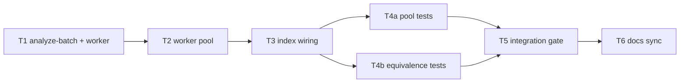

# Milestone 15 — AST Parallelization Tasks

**Design**: [`.specs/features/ast-parallelization/design.md`](./design.md)  
**Spec**: [`.specs/features/ast-parallelization/spec.md`](./spec.md)  
**Context**: [`.specs/features/ast-parallelization/context.md`](./context.md)  
**Status**: Done

---

## Execution Plan

### Phase 1: Batch analysis extraction + worker entry (Sequential)

```
T1 analyze-batch.ts + worker.ts entry point
```

### Phase 2: Worker pool (Sequential)

```
T1 → T2 createWorkerPool + pool unit tests
```

### Phase 3: Orchestrator wiring (Sequential)

```
T2 → T3 index.ts pool dispatch + merge reorder + deps injection
```

### Phase 4: Equivalence + regression tests (Parallel OK)

```
T3 → T4a pool.test.ts [P]
T3 → T4b index.test.ts equivalence + parse failure [P]
```

### Phase 5: Integration gate (Sequential)

```
T4 → T5 integration on small-ts + full project gate
```

### Phase 6: Documentation sync (Sequential)

```
T5 → T6 docs + benchmark + STATE deferred removal + ROADMAP
```



### Diagram-Definition Cross-Check

| Task | Depends on (declared) | Appears in diagram after deps | Match |
| ---- | --------------------- | ----------------------------- | ----- |
| T1   | None                  | Root                          | ✅    |
| T2   | T1                    | T1 → T2                       | ✅    |
| T3   | T2                    | T2 → T3                       | ✅    |
| T4   | T3                    | T3 → T4a/T4b                  | ✅    |
| T5   | T4                    | T4 → T5                       | ✅    |
| T6   | T5                    | T5 → T6                       | ✅    |

### Test Co-location Validation

| Task | Code layer                                     | TESTING.md expectation | Tests in same task                        | Match |
| ---- | ---------------------------------------------- | ---------------------- | ----------------------------------------- | ----- |
| T1   | `src/complexity/analyze-batch.ts`, `worker.ts` | Unit required          | Covered in T4 via analyze-batch           | ✅    |
| T2   | `src/complexity/pool.ts`                       | Unit required          | `pool.test.ts`                            | ✅    |
| T3   | `src/complexity/index.ts`                      | Unit required          | `index.test.ts` (partial)                 | ✅    |
| T4   | `src/complexity/**`                            | Unit required          | `pool.test.ts`, `index.test.ts`           | ✅    |
| T5   | `bin/` integration                             | Integration            | `bin/hotspot-scanner.integration.test.ts` | ✅    |
| T6   | Docs only                                      | Gate                   | `pnpm build && pnpm test`                 | ✅    |

---

## Task Breakdown

### T1: Batch analysis extraction + worker entry

**What**: Extract `analyzeBatch` from `index.ts` into `src/complexity/analyze-batch.ts` with `BatchAnalysisInput` / `BatchAnalysisOutput` types. Create `src/complexity/worker.ts` worker entry that receives `workerData`, calls `analyzeBatch`, and posts result or error to `parentPort`. Keep `index.ts` temporarily on old inline path until T3.

**Where**: `src/complexity/analyze-batch.ts`, `src/complexity/worker.ts`, `src/complexity/index.ts` (refactor import only if needed for compile)

**Depends on**: None

**Reuses**: [design.md](./design.md) § Batch analysis payload, § Worker entry; existing `createTsMorphProject`, `analyzeSourceFile`

**Requirement**: HOTSPOT-113, HOTSPOT-115, HOTSPOT-116

**Tools**:

- MCP: NONE
- Skill: NONE

**Done when**:

- [x] `analyzeBatch({ repoPath, batch })` returns `{ results, functions, warnings }` matching pre-extraction behavior
- [x] `worker.ts` compiles to `dist/complexity/worker.js` via `pnpm build`
- [x] Parse failures in batch produce warnings with `Failed to parse {filePath}:` format
- [x] `analyze-batch.ts` has no `worker_threads` import (pure analysis)

**Tests**: Deferred to T4 — manual smoke: run `analyzeBatch` on `tests/fixtures/complexity/` subset

**Gate**: `pnpm build` (worker compiles)

---

### T2: Worker pool with bounded concurrency

**What**: Implement `createWorkerPool({ concurrency })` in `src/complexity/pool.ts` with `DEFAULT_WORKER_CONCURRENCY = min(availableParallelism(), 4)`. Dispatch batches with bounded in-flight count. Inline fallback when `concurrency === 1` (no `Worker` spawn). Export `WorkerPool` interface for injection. Add `pool.test.ts` with mocked worker or inline concurrency 1.

**Where**: `src/complexity/pool.ts`, `src/complexity/pool.test.ts`

**Depends on**: T1

**Reuses**: [design.md](./design.md) § Worker pool, D4, D6; [context.md](./context.md) § Default concurrency cap

**Requirement**: HOTSPOT-113, HOTSPOT-117

**Tools**:

- MCP: NONE
- Skill: NONE

**Done when**:

- [x] `runBatches(repoPath, batches)` returns array aligned to input batch order
- [x] In-flight batches never exceed `concurrency`
- [x] `concurrency === 1` path does not spawn `Worker`
- [x] Worker error rejects with message including batch context
- [x] `src/complexity/pool.ts` meets per-file coverage thresholds

**Tests**: `pool.test.ts` — concurrency limit, single-batch inline, error propagation

**Gate**: `pnpm exec vitest run src/complexity/pool.test.ts`

---

### T3: Orchestrator wiring + merge reorder

**What**: Replace sequential `for (const batch of chunk(...))` loop in `createComplexityAnalyzer()` with pool dispatch. Extend `ComplexityAnalyzerDependencies` with `createWorkerPool` and `concurrency`. Build discovery index map; merge and reorder `results`, `functions`, `warnings` per design § Merge and Ordering. Export `analyzeBatch` and pool from `index.ts` if needed for tests.

**Where**: `src/complexity/index.ts`, `src/complexity/index.test.ts` (partial updates)

**Depends on**: T2

**Reuses**: [design.md](./design.md) § Orchestrator changes, § Merge and Ordering; [context.md](./context.md) § Sequential fallback

**Requirement**: HOTSPOT-114, HOTSPOT-116, HOTSPOT-117

**Tools**:

- MCP: NONE
- Skill: NONE

**Done when**:

- [x] `createComplexityAnalyzer().analyze()` return shape unchanged
- [x] `discoverSourceFiles` called once on main thread before pool dispatch
- [x] Injected `createWorkerPool` used when provided
- [x] `concurrency` option passed to default pool factory
- [x] Results ordered by discovery index

**Tests**: `index.test.ts` — mock discover + mock pool; assert call order

**Gate**: `pnpm exec vitest run src/complexity/index.test.ts`

---

### T4: Equivalence + regression tests

**What**: Add equivalence test: temp repo with >50 files (or mocked batches) comparing `concurrency: 1` vs higher concurrency — deep equal `results`, `functions`, `warnings`. Add parse-failure test across batches. Verify all `tests/fixtures/complexity/` fixtures pass unchanged. Complete `pool.test.ts` coverage.

**Where**: `src/complexity/index.test.ts`, `src/complexity/pool.test.ts`, existing `mccabe.test.ts`, `analyze-file.test.ts`

**Depends on**: T3

**Reuses**: [design.md](./design.md) § Testing Strategy; existing McCabe fixtures

**Requirement**: HOTSPOT-114, HOTSPOT-115, HOTSPOT-117, HOTSPOT-118

**Tools**:

- MCP: NONE
- Skill: NONE

**Done when**:

- [x] Equivalence test passes (inline vs parallel output identical)
- [x] Multi-batch parse failure collects all warnings
- [x] All existing complexity unit tests pass without fixture changes
- [x] `src/complexity/**` meets per-file coverage thresholds

**Tests**: `index.test.ts`, `pool.test.ts`, full `src/complexity/**/*.test.ts`

**Gate**: `pnpm exec vitest run src/complexity/`

---

### T5: Integration gate

**What**: Run existing integration tests on `small-ts` fixture — file and function granularity unchanged. Full project gate `pnpm build && pnpm test`.

**Where**: `bin/hotspot-scanner.integration.test.ts`, project-wide

**Depends on**: T4

**Reuses**: `tests/fixtures/repos/small-ts/`; [vitals-cli-validation](../../../.cursor/skills/vitals-cli-validation/SKILL.md)

**Requirement**: HOTSPOT-118

**Tools**:

- MCP: NONE
- Skill: `vitals-cli-validation`

**Done when**:

- [x] `pnpm exec hotspot-scanner scan tests/fixtures/repos/small-ts` exits `0`
- [x] `--granularity function` integration test passes
- [x] `pnpm build && pnpm test` passes with coverage thresholds

**Tests**: `bin/hotspot-scanner.integration.test.ts` + full gate

**Gate**: `pnpm build && pnpm test`

---

### T6: Documentation sync + STATE deferred removal

**What**: Update ARCHITECTURE.md (complexity worker pool), CONCERNS.md (RT-001 AST workers), INTEGRATIONS.md (`worker_threads` boundary), `scripts/benchmark-scan.md` (M15 section). Remove worker-thread entry from STATE.md §Deferred. Mark ROADMAP M15 implementation checkboxes `[x]` on Execute Done only — during planning, link spec and `**Specs:** Done` already set.

**Where**: `.specs/codebase/ARCHITECTURE.md`, `.specs/codebase/CONCERNS.md`, `.specs/codebase/INTEGRATIONS.md`, `.specs/project/STATE.md`, `scripts/benchmark-scan.md`, `.specs/project/ROADMAP.md`

**Depends on**: T5

**Reuses**: [design.md](./design.md) § Documentation Sync Targets

**Requirement**: HOTSPOT-119, HOTSPOT-120

**Tools**:

- MCP: NONE
- Skill: NONE

**Done when**:

- [x] STATE.md §Deferred no longer lists worker-thread parallelization
- [x] ARCHITECTURE.md documents worker pool in complexity stage
- [x] CONCERNS.md RT-001 mentions AST worker-thread batches
- [x] INTEGRATIONS.md documents `worker_threads` in complexity adapter
- [x] `benchmark-scan.md` includes M15 before/after notes
- [x] ROADMAP M15 implementation checkboxes `[x]` on Execute Done
- [x] `pnpm build && pnpm test` passes

**Tests**: Full project gate

**Gate**: `pnpm build && pnpm test`

---

## Requirement Traceability (Tasks)

| Requirement ID | Tasks      |
| -------------- | ---------- |
| HOTSPOT-113    | T1, T2     |
| HOTSPOT-114    | T3, T4     |
| HOTSPOT-115    | T1, T4     |
| HOTSPOT-116    | T1, T3     |
| HOTSPOT-117    | T2, T3, T4 |
| HOTSPOT-118    | T4, T5     |
| HOTSPOT-119    | T6         |
| HOTSPOT-120    | T6         |

**Coverage:** 8 total, 8 mapped to tasks, 0 unmapped

---

## Parallel Execution Map

```
Phase 4 (Parallel after T3):
  T4a pool.test.ts completion [P]
  T4b index.test.ts equivalence [P]
```

All other phases sequential.

---

## Handoff

Planejamento concluído para `ast-parallelization`.

**Artefatos:** spec.md, design.md, context.md, tasks.md (Status: Planned)  
**Próximo passo:** revisar tasks.md, promover Status, abrir sessão de dev e invocar `orchestrator-implementer`.  
**Gate final esperado:** `pnpm build && pnpm test`
