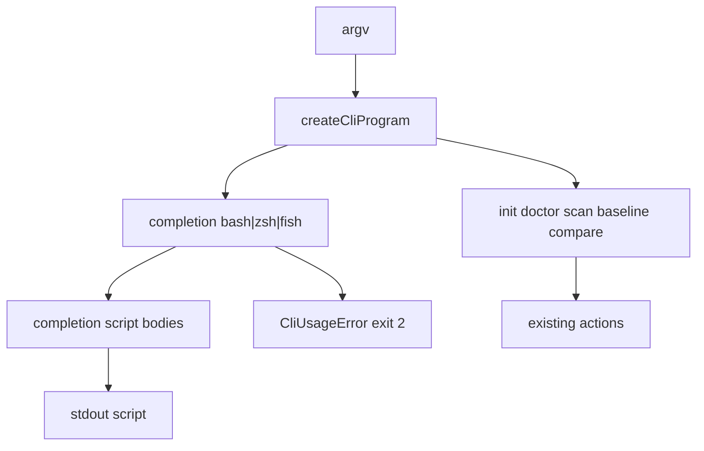

# Milestone 54 — CLI Adoption Extras Design (thin)

**Spec**: [`.specs/features/cli-adoption-extras/spec.md`](./spec.md)  
**Context**: [`.specs/features/cli-adoption-extras/context.md`](./context.md)  
**Status**: Planned  
**Depth:** Small — thin design; bin + docs only; no pipeline modules.

---

## Architecture Overview

M54 adds a **commander subcommand** that prints **hand-maintained** shell completion scripts. Domain pipeline unchanged. No new npm dependencies.



**Baseline:** current `bin/hotspot-scanner.ts` (`createCliProgram`, `CliUsageError`, exit mapping), M38 help patterns, M45 `docs/recipes.md`.

---

## Code Reuse

| Component                                       | Location                          | Use                                                                                     |
| ----------------------------------------------- | --------------------------------- | --------------------------------------------------------------------------------------- |
| `createCliProgram` / `runCli` / `CliUsageError` | `bin/hotspot-scanner.ts`          | Register `completion`; reuse usage-error path                                           |
| CLI unit tests                                  | `bin/hotspot-scanner.test.ts`     | Co-located assertions                                                                   |
| Recipes                                         | `docs/recipes.md`                 | Exclude cookbook + `.hotspotignore` rejection callout                                   |
| ARCHITECTURE CLI section                        | `.specs/codebase/ARCHITECTURE.md` | Document `completion`; remove/replace M30 “future ignore file” wording if still present |
| INTEGRATIONS.md                                 | `.specs/codebase/INTEGRATIONS.md` | Confirm **no** new dep entry (explicit non-add)                                         |

---

## Component notes

### 1. `completion` subcommand

```text
hotspot-scanner completion <shell>
```

- `.argument("<shell>", "Shell: bash | zsh | fish")`
- Map shell → script string; `process.stdout.write(script)` (ensure trailing newline)
- Default action only — no options required for MVP
- `.addHelpText("after", …)` with install one-liners (optional; README is sufficient if help lists shells)

### 2. Script bodies

Prefer a small `bin/completion-scripts.ts` (or similar) exporting:

```ts
export function getCompletionScript(shell: "bash" | "zsh" | "fish"): string;
export const COMPLETION_SHELLS = ["bash", "zsh", "fish"] as const;
```

Keep scripts **static**. Include:

| Layer      | Content                                                                                                                          |
| ---------- | -------------------------------------------------------------------------------------------------------------------------------- |
| Commands   | `init`, `doctor`, `scan`, `baseline`, `compare`, `completion` (+ `save` under `baseline` if still present)                       |
| Scan flags | At least `--format`, `--output`, `--exclude`, `--include`, `--config`, `--since` (add more from current `scan` options if cheap) |

Shell idioms:

- **bash:** `complete -F … hotspot-scanner` style function
- **zsh:** `#compdef` / `_arguments` or simple `compdef` wrapper
- **fish:** `complete -c hotspot-scanner …` lines

Exact script style is implementer discretion provided Tab-completable commands/flags match acceptance tests.

### 3. Docs

| Doc               | Change                                                                                      |
| ----------------- | ------------------------------------------------------------------------------------------- |
| README            | Short “Shell completion” subsection with three install one-liners                           |
| `docs/recipes.md` | Explicit **no `.hotspotignore`**; point to `exclude` / `--exclude` (reuse examples)         |
| ARCHITECTURE      | CLI commands list includes `completion`; path-scoping notes do not promise `.hotspotignore` |
| INTEGRATIONS      | No new dependency                                                                           |

### 4. Explicit non-goals in code

Do **not** add:

- Ignore-file parser under `src/paths/` or `src/config/`
- Config key for completion
- `@bomb.sh/tab` / Carapace

---

## Test Strategy

| Layer                                                                            | Focus                                                                                                                                 |
| -------------------------------------------------------------------------------- | ------------------------------------------------------------------------------------------------------------------------------------- |
| Unit `bin/hotspot-scanner.test.ts` (+ optional `bin/completion-scripts.test.ts`) | Each shell → exit 0, non-empty stdout, contains locked commands/flags; invalid shell → `CliUsageError` / exit 2; help mentions shells |
| Integration                                                                      | Optional smoke: `pnpm exec hotspot-scanner completion bash` exits 0 — not required if unit covers `runCli`/`parseAsync`               |
| Docs                                                                             | Manual Done-when checklist in tasks                                                                                                   |

No schema/contract tests. No fixture repo changes. No ranking tests.

Coverage: new `bin/completion-scripts.ts` (if split) is under `coverage.include` — keep scripts as string constants so branches stay simple; parse/`getCompletionScript` switch must be fully tested.

---

## Risks

| Risk                               | Mitigation                                                                  |
| ---------------------------------- | --------------------------------------------------------------------------- |
| Script drift vs real flags         | Substring tests + ARCHITECTURE note to update scripts with new public flags |
| Over-engineered dynamic completion | Locked static approach in context.md                                        |
| Accidental `.hotspotignore` creep  | Spec Out of Scope + Rejected decision; docs task only                       |
| Path conflict on `bin/`            | Sequential tasks; single module owner for completion code                   |
| New dependency temptation          | Design + INTEGRATIONS: explicitly none                                      |

---

## Implementation Notes

- Wire `completion` beside existing commands in `createCliProgram` (same file pattern as `init` / `doctor`).
- Preserve exit-code mapping in `main` (`CliUsageError` → 2).
- Propose Conventional Commit on Done (do not auto-commit): e.g. `feat(cli): add shell completion subcommand for bash/zsh/fish`.
