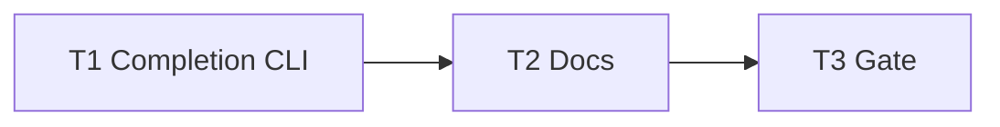

# Milestone 54 — CLI Adoption Extras Tasks

**Design**: [`.specs/features/cli-adoption-extras/design.md`](./design.md)  
**Spec**: [`.specs/features/cli-adoption-extras/spec.md`](./spec.md)  
**Context**: [`.specs/features/cli-adoption-extras/context.md`](./context.md)  
**Status**: Planned  
**Note**: Small feature — `bin/` + docs. **Do not Execute in the planning session.** Promote Status → invoke `orchestrator-implementer` in a new session.

---

## Execution Plan

### Phase 1: Completion CLI (Sequential — shared `bin/`)

```
T1 completion scripts + subcommand + tests
```

### Phase 2: Docs + gate (Sequential)

```
T1 → T2 living docs → T3 project gate
```



### Diagram-Definition Cross-Check

| Task | Depends on (declared) | Diagram shows | Match |
| ---- | --------------------- | ------------- | ----- |
| T1 | None | Root | ✅ |
| T2 | T1 | T1 → T2 | ✅ |
| T3 | T2 | T2 → T3 | ✅ |

### Path Conflict Check (Check 5)

| Task | Module owner | Paths | Conflict |
| ---- | ------------ | ----- | -------- |
| T1 | bin | `bin/hotspot-scanner.ts`, optional `bin/completion-scripts.ts`, `bin/hotspot-scanner.test.ts`, optional `bin/completion-scripts.test.ts` | Sole bin owner |
| T2 | docs | `README.md`, `docs/recipes.md`, `.specs/codebase/ARCHITECTURE.md`, `.specs/project/ROADMAP.md`, `.specs/project/STATE.md` | After T1; no `[P]` with bin |
| T3 | gate | none (verify) | After T2 |

No `[P]` — docs depend on CLI surface existing for accurate install examples.

### Test Co-location Validation

| Task | Code layer | TESTING.md expectation | Task says | Match |
| ---- | ---------- | ---------------------- | --------- | ----- |
| T1 | `bin/` | Unit | unit in same task | ✅ |
| T2 | Docs | none | none | ✅ |
| T3 | Full project | Gate | `pnpm build && pnpm test` | ✅ |

### Granularity Check

| Task | Scope | Status |
| ---- | ----- | ------ |
| T1 | Completion scripts + subcommand + unit tests | ✅ Cohesive (Small milestone) |
| T2 | Docs: completion install + `.hotspotignore` rejection | ✅ Granular |
| T3 | Project gate | ✅ Granular |

### Requirement → Task Mapping

| Requirement ID | Task |
| -------------- | ---- |
| HOTSPOT-840, HOTSPOT-841, HOTSPOT-842, HOTSPOT-843, HOTSPOT-844 | T1 |
| HOTSPOT-845, HOTSPOT-846 | T2 |
| (gate) | T3 |
| HOTSPOT-847–859 | Reserved — unused |

---

## Task Breakdown

### T1: Shell completion subcommand + static scripts

**What**: Add `hotspot-scanner completion <shell>` that prints static bash/zsh/fish completion scripts to stdout. Reject unknown shells with `CliUsageError` (exit 2). Cover locked commands and representative scan flags per [context.md](./context.md) / [spec.md](./spec.md). Document shells in command help. Co-locate unit tests.

**Where**: `bin/hotspot-scanner.ts`; optional `bin/completion-scripts.ts`; `bin/hotspot-scanner.test.ts` (+ optional `bin/completion-scripts.test.ts`)

**Depends on**: None

**Reuses**: `createCliProgram`, `CliUsageError`, existing `runCli` / exit mapping; M38 help patterns

**Done when**:

- [ ] `completion bash|zsh|fish` exits 0 with non-empty stdout script
- [ ] Invalid shell → `CliUsageError` / exit 2; message lists allowed shells
- [ ] Scripts include commands `init`, `doctor`, `scan`, `baseline`, `compare`, `completion` (and `baseline save` if still on the program)
- [ ] Scripts include at least `--format`, `--output`, `--exclude`, `--include`, `--config`, `--since`
- [ ] Help for `completion` documents the three shells
- [ ] No new runtime dependencies; no `runScan` on completion path
- [ ] Unit tests cover all three shells + invalid shell

**Tests**: Unit in `bin/*.test.ts` (same task)

**Gate**: `pnpm exec vitest run bin/hotspot-scanner.test.ts` (and completion-scripts test if split) — or full `pnpm test` if preferred locally

**Requirements**: HOTSPOT-840, HOTSPOT-841, HOTSPOT-842, HOTSPOT-843, HOTSPOT-844

---

### T2: Living docs — completion install + reject `.hotspotignore`

**What**: Document how to install shell completion (bash/zsh/fish one-liners). Explicitly state `.hotspotignore` is **not** supported; prefer config `exclude` / `--exclude` and point at recipes. Sync ARCHITECTURE CLI section; clear any leftover M30 “future `.hotspotignore`” promise. On feature Done, mark ROADMAP M54 checklist and STATE Active as appropriate for Execute completion (planner already linked Planned — Execute updates Done).

**Where**: `README.md`, `docs/recipes.md`, `.specs/codebase/ARCHITECTURE.md`; Execute may also tick ROADMAP/STATE Done rows

**Depends on**: T1

**Reuses**: Existing recipes exclude examples; M45 recipes structure

**Done when**:

- [ ] README has Shell completion subsection with bash/zsh/fish install examples using `completion`
- [ ] `docs/recipes.md` states no `.hotspotignore` and points to `exclude` / `--exclude`
- [ ] ARCHITECTURE documents `completion` and does not promise `.hotspotignore`
- [ ] No PathScope / config-key changes

**Tests**: none (docs)

**Gate**: none beyond review (full gate in T3)

**Requirements**: HOTSPOT-845, HOTSPOT-846

---

### T3: Project quality gate

**What**: Run full project gate; fix any fallout from T1/T2. Propose Conventional Commit message (do not commit unless user asks).

**Where**: repo root (verify only)

**Depends on**: T2

**Reuses**: [TESTING.md](../../codebase/TESTING.md) gate

**Done when**:

- [ ] `pnpm build && pnpm test` exits 0
- [ ] Coverage thresholds still met for touched `bin/` files
- [ ] Commit message proposed (e.g. `feat(cli): add bash/zsh/fish completion subcommand`)

**Tests**: full suite via gate

**Gate**: `pnpm build && pnpm test`

**Requirements**: (verification)

---

## Parallelism notes

- No `[P]` tasks — T1 owns all bin completion code; T2/T3 sequential after.
- Recommended implementer module owner: **bin** for T1; **docs** for T2; **verifier-quality-gates** pattern for T3.

---

## Handoff

```
Planejamento concluído para cli-adoption-extras.

Artefatos: context.md, spec.md, design.md, tasks.md (Status: Planned)
Próximo passo: revisar tasks.md, promover Status, abrir sessão de dev e invocar orchestrator-implementer.
Gate final esperado: pnpm build && pnpm test
```
