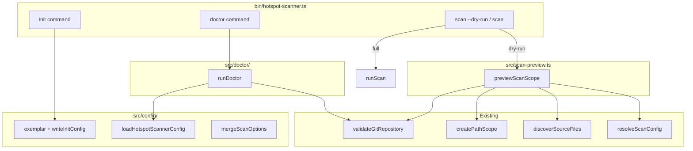

# Milestone 39 — CLI Init / Doctor / Dry-run Design

**Spec**: [`.specs/features/cli-init-doctor-dry-run/spec.md`](./spec.md)  
**Context**: [`.specs/features/cli-init-doctor-dry-run/context.md`](./context.md)  
**Status**: Planned  
**Depth**: Large

---

## Architecture Overview

Three thin domain modules feed a multi-command Commander program. `bin/` only parses argv and prints results; no discovery/merge/git checks inline beyond calling domain APIs.



**Key constraint:** Dry-run must not call `createGitMiner().mine`, `createComplexityAnalyzer().analyze`, scorers, or `createReporter().render` ranking paths. Inventory via `discoverSourceFiles` (optional `git ls-files`) is allowed.

---

## Code Reuse Analysis

### Existing Components to Leverage

| Component | Location | How to Use |
| --------- | -------- | ---------- |
| Config filename + load/walk/`--config` | `src/config/load-config.ts` | Doctor validity + dry-run merge |
| `mergeScanOptions` / `MergedScanConfig` | `src/config/merge-options.ts` | Dry-run effective values |
| `ConfigError` | `src/config/` | Doctor + dry-run invalid config → exit `2` |
| `resolveScanConfig` / `validateGitRepository` / `validateRepoPath` | `src/scan.ts` | Dry-run + doctor git check (export already public for git validate) |
| `createPathScope` | `src/paths/scope.ts` | Dry-run scope for discovery |
| `discoverSourceFiles` + `ELIGIBLE_EXTENSIONS` | `src/complexity/discover.ts` | Eligible file count |
| `DEFAULT_SINCE`, `DEFAULT_TOP`, `DEFAULT_MIN_COCHANGE` | scan / scoring | Exemplar values |
| `DEFAULT_WORKER_CONCURRENCY` | `src/complexity/pool.ts` | Dry-run concurrency line |
| CLI patterns | `bin/hotspot-scanner.ts` | Add commands; keep `CliUsageError` exit `2` |
| Fixture `small-ts` | `tests/fixtures/repos/small-ts/` | Doctor + dry-run CLI tests |

### Integration Points

| System | Integration Method |
| ------ | ------------------ |
| Commander | New `init` / `doctor` commands; `--dry-run` boolean on `scan` |
| Node `engines` | Read from package.json adjacent to CLI (same pattern as future M38 `--version`) or hardcode check against `process.version` with `semver` — **prefer no new dep**: parse `engines.node` string `>=22` with a tiny local comparator or `process.versions.node` major ≥ 22 matching package.json |
| `git` on PATH | `spawnSync('git', ['--version'], …)` or `which`-style lookup via `spawnSync` — encapsulate in `src/doctor/` (not `src/git/` miner) |
| tsconfig presence | `fs` walk upward from doctor target for `tsconfig.json` / `jsconfig.json` (informational only; do not reuse scoring `TsconfigPathMap`) |

### Fragile areas (CONCERNS)

| Concern | Mitigation |
| ------- | ---------- |
| `src/scan.ts` pipeline wiring | Prefer **new** `src/scan-preview.ts`; reuse `resolveScanConfig` + validators; do not insert dry-run branches inside `runScan` |
| Git miner / AST | Dry-run tests assert those entry points are **not** called |
| Config discovery semantics | Doctor/dry-run call existing loaders only — no parallel discovery rules |
| Domain logic in bin | Init/doctor/preview logic live under `src/`; bin wires only |

---

## Components

### Exemplar + init writer

- **Purpose**: Provide locked exemplar JSON and write `.hotspot-scanner.json` with force/exists semantics.
- **Location**: `src/config/exemplar.ts` (or `write-init.ts`) + export from `src/config/index.ts`
- **Interfaces**:
  - `EXEMPLAR_HOTSPOT_SCANNER_CONFIG: HotspotScannerConfig` (or serialized string constant)
  - `formatExemplarConfig(): string` — 2-space JSON + trailing newline
  - `writeInitConfig(options: { targetDir: string; force: boolean }): Promise<{ path: string }>` — throws `CliUsageError`-equivalent domain error or dedicated `InitError` mapped in bin; prefer a small `InitError` or reuse `Error` with clear message and let bin map to exit `2` for exists-without-force
- **Dependencies**: `node:fs/promises`, `HOTSPOT_SCANNER_CONFIG_FILENAME`
- **Reuses**: Defaults constants for exemplar values; omit `concurrency` per context.md

### Doctor runner

- **Purpose**: Run locked health checks and return structured findings + aggregate exit code.
- **Location**: `src/doctor/index.ts` (+ `checks.ts` if split keeps files small)
- **Interfaces**:
  - `runDoctor(options: { targetPath: string; configPath?: string; enginesNode?: string; nodeVersion?: string }): Promise<DoctorResult>`
  - `DoctorResult { findings: DoctorFinding[]; exitCode: 0 | 1 | 2 }`
  - `DoctorFinding { id: string; status: 'pass' | 'warn' | 'fail'; message: string }`
- **Dependencies**: `loadHotspotScannerConfig`, `validateGitRepository` (or shared access check), PATH git probe, package engines string
- **Reuses**: M30 load semantics; do not invent alternate config rules
- **Exit mapping**: Per [context.md](./context.md) — hard vs soft

### Scan scope preview

- **Purpose**: Produce dry-run preview data without running the scan pipeline.
- **Location**: `src/scan-preview.ts`
- **Interfaces**:
  - `previewScanScope(options: ScanOptions): Promise<ScanScopePreview>`
  - `ScanScopePreview { repoPath; since; include?: string[]; exclude?: string[]; eligibleFileCount: number; concurrency: number; configPathResolved?: string }`
  - `formatScanScopePreview(preview: ScanScopePreview): string` — plain text lines for stdout
- **Dependencies**: `validateRepoPath`, `validateGitRepository`, `resolveScanConfig`, `createPathScope`, `discoverSourceFiles`
- **Reuses**: Same merge path as `runScan`; **does not** call miner/analyzer/scorers
- **Export**: From `src/scan.ts` re-export optional, or `#scan` package export if already barrel — prefer exporting from `src/index.ts` / `#scan` only if existing pattern allows; otherwise bin imports relative/`#scan` if preview is re-exported from scan barrel. **YAGNI:** export `previewScanScope` from a path bin can import (`#scan` via adding export in `src/scan.ts` re-export line, or new `#`-import). Simplest: add `export { previewScanScope, formatScanScopePreview } from './scan-preview.js'` in `src/scan.ts` or extend package imports — follow STRUCTURE; if `#scan` maps to `dist/scan.js`, re-export from `scan.ts`.

### CLI wiring

- **Purpose**: Register `init`, `doctor`, and `scan --dry-run`.
- **Location**: `bin/hotspot-scanner.ts`, tests in `bin/hotspot-scanner.test.ts` (+ integration if needed)
- **Behavior**:
  - `init [directory]` + `--force`
  - `doctor [path]` + optional `--config`
  - `scan` gains `--dry-run`; if set, call preview path; reject `--baseline`
- **Reuses**: `buildCliConfigOverrides`, `loadHotspotScannerConfig` / merge already used by scan — dry-run should build `ScanOptions` the same way then call `previewScanScope`

---

## Data Models

```typescript
interface DoctorFinding {
  id:
    | "node-engines"
    | "git-path"
    | "git-repo"
    | "config"
    | "tsconfig";
  status: "pass" | "warn" | "fail";
  message: string;
}

interface DoctorResult {
  findings: DoctorFinding[];
  /** Aggregate per context.md */
  exitCode: 0 | 1 | 2;
}

interface ScanScopePreview {
  repoPath: string;
  since: string;
  include: string[]; // effective; empty if unset
  exclude: string[]; // user/config additive only
  eligibleFileCount: number;
  concurrency: number;
}
```

Exemplar shape (written file — no `concurrency` key):

```json
{
  "since": "12 months ago",
  "include": [],
  "exclude": [],
  "granularity": "file",
  "minCochange": 3,
  "top": 20
}
```

---

## Error Handling

| Case | Type | Exit |
| ---- | ---- | ---- |
| Init exists without `--force` | Usage-style error | `2` |
| Init bad directory | `CliUsageError` | `2` |
| Doctor hard env/repo | findings + `exitCode: 1` | `1` |
| Doctor invalid / missing explicit config | `ConfigError` or finding fail + `2` | `2` |
| Dry-run + `--baseline` | `CliUsageError` | `2` |
| Dry-run invalid config / bad repo | Same as scan | `2` / `1` |

Doctor should prefer returning `DoctorResult` and letting bin `process.exit(result.exitCode)` after printing, except when `ConfigError` is thrown from the loader for explicit-path/invalid parse — either catch inside doctor and convert to finding+exitCode `2`, or let throw (bin already maps `ConfigError` → `2`). **Lock for implementer:** catch inside `runDoctor` so all findings print in one report (invalid config appears as a fail finding, exit `2`).

---

## Testing Strategy

| Layer | What |
| ----- | ---- |
| Unit `src/config/*init*` | Exemplar contents; write/no-overwrite/`--force`; bad dir |
| Unit `src/doctor/` | Node below engines → fail; git missing → fail; no `.git` → fail; missing config → warn exit 0; invalid config → exit 2; tsconfig present/absent |
| Unit `src/scan-preview.ts` | Preview fields; spy that mine/analyze not used; zero files → count 0 |
| CLI `bin/hotspot-scanner.test.ts` | Commands registered; init/doctor/dry-run exit codes; `--baseline`+`--dry-run` rejects; help mentions flags |
| Integration (light) | Dry-run on isolated `small-ts` → count ≥ 1; doctor on `small-ts` healthy → exit 0 |

**Coverage:** New `src/**` and `bin/**` files fall under existing Vitest per-file thresholds — co-locate tests.

---

## Documentation Updates (Execute)

| Doc | Change |
| --- | ------ |
| README | Short “Getting started”: `init` → `doctor` → `scan --dry-run` → `scan` |
| ARCHITECTURE.md | CLI multi-command + dry-run preview stage note |
| STRUCTURE.md | `src/doctor/`, `src/scan-preview.ts`, config exemplar helper |
| STATE.md / ROADMAP M39 | Checkboxes on Execute Done (not this planning session) |

---

## Risks

| Risk | Mitigation |
| ---- | ---------- |
| Doctor Node check drifts from `package.json` engines | Read engines from package.json at runtime (resolve relative to CLI install) |
| `git ls-files` in dry-run confused with “mining” | Spec/docs: inventory only; tests do not spy ls-files as failure |
| Bin grows domain logic | Module split enforced in tasks Path Conflict Check |
| M38 later adds default path `.` | Doctor/init already default cwd; scan path still required until M38 — no dependency |

---

## Open Questions

_None — gray areas locked in context.md._
