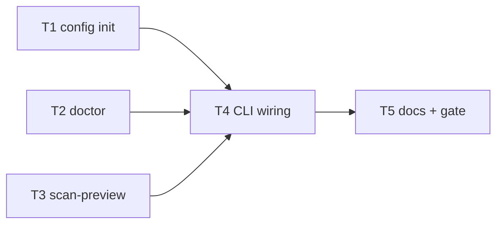

# Milestone 39 — CLI Init / Doctor / Dry-run Tasks

**Design**: [`.specs/features/cli-init-doctor-dry-run/design.md`](./design.md)  
**Spec**: [`.specs/features/cli-init-doctor-dry-run/spec.md`](./spec.md)  
**Context**: [`.specs/features/cli-init-doctor-dry-run/context.md`](./context.md)  
**Status**: Planned

---

## Execution Plan

```
T1 [P] init writer ────────┐
T2 [P] doctor module ──────┼──→ T4 CLI wiring → T5 docs + full gate
T3 [P] scan-preview ───────┘
```



### Diagram-Definition Cross-Check

| Task | Depends on (body) | Diagram shows | Status |
| ---- | ----------------- | ------------- | ------ |
| T1   | None              | Root          | ✅ Match |
| T2   | None              | Root          | ✅ Match |
| T3   | None              | Root          | ✅ Match |
| T4   | T1, T2, T3        | T1/T2/T3→T4   | ✅ Match |
| T5   | T4                | T4→T5         | ✅ Match |

### Path Conflict Check

| Task | Module owner | Paths | Conflict |
| ---- | ------------ | ----- | -------- |
| T1   | `src/config/` | `exemplar.ts` / `write-init.ts`, tests, `index.ts` exports | None vs T2/T3 — `[P]` OK |
| T2   | `src/doctor/` | new module + tests | None vs T1/T3 — `[P]` OK |
| T3   | `src/scan-preview.ts` (+ thin re-export from `src/scan.ts` if needed) | preview + tests | Avoid editing `runScan` body; re-export only — `[P]` OK vs T1/T2 |
| T4   | `bin/` | `hotspot-scanner.ts`, CLI tests | After T1–T3; sole bin owner |
| T5   | docs | README, ARCHITECTURE, STRUCTURE, ROADMAP/STATE notes | After T4 |

### Test Co-location Validation

| Task | Code layer | Matrix / TESTING.md | Task Tests | Status |
| ---- | ---------- | ------------------- | ---------- | ------ |
| T1   | `src/config/` | unit co-located | unit | ✅ OK |
| T2   | `src/doctor/` | unit co-located | unit | ✅ OK |
| T3   | `src/scan-preview.ts` | unit co-located | unit | ✅ OK |
| T4   | `bin/` | CLI Vitest | CLI | ✅ OK |
| T5   | docs | none | none + full gate | ✅ OK |

### Granularity Check

| Task | Scope | Status |
| ---- | ----- | ------ |
| T1 | Exemplar + writeInitConfig + unit tests | ✅ Granular |
| T2 | runDoctor + findings/exit policy + unit tests | ✅ Granular |
| T3 | previewScanScope + format + unit tests (no mine/AST) | ✅ Granular |
| T4 | Commander wiring for init/doctor/--dry-run + CLI tests | ✅ Cohesive CLI slice |
| T5 | Living docs + `pnpm build && pnpm test` | ✅ Granular |

---

## Task Breakdown

### T1: Init exemplar writer `[P]`

**What**: Add locked exemplar + `writeInitConfig` (cwd/dir target via caller, no overwrite without `force`) under `src/config/`.

**Where**: `src/config/exemplar.ts` (or `write-init.ts`), `src/config/index.ts`, `src/config/exemplar.test.ts` (or co-located name)

**Depends on**: None

**Reuses**: `HOTSPOT_SCANNER_CONFIG_FILENAME`; `DEFAULT_SINCE` / `DEFAULT_TOP` / `DEFAULT_MIN_COCHANGE`; [context.md](./context.md) exemplar table (omit `concurrency`)

**Requirement**: HOTSPOT-470, HOTSPOT-471, HOTSPOT-472, HOTSPOT-473, HOTSPOT-474, HOTSPOT-476

**Tools**:

- MCP: NONE
- Skill: `coding-guidelines`, `vitals-pipeline-domain`

**Done when**:

- [ ] Exemplar JSON matches locked keys/values (2-space indent, trailing newline)
- [ ] `writeInitConfig` refuses existing file without `force`; overwrites with `force`
- [ ] Clear error when target directory missing / not a directory
- [ ] Unit tests cover create / refuse / force
- [ ] Gate check passes: `pnpm exec vitest run src/config/`
- [ ] Test count does not drop silently

**Tests**: unit  
**Gate**: `pnpm exec vitest run src/config/`

**Verify**:

```bash
pnpm exec vitest run src/config/
```

---

### T2: Doctor module `[P]`

**What**: Implement `runDoctor` with locked checks (Node engines, git on PATH, git repo, config load/validity, tsconfig/jsconfig informational) and aggregate exit codes per context.md.

**Where**: `src/doctor/index.ts` (+ helpers as needed), `src/doctor/*.test.ts`

**Depends on**: None

**Reuses**: `loadHotspotScannerConfig` / `ConfigError`; `validateGitRepository` from `src/scan.ts` (or shared access check); [context.md](./context.md) exit policy

**Requirement**: HOTSPOT-477, HOTSPOT-478, HOTSPOT-479, HOTSPOT-480, HOTSPOT-481, HOTSPOT-482, HOTSPOT-483, HOTSPOT-484

**Tools**:

- MCP: NONE
- Skill: `coding-guidelines`, `vitals-pipeline-domain`

**Done when**:

- [ ] Hard failures: engines, git PATH, non-repo → `exitCode` `1`
- [ ] Invalid config / missing explicit `--config` → fail finding + `exitCode` `2` (findings still printed)
- [ ] Missing discovered config → warn, `exitCode` `0` if otherwise healthy
- [ ] tsconfig/jsconfig presence is informational (pass or soft warn)
- [ ] Unit tests cover each severity class
- [ ] Gate check passes: `pnpm exec vitest run src/doctor/`
- [ ] Test count does not drop silently

**Tests**: unit  
**Gate**: `pnpm exec vitest run src/doctor/`

**Verify**:

```bash
pnpm exec vitest run src/doctor/
```

---

### T3: Scan scope preview `[P]`

**What**: Implement `previewScanScope` + `formatScanScopePreview` that merge config, build PathScope, count via `discoverSourceFiles`, and never call miner/AST/scoring.

**Where**: `src/scan-preview.ts`, `src/scan-preview.test.ts`; optional one-line re-export from `src/scan.ts` for `#scan` consumers (do **not** branch inside `runScan`)

**Depends on**: None

**Reuses**: `resolveScanConfig`, `validateRepoPath`, `validateGitRepository`, `createPathScope`, `discoverSourceFiles`, `DEFAULT_WORKER_CONCURRENCY` via merge

**Requirement**: HOTSPOT-485, HOTSPOT-486, HOTSPOT-487, HOTSPOT-488

**Tools**:

- MCP: NONE
- Skill: `coding-guidelines`, `vitals-pipeline-domain`

**Done when**:

- [ ] Preview includes since, include, exclude (user/config), eligibleFileCount, concurrency
- [ ] Tests spy/prove `createGitMiner` / analyzer / scorers are not invoked
- [ ] Zero eligible files → count `0`, no throw
- [ ] Invalid repo/config fail like scan prelude
- [ ] Gate check passes: `pnpm exec vitest run src/scan-preview.ts src/scan-preview.test.ts` (and `src/scan.ts` if re-export touched)
- [ ] Test count does not drop silently

**Tests**: unit  
**Gate**: `pnpm exec vitest run src/scan-preview.ts src/scan-preview.test.ts`

**Verify**:

```bash
pnpm exec vitest run src/scan-preview.ts src/scan-preview.test.ts
```

---

### T4: CLI wiring — init, doctor, `--dry-run`

**What**: Register Commander `init` / `doctor` and `scan --dry-run`; map exit codes; reject `--baseline` with dry-run; extend CLI tests.

**Where**: `bin/hotspot-scanner.ts`, `bin/hotspot-scanner.test.ts` (and integration test file only if needed)

**Depends on**: T1, T2, T3

**Reuses**: T1 `writeInitConfig`; T2 `runDoctor`; T3 `previewScanScope` / formatter; existing `buildCliConfigOverrides` / `CliUsageError` / `ConfigError` exit mapping

**Requirement**: HOTSPOT-470–489 (CLI surfaces), especially HOTSPOT-475, HOTSPOT-489

**Tools**:

- MCP: NONE
- Skill: `coding-guidelines`, `vitals-cli-validation`

**Done when**:

- [ ] `hotspot-scanner init [--force] [dir]` works per context defaults
- [ ] `hotspot-scanner doctor [path] [--config]` prints findings and exits per policy
- [ ] `scan <path> --dry-run` prints preview; does not full-scan
- [ ] `--dry-run --baseline` → `CliUsageError`
- [ ] `--format` / `--output` with dry-run ignored (no error)
- [ ] Help text mentions `init`, `doctor`, `--dry-run`
- [ ] CLI tests cover happy paths + exit codes (use temp dirs / `small-ts` isolate)
- [ ] Gate check passes: `pnpm exec vitest run bin/ src/config/ src/doctor/ src/scan-preview.test.ts`
- [ ] Test count does not drop silently

**Tests**: CLI (unit-style Vitest)  
**Gate**: `pnpm exec vitest run bin/ src/config/ src/doctor/ src/scan-preview.test.ts`

**Verify**:

```bash
pnpm exec vitest run bin/ src/config/ src/doctor/ src/scan-preview.test.ts
pnpm exec hotspot-scanner init --help
pnpm exec hotspot-scanner doctor tests/fixtures/repos/small-ts
pnpm exec hotspot-scanner scan tests/fixtures/repos/small-ts --dry-run
```

---

### T5: Docs + full quality gate

**What**: Document the three surfaces in living docs; refine ROADMAP M39 notes if needed; run full project gate.

**Where**: `README.md`, `.specs/codebase/ARCHITECTURE.md`, `.specs/codebase/STRUCTURE.md`; optionally `.specs/project/STATE.md` Active note (Execute session marks Done)

**Depends on**: T4

**Reuses**: Existing README getting-started / CLI sections; ARCHITECTURE CLI bullet style

**Requirement**: Documentation goals in spec.md Success Criteria

**Tools**:

- MCP: NONE
- Skill: `vitals-spec-driven` (docs only), `coding-guidelines`

**Done when**:

- [ ] README mentions `init`, `doctor`, `scan --dry-run` (short adoption path)
- [ ] ARCHITECTURE notes multi-command CLI + dry-run preview (no mine/AST)
- [ ] STRUCTURE lists `src/doctor/`, `src/scan-preview.ts`, config exemplar helper
- [ ] Full gate passes: `pnpm build && pnpm test`
- [ ] Test count does not drop silently

**Tests**: none (docs) + full suite via gate  
**Gate**: `pnpm build && pnpm test`

**Verify**:

```bash
pnpm build && pnpm test
```

---

## Requirement → Task Mapping

| Requirement ID | Task(s) |
| -------------- | ------- |
| HOTSPOT-470 | T1, T4 |
| HOTSPOT-471 | T1, T4 |
| HOTSPOT-472 | T1, T4 |
| HOTSPOT-473 | T1, T4 |
| HOTSPOT-474 | T1 |
| HOTSPOT-475 | T4 |
| HOTSPOT-476 | T1, T4 |
| HOTSPOT-477 | T2, T4 |
| HOTSPOT-478 | T2, T4 |
| HOTSPOT-479 | T2, T4 |
| HOTSPOT-480 | T2, T4 |
| HOTSPOT-481 | T2, T4 |
| HOTSPOT-482 | T2, T4 |
| HOTSPOT-483 | T2, T4 |
| HOTSPOT-484 | T2, T4 |
| HOTSPOT-485 | T3, T4 |
| HOTSPOT-486 | T3, T4 |
| HOTSPOT-487 | T3, T4 |
| HOTSPOT-488 | T3, T4 |
| HOTSPOT-489 | T4 |

**Coverage:** 20/20 mapped. Unmapped: 0.

---

## Parallelism summary

| Phase | Tasks | Notes |
| ----- | ----- | ----- |
| 1 | T1, T2, T3 `[P]` | Disjoint module owners |
| 2 | T4 | Sequential — sole `bin/` owner |
| 3 | T5 | Docs + `deferred_project_gate` / full gate |

---

## Handoff

Status is **Planned**. Do **not** start Execute in the planning session.

Next: user promotes Status to `Approved` or `Ready for Execute`, then a **new** development session invokes `orchestrator-implementer`.
