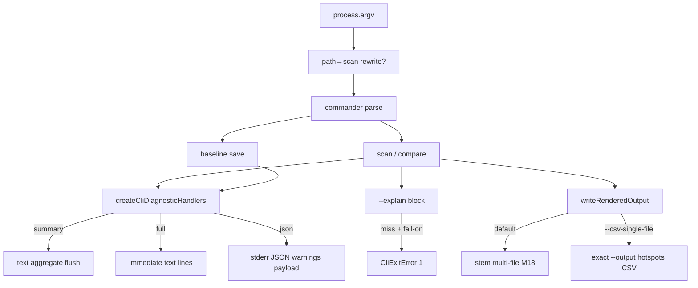

# Milestone 63 — CLI Surface Parity Design

**Spec**: [`.specs/features/cli-surface-parity/spec.md`](./spec.md)  
**Context**: [`.specs/features/cli-surface-parity/context.md`](./context.md)  
**Status**: Planned  

---

## Architecture Overview

Presentation and argv-routing changes concentrated in `bin/`, with a small diagnostics extension for `--warnings=json` and optional pure helpers in `src/report/explain.ts` for miss detection. No pipeline, schema, or ranking changes.



---

## Code Reuse Analysis

| Component | Location | How to Use |
| --------- | -------- | ---------- |
| Diagnostic handlers | `src/diagnostics/logger.ts`, `warning-summary.ts` | Extend `WarningsMode` with `"json"`; flush JSON document |
| Explain formatters | `src/report/explain.ts`, compare explain helpers | Add miss boolean / structured result for fail-on |
| Scan/compare actions | `bin/scan-actions.ts` | Pass quiet/verbose/warnings; optional single-file write branch |
| CLI program | `bin/hotspot-scanner.ts` | Flags, argv rewrite, parseWarningsMode, baseline options |
| Completions | `bin/completion-scripts.ts` | Align zsh/fish to bash; add new flags |
| CSV render | `src/report/csv.ts` / compare CSV | Reuse hotspots / hotspots.new string content; bin chooses write path |
| M38 quiet wiring | existing `executeScan` options | Baseline save adopts same options object |

### Fragile / concerns

| Concern | Mitigation |
| ------- | ---------- |
| Argv rewrite stealing commands | Allowlist subcommands + path heuristics only ([context.md](./context.md)) |
| `meta.warnings` thinning | JSON mode stderr-only; never filter collected warnings |
| CSV default break | Opt-in flag; default path untouched |
| Explain miss false positives | Pure helper from report layer, not brittle stderr sniff alone |
| Completion drift | Tests across three shells |

---

## Components and Interfaces

### 1. Path → scan rewrite

**Location:** `bin/hotspot-scanner.ts` (`runCli` and/or exported `maybeRewritePathToScan(argv): string[]`)

```ts
const KNOWN_COMMANDS = new Set([
  "init", "doctor", "scan", "baseline", "compare", "completion",
]);

function looksLikePathToken(token: string): boolean {
  if (token === "." || token.startsWith("./") || path.isAbsolute(token)) {
    return true;
  }
  try {
    return statSync(token).isDirectory();
  } catch {
    return false;
  }
}

function maybeRewritePathToScan(argv: string[]): string[] {
  if (argv.length <= 2) return argv;
  const first = argv[2]!;
  if (KNOWN_COMMANDS.has(first)) return argv;
  if (first === "-h" || first === "--help" || first === "-V" || first === "--version") {
    return argv;
  }
  if (first.startsWith("-")) return argv;
  if (!looksLikePathToken(first)) return argv;
  return [argv[0]!, argv[1]!, "scan", ...argv.slice(2)];
}
```

Bare `argv.length <= 2` still throws `CliUsageError(help)` before/without rewrite.

### 2. `baseline save` diagnostic options

**Location:** `bin/hotspot-scanner.ts` baseline action

Mirror `scan` / `compare`:

```ts
.option("--quiet", …)
.option("--verbose", …)
.option("--no-progress", …)
```

Pass into `executeScan({ quiet, verbose, noProgress, warningsMode, … })`.

### 3. `--fail-on-explain-miss`

**Location:** bin wiring + `src/report/explain.ts` (and compare explain)

Prefer:

```ts
export function formatExplainBlock(...): { text: string; found: boolean };
// or
export function explainTargetFound(result, target): boolean;
```

After writing explain (or not-found) to stderr:

```ts
if (failOnExplainMiss && !found) throw new CliExitError(1);
```

Validate: if `failOnExplainMiss && explainTarget === undefined` → `CliUsageError`.

### 4. `--warnings=json`

**Location:** `src/diagnostics/warning-summary.ts` + `logger.ts`; parse in bin

```ts
export type WarningsMode = "summary" | "full" | "json";
```

| Mode | Behavior |
| ---- | -------- |
| `summary` | Existing aggregate text flush |
| `full` | Immediate text lines |
| `json` | Buffer → `flushWarnings` writes `JSON.stringify({ warnings: ScanWarning[] }) + "\n"` |

Empty buffer → `{"warnings":[]}`. Quiet skips info before buffer. Update `parseWarningsMode` error string.

### 5. `--csv-single-file`

**Location:** `bin/scan-actions.ts` `writeRenderedOutput` (+ callers)

```ts
if (format === "csv" && csvSingleFile) {
  await validateOutputPath(outputPath!);
  const content = pickSingleFileCsv(bundle); // hotspots.csv or hotspots.new.csv key
  await writeFile(outputPath!, ensureTrailingNewline(content), "utf8");
  return;
}
// else existing writeCsvBundle(deriveCsvStem(...))
```

Flag registration on `scan` and `compare`. Validation before execute:

- csv without output → existing error
- `--csv-single-file` without csv → `CliUsageError`
- missing expected bundle key → `CliUsageError`

### 6. Completions

**Location:** `bin/completion-scripts.ts`

- Extend `SCAN_FLAGS` / bash baseline list with new flags
- Expand zsh `_arguments` and fish `-l` entries to match bash coverage
- Update `--warnings` help text to `summary|full|json`

---

## Data Models

No domain schema changes. Stderr JSON warnings payload (CLI-only):

```ts
interface WarningsJsonPayload {
  warnings: ScanWarning[]; // { code?, message, severity }
}
```

---

## Error Handling

| Case | Exit | Type |
| ---- | ---- | ---- |
| Bare CLI | 2 | `CliUsageError` (help text) |
| Invalid `--warnings` | 2 | `CliUsageError` |
| `--csv-single-file` without csv / missing output | 2 | `CliUsageError` |
| `--fail-on-explain-miss` without `--explain` | 2 | `CliUsageError` |
| Explain miss + fail-on | 1 | `CliExitError` |
| Scan/git failures | 1 | existing |

---

## Testing Strategy

| Layer | Focus |
| ----- | ----- |
| Unit `bin/` | Argv rewrite matrix; baseline flags; fail-on; csv single-file; parseWarningsMode |
| Unit `src/diagnostics/` | json flush payload + empty array + quiet/info |
| Unit `src/report/explain` | found vs miss helper |
| Unit completions | bash/zsh/fish flag substrings |
| Integration (optional) | Fixture scan with `--csv-single-file` writes one file |

Gate: `pnpm build && pnpm test`

---

## Implementation Notes

- Keep reporter pure: single-file is a **write-path** choice in bin, not a new `renderCsv` layout mode (may still pick one key from `CsvBundle`).
- Do not change M18 stem algorithm when flag is off.
- Living docs: README flag table + short path-rewrite note; ARCHITECTURE completion parity sentence.
- ROADMAP/STATE sync is **out of this planning session** per user instruction (Execute session may update when Done).
