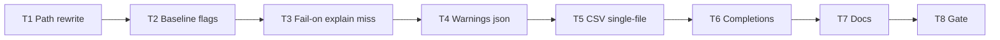

# Milestone 63 — CLI Surface Parity Tasks

**Design**: [`.specs/features/cli-surface-parity/design.md`](./design.md)  
**Spec**: [`.specs/features/cli-surface-parity/spec.md`](./spec.md)  
**Context**: [`.specs/features/cli-surface-parity/context.md`](./context.md)  
**Status**: Planned  
**Note**: Large feature — `bin/` + diagnostics. **Do not Execute in the planning session.** Promote Status → invoke `orchestrator-implementer` in a new session. Do **not** edit ROADMAP/STATE in planning; Execute may sync on Done.

---

## Execution Plan

### Phase 1: Argv + baseline parity (bin)

```
T1 path→scan rewrite → T2 baseline quiet/verbose/no-progress
```

### Phase 2: Explain miss + warnings json + csv single-file

```
T2 → T3 fail-on-explain-miss → T4 warnings=json → T5 csv-single-file
```

(T3–T5 sequential: shared `bin/hotspot-scanner.ts` / `scan-actions.ts`. T4 owns `src/diagnostics/` exclusively.)

### Phase 3: Completions + docs + gate

```
T5 → T6 completions → T7 living docs → T8 project gate
```



### Diagram-Definition Cross-Check

| Task | Depends on (declared) | Diagram shows | Match |
| ---- | --------------------- | ------------- | ----- |
| T1 | None | Root | ✅ |
| T2 | T1 | T1 → T2 | ✅ |
| T3 | T2 | T2 → T3 | ✅ |
| T4 | T3 | T3 → T4 | ✅ |
| T5 | T4 | T4 → T5 | ✅ |
| T6 | T5 | T5 → T6 | ✅ |
| T7 | T6 | T6 → T7 | ✅ |
| T8 | T7 | T7 → T8 | ✅ |

### Path Conflict Check (Check 5)

| Task | Module owner | Paths | Conflict |
| ---- | ------------ | ----- | -------- |
| T1 | bin | `bin/hotspot-scanner.ts`, `bin/hotspot-scanner.test.ts` | Sole early bin argv owner |
| T2 | bin | `bin/hotspot-scanner.ts`, `bin/scan-actions.ts` (if needed), `bin/hotspot-scanner.test.ts` | After T1; sequential |
| T3 | bin + report | `bin/hotspot-scanner.ts`, `src/report/explain.ts` (+ compare explain if separate), co-located tests, `bin/hotspot-scanner.test.ts` | After T2; only T3 touches explain helpers |
| T4 | diagnostics + bin | `src/diagnostics/warning-summary.ts`, `logger.ts`, exports, diagnostics tests; `bin/hotspot-scanner.ts`, `bin/scan-actions.ts`, bin tests | After T3; only T4 touches diagnostics |
| T5 | bin | `bin/scan-actions.ts`, `bin/hotspot-scanner.ts`, bin unit/integration tests | After T4; sequential on bin |
| T6 | bin (completion) | `bin/completion-scripts.ts`, `bin/completion-scripts.test.ts` and/or bin tests | After T5; sequential |
| T7 | docs | `README.md`, `.specs/codebase/ARCHITECTURE.md` (optional recipes) | After T6 |
| T8 | gate | none (verify) | After T7 |

No `[P]` — shared `bin/` ownership; keep sequential.

### Test Co-location Validation

| Task | Code layer | TESTING.md expectation | Task says | Match |
| ---- | ---------- | ---------------------- | --------- | ----- |
| T1 | `bin/` | Unit | unit in same task | ✅ |
| T2 | `bin/` | Unit | unit in same task | ✅ |
| T3 | `bin/` + `src/report/` | Unit | unit in same task | ✅ |
| T4 | `src/diagnostics/` + `bin/` | Unit | unit in same task | ✅ |
| T5 | `bin/` | Unit (+ integration optional) | unit in same task | ✅ |
| T6 | `bin/` | Unit | unit in same task | ✅ |
| T7 | Docs | none | none | ✅ |
| T8 | Full project | Gate | `pnpm build && pnpm test` | ✅ |

### Granularity Check

| Task | Scope | Status |
| ---- | ----- | ------ |
| T1 | Argv rewrite helper + tests | ✅ Cohesive |
| T2 | Baseline diagnostic flags + tests | ✅ Cohesive |
| T3 | Fail-on-explain-miss + miss helper + tests | ✅ Cohesive |
| T4 | WarningsMode json + parse + CLI tests | ✅ Cohesive |
| T5 | csv-single-file write path + tests | ✅ Cohesive |
| T6 | Completion parity three shells | ✅ Granular |
| T7 | Living docs | ✅ Granular |
| T8 | Project gate | ✅ Granular |

### Requirement → Task Mapping

| Requirement ID | Task |
| -------------- | ---- |
| HOTSPOT-1065, HOTSPOT-1066, HOTSPOT-1067, HOTSPOT-1068 | T1 |
| HOTSPOT-1060, HOTSPOT-1061, HOTSPOT-1062, HOTSPOT-1063 | T2 |
| HOTSPOT-1070, HOTSPOT-1071, HOTSPOT-1072, HOTSPOT-1073, HOTSPOT-1074 | T3 |
| HOTSPOT-1075, HOTSPOT-1076, HOTSPOT-1077, HOTSPOT-1078, HOTSPOT-1079, HOTSPOT-1080, HOTSPOT-1081 | T4 |
| HOTSPOT-1082, HOTSPOT-1083, HOTSPOT-1084, HOTSPOT-1085, HOTSPOT-1086, HOTSPOT-1087 | T5 |
| HOTSPOT-1088, HOTSPOT-1089, HOTSPOT-1090, HOTSPOT-1091 | T6 |
| HOTSPOT-1093, HOTSPOT-1094, HOTSPOT-1095 | T7 |
| (gate) | T8 |
| HOTSPOT-1064, HOTSPOT-1069, HOTSPOT-1092, HOTSPOT-1096–1099 | Reserved unused |

---

## Task Breakdown

### T1: Path-like argv → `scan` rewrite

**What**: Implement `maybeRewritePathToScan` (or equivalent) in `runCli` per [context.md](./context.md) / [design.md](./design.md). Bare invocation unchanged (help + exit 2). Cover `.`, `./…`, absolute, existing directory; exclude known subcommands, help/version, flags, non-path tokens.

**Where**: `bin/hotspot-scanner.ts`, `bin/hotspot-scanner.test.ts`

**Depends on**: None

**Reuses**: Existing `runCli` / `CliUsageError` help path; Node `fs`/`path` for directory check

**Requirements**: HOTSPOT-1065, HOTSPOT-1066, HOTSPOT-1067, HOTSPOT-1068

**Done when**:

- [ ] Rewrite matrix tests pass (positive + negative cases)
- [ ] Bare `runCli(["node","hotspot-scanner"])` still throws help `CliUsageError`
- [ ] `hotspot-scanner .` equivalent argv reaches `scan` action with path `.`

**Tests**: Unit — rewrite helper / `runCli` with mocked scan action or parse spy

**Gate**: `pnpm exec vitest run bin/hotspot-scanner.test.ts`

---

### T2: `baseline save` `--quiet` / `--no-progress` / `--verbose`

**What**: Register the three flags on `baseline save` and forward to `executeScan` / diagnostic handlers with scan parity (quiet wins over verbose). Update help text.

**Where**: `bin/hotspot-scanner.ts`, `bin/scan-actions.ts` (only if baseline path needs option plumb), `bin/hotspot-scanner.test.ts`

**Depends on**: T1

**Reuses**: Scan/compare option wiring and `createVerboseSpawnArgvHandler`

**Requirements**: HOTSPOT-1060, HOTSPOT-1061, HOTSPOT-1062, HOTSPOT-1063

**Done when**:

- [ ] Help lists the three flags
- [ ] Tests assert quiet/no-progress/verbose forwarding (mirror scan tests)
- [ ] Existing `--warnings` on baseline save still works

**Tests**: Unit — baseline save action with mocked `runScan`

**Gate**: `pnpm exec vitest run bin/hotspot-scanner.test.ts`

---

### T3: `--fail-on-explain-miss`

**What**: Add boolean CLI flag on `scan` and `compare`. Require `--explain` when set (`CliUsageError`). After explain write, if miss and flag set → `CliExitError(1)`. Default miss remains exit 0. Add pure found/miss helper in report explain layer if needed.

**Where**: `bin/hotspot-scanner.ts`, `src/report/explain.ts` (+ compare explain module if separate), co-located report tests, `bin/hotspot-scanner.test.ts`

**Depends on**: T2

**Reuses**: `formatExplainBlock`, compare explain not-found path, `CliExitError`

**Requirements**: HOTSPOT-1070, HOTSPOT-1071, HOTSPOT-1072, HOTSPOT-1073, HOTSPOT-1074

**Done when**:

- [ ] Default miss still completes without throwing
- [ ] Flag + miss → exit 1 (`CliExitError`)
- [ ] Flag without `--explain` → `CliUsageError`
- [ ] Found target + flag → success
- [ ] Compare miss path covered

**Tests**: Unit — report helper + bin explain miss/found cases

**Gate**: `pnpm exec vitest run src/report/explain.test.ts bin/hotspot-scanner.test.ts`

---

### T4: `--warnings=json` mode

**What**: Extend `WarningsMode` with `"json"`; buffer + flush one `{"warnings":ScanWarning[]}` document to stderr (empty → `{"warnings":[]}`); no human summary/full lines in json mode; keep `meta.warnings` full; update `parseWarningsMode` + help; wire through scan/compare/baseline save.

**Where**: `src/diagnostics/warning-summary.ts`, `src/diagnostics/logger.ts`, `src/diagnostics/index.ts`, diagnostics tests; `bin/hotspot-scanner.ts`, `bin/scan-actions.ts`, `bin/hotspot-scanner.test.ts`

**Depends on**: T3

**Reuses**: `createCliDiagnosticHandlers`, `flushWarnings` lifecycle (respect M61 defer-if-present)

**Requirements**: HOTSPOT-1075–HOTSPOT-1081

**Done when**:

- [ ] Diagnostics unit tests cover json flush, empty array, quiet suppresses info
- [ ] CLI invalid value lists `summary`, `full`, or `json`
- [ ] CLI test: stderr JSON parseable; `meta.warnings` length unchanged vs full mode fixture
- [ ] Default remains `summary`

**Tests**: Unit — diagnostics + bin

**Gate**: `pnpm exec vitest run src/diagnostics bin/hotspot-scanner.test.ts`

---

### T5: `--csv-single-file`

**What**: Add opt-in flag on `scan` and `compare`. Validate requires `--format csv` and `--output`. When set, write hotspots (scan) or hotspots.new (compare) CSV content to the exact `--output` path without stem expansion / meta sidecar. Default path remains `writeCsvBundle(deriveCsvStem)`. Guard missing hotspots section (`CliUsageError`).

**Where**: `bin/scan-actions.ts`, `bin/hotspot-scanner.ts`, `bin/hotspot-scanner.test.ts` (optional integration test)

**Depends on**: T4

**Reuses**: `CsvBundle` keys from `renderCsv` / compare CSV; `validateOutputPath`; `ensureTrailingNewline`

**Requirements**: HOTSPOT-1082–HOTSPOT-1087

**Done when**:

- [ ] Default csv still creates stem files
- [ ] Single-file writes exactly one file at `--output`
- [ ] Missing `--output` / flag without csv → `CliUsageError`
- [ ] Compare single-file writes hotspots.new schema content

**Tests**: Unit — temp dir write assertions; compare branch covered

**Gate**: `pnpm exec vitest run bin/hotspot-scanner.test.ts`

---

### T6: Completion scripts parity (bash / zsh / fish)

**What**: Align zsh and fish long-flag lists with bash `SCAN_FLAGS` (+ baseline subset). Include milestone flags: `--quiet` / `--verbose` / `--no-progress` on baseline; `--fail-on-explain-miss`; `--csv-single-file`; `--warnings` text `summary|full|json`. Extend tests for all three shells.

**Where**: `bin/completion-scripts.ts`, `bin/completion-scripts.test.ts` and/or `bin/hotspot-scanner.test.ts`

**Depends on**: T5 (so flag names are final)

**Reuses**: M54 completion subcommand + test patterns

**Requirements**: HOTSPOT-1088, HOTSPOT-1089, HOTSPOT-1090, HOTSPOT-1091

**Done when**:

- [ ] Representative flags asserted present in bash, zsh, and fish scripts
- [ ] New milestone flags covered by tests
- [ ] `completion <shell>` still exits 0 for valid shells

**Tests**: Unit — script string contains flags

**Gate**: `pnpm exec vitest run bin/completion-scripts.test.ts bin/hotspot-scanner.test.ts`

---

### T7: Living docs + help copy

**What**: Document path→scan rewrite, baseline diagnostic flags, `--fail-on-explain-miss`, `--warnings=json`, `--csv-single-file` in README; note completion parity in ARCHITECTURE CLI section; ensure commander help strings for new flags are clear. **Do not** edit ROADMAP/STATE unless Execute session is syncing Done (planning forbade ROADMAP/STATE edits).

**Where**: `README.md`, `.specs/codebase/ARCHITECTURE.md`; help strings already in bin from prior tasks — verify consistency

**Depends on**: T6

**Reuses**: Existing README flag tables / M58 warnings docs

**Requirements**: HOTSPOT-1093, HOTSPOT-1094, HOTSPOT-1095

**Done when**:

- [ ] README documents all new behaviors
- [ ] ARCHITECTURE mentions keeping zsh/fish aligned with bash
- [ ] Help text reviewed for new flags

**Tests**: None (docs)

**Gate**: none (docs-only); full gate in T8

---

### T8: Project quality gate

**What**: Run full project gate and fix any fallout from T1–T7.

**Where**: none (verify)

**Depends on**: T7

**Reuses**: AGENTS.md quality gate

**Requirements**: (gate)

**Done when**:

- [ ] `pnpm build && pnpm test` passes
- [ ] All T1–T7 Done when checkboxes satisfied
- [ ] Feature `tasks.md` Status may move to Done only after gate (Execute session)

**Tests**: Full suite

**Gate**: `pnpm build && pnpm test`

---

## Parallelism notes

No `[P]` tasks — all implementation tasks share `bin/` or depend on prior bin state. Diagnostics-only work is folded into T4 after prior bin tasks to avoid merge conflicts on `hotspot-scanner.ts`.

---

## Handoff

```
Planning complete for cli-surface-parity.

Artifacts: context.md, spec.md, design.md, tasks.md (Status: Planned)
IDs: HOTSPOT-1060–1099 (active 1060–1063, 1065–1068, 1070–1091, 1093–1095; reserved 1064, 1069, 1092, 1096–1099)
Next step: review tasks.md, promote Status to Approved/Ready for Execute, open a dev session, invoke orchestrator-implementer.
Expected final gate: pnpm build && pnpm test
Note: ROADMAP.md / STATE.md intentionally not updated in this planning session (per user).
```
