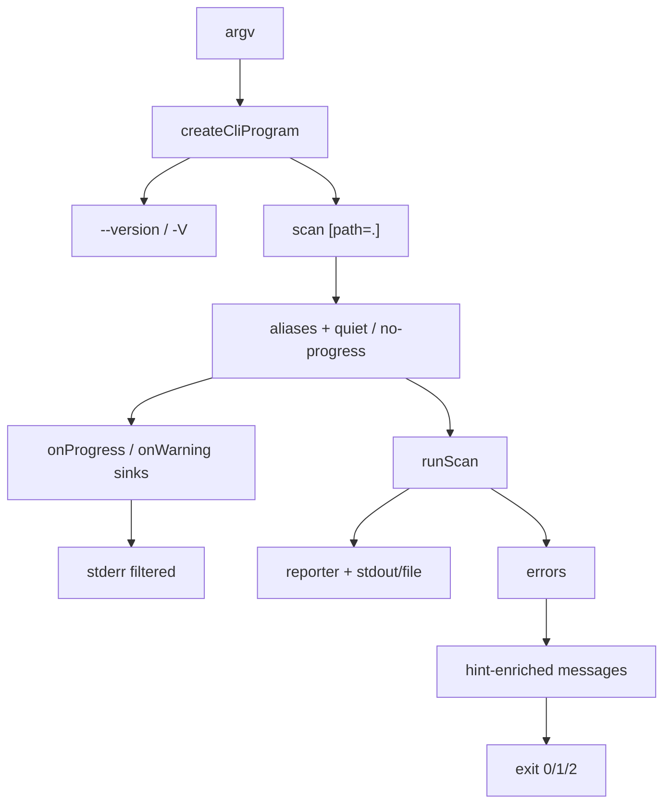

# Milestone 38 — CLI Surface Polish Design (thin)

**Spec**: [`.specs/features/cli-surface-polish/spec.md`](./spec.md)  
**Context**: [`.specs/features/cli-surface-polish/context.md`](./context.md)  
**Status**: Planned  
**Depth:** Medium — thin design; no new pipeline modules.

---

## Architecture Overview

M38 is **commander / diagnostics presentation** only. Domain pipeline (`runScan` → scoring → report) unchanged. Quiet/no-progress filter **callbacks** at the bin boundary (or a tiny diagnostics helper). Hints are string enrichment on known error paths.



**Baseline:** current `bin/hotspot-scanner.ts`, `src/diagnostics/logger.ts`, M18 csv/`CliUsageError`, M30 `--config` / `ConfigError`, M7 `.git` validation.

---

## Code Reuse

| Component                                       | Location                                              | Use                      |
| ----------------------------------------------- | ----------------------------------------------------- | ------------------------ |
| `createCliProgram` / `runCli` / `CliUsageError` | `bin/hotspot-scanner.ts`                              | Primary edit surface     |
| `maybeLogProgress` / `logWarning`               | `src/diagnostics/logger.ts`                           | Wrap or gate from bin    |
| `validateGitRepository`                         | `src/scan.ts`                                         | Hint text (optional)     |
| `ConfigError` missing file                      | `src/config/load-config.ts`                           | Hint text                |
| `validateBaselinePath` / `loadBaseline`         | bin + `src/compare/`                                  | Hints                    |
| `package.json` `version`                        | package root                                          | `--version`              |
| CLI tests                                       | `bin/hotspot-scanner.test.ts`, `.integration.test.ts` | Co-located coverage      |
| Fixture                                         | `tests/fixtures/repos/small-ts/`                      | Default-path integration |

---

## Component notes

### 1. Optional path argument

Change `.argument("<path>", …)` → `.argument("[path]", "Repository path (default: .)", ".")` (or equivalent commander default). Ensure `runCli` empty-argv behavior still shows root help when no subcommand (unchanged).

### 2. Version

`program.version(pkgVersion, "-V, --version")` on root program. Resolve `package.json` relative to package root (works from `dist/bin`).

### 3. Quiet / no-progress

Add boolean options on `scan`. Build sinks:

```text
onProgress: (quiet || noProgress) ? noop : existing maybeLogProgress
onWarning: quiet ? (w => w.severity === "info" ? skip : logWarning(w)) : logWarning
```

Prefer keeping `logger.ts` APIs intact; optional `createCliDiagnosticHandlers({ quiet, noProgress })` in diagnostics if it keeps bin thinner — YAGNI unless bin gets noisy.

### 4. Hints

Append `Hint: …` lines for the four families in context.md. Exit-code mapping in `main` unchanged.

### 5. Help + aliases

Commander `.option("-f, --format <format>", …)` (and `-o`, `-t`, `-g`). `.addHelpText("after", examples)`.

---

## Test Strategy

| Layer                              | Focus                                                                                                            |
| ---------------------------------- | ---------------------------------------------------------------------------------------------------------------- |
| Unit `bin/hotspot-scanner.test.ts` | default path, version, aliases, help examples, quiet/no-progress sinks, hint strings, csv/baseline/config errors |
| Unit `src/diagnostics/*.test.ts`   | only if new helper exported                                                                                      |
| Unit `src/scan` / `src/config`     | only if hint text changed at throw site                                                                          |
| Integration                        | `scan` with no path from `small-ts` cwd; `--quiet` still exits 0 with table/json                                 |

No schema/contract tests. No ranking fixtures.

---

## Risks

| Risk                                                    | Mitigation                                                       |
| ------------------------------------------------------- | ---------------------------------------------------------------- |
| Reading `package.json` from wrong path under `dist/bin` | Resolve via `import.meta.url` → package root; cover in unit test |
| Quiet hides useful warnings                             | Spec keeps `warning`/`error`; only `info` + progress             |
| Path conflict on `bin/` across tasks                    | Sequential bin-owning tasks; diagnostics helper in one task only |
| Accidental config keys                                  | Explicit out of scope; review tasks                              |

---

## Out of Scope (design boundary)

- `--verbose`, init/doctor/dry-run, colors, `--explain`, monorepo detect, npm publish
- JSON contract / formulas / new config keys
