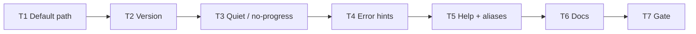

# Milestone 38 — CLI Surface Polish Tasks

**Design**: [`.specs/features/cli-surface-polish/design.md`](./design.md)  
**Spec**: [`.specs/features/cli-surface-polish/spec.md`](./spec.md)  
**Context**: [`.specs/features/cli-surface-polish/context.md`](./context.md)  
**Status**: Done  
**Note**: Medium feature — `bin/` primary. **Do not Execute in the planning session.** Promote Status → invoke `orchestrator-implementer` in a new session.

---

## Execution Plan

### Phase 1: Core CLI surface (Sequential — shared `bin/`)

```
T1 default path → T2 version → T3 quiet/no-progress → T4 error hints → T5 help+aliases
```

### Phase 2: Docs + gate (Sequential)

```
T5 → T6 living docs → T7 project gate
```



### Diagram-Definition Cross-Check

| Task | Depends on (declared) | Diagram shows | Match |
| ---- | --------------------- | ------------- | ----- |
| T1   | None                  | Root          | ✅    |
| T2   | T1                    | T1 → T2       | ✅    |
| T3   | T2                    | T2 → T3       | ✅    |
| T4   | T3                    | T3 → T4       | ✅    |
| T5   | T4                    | T4 → T5       | ✅    |
| T6   | T5                    | T5 → T6       | ✅    |
| T7   | T6                    | T6 → T7       | ✅    |

### Path Conflict Check (Check 5)

| Task | Module owner                     | Paths                                                                                                                                             | Conflict                                                               |
| ---- | -------------------------------- | ------------------------------------------------------------------------------------------------------------------------------------------------- | ---------------------------------------------------------------------- |
| T1   | bin                              | `bin/hotspot-scanner.ts`, `bin/hotspot-scanner.test.ts`, `bin/hotspot-scanner.integration.test.ts`                                                | Sequential before later bin tasks                                      |
| T2   | bin                              | `bin/hotspot-scanner.ts`, `bin/hotspot-scanner.test.ts`                                                                                           | After T1                                                               |
| T3   | bin (+ diagnostics if helper)    | `bin/hotspot-scanner.ts`, `bin/*.test.ts`, optional `src/diagnostics/logger.ts` + test                                                            | After T2; only T3 may touch diagnostics                                |
| T4   | bin (+ scan/config message text) | `bin/hotspot-scanner.ts`, `bin/*.test.ts`; optional `src/scan.ts`, `src/config/load-config.ts`, `src/compare/load-baseline.ts` + their unit tests | After T3; hint-only string changes — no parallel with other src owners |
| T5   | bin                              | `bin/hotspot-scanner.ts`, `bin/hotspot-scanner.test.ts`                                                                                           | After T4                                                               |
| T6   | docs                             | `README.md`, `.specs/codebase/ARCHITECTURE.md`, `.specs/project/ROADMAP.md`, `.specs/project/STATE.md`                                            | After T5; no `[P]` with bin                                            |
| T7   | gate                             | none (verify)                                                                                                                                     | After T6                                                               |

No `[P]` — all tasks share `bin/` or depend on prior bin state.

### Test Co-location Validation

| Task | Code layer                                       | TESTING.md expectation | Task says                       | Match |
| ---- | ------------------------------------------------ | ---------------------- | ------------------------------- | ----- |
| T1   | `bin/`                                           | Unit + integration     | unit + integration in same task | ✅    |
| T2   | `bin/`                                           | Unit                   | unit in same task               | ✅    |
| T3   | `bin/` (+ optional diagnostics)                  | Unit                   | unit in same task               | ✅    |
| T4   | `bin/` (+ optional scan/config/compare messages) | Unit                   | unit in same task               | ✅    |
| T5   | `bin/`                                           | Unit                   | unit in same task               | ✅    |
| T6   | Docs                                             | none                   | none                            | ✅    |
| T7   | Full project                                     | Gate                   | `pnpm build && pnpm test`       | ✅    |

### Granularity Check

| Task | Scope                                    | Status      |
| ---- | ---------------------------------------- | ----------- |
| T1   | Optional path default + validation tests | ✅ Cohesive |
| T2   | Version wiring + tests                   | ✅ Granular |
| T3   | Quiet / no-progress sinks + tests        | ✅ Cohesive |
| T4   | Four hint families + tests               | ✅ Cohesive |
| T5   | Help examples + four aliases + tests     | ✅ Cohesive |
| T6   | Docs sync                                | ✅ Granular |
| T7   | Project gate                             | ✅ Granular |

### Requirement → Task Mapping

| Requirement ID                                     | Task |
| -------------------------------------------------- | ---- |
| HOTSPOT-450, HOTSPOT-451                           | T1   |
| HOTSPOT-452                                        | T2   |
| HOTSPOT-453, HOTSPOT-454                           | T3   |
| HOTSPOT-455, HOTSPOT-456, HOTSPOT-457, HOTSPOT-458 | T4   |
| HOTSPOT-459, HOTSPOT-460                           | T5   |
| HOTSPOT-461                                        | T6   |
| (gate)                                             | T7   |

---

## Task Breakdown

### T1: Default optional scan path = `.`

**What**: Make `scan` path argument optional with default `.`. Keep `.git` validation via existing `runScan` / `validateGitRepository`. Update unit + integration tests (including scan with no path from `small-ts` cwd).

**Where**: `bin/hotspot-scanner.ts`, `bin/hotspot-scanner.test.ts`, `bin/hotspot-scanner.integration.test.ts`

**Depends on**: None

**Reuses**: [design.md](./design.md) § Optional path; [context.md](./context.md) § Default scan path; `tests/fixtures/repos/small-ts/`

**Requirement**: HOTSPOT-450, HOTSPOT-451

**Module owner**: bin

**Tools**:

- MCP: NONE
- Skill: `vitals-cli-validation`

**Done when**:

- [x] `scan` without path uses `repoPath === "."` (or resolved equivalent)
- [x] Explicit path still honored
- [x] Non-git `.` fails non-zero (existing validation)
- [x] `scan --help` documents optional path / default `.`
- [x] Integration: from `small-ts` directory, `scan` with no path exits `0`
- [x] Gate check passes: `pnpm exec vitest run bin/hotspot-scanner.test.ts bin/hotspot-scanner.integration.test.ts`

**Tests**: unit + integration (CLI)

**Gate**: `pnpm exec vitest run bin/hotspot-scanner.test.ts bin/hotspot-scanner.integration.test.ts`

**Commit**: `feat(cli): default scan path to cwd`

---

### T2: `--version` / `-V` from package.json

**What**: Wire root program `--version` / `-V` to `package.json` `"version"`. Ensure version path resolves correctly for compiled bin. Unit-test printed version string.

**Where**: `bin/hotspot-scanner.ts`, `bin/hotspot-scanner.test.ts`

**Depends on**: T1

**Reuses**: [context.md](./context.md) § Version; commander `program.version`; root `package.json`

**Requirement**: HOTSPOT-452

**Module owner**: bin

**Tools**:

- MCP: NONE
- Skill: `vitals-cli-validation`

**Done when**:

- [x] `hotspot-scanner --version` and `-V` print package version and exit `0`
- [x] Scan does not run for version-only invocation
- [x] Unit test asserts version matches `package.json`
- [x] Gate check passes: `pnpm exec vitest run bin/hotspot-scanner.test.ts`

**Tests**: unit (CLI)

**Gate**: `pnpm exec vitest run bin/hotspot-scanner.test.ts`

**Commit**: `feat(cli): add --version from package.json`

---

### T3: `--quiet` and `--no-progress`

**What**: Add `--quiet` and `--no-progress` on `scan`. Wire `onProgress` / `onWarning` so quiet suppresses progress + `info` severity; no-progress suppresses progress only; warning/error and reports remain. Optional tiny diagnostics helper only if it keeps bin clear. Unit tests with stderr spies or injected sinks.

**Where**: `bin/hotspot-scanner.ts`, `bin/hotspot-scanner.test.ts`; optional `src/diagnostics/logger.ts`, `src/diagnostics/logger.test.ts`

**Depends on**: T2

**Reuses**: [context.md](./context.md) § Quiet / no-progress; `maybeLogProgress`, `logWarning`

**Requirement**: HOTSPOT-453, HOTSPOT-454

**Module owner**: bin (diagnostics secondary)

**Tools**:

- MCP: NONE
- Skill: `coding-guidelines`

**Done when**:

- [x] `--no-progress` emits no progress lines
- [x] `--quiet` emits no progress and no `info` warnings; still emits `warning`/`error`
- [x] Successful scan still writes report (stdout or `--output`)
- [x] Hard errors still print under `--quiet`
- [x] Default (no flags) matches pre-M38 stderr behavior
- [x] Gate check passes: `pnpm exec vitest run bin/hotspot-scanner.test.ts src/diagnostics/logger.test.ts` (omit diagnostics path if untouched)

**Tests**: unit (CLI; diagnostics if modified)

**Gate**: `pnpm exec vitest run bin/hotspot-scanner.test.ts` (plus diagnostics test file if changed)

**Commit**: `feat(cli): add --quiet and --no-progress`

---

### T4: Actionable hints for common CLI errors

**What**: Enrich user-facing messages for: non-git repo path; `--format csv` without `--output`; missing/directory/invalid `--baseline`; missing explicit `--config` file. Preserve exit codes. Unit-test hint substrings.

**Where**: `bin/hotspot-scanner.ts`, `bin/hotspot-scanner.test.ts`; optional hint text in `src/scan.ts` (`validateGitRepository`), `src/config/load-config.ts`, `src/compare/load-baseline.ts` + matching unit tests

**Depends on**: T3

**Reuses**: [context.md](./context.md) § Error hints; existing `CliUsageError` / `ConfigError` / `BaselineError`

**Requirement**: HOTSPOT-455, HOTSPOT-456, HOTSPOT-457, HOTSPOT-458

**Module owner**: bin (scan/config/compare message-only secondary)

**Tools**:

- MCP: NONE
- Skill: `vitals-cli-validation`

**Done when**:

- [x] Non-git error includes actionable hint
- [x] CSV without `--output` error includes `--output` hint
- [x] Missing/directory baseline errors include re-scan / JSON baseline hint
- [x] Invalid baseline content error includes contract / re-scan hint
- [x] Missing `--config` file `ConfigError` includes path-must-exist hint
- [x] Exit codes unchanged (usage/config → 2; baseline/other → 1)
- [x] Gate check passes: targeted vitest for touched files

**Tests**: unit (CLI + any touched src unit tests)

**Gate**: `pnpm exec vitest run bin/hotspot-scanner.test.ts` (+ `src/scan.test.ts` / `src/config/load-config.test.ts` / `src/compare/load-baseline.test.ts` if modified)

**Commit**: `fix(cli): add actionable hints for common errors`

---

### T5: `scan --help` examples + short aliases

**What**: Add Examples help text on `scan`. Add short aliases `-f`/`-o`/`-t`/`-g` for format/output/top/granularity; keep long flags. Unit-test help contents and alias parsing.

**Where**: `bin/hotspot-scanner.ts`, `bin/hotspot-scanner.test.ts`

**Depends on**: T4

**Reuses**: [context.md](./context.md) § Help examples / Short aliases; commander `addHelpText`

**Requirement**: HOTSPOT-459, HOTSPOT-460

**Module owner**: bin

**Tools**:

- MCP: NONE
- Skill: `vitals-cli-validation`

**Done when**:

- [x] `scan --help` includes Examples block (≥3 examples: cwd, JSON+output, aliases; baseline optional)
- [x] `-f`, `-o`, `-t`, `-g` accepted and equivalent to long flags
- [x] Long flags still work
- [x] Help lists short+long forms
- [x] Gate check passes: `pnpm exec vitest run bin/hotspot-scanner.test.ts`

**Tests**: unit (CLI)

**Gate**: `pnpm exec vitest run bin/hotspot-scanner.test.ts`

**Commit**: `feat(cli): add help examples and short aliases`

---

### T6: Living docs sync

**What**: Update README flags/usage for default path, `--version`/`-V`, `--quiet`, `--no-progress`, aliases, and hint UX note. Update ARCHITECTURE CLI flags bullet (no new config keys). On Execute Done only: mark ROADMAP M38 checkboxes `[x]` and STATE Active note — **not** during this planning session.

**Where**: `README.md`, `.specs/codebase/ARCHITECTURE.md`, `.specs/project/ROADMAP.md`, `.specs/project/STATE.md`

**Depends on**: T5

**Reuses**: [spec.md](./spec.md) P2; [context.md](./context.md)

**Requirement**: HOTSPOT-461

**Module owner**: docs

**Tools**:

- MCP: NONE
- Skill: NONE

**Done when**:

- [x] README documents optional path default `.`, version, quiet/no-progress, aliases
- [x] ARCHITECTURE lists new CLI-only flags; no quiet/version config keys
- [x] ROADMAP M38 implementation checkboxes marked `[x]` when Execute finishes
- [x] STATE records M38 Execute complete when Execute finishes

**Tests**: none

**Gate**: docs review (final gate in T7)

**Commit**: `docs(cli): document M38 surface polish`

---

### T7: Project gate

**What**: Run full project gate. Confirm no schema/ranking drift. Mark feature tasks Complete only after green gate.

**Where**: repo root (verify only)

**Depends on**: T6

**Reuses**: [AGENTS.md](../../../AGENTS.md) quality gate; [TESTING.md](../../codebase/TESTING.md)

**Requirement**: (all) gate

**Module owner**: gate

**Tools**:

- MCP: NONE
- Skill: NONE
- Agent (dev session): `verifier-quality-gates`

**Done when**:

- [x] `pnpm build && pnpm test` passes
- [x] No intentional JSON contract / formula changes in the diff
- [x] `tasks.md` Status → Done (Execute session only)

**Tests**: full suite

**Gate**: `pnpm build && pnpm test`

**Commit**: none (verification only) — or include in final docs commit if needed

---

## Parallel Execution Map

```
Phase 1 (Sequential — bin path conflict):
  T1 → T2 → T3 → T4 → T5

Phase 2 (Sequential):
  T5 → T6 → T7
```

**No `[P]` tasks** — Check 5: shared `bin/hotspot-scanner.ts`.

---

## Handoff (planning complete)

```
Planejamento concluído para cli-surface-polish.

Artefatos: spec.md, context.md, design.md, tasks.md (Status: Planned)
IDs: HOTSPOT-450–461 (462–469 reserved)
Próximo passo: revisar tasks.md, promover Status para Approved/Ready for Execute,
abrir sessão de dev e invocar orchestrator-implementer.
Gate final esperado: pnpm build && pnpm test
```
