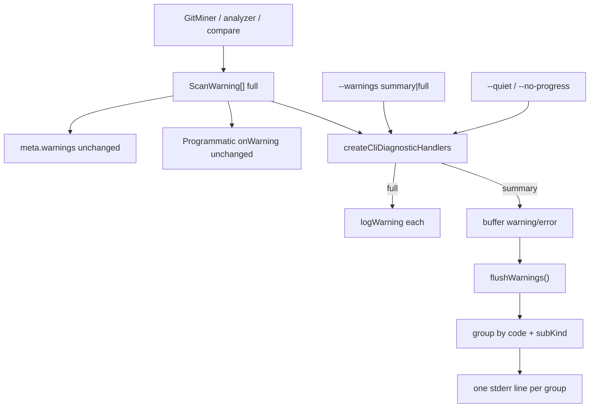

# Milestone 58 — CLI Warnings Mode Design

**Spec**: [`.specs/features/cli-warnings-mode/spec.md`](./spec.md)  
**Context**: [`.specs/features/cli-warnings-mode/context.md`](./context.md)  
**Status**: Planned  

---

## Architecture Overview

Presentation-only change: the pipeline keeps emitting full `ScanWarning[]`. The CLI diagnostic sink optionally **buffers** warning/error lines and **flushes** aggregated stderr after the command’s warning emission is complete.



**SoT for product scans:** `src/git/index.ts` + `src/git/rename-warnings.ts` (file mode). Do not revive function-churn warning paths for M58.

---

## Code Reuse Analysis

| Component | Location | How to Use |
| --------- | -------- | ---------- |
| CLI diagnostic handlers | `src/diagnostics/logger.ts` | Extend options + return `flushWarnings` |
| Rename formatters / next-step strings | `src/git/rename-warnings.ts` | Prefix classification for sub-kinds; reuse next-step constants (export if needed for summary templates) |
| Enum parse + `CliUsageError` | `bin/hotspot-scanner.ts` | Mirror `parseFormat` → `parseWarningsMode` |
| Scan/compare wiring | `bin/scan-actions.ts` | Pass `warningsMode`; call `flushWarnings` |
| Quiet/progress | existing `CliDiagnosticOptions` | Keep; compose with `warningsMode` |
| Verbose git argv | `createVerboseSpawnArgvHandler` | Untouched (M51) |
| Exec summary | `src/report/summary.ts` | Leave as-is |
| Completion flag list | `bin/completion-scripts.ts` | Add `--warnings` |

### Fragile / concerns

| Concern | Mitigation |
| ------- | ---------- |
| Warning code stability ([CONCERNS.md](../../codebase/CONCERNS.md)) | No new codes; no message-prefix churn without tests |
| Dual emit (onWarning + meta) | Aggregation only in CLI sink; never filter `collectedWarnings` |
| Compare late warnings | Flush **after** compare `meta.warnings` loop |
| Function-churn leftovers | Explicitly out of wiring; file miner SoT |

---

## Components and Interfaces

### 1. `WarningsMode` + parse

**Location:** `bin/hotspot-scanner.ts` (parse) and optionally re-export type from `src/diagnostics/` if the sink wants a shared type.

```ts
type WarningsMode = "summary" | "full";

function parseWarningsMode(value: string): WarningsMode {
  if (value === "summary" || value === "full") return value;
  throw new CliUsageError(
    `Invalid --warnings: ${value}. Expected summary or full.`,
  );
}
```

Default when flag omitted: `"summary"`.

### 2. Extended `createCliDiagnosticHandlers`

**Location:** `src/diagnostics/logger.ts`

```ts
export interface CliDiagnosticOptions {
  quiet?: boolean;
  noProgress?: boolean;
  warningsMode?: WarningsMode; // default "summary"
}

export function createCliDiagnosticHandlers(options?: CliDiagnosticOptions): {
  onProgress: (progress: ScanProgress) => void;
  onWarning: (warning: ScanWarning) => void;
  flushWarnings: () => void;
};
```

**Behavior:**

| Mode | `onWarning` | `flushWarnings` |
| ---- | ----------- | --------------- |
| `full` | Existing quiet-aware `logWarning` immediately | no-op |
| `summary` | Buffer `warning`/`error` (skip `info` when quiet; when not quiet, buffer or pass-through info — prefer buffer+aggregate info by code too for consistency) | Group buffer → write one stderr line per group → clear |

**Classification helper** (same file or `src/diagnostics/warning-summary.ts`):

```ts
type WarningSubKind =
  | "ambiguous"
  | "unlinked"
  | "since-truncation"
  | "default";

function classifyWarning(w: ScanWarning): { code: string; subKind: WarningSubKind };
```

For `RENAME_HISTORY_INCOMPLETE`, match message prefixes from `formatAmbiguousRenameWarnings` / `formatUnlinkedRenameWarnings` / `formatSinceTruncationWarning`. Treat `... and N more suspected unlinked` as `unlinked`. Other codes → `subKind: "default"`.

**Summary line templates (lock):**

- Rename ambiguous:  
  `warning: Rename history may be incomplete for N path(s). Next step: verify rename detection or widen --since to capture more history.`
- Rename unlinked:  
  `warning: Suspected unlinked rename (no git rename metadata): N pair(s). Next step: ensure git records renames (-M is enabled) or widen --since to capture earlier history.`
- Rename since-truncation: prefer original single message (count usually 1); if aggregated, keep same next-step.
- Other codes with N>1:  
  `warning: N CODE: <short gist from first message or stable phrase>.`  
  Prefer including `code` in the line for greppability when collapsing non-rename codes. Exact wording implementer discretion within tests; must include **count** and **code**.
- N===1 non-rename: emit original `logWarning(warning)` text unchanged.

Severity prefix: keep `SEVERITY_PREFIX` (`warning:` / `error:`). If a group mixes severities (unlikely), use the highest (`error` > `warning`).

### 3. Bin / scan-actions wiring

**Location:** `bin/scan-actions.ts`, `bin/hotspot-scanner.ts`

1. Extend `ScanDiagnosticOptions` with `warningsMode?: WarningsMode`.
2. Pass into `createCliDiagnosticHandlers`.
3. After `runScan` in `executeScan`: `flushWarnings()`.
4. In `executeCompareAndRender`: after compare warning loop, `flushWarnings()` (single flush covering scan + compare diagnostics).
5. Commander: `.option("--warnings <mode>", "…", "summary")` on `scan`, `compare`, and `baseline save` (or shared option builder).
6. Parse with `parseWarningsMode` when option present; default string `"summary"` from commander.

**Do not** pass `warningsMode` into `runScan` / `ScanOptions` — keep it CLI presentation-only (like quiet handlers today).

### 4. Docs / completion

Update README flag tables, Advanced diagnostics prose, `docs/warning-codes.md` (stderr modes), `docs/recipes.md` (quiet CI + `--warnings=full` when debugging renames), `bin/completion-scripts.ts` flag string, ARCHITECTURE diagnostics note.

---

## Data Flow (ordering)

```
executeScan:
  handlers = createCliDiagnosticHandlers({ quiet, noProgress, warningsMode })
  result = await runScan({ onWarning: handlers.onWarning, … })
  handlers.flushWarnings()
  return result

executeCompareAndRender:
  handlers = …
  result = await runScan({ onWarning })
  compareResult = compare…
  for (w of compareResult.meta.warnings) onWarning(w)
  handlers.flushWarnings()
  render / write
```

Under `summary`, operators see aggregated stderr **after** the scan work completes and **before** or **after** report write — prefer flush **before** report write so warnings still appear above the Hotspots table when stdout is the TTY (match mental model: diagnostics then report). Today warnings stream during scan; summary delays them until flush. Document this intentional ordering change for summary mode.

**Locked ordering:** `flushWarnings()` **before** `writeRenderedOutput` / stdout report in compare path; for scan action in bin, flush inside `executeScan` before return so the caller prints the report afterward — warnings appear first. Confirm bin scan path: `executeScan` then render — yes, flush at end of `executeScan` keeps warnings before report.

---

## Test Plan

| Layer | Focus |
| ----- | ----- |
| Unit `src/diagnostics/` | classify + summary lines; full vs summary; quiet+full; flush idempotency; empty buffer |
| Unit `bin/` | `parseWarningsMode`; invalid → CliUsageError; flag forwarded; quiet+warnings composition; JSON meta.warnings length unchanged across modes (mocked runScan returning many rename warnings) |
| Unit rename (optional) | No change required if miner untouched; regression that formatters still produce per-path messages for meta |
| Integration (optional light) | Fixture with renames: default stderr line count ≪ full |

**Gate:** per-task vitest paths; final `pnpm build && pnpm test`.

---

## Risks

| Risk | Mitigation |
| ---- | ---------- |
| Message-prefix classification brittle | Co-locate tests with exact prefixes from formatters; export shared prefix constants if needed |
| Double flush / missing flush | Single ownership in scan-actions; tests assert one summary block |
| Users surprised by delayed stderr under summary | Docs note; full mode restores immediate lines |
| Accidental meta thinning | Explicit regression tests on `meta.warnings` |

---

## Implementation Notes (Execute)

- YAGNI: no `warnings` config key; no schema edit; no new warning codes.
- Prefer small helper module under `src/diagnostics/` if `logger.ts` grows past readability.
- Completion + help in same bin task wave as flag parse to avoid drift.
