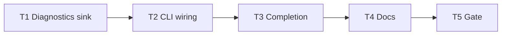

# Milestone 58 — CLI Warnings Mode Tasks

**Design**: [`.specs/features/cli-warnings-mode/design.md`](./design.md)  
**Spec**: [`.specs/features/cli-warnings-mode/spec.md`](./spec.md)  
**Context**: [`.specs/features/cli-warnings-mode/context.md`](./context.md)  
**Status**: Done  
**Note**: Large feature — diagnostics + bin. Execute complete (T1–T5).

---

## Execution Plan

### Phase 1: Diagnostic sink (foundation)

```
T1 summary classifier + handlers + unit tests
```

### Phase 2: CLI wiring

```
T1 → T2 parse flag + scan-actions flush + CLI tests
```

### Phase 3: Docs + completion + gate

```
T2 → T3 completion → T4 living docs → T5 project gate
```



### Diagram-Definition Cross-Check

| Task | Depends on (declared) | Diagram shows | Match |
| ---- | --------------------- | ------------- | ----- |
| T1   | None                  | Root          | ✅    |
| T2   | T1                    | T1 → T2       | ✅    |
| T3   | T2                    | T2 → T3       | ✅    |
| T4   | T3                    | T3 → T4       | ✅    |
| T5   | T4                    | T4 → T5       | ✅    |

### Path Conflict Check (Check 5)

| Task | Module owner     | Paths                                                                                                                                                     | Conflict                                          |
| ---- | ---------------- | --------------------------------------------------------------------------------------------------------------------------------------------------------- | ------------------------------------------------- |
| T1   | diagnostics      | `src/diagnostics/logger.ts` (+ optional `warning-summary.ts`), `src/diagnostics/logger.test.ts` (+ optional new test), `src/diagnostics/index.ts` exports | Sole diagnostics owner                            |
| T2   | bin              | `bin/hotspot-scanner.ts`, `bin/scan-actions.ts`, `bin/hotspot-scanner.test.ts`                                                                            | After T1; only T2 may touch scan-actions handlers |
| T3   | bin (completion) | `bin/completion-scripts.ts`, `bin/completion-scripts.test.ts` and/or `bin/hotspot-scanner.test.ts`                                                        | After T2; sequential on bin                       |
| T4   | docs             | `README.md`, `docs/warning-codes.md`, `docs/recipes.md`, `.specs/codebase/ARCHITECTURE.md`; Execute may tick ROADMAP/STATE Done                           | After T3                                          |
| T5   | gate             | none (verify)                                                                                                                                             | After T4                                          |

No `[P]` — T3 shares `bin/` with T2; keep sequential.

### Test Co-location Validation

| Task | Code layer         | TESTING.md expectation | Task says                 | Match |
| ---- | ------------------ | ---------------------- | ------------------------- | ----- |
| T1   | `src/diagnostics/` | Unit                   | unit in same task         | ✅    |
| T2   | `bin/`             | Unit                   | unit in same task         | ✅    |
| T3   | `bin/`             | Unit                   | unit in same task         | ✅    |
| T4   | Docs               | none                   | none                      | ✅    |
| T5   | Full project       | Gate                   | `pnpm build && pnpm test` | ✅    |

### Granularity Check

| Task | Scope                                 | Status             |
| ---- | ------------------------------------- | ------------------ |
| T1   | Aggregation + flush API + unit tests  | ✅ Cohesive module |
| T2   | Flag parse + wire + flush + CLI tests | ✅ Cohesive bin    |
| T3   | Completion `--warnings`               | ✅ Granular        |
| T4   | Living docs                           | ✅ Granular        |
| T5   | Project gate                          | ✅ Granular        |

### Requirement → Task Mapping

| Requirement ID                                                                            | Task              |
| ----------------------------------------------------------------------------------------- | ----------------- |
| HOTSPOT-955, HOTSPOT-956, HOTSPOT-957, HOTSPOT-958                                        | T1                |
| HOTSPOT-950, HOTSPOT-951, HOTSPOT-952, HOTSPOT-953, HOTSPOT-954, HOTSPOT-959, HOTSPOT-962 | T2                |
| HOTSPOT-961                                                                               | T3                |
| HOTSPOT-960                                                                               | T4                |
| (gate)                                                                                    | T5                |
| HOTSPOT-963–969                                                                           | Reserved — unused |

---

## Task Breakdown

### T1: Warning summary sink in diagnostics

**What**: Extend `createCliDiagnosticHandlers` with `warningsMode` (default `"summary"`) and `flushWarnings()`. Implement `(code, subKind)` classification for `RENAME_HISTORY_INCOMPLETE` (ambiguous / unlinked / since-truncation) and default grouping for other codes. Summary: one stderr line per group with count + next-step; full: immediate `logWarning` (flush no-op). Honor existing quiet rules for `info`. Do **not** change git miner or `meta.warnings` construction. Export any new symbols from `src/diagnostics/index.ts`.

**Where**: `src/diagnostics/logger.ts` (and optional `src/diagnostics/warning-summary.ts`); `src/diagnostics/logger.test.ts` (+ optional co-located new test); `src/diagnostics/index.ts`

**Depends on**: None

**Reuses**: `logWarning`, `SEVERITY_PREFIX`, quiet/noProgress behavior; message prefixes / next-step text from `src/git/rename-warnings.ts` (import or duplicate minimal prefix constants — prefer importing/exporting shared next-step or prefix helpers without changing miner emit behavior)

**Done when**:

- [x] `warningsMode: "summary"` buffers warning/error; `flushWarnings()` emits aggregated lines then clears
- [x] Multiple ambiguous-path warnings → one summary line with count
- [x] Multiple unlinked warnings → one summary line with total pair count (not 5 samples)
- [x] `warningsMode: "full"` logs each warning immediately; flush is no-op
- [x] Quiet still suppresses `info`; warning/error still flush/log per mode
- [x] Empty buffer flush emits nothing
- [x] Unit tests cover classify + summary/full + quiet composition + idempotent second flush

**Tests**: Unit in `src/diagnostics/*.test.ts` (same task)

**Gate**: `pnpm exec vitest run src/diagnostics/` — PASS (34 tests)

**Requirements**: HOTSPOT-955, HOTSPOT-956, HOTSPOT-957, HOTSPOT-958

---

### T2: CLI `--warnings` + flush wiring

**What**: Add `parseWarningsMode`, Commander `--warnings <mode>` (default `summary`) on `scan`, `compare`, and `baseline save`. Extend `ScanDiagnosticOptions` / `executeScan` / `executeCompareAndRender` to pass `warningsMode` and call `flushWarnings()` after warning emission (compare: after compare `meta.warnings` loop; before report write). Invalid value → `CliUsageError` exit 2. Help text documents values + default. Regression: mocked scan with many rename warnings — `meta.warnings` length identical under summary vs full; stderr aggregated under default/summary; full expands; `--quiet` + `--warnings=full` composition; `--verbose` does not expand warnings.

**Where**: `bin/hotspot-scanner.ts`, `bin/scan-actions.ts`, `bin/hotspot-scanner.test.ts`

**Depends on**: T1

**Reuses**: `parseFormat` pattern; `createCliDiagnosticHandlers`; existing quiet/verbose CLI tests as templates

**Done when**:

- [x] Default (no flag) ≡ summary
- [x] `--warnings full|summary` accepted; invalid → `CliUsageError` listing allowed values
- [x] `scan` / `compare` / `baseline save` forward mode and flush
- [x] JSON/`meta.warnings` completeness regression under both modes
- [x] Quiet + full / verbose interaction tests pass
- [x] Help mentions `--warnings` and default `summary`

**Tests**: Unit in `bin/hotspot-scanner.test.ts` (same task)

**Gate**: `pnpm exec vitest run bin/hotspot-scanner.test.ts src/diagnostics/` — PASS (215 tests)

**Requirements**: HOTSPOT-950, HOTSPOT-951, HOTSPOT-952, HOTSPOT-953, HOTSPOT-954, HOTSPOT-959, HOTSPOT-962

---

### T3: Completion scripts include `--warnings`

**What**: Add `--warnings` to static bash/zsh/fish completion flag lists for scan/compare (and shared baseline save flags as applicable). Unit assert scripts contain `--warnings`.

**Where**: `bin/completion-scripts.ts`; `bin/completion-scripts.test.ts` and/or `bin/hotspot-scanner.test.ts`

**Depends on**: T2

**Reuses**: M54 completion string constant pattern

**Done when**:

- [x] All three shell scripts include `--warnings`
- [x] Unit coverage updated

**Tests**: Unit (same task)

**Gate**: `pnpm exec vitest run bin/completion-scripts.test.ts bin/hotspot-scanner.test.ts` — PASS (181 tests)

**Requirements**: HOTSPOT-961

---

### T4: Living docs

**What**: Document `--warnings summary|full` (default summary), stderr-only aggregation, JSON/`onWarning` remain full, quiet/verbose interaction, and when to use `full` (debug renames). Update README flag tables + Advanced diagnostics; `docs/warning-codes.md`; `docs/recipes.md`; ARCHITECTURE diagnostics note. On Execute Done, tick ROADMAP M58 checkboxes and STATE Active/decision row (planner already added Planned milestone).

**Where**: `README.md`, `docs/warning-codes.md`, `docs/recipes.md`, `.specs/codebase/ARCHITECTURE.md` (+ ROADMAP/STATE Done sync at Execute completion)

**Depends on**: T3

**Reuses**: M45/M51 docs tone; no user-facing milestone jargon beyond stable flag names

**Done when**:

- [x] README documents flag, default, full opt-in, quiet/verbose composition, JSON unchanged
- [x] `docs/warning-codes.md` describes summary vs full stderr presentation
- [x] Recipes mention `--warnings=full` for rename debugging (and default summary)
- [x] ARCHITECTURE notes CLI stderr summary sink (presentation-only)
- [x] No config key invented

**Tests**: none (docs)

**Gate**: none beyond review (full gate in T5)

**Requirements**: HOTSPOT-960

---

### T5: Project quality gate

**What**: Run full project gate; fix fallout from T1–T4. Propose Conventional Commit message (do not commit unless user asks). Mark feature tasks Complete + ROADMAP/STATE Done when green.

**Where**: repo root (verify only)

**Depends on**: T4

**Reuses**: [TESTING.md](../../codebase/TESTING.md) gate

**Done when**:

- [x] `pnpm build && pnpm test` exits 0
- [x] Coverage thresholds met for touched `src/diagnostics/` and `bin/` files
- [x] Commit message proposed (e.g. `feat(cli): add --warnings summary|full defaulting to summary`)

**Tests**: full suite via gate

**Gate**: `pnpm build && pnpm test` — PASS (58 files, 795 tests; diagnostics 97.39% stmts)

**Requirements**: (final verification for HOTSPOT-950–962)

---

## Parallelism notes

- No `[P]` tasks — bin/docs sequential after diagnostics foundation.
- Implementer routing: T1 → diagnostics; T2–T3 → bin; T4 → docs; T5 → verifier-quality-gates / orchestrator Phase E.

## Handoff

Execute complete (T1–T5). Feature Status: **Done**. ROADMAP M58 / STATE synced.
