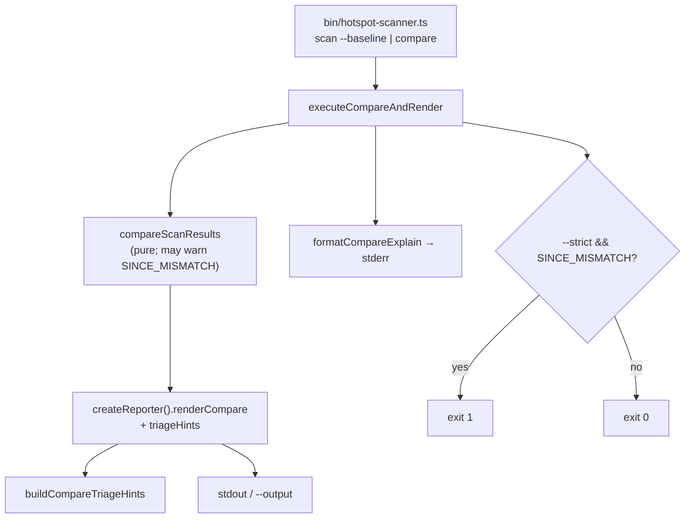

# Milestone 53 — Compare Interpretation Design

**Spec**: [`.specs/features/compare-interpretation/spec.md`](./spec.md)  
**Context**: [`.specs/features/compare-interpretation/context.md`](./context.md)  
**Status**: Done  
**Depth**: Medium

---

## Architecture Overview

M53 is a **reporter + CLI** feature. `compareScanResults` stays warn-and-continue for `COMPARE_SINCE_MISMATCH`. New pure helpers under `src/report/` build compare triage and compare explain. `createReporter().renderCompare` gains triage (honoring `triageHints`). Bin / `executeCompareAndRender` wire `--explain` against `CompareResult` and enforce `--strict` after report write.



---

## Code Reuse Analysis

### Existing Components to Leverage

| Component                                              | Location                                             | How to Use                                                                  |
| ------------------------------------------------------ | ---------------------------------------------------- | --------------------------------------------------------------------------- |
| Scan triage constants / dual-signal predicate          | `src/report/triage.ts`                               | Reuse thresholds; do **not** call `buildTriageHints(ScanResult)` on compare |
| `renderTable` / `renderMarkdown` triage section format | `src/report/table.ts`, `markdown.ts`                 | Mirror section title + list layout for compare                              |
| Compare renderers                                      | `src/report/compare-table.ts`, `compare-markdown.ts` | Insert triage after sections, before glossary                               |
| `createReporter` / `ReporterOptions.triageHints`       | `src/report/index.ts`                                | Pass triage into compare table/md path (today ignored for compare)          |
| `parseExplainTarget` / path normalize                  | `src/report/explain.ts`                              | Reuse grammar; add compare formatter sibling                                |
| `executeCompareAndRender`                              | `bin/scan-actions.ts`                                | Return `CompareResult` (or both); apply explain + strict                    |
| `formatScanWarning` / stderr `onWarning`               | diagnostics + report                                 | Unchanged warning emission                                                  |
| M41 `--no-triage-hints` CLI                            | `bin/hotspot-scanner.ts`                             | Already on compare; make effective                                          |

### Integration Points

| System               | Integration Method                                        |
| -------------------- | --------------------------------------------------------- |
| `scan --baseline`    | After `executeCompareAndRender`, compare explain + strict |
| `compare` command    | Add `--explain` + `--strict`; same execute path           |
| JSON schemas         | **No** change                                             |
| `compareScanResults` | **No** behavior change                                    |

### Fragile areas (CONCERNS)

| Concern                   | Mitigation                                                                                 |
| ------------------------- | ------------------------------------------------------------------------------------------ |
| Warning code stability    | Keep `COMPARE_SINCE_MISMATCH`; `--strict` only changes exit code                           |
| Scores scan-relative      | Triage uses delta classification + locked thresholds; docs warn compare is paired-run only |
| Baseline/compare contract | No schema edit; explain/triage are presentation                                            |

---

## Components

### `buildCompareTriageHints`

- **Purpose:** Pure delta-aware triage over `CompareResult` (sliced view).
- **Location:** `src/report/compare-triage.ts` (+ `compare-triage.test.ts`)
- **Interfaces:**
  - `buildCompareTriageHints(result: CompareResult): TriageHint[]` — or compare-specific hint type reusing `{ ruleId, message, target, rankMetric }`
  - Exported constants: `COMPARE_TRIAGE_RANK_DELTA_THRESHOLD`, `COMPARE_TRIAGE_WORSENED_SCORE_THRESHOLD`, reuse dual-signal / coupling thresholds from `triage.ts` where equal
- **Dependencies:** `CompareResult` types; shared dual-signal helper (extract or import)
- **Reuses:** Cap / sort pattern from `triage.ts`; rule IDs from context

### Compare table / markdown triage wiring

- **Purpose:** Render triage section when `triageHints !== false`.
- **Location:** `src/report/compare-table.ts`, `compare-markdown.ts`; `CompareRenderOptions.triageHints?: boolean`
- **Interfaces:** Extend `renderCompareTable` / `renderCompareMarkdown` options; section after delta tables, before glossary / how-to-read trailing
- **Dependencies:** `buildCompareTriageHints`
- **Reuses:** Existing glossary placement; M41 triage string formatting style

### Reporter dispatch

- **Purpose:** Forward `triageHints` into compare table/md (json/csv remain triage-free).
- **Location:** `src/report/index.ts`
- **Interfaces:** Existing `ReporterOptions.triageHints`; `renderCompare` passes through
- **Reuses:** Scan path already passes `triageHints`

### `formatCompareExplain` / lookup

- **Purpose:** Lookup target in compare delta sections; format stderr block.
- **Location:** `src/report/explain-compare.ts` (or extend `explain.ts` with clear compare exports) + co-located tests
- **Interfaces:**
  - `findCompareExplainMatches(result: CompareResult, target: ExplainTarget, repoPath: string): CompareExplainMatch[]`
  - `formatCompareExplain(matches): string` — empty → caller prints not-found
- **Dependencies:** `parseExplainTarget`, `normalizeExplainPath`
- **Reuses:** Score field formatting from M42 explain blocks

### CLI / `executeCompareAndRender`

- **Purpose:** Wire `--explain`, `--strict`; return enough state for exit policy.
- **Location:** `bin/scan-actions.ts`, `bin/hotspot-scanner.ts`
- **Interfaces:**
  - Extend execute options: `strict?: boolean`, `explainTarget?: string`
  - Prefer return `{ scanResult, compareResult }` (or `compareResult` alone + keep scan for callers) so bin can explain compare and check warnings
  - On strict mismatch: throw `CliExitError` (exit `1`) **after** report write and after explain (if any)
- **Dependencies:** reporter, explain-compare, existing diagnostic handlers
- **Reuses:** `writeExplainBlock` pattern → `writeCompareExplainBlock`

---

## Data Models

No new JSON schema types. Internal only:

```typescript
type CompareExplainClassification = "new" | "removed" | "rank-changed";

interface CompareExplainMatch {
  classification: CompareExplainClassification;
  /** hotspot or function entity */
  entity: HotspotScore | FunctionHotspotScore;
  baselineRank?: number;
  currentRank?: number;
  rankDelta?: number;
}

type CompareTriageRuleId =
  "new-dual-signal" | "rank-worsened" | "new-coupled-with-static";
```

`TriageHint.ruleId` may widen to include compare IDs, or compare module uses its own hint type with identical render shape — prefer **separate compare rule id union** to avoid breaking scan triage types.

---

## Error Handling Strategy

| Error Scenario                              | Handling                                 | User Impact         |
| ------------------------------------------- | ---------------------------------------- | ------------------- |
| `COMPARE_SINCE_MISMATCH` without `--strict` | Warning stderr + meta; exit 0            | Unchanged (M13)     |
| `COMPARE_SINCE_MISMATCH` with `--strict`    | Same warning + report; then exit 1       | CI fails            |
| Explain target not in deltas                | stderr not-found; exit 0 (unless strict) | Clear message       |
| `:function` in file granularity             | `CliUsageError` exit 2                   | Before scan (M42)   |
| Granularity mismatch                        | `CompareError` (unchanged)               | Non-zero; no report |

---

## Tech Decisions

| Decision                              | Choice                                          | Rationale                                                  |
| ------------------------------------- | ----------------------------------------------- | ---------------------------------------------------------- |
| Where to put compare triage           | New `compare-triage.ts`                         | Keeps scan `triage.ts` absolute; avoids M41 regression     |
| Strict enforcement                    | CLI after render                                | Keeps compare engine pure; report artifact available       |
| Explain module split                  | `explain-compare.ts` (or clearly named exports) | Avoid overloading scan explain with CompareResult branches |
| Return type of execute                | Include `CompareResult`                         | Needed for explain + strict without re-compare             |
| Rank worsen threshold                 | `rankDelta ≥ 5`                                 | Filters noise one-rank jitter; locked in context           |
| Removed / coupling rankChanged triage | Out of scope                                    | YAGNI                                                      |

---

## Testing Notes

| Layer      | Surface                                                                                                |
| ---------- | ------------------------------------------------------------------------------------------------------ |
| Unit       | `compare-triage.test.ts`; explain-compare tests; compare-table/markdown assert triage presence/absence |
| Unit/CLI   | `bin/hotspot-scanner.test.ts` — `--strict` exit; `--explain` stderr vs JSON; `compare --explain`       |
| Regression | Scan triage tests still pass; since-mismatch without `--strict` exit 0                                 |
| Contract   | No schema change — contract suite unchanged                                                            |

**Gate:** per-task targeted Vitest; feature Done → `pnpm build && pnpm test`
