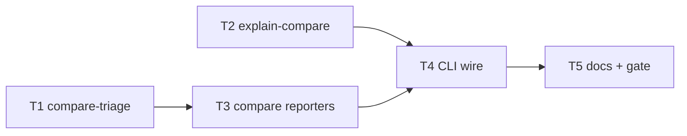

# Milestone 53 — Compare Interpretation Tasks

**Design**: [`.specs/features/compare-interpretation/design.md`](./design.md)  
**Spec**: [`.specs/features/compare-interpretation/spec.md`](./spec.md)  
**Context**: [`.specs/features/compare-interpretation/context.md`](./context.md)  
**Status**: Planned

---

## Execution Plan

```
T1 compare-triage [P] ──┐
T2 explain-compare [P] ─┼──→ T3 compare reporters ──→ T4 CLI strict+explain ──→ T5 docs + full gate
```



### Diagram-Definition Cross-Check

| Task | Depends on (body) | Diagram shows | Status |
| ---- | ----------------- | ------------- | ------ |
| T1 | None | Root parallel | ✅ Match |
| T2 | None | Root parallel | ✅ Match |
| T3 | T1 | T1→T3 | ✅ Match |
| T4 | T2, T3 | T2→T4, T3→T4 | ✅ Match |
| T5 | T4 | T4→T5 | ✅ Match |

### Path Conflict Check (Check 5)

| Task | Module owner | Paths | Conflict |
| ---- | ------------ | ----- | -------- |
| T1 | `src/report/` | `compare-triage.ts` + test | Sole — new files |
| T2 | `src/report/` | `explain-compare.ts` (+ optional `explain.ts` re-export) + test | Sole — disjoint from T1 |
| T3 | `src/report/` | `compare-table.ts`, `compare-markdown.ts`, `index.ts` + tests | After T1; does not edit explain-compare |
| T4 | `bin/` | `scan-actions.ts`, `hotspot-scanner.ts` + bin tests | After T2/T3; sole CLI owner |
| T5 | docs | ARCHITECTURE, README, recipes, warning-codes, TESTING note | After T4 |

### Test Co-location Validation

| Task | Code layer | Matrix / TESTING.md | Task Tests | Status |
| ---- | ---------- | ------------------- | ---------- | ------ |
| T1 | `src/report/` | unit co-located | unit | ✅ OK |
| T2 | `src/report/` | unit co-located | unit | ✅ OK |
| T3 | `src/report/` | unit co-located | unit | ✅ OK |
| T4 | `bin/` | unit/CLI co-located | unit + CLI | ✅ OK |
| T5 | docs | none | none + full gate | ✅ OK |

### Granularity Check

| Task | Scope | Status |
| ---- | ----- | ------ |
| T1 | One module: compare triage | ✅ Granular |
| T2 | One module: compare explain | ✅ Granular |
| T3 | Compare renderers + reporter dispatch (cohesive) | ✅ OK |
| T4 | CLI wiring for explain + strict | ✅ Granular |
| T5 | Docs + ROADMAP sync on Execute Done | ✅ Granular |

### Parallelism

| Task | `[P]`? | Parallel-safe? |
| ---- | ------ | -------------- |
| T1 / T2 | Yes | Disjoint new files under `src/report/`; unit tests parallel-safe |
| T3–T5 | No | Shared reporter/bin/docs sequencing |

---

## Task Breakdown

### T1: Compare delta triage helper `[P]`

**What**: Implement `buildCompareTriageHints` with the three locked delta rules, exported thresholds, cap 3/rule, sliced-input contract.
**Where**: `src/report/compare-triage.ts`, `src/report/compare-triage.test.ts`
**Depends on**: None
**Reuses**: Dual-signal thresholds / sort-cap pattern from `src/report/triage.ts`; context rule table
**Requirement**: HOTSPOT-820, HOTSPOT-821, HOTSPOT-823, HOTSPOT-825, HOTSPOT-826

**Tools**:

- Skill: `coding-guidelines`, `vitals-pipeline-domain`
- MCP: NONE

**Done when**:

- [ ] Rules `new-dual-signal`, `rank-worsened`, `new-coupled-with-static` match context predicates exactly
- [ ] Empty input → `[]`; cap ≤3 per rule; highest metric first
- [ ] Unit tests cover each rule, non-match, and cap
- [ ] Gate check passes: `pnpm exec vitest run src/report/compare-triage.test.ts`
- [ ] Test count: new file tests pass (no silent deletions)

**Tests**: unit  
**Gate**: quick — `pnpm exec vitest run src/report/compare-triage.test.ts`

**Commit**: `feat(report): add delta-aware compare triage hints`

---

### T2: Compare explain formatter `[P]`

**What**: Lookup `--explain` targets in `CompareResult` new/removed/rankChanged; format stderr blocks with classification and ranks/delta; reuse M42 path grammar helpers.
**Where**: `src/report/explain-compare.ts`, `src/report/explain-compare.test.ts` (export from `src/report/index.ts` if needed)
**Depends on**: None
**Reuses**: `parseExplainTarget`, `normalizeExplainPath`, score field formatting from `src/report/explain.ts`
**Requirement**: HOTSPOT-828, HOTSPOT-829, HOTSPOT-831

**Tools**:

- Skill: `coding-guidelines`, `vitals-pipeline-domain`
- MCP: NONE

**Done when**:

- [ ] Matches classification `new` | `removed` | `rank-changed` with required fields
- [ ] Not-found path returns empty matches (caller message)
- [ ] Function mode: `path` explains all function deltas for file; `path:fn` filters by name
- [ ] Gate check passes: `pnpm exec vitest run src/report/explain-compare.test.ts`
- [ ] Test count: new file tests pass (no silent deletions)

**Tests**: unit  
**Gate**: quick — `pnpm exec vitest run src/report/explain-compare.test.ts`

**Commit**: `feat(report): add compare-mode explain formatter`

---

### T3: Wire triage into compare table/markdown + reporter

**What**: Add `triageHints` to compare render options; call `buildCompareTriageHints` on sliced display result; place section after delta tables / before glossary; json/csv unchanged; update `createReporter().renderCompare`.
**Where**: `src/report/compare-table.ts`, `compare-markdown.ts`, `index.ts`, co-located tests (`compare-table.test.ts`, `compare-markdown.test.ts`, `index.test.ts`)
**Depends on**: T1
**Reuses**: M41 triage section titles; existing glossary placement
**Requirement**: HOTSPOT-822, HOTSPOT-824, HOTSPOT-827

**Tools**:

- Skill: `coding-guidelines`, `vitals-pipeline-domain`
- MCP: NONE

**Done when**:

- [ ] Default `triageHints` emits section when rules match; `triageHints: false` omits
- [ ] json/csv paths never include triage text
- [ ] Scan triage regression still green
- [ ] Gate check passes: `pnpm exec vitest run src/report/compare-table.test.ts src/report/compare-markdown.test.ts src/report/index.test.ts src/report/triage.test.ts`
- [ ] Test count: suite passes (no silent deletions)

**Tests**: unit  
**Gate**: quick — listed vitest files above

**Commit**: `feat(report): show compare triage in table and markdown`

---

### T4: CLI `--explain` compare mode + `--strict`

**What**: Extend `executeCompareAndRender` to return `CompareResult`; wire compare explain to stderr after report; add `--strict` on `scan` and `compare`; exit `1` after write when strict + `COMPARE_SINCE_MISMATCH`; add `--explain` to `compare` command; keep scan-without-baseline explain as M42.
**Where**: `bin/scan-actions.ts`, `bin/hotspot-scanner.ts`, `bin/hotspot-scanner.test.ts` (+ integration assertions as needed)
**Depends on**: T2, T3
**Reuses**: Existing explain stderr write pattern; diagnostic `onWarning`; `CliExitError`
**Requirement**: HOTSPOT-830, HOTSPOT-832, HOTSPOT-833, HOTSPOT-834, HOTSPOT-835, HOTSPOT-836

**Tools**:

- Skill: `coding-guidelines`, `vitals-cli-validation`
- MCP: NONE

**Done when**:

- [ ] `scan --baseline --explain` / `compare --explain` write compare explain on stderr; JSON stdout intact
- [ ] Without baseline, M42 scan explain unchanged
- [ ] `--strict` + mismatched since → exit `1` after report; without `--strict` → exit `0`
- [ ] Other warnings alone do not fail under `--strict`
- [ ] Help lists `--strict` and compare `--explain`
- [ ] Gate check passes: `pnpm exec vitest run bin/hotspot-scanner.test.ts`
- [ ] Test count: suite passes (no silent deletions)

**Tests**: unit + CLI  
**Gate**: quick — `pnpm exec vitest run bin/hotspot-scanner.test.ts`

**Verify**:

```bash
pnpm exec hotspot-scanner compare --baseline <prior.json> --explain <known-delta-path> -f json
# stderr: compare explain; stdout: parseable CompareResult JSON

pnpm exec hotspot-scanner scan . --baseline <prior-different-since.json> --strict -f json
# exit 1; JSON report still written/printed
```

**Commit**: `feat(cli): compare explain and --strict since mismatch`

---

### T5: Living docs + feature gate

**What**: Update ARCHITECTURE (reporter/compare), README/recipes, `docs/warning-codes.md` (`--strict`), TESTING note for M53; sync ROADMAP M53 checkboxes / STATE on Execute Done; run full project gate.
**Where**: `.specs/codebase/ARCHITECTURE.md`, `README.md`, `docs/recipes.md`, `docs/warning-codes.md`, `.specs/codebase/TESTING.md` (brief), ROADMAP/STATE (Execute Done only)
**Depends on**: T4
**Reuses**: Existing Advanced / warning-codes style
**Requirement**: HOTSPOT-837, HOTSPOT-838, HOTSPOT-839

**Tools**:

- Skill: `vitals-spec-driven` (roadmap-sync on Done)
- MCP: NONE

**Done when**:

- [ ] Docs describe delta triage, compare explain, `--strict`
- [ ] No living-doc claim that compare has “no triage”
- [ ] Gate check passes: `pnpm build && pnpm test`
- [ ] ROADMAP M53 implementation checkboxes marked on Execute Done only

**Tests**: none  
**Gate**: full — `pnpm build && pnpm test`

**Commit**: `docs: document compare interpretation UX`

---

## Parallel Execution Map

```
Phase 1 (Parallel):
  ├── T1 [P] compare-triage
  └── T2 [P] explain-compare

Phase 2 (Sequential):
  T1 → T3 compare reporters

Phase 3 (Sequential):
  T2 + T3 → T4 CLI → T5 docs + full gate
```

---

## Requirement → Task map

| IDs | Task |
| --- | ---- |
| HOTSPOT-820, 821, 823, 825, 826 | T1 |
| HOTSPOT-828, 829, 831 | T2 |
| HOTSPOT-822, 824, 827 | T3 |
| HOTSPOT-830, 832–836 | T4 |
| HOTSPOT-837–839 | T5 |

**Unmapped:** none (820–839 covered).
