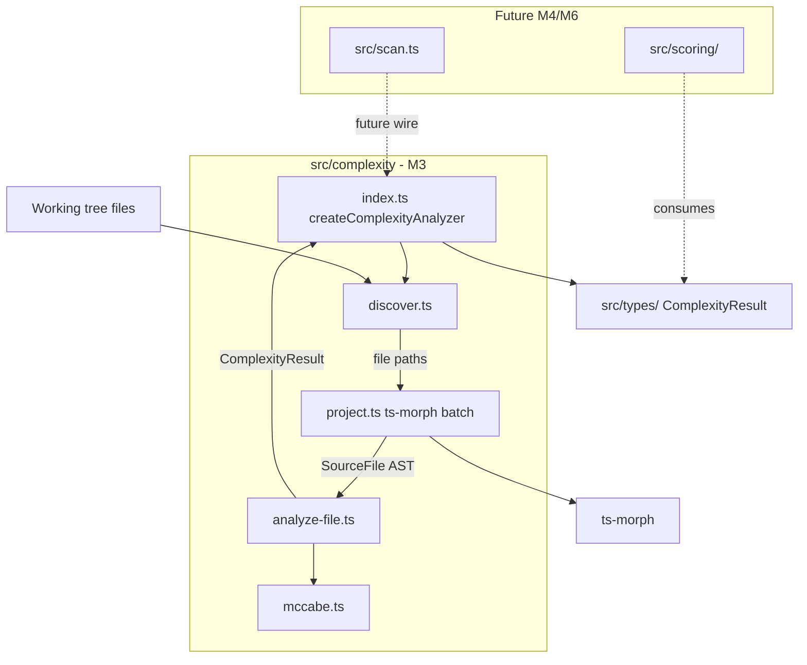

# Milestone 3 — Complexity Analyzer Design

**Spec**: [`.specs/features/complexity-analyzer/spec.md`](./spec.md)  
**Status**: Done

---

## Architecture Overview

M3 implements the Complexity Analyzer as an internal pipeline inside `src/complexity/`: discover eligible files in the working tree, load them into ts-morph in batches, walk each function's AST for McCabe decision nodes, and aggregate per-file `ComplexityResult` values. No changes to `src/scan.ts` — the analyzer is independently testable.



**IMPL reference:** §4.3 Complexity Analyzer, §5.1 `COMPLEXITY_RESULT`, §7.1 data flow, §7.2 batch processing, §8.4 parse failure, ADR-2026-019 ts-morph + own McCabe, RT-001 batching, RT-002 warn-skip, RT-005 decision node definition.

---

## Code Reuse Analysis

### Existing Components to Leverage

| Component | Location | How to Use |
| --------- | -------- | ---------- |
| Domain types | `src/types/domain.ts` | `ComplexityResult` — no changes expected |
| ComplexityAnalyzer contract | `src/complexity/index.ts` | Extend return type with `warnings`; keep `ComplexityAnalyzerOptions` |
| Stub test pattern | `src/complexity/index.test.ts` | Replace "throws not implemented" with integration tests |
| Fixture directory | `tests/fixtures/complexity/` | Populate with McCabe-verified TS files in T6 |
| Vitest config | `vitest.config.ts` | Coverage threshold for `src/complexity/**` in T8 |
| GitMiner deps pattern | `src/git/index.ts` | Mirror `ComplexityAnalyzerDependencies` injection pattern |

### Integration Points

| System | M3 behavior | Future milestone |
| ------ | ----------- | ---------------- |
| `ts-morph` | Added as runtime dependency; used only in `src/complexity/` | — |
| `src/scan.ts` | Not wired | M6 Integration |
| `HotspotScorer` | Consumes `ComplexityResult[]` types only | M4 Scoring |
| Git Miner paths | Not intersected in M3 | M4/M6 may filter at orchestration |
| CLI | No flags added | M5 Reporter + CLI |

Per [INTEGRATIONS.md](../../codebase/INTEGRATIONS.md): all `ts-morph` usage stays inside `src/complexity/`. Parse errors propagate as warnings with `filePath` and error message — not as fatal scan errors.

---

## Design Decisions

| # | Decision | Rationale |
| - | -------- | --------- |
| D1 | File `cyclomaticComplexity` = **sum** of per-function complexities | User decision; reflects total decision-path load in the file |
| D2 | Recursive walk of all eligible extensions under `repoPath` | User decision; M3 testable in isolation without Git Miner |
| D3 | `switch`: each `case` and `default` = 1 decision node | Classic McCabe; RT-005 mitigated by per-construct fixtures |
| D4 | `ts-morph` encapsulated in `src/complexity/` only | INTEGRATIONS.md adapter boundary |
| D5 | `ComplexityAnalyzerDependencies` for test injection | Mirrors M2 `GitMinerDependencies`; mock at adapter boundary |
| D6 | `ComplexityAnalyzerResult { results, warnings }` | Parse failures testable without `console` mocks; mirrors M2 `GitMinerResult.warnings` |
| D7 | Default batch size **50** files per `addSourceFiles` call | RT-001 heap mitigation; internal constant, not CLI flag |

---

## Components

### File discovery (`src/complexity/discover.ts`)

- **Purpose**: Recursively find all TS/JS source files under `repoPath`.
- **Location**: `src/complexity/discover.ts`
- **Interfaces**:

```typescript
export const ELIGIBLE_EXTENSIONS = [".ts", ".tsx", ".js", ".jsx"] as const;

/** Returns paths relative to repoPath. */
export async function discoverSourceFiles(repoPath: string): Promise<string[]>;
```

- **Algorithm**: Depth-first walk with `fs.readdir` (recursive). Filter by extension suffix. Return relative paths (forward slashes).
- **No denylist** for `node_modules`/`dist` in v1 (YAGNI).
- **Dependencies**: Node `fs`, `path`
- **Reuses**: None

---

### ts-morph project adapter (`src/complexity/project.ts`)

- **Purpose**: Encapsulate ts-morph `Project` creation and batch file loading.
- **Location**: `src/complexity/project.ts`
- **Interfaces**:

```typescript
import type { SourceFile } from "ts-morph";

export const DEFAULT_BATCH_SIZE = 50;

export interface TsMorphProjectOptions {
  repoPath: string;
}

export interface TsMorphProjectAdapter {
  /** Load up to batchSize paths; returns successfully parsed SourceFiles. */
  loadBatch(paths: string[]): Promise<SourceFile[]>;

  /** Returns paths that failed to parse in the last loadBatch call. */
  getParseFailures(): Array<{ filePath: string; message: string }>;
}

export function createTsMorphProject(
  options: TsMorphProjectOptions,
): TsMorphProjectAdapter;
```

- **ts-morph config**: `new Project({ compilerOptions: { allowJs: true }, skipAddingFilesFromTsConfig: true })` — add files by absolute path from `repoPath` + relative path.
- **Batch contract**: Caller passes slices of ≤50 paths. Each batch creates a fresh `Project` instance (or clears previous sources) to release AST memory between batches.
- **Parse failures**: ts-morph may produce diagnostics; adapter records `{ filePath, message }` for files that cannot be analyzed.
- **Dependencies**: `ts-morph` (only module that imports it)
- **Reuses**: None

**Note:** Exact ts-morph API for detecting parse failures will be validated during T1 implementation. Adapter SHALL surface failures via `getParseFailures()` rather than throwing for individual file syntax errors.

---

### McCabe counter (`src/complexity/mccabe.ts`)

- **Purpose**: Pure decision-node counting on ts-morph AST nodes.
- **Location**: `src/complexity/mccabe.ts`
- **Interfaces**:

```typescript
import type { FunctionLikeDeclaration, Node } from "ts-morph";

/** Count decision nodes inside a function/method body (excludes the +1 base). */
export function countDecisionNodes(root: Node): number;

/** McCabe complexity for a single function: decision nodes + 1. */
export function complexityForFunction(fn: FunctionLikeDeclaration): number;
```

- **Decision nodes counted**:

| Construct | Count rule |
| --------- | ---------- |
| `IfStatement` | +1 per `if` and `else if` branch |
| `ForStatement`, `ForInStatement`, `ForOfStatement`, `WhileStatement`, `DoStatement` | +1 each |
| `CaseClause`, `DefaultClause` | +1 each (inside parent `SwitchStatement`) |
| `CatchClause` | +1 each |
| `BinaryExpression` with `&&`, `\|\|`, `??` | +1 per operator (when in expression context) |
| `ConditionalExpression` (ternary) | +1 each |

- **Not counted**: JSX elements, type annotations, `else` without `if` (the `else if` is a separate `IfStatement` child), loop `increment` expressions.
- **Formula**: `complexityForFunction(fn) = countDecisionNodes(fn.getBody() ?? fn) + 1`
- **Dependencies**: `ts-morph` types only (imported via this module, called from `analyze-file.ts`)
- **Reuses**: None

---

### Per-file analyzer (`src/complexity/analyze-file.ts`)

- **Purpose**: Enumerate functions in a `SourceFile` and produce one `ComplexityResult`.
- **Location**: `src/complexity/analyze-file.ts`
- **Interfaces**:

```typescript
import type { SourceFile } from "ts-morph";
import type { ComplexityResult } from "../types/index.js";

export function analyzeSourceFile(sourceFile: SourceFile): ComplexityResult;
```

- **Function enumeration** (top-level and nested):
  - `FunctionDeclaration`
  - `MethodDeclaration` (class methods)
  - `ArrowFunction` and `FunctionExpression` assigned to `VariableDeclaration` (`const fn = () => …`)
  - Nested functions inside any of the above (recursive walk of function bodies)

- **Aggregation**:
  - `functionCount` = total functions found (including nested)
  - `cyclomaticComplexity` = sum of `complexityForFunction(fn)` for all functions
  - `filePath` = `sourceFile.getFilePath()` normalized relative to repo root (caller may normalize)

- **Empty file**: `{ filePath, cyclomaticComplexity: 0, functionCount: 0 }`
- **Dependencies**: `mccabe.ts`, `src/types/`
- **Reuses**: `ComplexityResult` from domain types

---

### ComplexityAnalyzer factory (`src/complexity/index.ts`)

- **Purpose**: Public entry point — orchestrate discover → batch load → analyze → collect warnings.
- **Location**: `src/complexity/index.ts`
- **Interfaces** (extended):

```typescript
import type { ComplexityResult } from "../types/index.js";

export interface ComplexityAnalyzerOptions {
  repoPath: string;
}

export interface ComplexityAnalyzerResult {
  results: ComplexityResult[];
  warnings: string[];
}

export interface ComplexityAnalyzerDependencies {
  discoverSourceFiles?: typeof discoverSourceFiles;
  createTsMorphProject?: typeof createTsMorphProject;
}

export interface ComplexityAnalyzer {
  analyze(options: ComplexityAnalyzerOptions): Promise<ComplexityAnalyzerResult>;
}

export function createComplexityAnalyzer(
  deps?: ComplexityAnalyzerDependencies,
): ComplexityAnalyzer;
```

- **Orchestration**:

```typescript
async analyze({ repoPath }) {
  const warnings: string[] = [];
  const results: ComplexityResult[] = [];

  const filePaths = await discover(repoPath);
  const project = createProject({ repoPath });

  for (const batch of chunk(filePaths, DEFAULT_BATCH_SIZE)) {
    const sourceFiles = await project.loadBatch(batch);
    for (const sf of sourceFiles) {
      results.push(analyzeSourceFile(sf));
    }
    for (const failure of project.getParseFailures()) {
      warnings.push(`Failed to parse ${failure.filePath}: ${failure.message}`);
    }
  }

  return { results, warnings };
}
```

- **Invalid `repoPath`**: throw `Error` with message containing `repoPath` before discovery.
- **Dependencies**: `discover.ts`, `project.ts`, `analyze-file.ts`, `src/types/`
- **Reuses**: Existing `ComplexityAnalyzerOptions`

---

## Data Models

No new domain types in `src/types/`. Public change: `ComplexityAnalyzer.analyze()` returns `ComplexityAnalyzerResult` instead of bare `ComplexityResult[]`.

### ComplexityResult (unchanged)

```typescript
export interface ComplexityResult {
  filePath: string;
  cyclomaticComplexity: number;
  functionCount: number;
}
```

### ComplexityAnalyzerResult (new, in `index.ts`)

```typescript
export interface ComplexityAnalyzerResult {
  results: ComplexityResult[];
  warnings: string[];
}
```

---

## Risks and Mitigations

| Risk | Source | Mitigation |
| ---- | ------ | ---------- |
| RT-005: McCabe bugs / non-standard definitions | CONCERNS.md | Fixture per construct; document decision nodes in `mccabe.ts` |
| RT-001: Heap exhaustion on large repos | IMPL §7.2 | Batch loading (D7); fresh Project per batch |
| RT-002: ts-morph exotic syntax failures | IMPL §8.4 | warn + skip via `getParseFailures()` |
| ts-morph version API drift | INTEGRATIONS.md | Pin version in `package.json`; adapter isolates API |
| Nested function double-counting | Spec edge case | Each function is its own scope; sum is intentional (D1) |

---

## Test Strategy

| Layer | Location | Focus |
| ----- | -------- | ----- |
| Unit — discover | `src/complexity/discover.test.ts` | Extension filter, recursive walk, relative paths |
| Unit — project | `src/complexity/project.test.ts` | Batch boundaries, parse failure collection |
| Unit — mccabe | `src/complexity/mccabe.test.ts` | Each decision node type in isolation |
| Unit — analyze-file | `src/complexity/analyze-file.test.ts` | Sum aggregation, nested functions, empty file |
| Integration | `src/complexity/index.test.ts` | Full pipeline on fixture directory |
| Edge cases | `src/complexity/index.test.ts` | Invalid syntax, mixed valid/invalid (T7) |
| Fixtures | `tests/fixtures/complexity/` | Manually verified McCabe values |

**Mock boundary:** Mock `discoverSourceFiles` and `createTsMorphProject` only in `index.test.ts` integration tests when needed. `mccabe.ts` and `analyze-file.ts` tests use real ts-morph `Project` with fixture file content or inline source strings.

**Coverage target:** ≥80% lines on `src/complexity/**` per TESTING.md.

### Planned fixtures

| File | Scenario | Expected (documented in header) |
| ---- | -------- | ------------------------------- |
| `if-else.ts` | if / else if / else | fn complexity = 3 |
| `switch.ts` | switch with 3 cases + default | per-case counting |
| `loops.ts` | for, while, do-while in one function | fn complexity = 4 |
| `try-catch.ts` | try/catch/finally | catch = 1 node |
| `logical-ops.ts` | `&&`, `\|\|`, `??` in conditions | 3 nodes + 1 base |
| `ternary.ts` | nested ternary | documented per level |
| `nested.ts` | outer + inner functions | sum of both scopes |
| `empty.ts` | no functions | 0 / 0 |
| `invalid-syntax.ts` | deliberate syntax error | skip + warning |

Each fixture header comment format:

```
// Fixture: if-else.ts
// Provenance: hand-crafted
// Expected: functionCount=1, cyclomaticComplexity=3 (if=1, else if=1, else branch implicit in chain)
```

---

## File Layout (after M3)

```
src/complexity/
├── index.ts          # ComplexityAnalyzer factory (public)
├── discover.ts       # recursive file walk
├── project.ts        # ts-morph batch adapter
├── mccabe.ts         # decision node counter
├── analyze-file.ts   # per-file aggregation
├── index.test.ts
├── discover.test.ts
├── project.test.ts
├── mccabe.test.ts
└── analyze-file.test.ts

tests/fixtures/complexity/
├── if-else.ts
├── switch.ts
├── loops.ts
├── try-catch.ts
├── logical-ops.ts
├── ternary.ts
├── nested.ts
├── empty.ts
└── invalid-syntax.ts
```

---

## Out of Scope (design)

- `src/scan.ts` wiring — deferred to M6
- Intersection with Git Miner `fileStats` keys — deferred to M4/M6
- `node_modules` / `dist` exclusion — YAGNI v1
- Per-function complexity in output JSON — M5 may expose; M3 outputs file-level only
- Historical AST from Git blobs — never in v1
