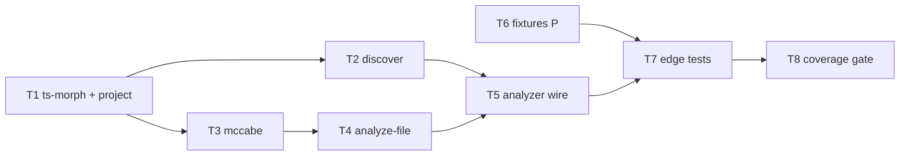

# Milestone 3 — Complexity Analyzer Tasks

**Design**: [`.specs/features/complexity-analyzer/design.md`](./design.md)  
**Spec**: [`.specs/features/complexity-analyzer/spec.md`](./spec.md)  
**Status**: Done

---

## Execution Plan

### Phase 1: Core modules (Sequential)

```
T1 → T2, T3 (parallel) → T4
```

### Phase 2: Fixtures (Parallel with Phase 1)

```
T6 [P]  (no code dependency on T1–T4)
```

### Phase 3: Integration and gate (Sequential)

```
T4, T6 → T5 → T7 → T8
```



---

## Task Breakdown

### T1: ts-morph dependency and project adapter

**What**: Add `ts-morph` to `package.json`. Implement `createTsMorphProject()` with `DEFAULT_BATCH_SIZE = 50`, `loadBatch(paths)`, and `getParseFailures()`. Create a fresh `Project` per batch to limit heap usage. Record parse failures without throwing for individual syntax errors.

**Where**: `package.json`, `src/complexity/project.ts`, `src/complexity/project.test.ts`

**Depends on**: None

**Reuses**: None

**Requirement**: HOTSPOT-19, HOTSPOT-26

**Tools**:

- MCP: NONE
- Skill: NONE

**Done when**:

- [x] `ts-morph` added as runtime dependency in `package.json`
- [x] `createTsMorphProject({ repoPath })` returns adapter with `loadBatch` and `getParseFailures`
- [x] `loadBatch` processes at most `DEFAULT_BATCH_SIZE` paths per call
- [x] Valid fixture file loads as `SourceFile` without error
- [x] Invalid syntax file appears in `getParseFailures()` with `filePath` and `message`
- [x] Unit tests cover batch chunking and parse failure collection
- [x] Gate check passes: `pnpm build && pnpm test -- src/complexity/project.test.ts`

**Tests**: unit (`project.test.ts` — real ts-morph with fixture strings or temp files)

**Gate**: build + test

---

### T2: File discovery module

**What**: Implement `discoverSourceFiles(repoPath)` — recursive walk returning relative paths for `.ts`, `.tsx`, `.js`, `.jsx` files. Throw if `repoPath` does not exist or is not a directory.

**Where**: `src/complexity/discover.ts`, `src/complexity/discover.test.ts`

**Depends on**: T1 (project exists; tests use temp dirs independently)

**Reuses**: `ELIGIBLE_EXTENSIONS` constant

**Requirement**: HOTSPOT-20, HOTSPOT-25

**Tools**:

- MCP: NONE
- Skill: NONE

**Done when**:

- [x] `discoverSourceFiles` returns only eligible extensions
- [x] Nested directories are walked recursively
- [x] Returned paths are relative to `repoPath`
- [x] Non-existent `repoPath` throws with `repoPath` in message
- [x] Unit tests cover extension filter, nesting, and error on bad path
- [x] Gate check passes: `pnpm build && pnpm test -- src/complexity/discover.test.ts`

**Tests**: unit (`discover.test.ts` — temp directory with mixed files)

**Gate**: build + test

---

### T3: McCabe decision node counter

**What**: Implement `countDecisionNodes(root)` and `complexityForFunction(fn)` — count `if`/`else if`, loops, `case`/`default`, `catch`, `&&`/`||`/`??`, and ternaries. Formula: decision nodes + 1 per function.

**Where**: `src/complexity/mccabe.ts`, `src/complexity/mccabe.test.ts`

**Depends on**: T1 (ts-morph types available)

**Reuses**: None

**Requirement**: HOTSPOT-21

**Tools**:

- MCP: NONE
- Skill: NONE

**Done when**:

- [x] Each decision node type has a dedicated unit test
- [x] `switch` counts per `case` and `default` (not block-level)
- [x] `complexityForFunction` returns decision nodes + 1
- [x] Function with no branches returns complexity 1 (base path only)
- [x] Gate check passes: `pnpm build && pnpm test -- src/complexity/mccabe.test.ts`

**Tests**: unit (`mccabe.test.ts` — ts-morph `Project` with inline source strings)

**Gate**: build + test

---

### T4: Per-file analyzer (sum aggregation)

**What**: Implement `analyzeSourceFile(sourceFile)` — enumerate all functions (declarations, methods, assigned arrows, nested), sum their McCabe complexities into `cyclomaticComplexity`, set `functionCount`. Empty file returns 0/0.

**Where**: `src/complexity/analyze-file.ts`, `src/complexity/analyze-file.test.ts`

**Depends on**: T3

**Reuses**: `mccabe.ts`, `ComplexityResult` from `src/types/`

**Requirement**: HOTSPOT-22, HOTSPOT-23

**Tools**:

- MCP: NONE
- Skill: NONE

**Done when**:

- [x] `functionCount` equals total functions including nested
- [x] `cyclomaticComplexity` equals sum of per-function complexities
- [x] File with no functions returns `{ cyclomaticComplexity: 0, functionCount: 0 }`
- [x] Class methods and arrow functions in `const` assignments are counted
- [x] Unit tests cover sum, nested, and empty cases
- [x] Gate check passes: `pnpm build && pnpm test -- src/complexity/analyze-file.test.ts`

**Tests**: unit (`analyze-file.test.ts` — inline source or early fixtures)

**Gate**: build + test

---

### T5: ComplexityAnalyzer factory wiring

**What**: Replace throwing stub in `createComplexityAnalyzer()` with full pipeline: discover → batch load → analyze per file → collect warnings from parse failures. Export `ComplexityAnalyzerResult`, `ComplexityAnalyzerDependencies`. Replace `index.test.ts` stub test with integration test on at least one fixture.

**Where**: `src/complexity/index.ts`, `src/complexity/index.test.ts`

**Depends on**: T1, T2, T3, T4, T6 (minimal `if-else.ts` fixture)

**Reuses**: All `src/complexity/` submodules; `ComplexityAnalyzerOptions` unchanged

**Requirement**: HOTSPOT-19, HOTSPOT-24

**Tools**:

- MCP: NONE
- Skill: NONE

**Done when**:

- [x] `createComplexityAnalyzer().analyze()` returns `{ results, warnings }` without throwing on valid fixture dir
- [x] `ComplexityAnalyzerResult` includes `warnings: string[]`
- [x] Parse failures produce warnings and are excluded from `results`
- [x] `ComplexityAnalyzerDependencies` allows injecting `discoverSourceFiles` and `createTsMorphProject`
- [x] `index.test.ts` no longer expects "not implemented" throw
- [x] Integration test analyzes at least `tests/fixtures/complexity/if-else.ts`
- [x] Gate check passes: `pnpm build && pnpm test -- src/complexity/index.test.ts`

**Tests**: integration (`index.test.ts`)

**Gate**: build + test

---

### T6: McCabe fixtures [P]

**What**: Create hand-crafted TS fixture files with header comments documenting manually verified McCabe values: `if-else.ts`, `switch.ts`, `loops.ts`, `try-catch.ts`, `logical-ops.ts`, `ternary.ts`, `nested.ts`, `empty.ts`, `invalid-syntax.ts`.

**Where**: `tests/fixtures/complexity/`

**Depends on**: None

**Reuses**: Existing `tests/fixtures/complexity/.gitkeep` directory

**Requirement**: HOTSPOT-27

**Tools**:

- MCP: NONE
- Skill: NONE

**Done when**:

- [x] All 9 fixture files exist with documented expected `cyclomaticComplexity` and `functionCount`
- [x] Each fixture header comment documents provenance and expected values
- [x] `invalid-syntax.ts` contains deliberate unparseable syntax
- [x] `empty.ts` contains no functions
- [x] `nested.ts` documents sum of outer + inner function complexities

**Tests**: none (fixture data only)

**Gate**: none

---

### T7: Edge-case integration tests

**What**: Add integration tests exercising full `analyze()` pipeline against all T6 fixtures. Assert deterministic `ComplexityResult` values match fixture headers. Test mixed valid + invalid files produce partial results and warnings.

**Where**: `src/complexity/index.test.ts`, `src/complexity/mccabe.test.ts` (supplement if needed)

**Depends on**: T5, T6

**Reuses**: All fixtures from T6

**Requirement**: HOTSPOT-21, HOTSPOT-24, HOTSPOT-27

**Tools**:

- MCP: NONE
- Skill: NONE

**Done when**:

- [x] Each fixture's expected McCabe values asserted in `index.test.ts`
- [x] `invalid-syntax.ts` → excluded from `results`, warning in `warnings`
- [x] Directory with valid + invalid files → partial results without throw
- [x] `nested.ts` → sum of nested function complexities verified
- [x] `empty.ts` → `{ cyclomaticComplexity: 0, functionCount: 0 }`
- [x] Gate check passes: `pnpm build && pnpm test -- src/complexity/`

**Tests**: integration (fixture-driven)

**Gate**: build + test

---

### T8: Coverage gate and docs sync

**What**: Verify `src/complexity/**` ≥80% line coverage; run full project gate; update ROADMAP M3 checkboxes; update STRUCTURE.md module map for `src/complexity/` from `stub` to `implemented`; add `ts-morph` entry confirmation in INTEGRATIONS.md if not already present.

**Where**: `vitest.config.ts` (if threshold config needed), `.specs/project/ROADMAP.md`, `.specs/codebase/STRUCTURE.md`, `.specs/codebase/INTEGRATIONS.md`

**Depends on**: T1–T7

**Reuses**: TESTING.md coverage rules

**Requirement**: HOTSPOT-28

**Tools**:

- MCP: NONE
- Skill: `verifier-quality-gates` (optional)

**Done when**:

- [x] `src/complexity/**` line coverage ≥80%
- [x] Gate check passes: `pnpm build && pnpm test`
- [x] ROADMAP M3 items checked or linked to completed spec
- [x] STRUCTURE.md reflects `src/complexity/` as implemented
- [x] No regressions in existing tests (`src/git/**`, `src/scan.test.ts`, etc.)

**Tests**: project gate + coverage report

**Gate**: full (`pnpm build && pnpm test`)

**Commit**: `feat(complexity): implement McCabe Complexity Analyzer (M3)`

---

## Parallel Execution Map

```
Phase 1 (Sequential):
  T1 ──→ T2 [P with T3 after T1]
  T1 ──→ T3 ──→ T4

Phase 2 (Parallel — no code deps):
  T6 [P]  (can start immediately)

Phase 3 (Sequential):
  T4 + T6 (if-else.ts ready) ──→ T5 ──→ T7 ──→ T8
```

**Note:** T6 can run in parallel with T1–T4. T5 needs at least `if-else.ts` from T6. T7 needs all T6 fixtures.

---

## Task Granularity Check

| Task                   | Scope                                   | Status      |
| ---------------------- | --------------------------------------- | ----------- |
| T1: ts-morph + project | 1 module (`project.ts`) + dep           | ✅ Granular |
| T2: discover           | 1 module (`discover.ts`)                | ✅ Granular |
| T3: mccabe             | 1 module (`mccabe.ts`)                  | ✅ Granular |
| T4: analyze-file       | 1 module (`analyze-file.ts`)            | ✅ Granular |
| T5: analyzer wire      | 1 file (`index.ts`)                     | ✅ Granular |
| T6: Fixtures           | `tests/fixtures/complexity/` data files | ✅ Granular |
| T7: Edge tests         | test files only                         | ✅ Granular |
| T8: Coverage + docs    | verification + docs                     | ✅ Granular |

---

## Diagram-Definition Cross-Check

| Task | Depends On (task body) | Diagram Shows       | Status   |
| ---- | ---------------------- | ------------------- | -------- |
| T1   | None                   | Entry node          | ✅ Match |
| T2   | T1                     | T1 → T2             | ✅ Match |
| T3   | T1                     | T1 → T3             | ✅ Match |
| T4   | T3                     | T3 → T4             | ✅ Match |
| T5   | T1–T4, T6              | T2+T4 → T5, T6 → T7 | ✅ Match |
| T6   | None                   | Parallel node       | ✅ Match |
| T7   | T5, T6                 | T5 → T7, T6 → T7    | ✅ Match |
| T8   | T1–T7                  | T7 → T8             | ✅ Match |

---

## Test Co-location Validation

| Task              | Code Layer Created/Modified      | Matrix Requires | Task Says                     | Status |
| ----------------- | -------------------------------- | --------------- | ----------------------------- | ------ |
| T1: project       | `src/complexity/project.ts`      | unit ≥80%       | unit (`project.test.ts`)      | ✅ OK  |
| T2: discover      | `src/complexity/discover.ts`     | unit ≥80%       | unit (`discover.test.ts`)     | ✅ OK  |
| T3: mccabe        | `src/complexity/mccabe.ts`       | unit ≥80%       | unit (`mccabe.test.ts`)       | ✅ OK  |
| T4: analyze-file  | `src/complexity/analyze-file.ts` | unit ≥80%       | unit (`analyze-file.test.ts`) | ✅ OK  |
| T5: analyzer wire | `src/complexity/index.ts`        | unit ≥80%       | integration (`index.test.ts`) | ✅ OK  |
| T6: Fixtures      | `tests/fixtures/complexity/`     | none            | none                          | ✅ OK  |
| T7: Edge tests    | `src/complexity/*.test.ts`       | unit ≥80%       | integration                   | ✅ OK  |
| T8: Coverage gate | docs + config                    | project gate    | full gate                     | ✅ OK  |

---

## Requirement → Task Mapping

| Requirement | Task(s) |
| ----------- | ------- |
| HOTSPOT-19  | T1, T5  |
| HOTSPOT-20  | T2, T5  |
| HOTSPOT-21  | T3, T7  |
| HOTSPOT-22  | T4, T5  |
| HOTSPOT-23  | T4, T5  |
| HOTSPOT-24  | T5, T7  |
| HOTSPOT-25  | T2      |
| HOTSPOT-26  | T1      |
| HOTSPOT-27  | T6, T7  |
| HOTSPOT-28  | T8      |

**Coverage:** 10 requirements, 10 mapped, 0 unmapped

---

## Module Owner Routing

| Task | Primary owner module             |
| ---- | -------------------------------- |
| T1   | `src/complexity/project.ts`      |
| T2   | `src/complexity/discover.ts`     |
| T3   | `src/complexity/mccabe.ts`       |
| T4   | `src/complexity/analyze-file.ts` |
| T5   | `src/complexity/index.ts`        |
| T6   | `tests/fixtures/complexity/`     |
| T7   | `src/complexity/*.test.ts`       |
| T8   | project docs + vitest config     |

**Path conflict check:** Each production file owned by exactly one task (T1–T5). ✅ No conflicts.

---

## Out of Scope Reminder

- Do **not** modify `src/scan.ts` in M3
- Do **not** wire `HotspotScorer` formulas (M4)
- Do **not** add CLI flags (M5)
- Do **not** import `ts-morph` outside `src/complexity/`
