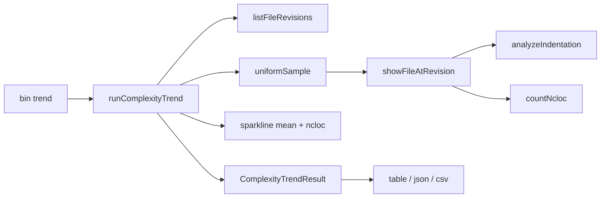

# Milestone 72 — Complexity Trend Design

**Spec**: [spec.md](./spec.md)  
**Context**: [context.md](./context.md)  
**Status**: Approved for planning (locked decisions)  
**Depth**: Complex  
**Design SoT**: [ARCHITECTURE.md](../../codebase/ARCHITECTURE.md)

---

## Architecture Overview

M72 adds a **sibling workflow** beside scan — not a new scan stage:

```text
scan:  git log numstat → working-tree NCLOC → hotspot score → report
trend: git log (path, --follow) → git show blobs → indent + NCLOC → series report
```



**Hard boundaries:**

- Do **not** call `runScan`, mutate `ScanResult`, or bump scan JSON `3.0`
- Do **not** reintroduce compare/baseline
- Do **not** add `--follow` to the global numstat miner
- Historical blob reads are **trend-only**; scan size analysis remains working-tree

---

## Code Reuse Analysis

| Pattern | Location | How to use |
| ------- | -------- | ---------- |
| NCLOC | `src/complexity/ncloc.ts` `countNcloc` | Per-revision size axis |
| Git spawn + hints | `src/git/spawn.ts`, `git-error-hint.ts` | New helpers alongside; same stderr→Hint style |
| Repo resolve / remount | `src/paths/resolve-repo.ts` | Resolve `--repo` / cwd; optional remount awareness for nested paths |
| Cancel signals | `bin/scan-actions.ts` `runWithScanCancelSignals` | Reuse or thin twin for trend AbortSignal |
| Doctor-style command | `src/doctor/` | Pattern for `src/trend/` orchestration separate from scan |
| Completions parity | `bin/completion-scripts.ts` + tests | Add `trend` + flags |
| Contract tests | `tests/contract/` | New schema `complexity-trend.json` |
| Pure report + bin I/O | `src/report/` vs `bin/` | Trend formatters pure; `-o` in bin |

---

## Components

### 1. Indentation analyzer

- **Purpose**: Tornhill whitespace complexity proxy
- **Location**: `src/complexity/indentation.ts` (+ co-located `indentation.test.ts`)
- **Interface**: `analyzeIndentation(source: string): IndentationMetrics`
- **Rules**: 4 spaces = 1 level; tab = 1 level; ignore blank/whitespace-only lines; `n===0` → `mean`/`sd` = 0
- **Dependencies**: none (pure)
- **Why under complexity/**: Same “source text metrics” family as NCLOC; trend imports it

### 2. Sparkline helper

- **Purpose**: Map `number[]` → ASCII sparkline
- **Location**: `src/trend/sparkline.ts` (+ test) — owned by trend UX, not scoring
- **Interface**: `sparkline(values: number[]): string`
- **Glyphs**: `▁▂▃▄▅▆▇█`; min–max; constant → mid; empty → `""`
- **Dependencies**: none

### 3. Git path history helpers

- **Purpose**: List revisions for a path; fetch blob text at rev
- **Location**: `src/git/file-history.ts` (or split `list-file-revisions.ts` / `show-file.ts`) + tests/fixtures
- **Interfaces**:
  - `listFileRevisions({ repoPath, filePath, since?, start?, end?, follow, signal }): Promise<FileRevisionRef[]>`
  - `showFileAtRevision({ repoPath, rev, pathAtRev, signal }): Promise<string>`
- **`FileRevisionRef`**: `{ rev: string; pathAtRev: string; date?: string }`
- **Argv notes**:
  - Log: `git -C <repo> log --follow? --format=… [--since=] [<start>..<end>] -- <file>`
  - Need path-at-rev for renames under `--follow` (name-status / name-only / `diff-tree` — implementer picks reliable approach; prefer one spawn strategy documented in code)
  - Show: `git -C <repo> show <rev>:<pathAtRev>`
- **Errors**: Reuse `formatGitStderrHint` patterns; typed errors analogous to `GitLogError`
- **Forbidden**: Changing `buildGitLogArgv` numstat flags for scan

### 4. Sampling

- **Purpose**: Cap revision count without only taking “newest N”
- **Location**: `src/trend/sample.ts` (pure) + test
- **Interface**: `uniformSample<T>(items: T[], max: number): T[]`
- **Behavior**: If `items.length <= max` return copy; else pick indices evenly including endpoints when possible

### 5. Orchestration `runComplexityTrend`

- **Purpose**: End-to-end trend result
- **Location**: `src/trend/run-trend.ts` + `src/trend/index.ts`
- **Interface**: `runComplexityTrend(options: ComplexityTrendOptions): Promise<ComplexityTrendResult>`
- **Flow**:
  1. Validate options (range exclusivity, file not directory)
  2. Resolve repo
  3. `listFileRevisions`
  4. If empty → result with warning, empty points, empty sparklines
  5. If never-in-range for CLI “file unknown” — orchestration may return empty; **CLI maps** empty+no-history to exit `2` when appropriate (file path not in git at all vs empty since window — distinguish: empty since → warn exit 0; path never tracked → exit 2)
  6. Sample unless `--all`
  7. For each ref: show → indent + ncloc; on show failure push warning + skip
  8. Sort ascending by commit date/order from log (list oldest-first or reverse after fetch)
  9. Build sparklines from points’ `mean` and `ncloc`
- **Config**: Does **not** call `loadHotspotScannerConfig`
- **Progress**: Optional `onProgress` callback (revisionsProcessed/total) for CLI stderr — keep minimal (YAGNI fancy TTY bar unless cheap reuse)

### 6. Types + schema

- **Location**: `src/trend/types.ts` (or `src/types/` only if shared — prefer trend-local to avoid polluting scan types)
- **Schema**: `schemas/complexity-trend.json`  
  Package export subpath `./schemas/complexity-trend.json` (mirror config/scan pattern)
- **Shape** (normative sketch):

```ts
type IndentationMetrics = {
  n: number;
  total: number;
  mean: number;
  sd: number;
  max: number;
};

type ComplexityTrendPoint = IndentationMetrics & {
  rev: string;
  date?: string;
  ncloc: number;
};

type ComplexityTrendResult = {
  version: "1.0";
  kind: "complexity-trend";
  filePath: string;
  points: ComplexityTrendPoint[];
  meta: {
    since?: string;
    start?: string;
    end?: string;
    follow: boolean;
    revisionCount: number;
    truncated: boolean;
    maxRevisions: number | null; // null when --all
    sparklines: { mean: string; ncloc: string };
    scannerVersion?: string;
    warnings: Array<{ code: string; message: string }>;
  };
};
```

- Optional `parseComplexityTrend` in v1: **YAGNI** unless contract tests need a runtime parse helper — Ajv fixture validation is enough for MVP

### 7. Reporters

- **Location**: `src/report/trend-table.ts`, `trend-json.ts`, `trend-csv.ts` (or single `trend-format.ts` with three exports — prefer split if files stay small)
- **table**: header + `mean <spark>` / `ncloc <spark>` + rows (`rev`, `date?`, `n`, `ncloc`, `mean`, `sd`, `max`, `total` as space allows)
- **json**: `JSON.stringify(result, null, 2)` (+ `$schema` URL optional, M66-style — include if cheap)
- **csv**: RFC-like header `rev,date,n,total,mean,sd,max,ncloc` — no sparkline fields
- **index**: re-export formatters; no fs

### 8. CLI

- **Location**: `bin/hotspot-scanner.ts`, `bin/completion-scripts.ts`, optional `bin/trend-actions.ts` if wiring would bloat the main bin
- **Command**: `trend <file>`
- **Options**: `--repo`, `--since`, `--start`, `--end`, `--max-revisions`, `--all`, `--no-follow`, `-f/--format table|json|csv`, `-o/--output`
- **Known subcommands list**: include `trend` so path-first rewrite ignores it
- **Cancel**: AbortSignal through list/show loops; map to 130/143
- **Exit 2**: usage; directory file arg; start/end/since conflicts; path never present in history
- **Exit 0**: success; empty since window with warning

### 9. Fixture

- **Location**: `tests/fixtures/repos/trend-indent/` (new) **or** extend `small-ts` only if history is insufficient
- Prefer **new** tiny repo with scripted commits: flat file → nested indent growth → optional refactor flatten — so metrics visibly change
- Built like other fixture repos (real `.git`); document creation in fixture README if the repo pattern requires it

---

## Data flow detail

1. CLI parses argv → `ComplexityTrendOptions`
2. `runComplexityTrend`:
   - resolve repoPath
   - list revisions (follow default)
   - uniform sample (unless all)
   - sequential `git show` (MVP; concurrency YAGNI)
   - metrics + warnings
   - sparklines
3. Formatter → string
4. Bin writes stdout or `-o`

---

## Risks and mitigations

| Risk | Mitigation |
| ---- | ---------- |
| `--follow` rename path-at-rev wrong | Fixture with rename; integration asserts continuity across rename |
| N × `git show` slow | Default max 100; `--all` documented; sequential MVP |
| Prettier mass-reindent cliffs | Docs Limitations / recipes note |
| CONCERNS “working-tree only” confusion | Update CONCERNS: scan-only constraint; trend reads history |
| Scope creep into scan JSON | Separate schema + `kind`; no fields on `ScanResult` |
| Empty vs never-tracked ambiguity | Distinct warning codes / CLI exit policy (context) |
| Completions drift | M54-style tests for bash/zsh/fish |

---

## Testing strategy

| Layer | What |
| ----- | ---- |
| Unit | `analyzeIndentation`, `sparkline`, `uniformSample`, formatters with fixed result |
| Unit/integration | git helpers with temp repo or fixture |
| Contract | Ajv `complexity-trend.json` |
| CLI | `runCli` trend smoke; negative usage; completions |
| Gate | Per-task Vitest paths; final `pnpm build && pnpm test` |

---

## Docs / living documentation (Execute)

Update when shipping:

- `ARCHITECTURE.md` — trend command + diagram note
- `STRUCTURE.md` — `src/trend/`, schema, CLI
- `INTEGRATIONS.md` — git show/log path history
- `CONCERNS.md` — historical reads are trend-only; indent false negatives; formatter cliffs
- `TESTING.md` — fixture + contract if needed
- `AGENTS.md` — validation table row for `trend`
- README + `docs/recipes.md` — scan → trend → CSV
- vitals-pipeline-domain / cli-validation skills — brief trend mention

---

## Non-goals (design)

- ASCII bar charts per row
- Classification heuristics
- Batch `cat-file`
- Markdown reporter
- Config schema keys for trend
