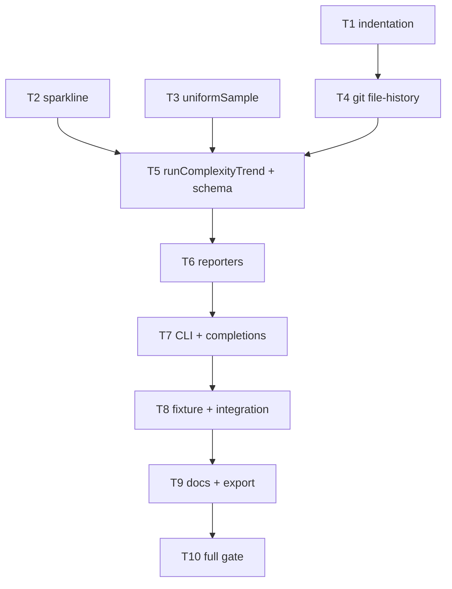

# Milestone 72 — Complexity Trend Tasks

**Design**: [design.md](./design.md)  
**Spec**: [spec.md](./spec.md)  
**Context**: [context.md](./context.md)  
**Status**: Planned

---

## Execution Plan

### Phase 1: Pure metrics (parallel-safe)

```
T1 analyzeIndentation
T2 sparkline          [P] with T1
T3 uniformSample      [P] with T1/T2
```

### Phase 2: Git + orchestration

```
T1/T2/T3 → T4 git file-history helpers
T4 → T5 types + schema + runComplexityTrend
```

### Phase 3: Report + CLI

```
T5 → T6 trend reporters
T6 → T7 CLI + completions + cancel
```

### Phase 4: Fixture, docs, gate

```
T7 → T8 fixture + integration/CLI smoke
T8 → T9 living docs + public export
T9 → T10 full project gate
```



### Diagram-Definition Cross-Check

| Task | Depends on (declared) | Diagram shows | Match |
| ---- | --------------------- | ------------- | ----- |
| T1 | None | Root | yes |
| T2 | None | Root | yes |
| T3 | None | Root | yes |
| T4 | T1 | T1→T4 | yes (T1 ensures indent ready before orchestration path; T4 itself is git-only but sequenced after T1 for phase clarity) |
| T5 | T2, T3, T4 | T2/T3/T4→T5 | yes |
| T6 | T5 | T5→T6 | yes |
| T7 | T6 | T6→T7 | yes |
| T8 | T7 | T7→T8 | yes |
| T9 | T8 | T8→T9 | yes |
| T10 | T9 | T9→T10 | yes |

### Path Conflict Check (Check 5)

| Task | Module owner | Paths (primary) | Conflict with parallel peers |
| ---- | ------------ | --------------- | ---------------------------- |
| T1 | `src/complexity/` | `indentation.ts` + test | None vs T2/T3 |
| T2 | `src/trend/` | `sparkline.ts` + test | None vs T1/T3 |
| T3 | `src/trend/` | `sample.ts` + test | None vs T1/T2 (different file from T2) |
| T4 | `src/git/` | `file-history.ts` (or split) + tests/fixtures | Sole after Phase 1 |
| T5 | `src/trend/` + `schemas/` | `run-trend.ts`, types, index, schema, contract test | After T4 |
| T6 | `src/report/` | `trend-*.ts` + tests | After T5 |
| T7 | `bin/` | `hotspot-scanner.ts`, completions (+ optional trend-actions) | After T6 |
| T8 | `tests/fixtures/` + integration | new fixture repo + trend integration/CLI tests | After T7 |
| T9 | docs + `src/index.ts` | living docs, README, recipes, skills, public export | After T8 |
| T10 | gate | none (run only) | After T9 |

> **[P]**: T1, T2, T3 only.

---

## Requirement → Task Mapping

| IDs | Task |
| --- | ---- |
| HOTSPOT-1400, HOTSPOT-1401, HOTSPOT-1402 | T1 |
| HOTSPOT-1403, HOTSPOT-1404 | T2 (series wiring completed in T5) |
| HOTSPOT-1408 (sample algorithm) | T3 |
| HOTSPOT-1406, HOTSPOT-1409 (show), HOTSPOT-1411 (git encapsulation) | T4 |
| HOTSPOT-1404 (attach sparklines), HOTSPOT-1405, HOTSPOT-1407, HOTSPOT-1408 (truncate meta), HOTSPOT-1410, HOTSPOT-1411 (order), HOTSPOT-1412, HOTSPOT-1413, HOTSPOT-1414 | T5 |
| HOTSPOT-1415, HOTSPOT-1416, HOTSPOT-1417 | T6 |
| HOTSPOT-1418, HOTSPOT-1419, HOTSPOT-1420, HOTSPOT-1421 | T7 |
| HOTSPOT-1425 | T8 |
| HOTSPOT-1422, HOTSPOT-1423, HOTSPOT-1424 | T9 |
| all HOTSPOT-1400–1425 | T10 verification |
| HOTSPOT-1426–1469 | Buffer unused |
| HOTSPOT-1470–1499 | Reserved |

---

## Tasks

### T1: Indentation analyzer

**What**: Implement `analyzeIndentation(source)` returning `{ n, total, mean, sd, max }` per locked indent rules (4 spaces / tab; ignore blanks; no AST; zero-safe mean/sd).  
**Where**: `src/complexity/indentation.ts`, `src/complexity/indentation.test.ts` (export from complexity index if appropriate)  
**Depends on**: None  
**Reuses**: None (pure). Do not change `ncloc.ts` semantics.  
**Requirements**: HOTSPOT-1400, HOTSPOT-1401, HOTSPOT-1402  
**Done when**:
- [ ] Function exported and documented briefly
- [ ] Fixtures cover flat, nested, tabs, blanks, empty source
- [ ] No ts-morph / AST imports
**Tests**: Co-located unit tests with exact expected metrics  
**Gate**: `pnpm test -- src/complexity/indentation.test.ts`

---

### T2: Sparkline helper `[P]`

**What**: Implement `sparkline(values)` with glyphs `▁▂▃▄▅▆▇█`, min–max scale, constant→mid, empty→`""`.  
**Where**: `src/trend/sparkline.ts`, `src/trend/sparkline.test.ts`, `src/trend/index.ts` (re-export)  
**Depends on**: None  
**Reuses**: None  
**Requirements**: HOTSPOT-1403, HOTSPOT-1404 (helper half)  
**Done when**:
- [ ] Edge cases unit-tested
- [ ] Module creatable without git deps
**Tests**: Co-located unit tests  
**Gate**: `pnpm test -- src/trend/sparkline.test.ts`

---

### T3: Uniform sample helper `[P]`

**What**: Implement `uniformSample(items, max)` preserving endpoints when truncating.  
**Where**: `src/trend/sample.ts`, `src/trend/sample.test.ts`  
**Depends on**: None  
**Reuses**: None  
**Requirements**: HOTSPOT-1408 (algorithm)  
**Done when**:
- [ ] `length <= max` returns full copy
- [ ] Truncation picks evenly; deterministic
**Tests**: Co-located unit tests (including max=1, max=2, exact length)  
**Gate**: `pnpm test -- src/trend/sample.test.ts`

---

### T4: Git file-history helpers

**What**: Add encapsulated `listFileRevisions` and `showFileAtRevision` under `src/git/` with `--follow` support, date/rev/pathAtRev, AbortSignal, and stderr hints. Do **not** modify numstat `buildGitLogArgv` behavior.  
**Where**: `src/git/file-history.ts` (name flexible), tests; optional raw fixtures under `tests/fixtures/`  
**Depends on**: T1 (phase sequencing)  
**Reuses**: spawn patterns, `formatGitStderrHint`  
**Requirements**: HOTSPOT-1406, HOTSPOT-1409, HOTSPOT-1411  
**Done when**:
- [ ] Follow on/off works in tests
- [ ] Show returns blob text; failures typed/clear
- [ ] Scan miner argv tests still assert no global `--follow`
**Tests**: Unit/integration with temp or fixture git repo  
**Gate**: `pnpm test -- src/git/`

---

### T5: `runComplexityTrend` + types + schema

**What**: Implement orchestration: options validation, repo resolve, list→sample→show→indent+ncloc, warnings, ascending points, sparklines on meta, CLI-only (no config load). Add `ComplexityTrendResult` types and `schemas/complexity-trend.json` + Ajv contract tests. Wire package schema export if required by repo convention.  
**Where**: `src/trend/run-trend.ts`, types, `src/trend/index.ts`, `schemas/complexity-trend.json`, `tests/contract/`  
**Depends on**: T2, T3, T4  
**Reuses**: `countNcloc`, `analyzeIndentation`, `sparkline`, `uniformSample`, `getPackageVersion` optional  
**Requirements**: HOTSPOT-1404, HOTSPOT-1405, HOTSPOT-1407, HOTSPOT-1408, HOTSPOT-1410, HOTSPOT-1411, HOTSPOT-1412, HOTSPOT-1413, HOTSPOT-1414  
**Done when**:
- [ ] Result matches contract sketch in design.md
- [ ] Truncation sets `meta.truncated` + sample size
- [ ] `--all` path leaves truncated false
- [ ] Contract tests pass; scan-result schema untouched
- [ ] No `loadHotspotScannerConfig` in trend path
**Tests**: Unit tests for run-trend with mocked git or fixture; contract Ajv  
**Gate**: `pnpm test -- src/trend/ tests/contract/`

---

### T6: Trend reporters

**What**: Pure formatters for table (header + mean/ncloc sparklines + rows), json (full payload), csv (no sparkline columns).  
**Where**: `src/report/trend-table.ts`, `trend-json.ts`, `trend-csv.ts` (or equivalent), tests, report index exports  
**Depends on**: T5  
**Reuses**: Report purity pattern (no fs)  
**Requirements**: HOTSPOT-1415, HOTSPOT-1416, HOTSPOT-1417  
**Done when**:
- [ ] Fixed fixture result snapshots/assertions for all three formats
- [ ] Table contains both sparkline strings from meta
- [ ] CSV header has no sparkline fields
**Tests**: Co-located reporter unit tests  
**Gate**: `pnpm test -- src/report/trend`

---

### T7: CLI `trend` + completions + cancel

**What**: Register `trend <file>` in Commander with locked flags; map exits (`2` / `130` / `143` / `0`); write `-o`; add completions parity; ensure path-first rewrite does not capture `trend`.  
**Where**: `bin/hotspot-scanner.ts`, `bin/completion-scripts.ts` (+ tests), optional `bin/trend-actions.ts`  
**Depends on**: T6  
**Reuses**: cancel helper from scan-actions if clean; `CliUsageError` patterns  
**Requirements**: HOTSPOT-1418, HOTSPOT-1419, HOTSPOT-1420, HOTSPOT-1421  
**Done when**:
- [ ] `trend --help` lists flags
- [ ] Negative tests: missing file arg, directory, since+start mix, never-tracked path → exit 2
- [ ] Completions include `trend` in bash/zsh/fish tests
- [ ] Known-subcommand list includes `trend`
**Tests**: `bin/hotspot-scanner.test.ts`, `bin/completion-scripts.test.ts`  
**Gate**: `pnpm test -- bin/hotspot-scanner.test.ts bin/completion-scripts.test.ts`

---

### T8: Fixture repo + integration / CLI smoke

**What**: Add (or extend) a multi-commit fixture demonstrating indent/NCLOC change; integration + CLI smoke for happy-path trend.  
**Where**: `tests/fixtures/repos/trend-indent/` (preferred new), integration test file(s)  
**Depends on**: T7  
**Reuses**: Existing fixture-builder patterns / real git repos under `tests/fixtures/repos/`  
**Requirements**: HOTSPOT-1425  
**Done when**:
- [ ] ≥3 commits; trend returns ≥2 points with changing metrics
- [ ] Sparklines non-empty on happy path
- [ ] CLI exit 0 on fixture file
**Tests**: Integration + CLI smoke  
**Gate**: `pnpm test --` paths covering trend integration/CLI fixture

---

### T9: Public export + living docs

**What**: Export `runComplexityTrend` + types from `src/index.ts`; sync ARCHITECTURE, STRUCTURE, INTEGRATIONS, CONCERNS, TESTING (as needed), AGENTS, README, recipes, vitals-pipeline-domain / vitals-cli-validation skills. Document Prettier cliffs and trend-only `--follow` / historical reads.  
**Where**: `src/index.ts`, `src/index.test.ts`, `.specs/codebase/*`, README, `docs/recipes.md`, `.cursor/skills/vitals-*`  
**Depends on**: T8  
**Reuses**: M45/M66 docs patterns  
**Requirements**: HOTSPOT-1422, HOTSPOT-1423, HOTSPOT-1424  
**Done when**:
- [ ] Public export smoke test
- [ ] Docs claim scan→trend drill-down; no compare resurrection
- [ ] CONCERNS clarifies scan working-tree vs trend history
**Tests**: `src/index.test.ts`  
**Gate**: `pnpm test -- src/index.test.ts`

---

### T10: Full project gate

**What**: Run full quality gate; fix any fallout from M72 surface (types, exports, completions).  
**Where**: repo-wide (no feature code unless gate fails)  
**Depends on**: T9  
**Requirements**: HOTSPOT-1400–1425 (verification)  
**Done when**:
- [ ] `pnpm build && pnpm test` passes
- [ ] tasks.md Status → Done (Execute session only)
- [ ] ROADMAP M72 marked Done (Execute Phase F)
**Tests**: Full suite  
**Gate**: `pnpm build && pnpm test`  
**Note**: `deferred_project_gate` — this is the milestone gate task

---

## Parallelism summary

| Phase | Parallel |
| ----- | -------- |
| Phase 1 | T1 ‖ T2 ‖ T3 |
| Phase 2+ | Sequential T4→T10 |

---

## Handoff

```
Feature: complexity-trend (M72)
tasks.md Status: Planned
Next: promote Status → Approved or Ready for Execute in a new session,
then invoke orchestrator-implementer.
Do not Execute in the planning session.
```

IDs: HOTSPOT-1400–1499 (active 1400–1425; buffer 1426–1469; reserved 1470–1499)
