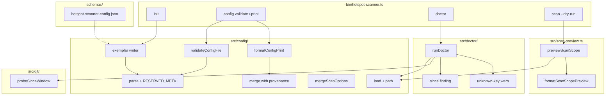

# Milestone 64 — Config and Doctor DX Design

**Spec**: [`.specs/features/config-doctor-dx/spec.md`](./spec.md)  
**Context**: [`.specs/features/config-doctor-dx/context.md`](./context.md)  
**Status**: Planned  
**Depth**: Large  
**Sisters**: M21 config-file, M30 path-config-dx, M39 cli-init-doctor-dry-run, M52 doctor-scope-parity, M55 unknown keys

---

## Architecture Overview

M64 extends the config/doctor/dry-run adoption surface. No change to Git Miner → NCLOC → scoring → report ranking. Domain modules grow; bin only wires Commander.



| Concern               | Owner                                   | Action                                         |
| --------------------- | --------------------------------------- | ---------------------------------------------- |
| Reserved meta         | `load-config.ts`                        | `RESERVED_META_KEYS` skip from known + unknown |
| Richer exemplar       | `exemplar.ts`                           | Locked JSON; still omit `concurrency`          |
| Provenance merge      | `merge-options.ts` or `print-config.ts` | Per-field `cli`/`config`/`default`             |
| Validate / print APIs | `src/config/`                           | New helpers; export via `#config`              |
| Config path on load   | `LoadedHotspotScannerConfig.path`       | `string \| null`                               |
| Dry-run enrichment    | `scan-preview.ts` + prelude threading   | Config path, remount, unknown keys             |
| Since probe           | `src/git/` new small helper             | Doctor consumes                                |
| Schema + exports      | `schemas/` + `package.json`             | Three schema subpaths                          |
| CLI                   | `bin/hotspot-scanner.ts`                | `config` command group                         |

---

## Code Reuse Analysis

### Existing components to leverage

| Component                                                | Location                             | How to use                                                                            |
| -------------------------------------------------------- | ------------------------------------ | ------------------------------------------------------------------------------------- |
| `parseHotspotScannerConfig` / `loadHotspotScannerConfig` | `src/config/load-config.ts`          | Extend with reserved meta + `path`                                                    |
| `mergeScanOptions`                                       | `src/config/merge-options.ts`        | Keep for scan; add provenance sibling or return tags                                  |
| `writeInitConfig` / `formatExemplarConfig`               | `src/config/exemplar.ts`             | Replace locked exemplar body                                                          |
| `resolveScanPipelineContext`                             | `src/scan.ts`                        | Already returns remount + unknownKeys; thread `configPath`                            |
| `previewScanScope` / `formatScanScopePreview`            | `src/scan-preview.ts`                | Extend preview DTO + formatter                                                        |
| `runDoctor` / `aggregateExitCode`                        | `src/doctor/index.ts`                | Add `since` finding; enrich config check                                              |
| Ajv contract pattern                                     | `tests/contract/json-schema.test.ts` | Add config schema `$id`                                                               |
| Scan/compare `$id` family                                | `schemas/*.json`                     | Mirror `https://raw.githubusercontent.com/AlanTaranti/hotspot-scanner/main/schemas/…` |

### Integration points

| System          | Integration                                                                                                                                                |
| --------------- | ---------------------------------------------------------------------------------------------------------------------------------------------------------- |
| git subprocess  | New probe **only** under `src/git/` (INTEGRATIONS.md). Doctor already uses `spawnSync("git", ["--version"])` for PATH — do not expand ad-hoc git log there |
| commander       | Nested `config` command; mirror `doctor --format` option style for print                                                                                   |
| package exports | Additive schema subpaths; keep `"."`                                                                                                                       |
| Warning codes   | Unknown keys remain `UNKNOWN_CONFIG_KEY` on scan; dry-run/doctor text may mirror message without requiring new code                                        |

---

## Components

### Reserved meta + load path (`src/config/load-config.ts`)

- **Purpose**: Ignore reserved meta; expose discovered/explicit config path
- **Interfaces**:
  - `RESERVED_META_KEYS: ReadonlySet<string>` — `$schema`, `$comment`, `$comments`
  - `LoadedHotspotScannerConfig` gains `path: string | null`
  - `parseHotspotScannerConfig`: skip reserved names before known/unknown classification (name-based; do not validate meta value shapes)
- **Dependencies**: existing parse asserts
- **Reuses**: `KNOWN_KEYS` set

### Provenance merge + validate/print (`src/config/`)

- **Purpose**: Domain APIs for `config validate` / `config print`
- **Suggested files**: `print-config.ts` and/or extend `merge-options.ts`; `validate-config.ts` thin wrapper around load/parse
- **Interfaces** (illustrative):

```typescript
type OptionSource = "cli" | "config" | "default";

interface MergedScanConfigWithSources {
  values: MergedScanConfig;
  sources: {
    since: OptionSource;
    include: OptionSource;
    exclude: OptionSource;
    top: OptionSource;
    concurrency: OptionSource;
  };
  configPath: string | null;
}

function mergeScanOptionsWithSources(
  input: MergeScanOptionsInput,
  configPath: string | null,
): MergedScanConfigWithSources;

function formatConfigPrintText(result: MergedScanConfigWithSources): string;
function formatConfigPrintJson(result: MergedScanConfigWithSources): string;

/** Resolve path arg → file; missing → ConfigError. Exit mapping in bin. */
function validateHotspotScannerConfigFile(
  pathOrDir: string,
): Promise<{ path: string }>;
```

- **Rules**: `include`/`exclude` absent → effective empty/undefined per today’s merge; source `default` when neither CLI nor config provided
- **Reuses**: `mergeScanOptions` pick helpers

### Exemplar (`src/config/exemplar.ts`)

- **Purpose**: Locked richer JSON per context.md
- **Note**: Exemplar object type may be `Record<string, unknown>` or a dedicated write DTO — meta keys are not `HotspotScannerConfig` fields. Ensure `formatExemplarConfig()` still pretty-prints 2-space + newline
- **Reuses**: `HOTSPOT_SCANNER_CONFIG_FILENAME`, overwrite/`InitError` rules

### Dry-run enrichment (`src/scan-preview.ts` + `src/scan.ts`)

- **Purpose**: Surface prelude metadata already computed for scan
- **Changes**:
  - Thread `configPath` through `loadMergedScanConfig` / `ScanPipelineContext`
  - Extend `ScanScopePreview` with `configPath: string | null`, `remountMessage?: string`, `unknownConfigKeys: string[]`
  - `formatScanScopePreview` adds lines when applicable
- **Reuses**: `resolveScanPipelineContext` (avoid second load)

### Since probe (`src/git/`)

- **Purpose**: Lightweight since validation for doctor
- **Suggested**: `src/git/probe-since.ts` (name flexible)

```typescript
type SinceProbeResult =
  | { status: "ok"; tipSubject?: string }
  | { status: "empty" }
  | { status: "invalid"; message: string };

function probeSinceWindow(options: {
  repoPath: string;
  since: string;
}): Promise<SinceProbeResult>;
```

- **Implementation sketch**: `git -C <repo> log -1 --since=<since> --format=%H` (or `%s`); exit 0 + empty stdout → `empty`; non-zero with rejection → `invalid`; exit 0 + hash → `ok`
- **Tests**: mock `spawn` at git boundary (TESTING.md)
- **Export**: via `#git` / `src/git/index.ts` as needed by doctor

### Doctor (`src/doctor/index.ts`)

- **Purpose**: `since` finding + unknown-key soft warn
- **Changes**:
  - Extend `DoctorFindingId` with `"since"`
  - After prelude success, call `probeSinceWindow(pipelineRepoPath, merged.since)`
  - Map probe → pass / warn / fail per context.md
  - `checkConfig`: include unknown keys (post-meta) as warn detail; reserved meta ignored
- **Exit**: unchanged aggregate rules; since invalid → hard `1`; empty → soft; unknown keys → soft
- **Reuses**: `resolveScanPipelineContext`, `aggregateExitCode`

### Schema + package exports

- **Purpose**: Publish config contract; expose all schemas
- **File**: `schemas/hotspot-scanner-config.json`
- **`$id`**: `https://raw.githubusercontent.com/AlanTaranti/hotspot-scanner/main/schemas/hotspot-scanner-config.json`
- **Shape guidance**:
  - `type: object`
  - properties for known keys matching runtime
  - optional `$schema` (string), `$comment` (string), `$comments` (array of strings)
  - `additionalProperties: true` (forward-compat; runtime still warns unknowns)
- **package.json**: add three schema export entries (see context.md)
- **Contract**: extend `tests/contract/json-schema.test.ts`

### CLI (`bin/hotspot-scanner.ts`)

- **Purpose**: Wire only
- **Commands**:
  - `config validate [path]`
  - `config print [path]` with `--config`, `--format text|json`, and scan-like option overrides needed for provenance demos (`--since`, `--include`, `--exclude`, `--top`, `--concurrency` as Low-cost parity — **at minimum** `--config` + format; prefer forwarding the same merge-relevant flags scan uses so print matches dry-run mental model)
- **Exit mapping**: `ConfigError` / validate miss → `2`; print success → `0`

---

## Data Models

### Loaded config path

```typescript
interface LoadedHotspotScannerConfig {
  config: HotspotScannerConfig | null;
  unknownKeys: string[];
  path: string | null;
}
```

### Scan preview (additive fields)

```typescript
interface ScanScopePreview {
  // existing fields…
  configPath: string | null;
  remountMessage?: string;
  unknownConfigKeys: string[];
}
```

### Config print JSON (locked shape intent)

```typescript
interface ConfigPrintJson {
  configPath: string | null;
  values: {
    since: string;
    include: string[];
    exclude: string[];
    top: number;
    concurrency: number;
  };
  sources: {
    since: "cli" | "config" | "default";
    include: "cli" | "config" | "default";
    exclude: "cli" | "config" | "default";
    top: "cli" | "config" | "default";
    concurrency: "cli" | "config" | "default";
  };
}
```

(`include`/`exclude` in JSON print: use `[]` when unset for stable output.)

---

## Error Handling

| Case                           | Behavior                                                                                                                                                                                                                                                                                                                                                                                                  |
| ------------------------------ | --------------------------------------------------------------------------------------------------------------------------------------------------------------------------------------------------------------------------------------------------------------------------------------------------------------------------------------------------------------------------------------------------------- |
| Invalid JSON / bad known types | `ConfigError` → CLI exit `2`                                                                                                                                                                                                                                                                                                                                                                              |
| Validate: no file found        | `ConfigError` (or dedicated message) → exit `2`                                                                                                                                                                                                                                                                                                                                                           |
| Print: path/git failures       | Same class as dry-run/scan prelude if print resolves via prelude; if print is config-only merge without git, document — **prefer** merge without requiring git repo so `config print` works on config file alone when `[path]` is a config file; when `[path]` is a directory, load via walk + merge defaults (git optional). **Lock:** print does **not** require git; validate does **not** require git |
| Doctor since invalid           | finding fail → exit `1`                                                                                                                                                                                                                                                                                                                                                                                   |
| Doctor since empty             | finding warn → exit `0` if no other hard fails                                                                                                                                                                                                                                                                                                                                                            |
| Init exists without force      | `InitError` → `2` (unchanged)                                                                                                                                                                                                                                                                                                                                                                             |

---

## Risks & Fragile Areas

| Risk                                                | Mitigation                                                                                       |
| --------------------------------------------------- | ------------------------------------------------------------------------------------------------ |
| INTEGRATIONS: git spawn outside `src/git/`          | Since probe lives in `src/git/`; doctor imports helper only                                      |
| M55 single-export lock                              | Context explicitly supersedes for **schema JSON** subpaths only                                  |
| Exemplar include filters fixtures to 0 files        | Acceptable; examples are documentation — tests assert exemplar parse, not fixture eligible count |
| `ScanPipelineContext` / load signature churn        | Update `scan.ts`, doctor, preview, tests together in owning tasks; Check 5 path owners           |
| Doctor format JSON (M51) must accept new `since` id | Additive finding; update format tests if they freeze id unions                                   |
| CONCERNS: warning code stability                    | Do not rename `UNKNOWN_CONFIG_KEY`; meta keys simply never emit it                               |

---

## Living docs (Execute)

Update when implementing (HOTSPOT-1135):

- `.specs/codebase/ARCHITECTURE.md` — config keys, meta, schema, subcommands, doctor `since`, dry-run lines
- `.specs/codebase/STRUCTURE.md` — new config/git files
- `.specs/codebase/INTEGRATIONS.md` — since probe
- `README.md` — Configuration / init / validate / print / schema exports
- Optional: `docs/recipes.md` one-liner for validate in CI

**Not in this planning session:** ROADMAP.md / STATE.md (mission lock).

---

## Test Strategy

| Layer                    | What                                                                    |
| ------------------------ | ----------------------------------------------------------------------- |
| Unit `src/config/`       | Meta skip, path on load, exemplar snapshot, provenance, validate helper |
| Unit `src/scan-preview/` | New preview fields + format lines                                       |
| Unit `src/git/`          | probeSinceWindow mock spawn: ok / empty / invalid                       |
| Unit `src/doctor/`       | since finding mapping; unknown-key warn; exit policy                    |
| CLI `bin/`               | `config validate` / `print` exits + stdout; dry-run lines; doctor since |
| Contract                 | Config schema Ajv + exemplar accept / bad-type reject                   |

**Gate:** per-task narrow Vitest; feature Done → `pnpm build && pnpm test`.
