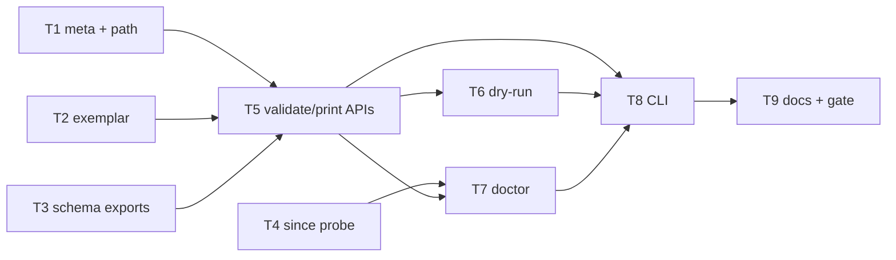

# Milestone 64 — Config and Doctor DX Tasks

**Design**: [`.specs/features/config-doctor-dx/design.md`](./design.md)  
**Spec**: [`.specs/features/config-doctor-dx/spec.md`](./spec.md)  
**Context**: [`.specs/features/config-doctor-dx/context.md`](./context.md)  
**Status**: Planned

---

## Execution Plan

```
T1 [P] reserved meta + load path ──┐
T2 [P] richer exemplar ────────────┤
T3 [P] config schema + exports ────┼──→ T5 provenance + validate/print APIs
T4 [P] git since probe ────────────┘         │
                                             ├──→ T6 dry-run enrichment
                                             ├──→ T7 doctor since + unknown keys
                                             └──→ T8 CLI wiring → T9 docs + full gate
```



### Diagram-Definition Cross-Check

| Task | Depends on (body) | Diagram shows | Status |
| ---- | ----------------- | ------------- | ------ |
| T1 | None | Root | ✅ Match |
| T2 | None | Root | ✅ Match |
| T3 | None | Root | ✅ Match |
| T4 | None | Root | ✅ Match |
| T5 | T1, T2, T3 | T1/T2/T3→T5 | ✅ Match |
| T6 | T5 | T5→T6 | ✅ Match |
| T7 | T4, T5 | T4→T7, T5→T7 | ✅ Match |
| T8 | T5, T6, T7 | T5/T6/T7→T8 | ✅ Match |
| T9 | T8 | T8→T9 | ✅ Match |

### Path Conflict Check (Check 5)

| Task | Module owner | Paths | Conflict |
| ---- | ------------ | ----- | -------- |
| T1 | `src/config/` | `load-config.ts`, `load-config.test.ts`, `index.ts` | None vs T2/T3/T4 — `[P]` OK (T2 touches `exemplar.ts` only) |
| T2 | `src/config/` | `exemplar.ts`, `exemplar.test.ts` | Disjoint files vs T1 — `[P]` OK |
| T3 | `schemas/` + `package.json` + contract | `schemas/hotspot-scanner-config.json`, `package.json`, `tests/contract/json-schema.test.ts` | None vs T1/T2/T4 — `[P]` OK |
| T4 | `src/git/` | `probe-since.ts` (or equiv), tests, `index.ts` export | None vs config — `[P]` OK |
| T5 | `src/config/` | new print/validate helpers + `merge-options` provenance + tests + barrel | After T1–T3; sole config owner in phase |
| T6 | `src/scan-preview.ts` + thin `src/scan.ts` prelude thread | preview + `ScanPipelineContext` configPath | After T5; do not edit doctor/bin |
| T7 | `src/doctor/` | `index.ts`, tests, format if id union frozen | After T4+T5; do not edit preview/bin |
| T8 | `bin/` | `hotspot-scanner.ts`, `hotspot-scanner.test.ts` | After T5–T7; sole bin owner |
| T9 | docs | README, ARCHITECTURE, STRUCTURE, INTEGRATIONS | After T8 |

### Test Co-location Validation

| Task | Code layer | Matrix / TESTING.md | Task Tests | Status |
| ---- | ---------- | ------------------- | ---------- | ------ |
| T1 | `src/config/` | unit co-located | unit | ✅ OK |
| T2 | `src/config/` | unit co-located | unit | ✅ OK |
| T3 | `schemas/` + contract | contract | contract | ✅ OK |
| T4 | `src/git/` | unit co-located; mock spawn | unit | ✅ OK |
| T5 | `src/config/` | unit co-located | unit | ✅ OK |
| T6 | `src/scan-preview.ts`, `src/scan.ts` | unit co-located | unit | ✅ OK |
| T7 | `src/doctor/` | unit co-located | unit | ✅ OK |
| T8 | `bin/` | CLI Vitest | CLI | ✅ OK |
| T9 | docs | none | none + full gate | ✅ OK |

### Granularity Check

| Task | Scope | Status |
| ---- | ----- | ------ |
| T1 | Reserved meta + load `path` | ✅ Granular |
| T2 | Exemplar content only | ✅ Granular |
| T3 | Schema file + exports + contract | ✅ Cohesive schema slice |
| T4 | Since probe helper | ✅ Granular |
| T5 | Validate/print/provenance APIs | ✅ Cohesive config DX API |
| T6 | Dry-run enrichment | ✅ Granular |
| T7 | Doctor since + unknown keys | ✅ Cohesive doctor slice |
| T8 | CLI wiring for all new commands + dry-run/doctor flags already present | ✅ Cohesive CLI slice |
| T9 | Living docs + full gate | ✅ Granular |

---

## Task Breakdown

### T1: Reserved meta keys + config path on load `[P]`

**What**: Skip `$schema` / `$comment` / `$comments` from known and unknown classification; add `path: string | null` to `LoadedHotspotScannerConfig`; update unit tests (including that meta does not appear in `unknownKeys`).

**Where**: `src/config/load-config.ts`, `src/config/load-config.test.ts`, `src/config/index.ts` (if types re-exported)

**Depends on**: None

**Reuses**: `KNOWN_KEYS`, `parseHotspotScannerConfig`, `loadHotspotScannerConfig`; [context.md](./context.md) reserved-meta decision

**Requirements**: HOTSPOT-1100, HOTSPOT-1101

**Tools**:

- MCP: NONE
- Skill: `coding-guidelines`, `vitals-pipeline-domain`

**Done when**:

- [ ] Reserved meta never land in `HotspotScannerConfig` or `unknownKeys`
- [ ] Non-meta unknowns still collected (sorted) as today
- [ ] Loaded result includes absolute `path` when file found; `null` when missing on walk
- [ ] Unit tests cover meta-only, meta+typo, explicit `--config` path, walk miss → `path: null`
- [ ] Gate check passes: `pnpm exec vitest run src/config/load-config.test.ts`
- [ ] Test count does not drop silently

**Tests**: unit  
**Gate**: `pnpm exec vitest run src/config/load-config.test.ts`

**Verify**:

```bash
pnpm exec vitest run src/config/load-config.test.ts
```

---

### T2: Richer init exemplar `[P]`

**What**: Replace locked exemplar with `$schema`, `$comments`, realistic non-empty `include`/`exclude`, `since`/`top` defaults; omit `concurrency`; keep overwrite/`--force` behavior.

**Where**: `src/config/exemplar.ts`, `src/config/exemplar.test.ts`

**Depends on**: None

**Reuses**: `writeInitConfig`, `formatExemplarConfig`, `HOTSPOT_SCANNER_CONFIG_FILENAME`; [context.md](./context.md) exemplar table

**Requirements**: HOTSPOT-1102, HOTSPOT-1103, HOTSPOT-1104, HOTSPOT-1105, HOTSPOT-1106

**Tools**:

- MCP: NONE
- Skill: `coding-guidelines`, `vitals-pipeline-domain`

**Done when**:

- [ ] Written JSON matches locked `$schema` URL and includes `$comments` array
- [ ] `include` / `exclude` are non-empty realistic examples
- [ ] `concurrency` omitted; refuse/force rules unchanged
- [ ] Round-trip: written file parses without `ConfigError` (meta not in unknownKeys — may rely on T1 if run after, or assert via future full gate; prefer importing parse in test and asserting after T1 lands in same feature Execute order)
- [ ] Gate: `pnpm exec vitest run src/config/exemplar.test.ts`
- [ ] Test count does not drop silently

**Tests**: unit  
**Gate**: `pnpm exec vitest run src/config/exemplar.test.ts`

**Note**: T1 and T2 are `[P]` on disjoint files. Full meta round-trip assertion in exemplar tests should land after T1 in Execute if parse behavior is required in the same test file — orchestrator may run T1 before asserting parse, or exemplar test only snapshots string until T5/T8. Prefer updating exemplar test to call `parseHotspotScannerConfig` once T1 is merged in the branch.

**Verify**:

```bash
pnpm exec vitest run src/config/exemplar.test.ts
```

---

### T3: Config JSON Schema + package schema exports `[P]`

**What**: Add `schemas/hotspot-scanner-config.json` with locked `$id`; document known keys + reserved meta; add `package.json` exports for scan-result, compare-result, and config schemas; extend contract tests.

**Where**: `schemas/hotspot-scanner-config.json`, `package.json`, `tests/contract/json-schema.test.ts`

**Depends on**: None

**Reuses**: Existing Ajv2020 contract pattern; scan/compare `$id` URL family

**Requirements**: HOTSPOT-1107, HOTSPOT-1108, HOTSPOT-1109, HOTSPOT-1110

**Tools**:

- MCP: NONE
- Skill: `coding-guidelines`

**Done when**:

- [ ] Schema `$id` matches locked URL; known-key constraints align with runtime
- [ ] Reserved meta properties allowed; `additionalProperties` permits forward-compat
- [ ] `package.json` `"exports"` includes three schema subpaths; `"."` preserved
- [ ] Contract: schema compiles; locked exemplar (or equivalent fixture) validates; invalid known-key type fails
- [ ] Gate: `pnpm exec vitest run tests/contract/json-schema.test.ts`
- [ ] Test count does not drop silently

**Tests**: contract  
**Gate**: `pnpm exec vitest run tests/contract/json-schema.test.ts`

**Verify**:

```bash
pnpm exec vitest run tests/contract/json-schema.test.ts
```

---

### T4: Git since probe helper `[P]`

**What**: Add lightweight `probeSinceWindow` (or equivalent) under `src/git/` using `git log -1 --since=…`; map ok / empty / invalid; unit-test with mocked spawn.

**Where**: `src/git/probe-since.ts` (name flexible), `src/git/probe-since.test.ts`, `src/git/index.ts` export

**Depends on**: None

**Reuses**: spawn patterns from `src/git/spawn.ts` / `ls-files.ts`; INTEGRATIONS.md git ownership

**Requirements**: HOTSPOT-1129 (helper surface)

**Tools**:

- MCP: NONE
- Skill: `coding-guidelines`, `vitals-pipeline-domain`

**Done when**:

- [ ] Helper returns discriminated ok / empty / invalid
- [ ] Invalid covers git rejection of since string (non-zero + message)
- [ ] Empty covers accepted since with no commits
- [ ] No git spawn added outside `src/git/` for this probe
- [ ] Gate: `pnpm exec vitest run src/git/probe-since.test.ts` (or chosen filename)
- [ ] Test count does not drop silently

**Tests**: unit  
**Gate**: `pnpm exec vitest run src/git/probe-since.test.ts`

**Verify**:

```bash
pnpm exec vitest run src/git/probe-since.test.ts
```

---

### T5: Config validate + print provenance APIs

**What**: Implement domain validate helper and provenance-aware merge + text/JSON formatters for `config print`; export from `src/config/`; unit tests for source tags and validate exit-class errors.

**Where**: `src/config/merge-options.ts` and/or `src/config/print-config.ts`, `src/config/validate-config.ts` (names flexible), tests, `src/config/index.ts`

**Depends on**: T1, T2, T3

**Reuses**: `mergeScanOptions`, `loadHotspotScannerConfig`, `parseHotspotScannerConfig`, T1 `path`, T3 schema as docs SoT (runtime validate remains parse-based, not Ajv-required)

**Requirements**: HOTSPOT-1111, HOTSPOT-1112, HOTSPOT-1113, HOTSPOT-1114, HOTSPOT-1116, HOTSPOT-1117, HOTSPOT-1118, HOTSPOT-1119, HOTSPOT-1120, HOTSPOT-1122

**Tools**:

- MCP: NONE
- Skill: `coding-guidelines`, `vitals-pipeline-domain`

**Done when**:

- [ ] Validate API resolves file/dir; missing → `ConfigError`; invalid → `ConfigError`; valid → path
- [ ] Provenance merge tags `cli` / `config` / `default` per field
- [ ] Text + JSON formatters match design `ConfigPrintJson` intent
- [ ] Print/validate do not require git
- [ ] Unit tests cover override matrix + missing/invalid validate
- [ ] Gate: `pnpm exec vitest run src/config/`
- [ ] Test count does not drop silently

**Tests**: unit  
**Gate**: `pnpm exec vitest run src/config/`

**Verify**:

```bash
pnpm exec vitest run src/config/
```

---

### T6: Dry-run prelude enrichment

**What**: Thread config path + remount + unknown keys into `ScanScopePreview` / `formatScanScopePreview`; ensure `resolveScanPipelineContext` / `loadMergedScanConfig` expose config path; keep no mine/NCLOC/scoring.

**Where**: `src/scan.ts` (thin prelude/`ScanPipelineContext` only), `src/scan-preview.ts`, `src/scan-preview.test.ts`, `src/scan.test.ts` only if prelude type changes break tests

**Depends on**: T5

**Reuses**: `resolveScanPipelineContext`, T1 `path`, existing `remountWarning` / `unknownConfigKeys`

**Requirements**: HOTSPOT-1123, HOTSPOT-1124, HOTSPOT-1125, HOTSPOT-1126, HOTSPOT-1127, HOTSPOT-1128

**Tools**:

- MCP: NONE
- Skill: `coding-guidelines`, `vitals-pipeline-domain`

**Done when**:

- [ ] Preview includes `configPath` (or none), remount message when present, unknown keys when present
- [ ] Formatter lines stable enough for assertions
- [ ] Still no miner/analyzer/scorer invocation in preview path
- [ ] Gate: `pnpm exec vitest run src/scan-preview.test.ts src/scan.test.ts`
- [ ] Test count does not drop silently

**Tests**: unit  
**Gate**: `pnpm exec vitest run src/scan-preview.test.ts src/scan.test.ts`

**Verify**:

```bash
pnpm exec vitest run src/scan-preview.test.ts src/scan.test.ts
```

---

### T7: Doctor since finding + unknown-key warn

**What**: Add `since` finding via T4 probe on effective merged since; soft warn empty / hard fail invalid; surface unknown keys (post-meta) as soft config warn; skip `since` when prelude git already failed.

**Where**: `src/doctor/index.ts`, `src/doctor/index.test.ts`, `src/doctor/format.ts` / `format.test.ts` if finding id union / JSON report needs update

**Depends on**: T4, T5

**Reuses**: `runDoctor`, `aggregateExitCode`, `resolveScanPipelineContext`, T4 `probeSinceWindow`, T1 unknownKeys/path

**Requirements**: HOTSPOT-1129, HOTSPOT-1130, HOTSPOT-1131, HOTSPOT-1132, HOTSPOT-1133, HOTSPOT-1134

**Tools**:

- MCP: NONE
- Skill: `coding-guidelines`, `vitals-pipeline-domain`

**Done when**:

- [ ] `DoctorFindingId` includes `since`
- [ ] Pass / warn / fail mapping matches context.md; no doctor `--since` CLI flag
- [ ] Unknown keys soft-warn; reserved meta alone does not warn
- [ ] Aggregate exit: empty since → `0` alone; invalid since → `1`
- [ ] Gate: `pnpm exec vitest run src/doctor/`
- [ ] Test count does not drop silently

**Tests**: unit  
**Gate**: `pnpm exec vitest run src/doctor/`

**Verify**:

```bash
pnpm exec vitest run src/doctor/
```

---

### T8: CLI wiring — `config` group + dry-run/doctor surfaces

**What**: Wire `config validate` / `config print` (incl. `--format json`); ensure dry-run prints enriched preview; doctor uses T7 behavior; map exits `0`/`2` for validate; CLI tests.

**Where**: `bin/hotspot-scanner.ts`, `bin/hotspot-scanner.test.ts` (and `bin/scan-actions.ts` only if dry-run formatting is centralized there)

**Depends on**: T5, T6, T7

**Reuses**: T5 APIs, `formatScanScopePreview`, `runDoctor`; [context.md](./context.md) CLI decisions; skill `vitals-cli-validation` for exit/fixture checks

**Requirements**: HOTSPOT-1115, HOTSPOT-1121, HOTSPOT-1118 (CLI flag), plus CLI coverage for dry-run enrichment / doctor since already specified in T6/T7

**Tools**:

- MCP: NONE
- Skill: `coding-guidelines`, `vitals-cli-validation`

**Done when**:

- [ ] `hotspot-scanner config validate|print` appear in help; validate exit `0`/`2`; print text + `--format json`
- [ ] Dry-run stdout includes config path / remount / unknowns when applicable
- [ ] Doctor CLI still exit-policy correct with since finding
- [ ] Domain logic not duplicated in bin
- [ ] Gate: `pnpm exec vitest run bin/hotspot-scanner.test.ts`
- [ ] Test count does not drop silently

**Tests**: CLI  
**Gate**: `pnpm exec vitest run bin/hotspot-scanner.test.ts`

**Verify**:

```bash
pnpm exec vitest run bin/hotspot-scanner.test.ts
```

---

### T9: Living docs + full quality gate

**What**: Update ARCHITECTURE, STRUCTURE, INTEGRATIONS, README (and recipes note if cheap) for reserved meta, schema exports, `config validate`/`print`, dry-run enrichment, doctor `since`; run full project gate.

**Where**: `.specs/codebase/ARCHITECTURE.md`, `.specs/codebase/STRUCTURE.md`, `.specs/codebase/INTEGRATIONS.md`, `README.md`, optionally `docs/recipes.md`

**Depends on**: T8

**Reuses**: [design.md](./design.md) living-docs list; do **not** edit ROADMAP.md / STATE.md in this feature’s planning mission (Execute may sync later per roadmap-sync)

**Requirements**: HOTSPOT-1135

**Tools**:

- MCP: NONE
- Skill: `coding-guidelines`

**Done when**:

- [ ] Docs describe M64 surfaces accurately
- [ ] Full gate passes: `pnpm build && pnpm test`
- [ ] No silent test deletions

**Tests**: none  
**Gate**: `pnpm build && pnpm test`

**Verify**:

```bash
pnpm build && pnpm test
```

---

## Requirement → Task Mapping

| Requirement IDs | Task |
| --------------- | ---- |
| HOTSPOT-1100, HOTSPOT-1101 | T1 |
| HOTSPOT-1102, HOTSPOT-1103, HOTSPOT-1104, HOTSPOT-1105, HOTSPOT-1106 | T2 |
| HOTSPOT-1107, HOTSPOT-1108, HOTSPOT-1109, HOTSPOT-1110 | T3 |
| HOTSPOT-1129 (helper) | T4 |
| HOTSPOT-1111–1114, HOTSPOT-1116–1120, HOTSPOT-1122 | T5 |
| HOTSPOT-1123–1128 | T6 |
| HOTSPOT-1129–1134 | T7 |
| HOTSPOT-1115, HOTSPOT-1121 (+ CLI glue) | T8 |
| HOTSPOT-1135 | T9 |
| HOTSPOT-1136–1139 | Reserved — unused |

---

## Parallel Execution Map

```
Phase 1 (parallel):
  T1 [P]  T2 [P]  T3 [P]  T4 [P]

Phase 2 (sequential):
  T5

Phase 3 (parallel after T5; T7 also needs T4):
  T6 [P]  T7 [P]     # disjoint: scan-preview/scan vs doctor

Phase 4 (sequential):
  T8 → T9
```

**Parallelism notes:** T6 and T7 are `[P]` relative to each other (disjoint paths) once T5 (and T4 for T7) complete. Do not parallelize T6 with tasks that also edit `src/scan.ts` heavily.

---

## Handoff

**Status: Planned** — planning session ends here.

Next step: review artifacts, promote Status to `Approved` / `Ready for Execute` in a **new** development session, then invoke `orchestrator-implementer`.

Expected final gate: `pnpm build && pnpm test`
