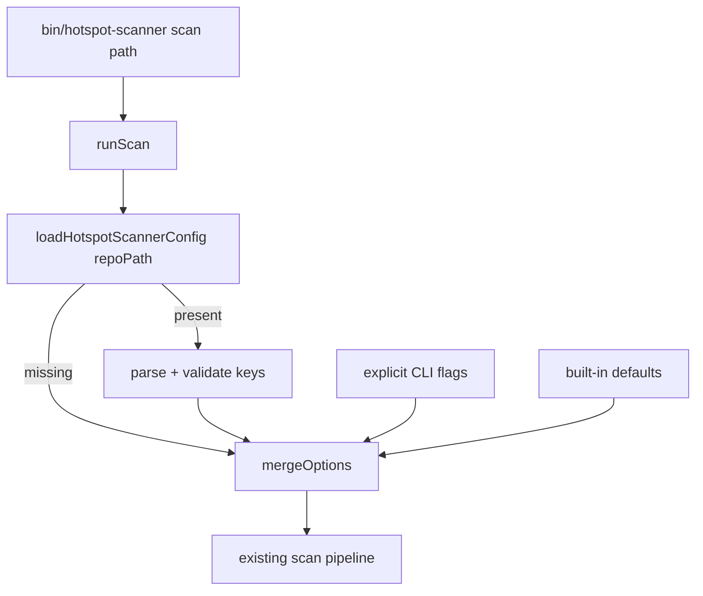

# Milestone 21 — Config File Design

**Spec**: [`.specs/features/config-file/spec.md`](./spec.md)  
**Context**: [`.specs/features/config-file/context.md`](./context.md)  
**Status**: Planned

---

## Architecture Overview



**Locked:** filename `.hotspot-scanner.json` only; precedence CLI > config > defaults.

---

## Code Reuse Analysis

| Component | Location | How to Use |
| --------- | -------- | ---------- |
| `ScanOptions` | `src/types/domain.ts` | Target shape after merge |
| Defaults | `DEFAULT_SINCE`, `DEFAULT_TOP`, `DEFAULT_MIN_COCHANGE` | Fallback layer |
| Flag parsers | `bin/hotspot-scanner.ts` | Reuse validation or extract shared parsers to `src/config/` |
| Path scoping | `src/paths/` | `include`/`exclude` arrays feed existing scope builder |
| `CliUsageError` | bin | Pattern for config errors |

---

## Components

### loadHotspotScannerConfig

- **Purpose**: Read and validate `<repoPath>/.hotspot-scanner.json`
- **Location**: `src/config/load-config.ts` (new module)
- **Interfaces**:
  - `loadHotspotScannerConfig(repoPath: string): Promise<Partial<ConfigValues> | null>`
  - `ConfigValues` = the six keys with typed fields
- **Dependencies**: `fs/promises`, path join
- **Reuses**: None (new)

### mergeScanOptions

- **Purpose**: Apply precedence CLI > config > defaults
- **Location**: `src/config/merge-options.ts` or inside `scan.ts`
- **Interfaces**: `mergeScanOptions({ defaults, config, cli }): ScanOptions`-like fields
- **Note:** Detecting “CLI explicitly provided” may require Commander `opts` vs defaultPresent — design: pass a `cliOverrides` partial containing only flags the user set (Commander `.getOptionValueSource` or compare to undefined before default application)

### Wiring

- **Prefer:** `runScan` loads config from `repoPath` then merges with provided options where provided options act as CLI layer
- **CLI:** Build `cliOverrides` from commander; pass into `runScan` or merge before call — keep domain out of bin beyond flag parse

---

## Data Models

```typescript
interface HotspotScannerConfigFile {
  since?: string;
  include?: string[];
  exclude?: string[];
  granularity?: "file" | "function";
  minCochange?: number;
  top?: number;
}
```

---

## Error Handling Strategy

| Scenario | Handling |
| -------- | -------- |
| ENOENT | `null` config — not an error |
| Invalid JSON | throw typed error → CLI exit != 0 |
| Bad types | throw with key name |
| Unknown key | ignore |

---

## Tech Decisions

| Decision | Choice | Rationale |
| -------- | ------ | --------- |
| Filename | `.hotspot-scanner.json` only | User locked |
| Location | `repoPath` root | No cascade |
| Module | `src/config/` | Keeps bin thin |
| format/output/baseline | Not in file | YAGNI / locked keys |
