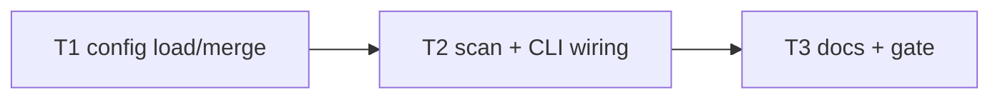

# Milestone 21 — Config File Tasks

**Design**: [`.specs/features/config-file/design.md`](./design.md)  
**Spec**: [`.specs/features/config-file/spec.md`](./spec.md)  
**Context**: [`.specs/features/config-file/context.md`](./context.md)  
**Status**: Done

---

## Execution Plan

```
T1 load + merge + unit tests → T2 runScan/CLI wiring + tests → T3 docs + gate
```



### Diagram-Definition Cross-Check

| Task | Depends on | Diagram | Match |
| ---- | ---------- | ------- | ----- |
| T1 | None | Root | ✅ |
| T2 | T1 | T1 → T2 | ✅ |
| T3 | T2 | T2 → T3 | ✅ |

### Path Conflict Check

| Task | Module owner | Paths | Conflict |
| ---- | ------------ | ----- | -------- |
| T1 | `src/config/` | new module + tests | Sequential |
| T2 | `src/scan.ts` + `bin/` | wiring | After T1 |
| T3 | docs | README, ARCHITECTURE, ROADMAP | After T2 |

### Test Co-location Validation

| Task | Layer | Tests | Match |
| ---- | ----- | ----- | ----- |
| T1 | config | unit same task | ✅ |
| T2 | scan/bin | unit/integration same task | ✅ |
| T3 | docs | full gate | ✅ |

---

## Task Breakdown

### T1: Config load + merge + validation

**What**: Create `src/config/` with loader for **only** `.hotspot-scanner.json`, validate six keys, ignore unknown keys, merge helper implementing CLI > config > defaults. Unit tests for missing file, invalid JSON, bad types, precedence matrix, include/exclude arrays.

**Where**: `src/config/load-config.ts`, `src/config/merge-options.ts` (names flexible), `src/config/*.test.ts`, `src/config/index.ts`

**Depends on**: None

**Reuses**: [context.md](./context.md) locked decisions; existing default constants

**Requirement**: HOTSPOT-166, HOTSPOT-167, HOTSPOT-168, HOTSPOT-169, HOTSPOT-170

**Done when**:

- [x] Only `.hotspot-scanner.json` is read (no `.hotspotrc`)
- [x] Precedence tests pass
- [x] Invalid config throws clear errors
- [x] Unknown keys ignored

**Tests**: unit

**Gate**: `pnpm exec vitest run src/config/`

---

### T2: Wire into runScan + CLI

**What**: Load/merge config in `runScan` (preferred) and ensure CLI passes explicit overrides correctly (Commander source detection or equivalent). Tests: fixture repo with config file; CLI override beats config. Update help text if straightforward.

**Where**: `src/scan.ts`, `bin/hotspot-scanner.ts`, related tests

**Depends on**: T1

**Reuses**: Path scoping options already on `ScanOptions`

**Requirement**: HOTSPOT-171, HOTSPOT-168

**Done when**:

- [x] Scan picks up repo config automatically
- [x] CLI flag overrides config
- [x] Programmatic `runScan` honors config at `repoPath` when options omit fields
- [x] Tests green

**Tests**: unit + CLI/integration as appropriate

**Gate**: `pnpm exec vitest run src/scan.ts bin/hotspot-scanner.test.ts` (adjust paths)

---

### T3: Documentation + full gate

**What**: Document filename, keys, precedence, discovery root in README and ARCHITECTURE; sync STATE if needed; ROADMAP M21 checkboxes on completion; `pnpm build && pnpm test`.

**Where**: `README.md`, `.specs/codebase/ARCHITECTURE.md`, `.specs/codebase/STRUCTURE.md` (add `src/config/`), `.specs/project/ROADMAP.md`

**Depends on**: T2

**Requirement**: HOTSPOT-172, HOTSPOT-173

**Done when**:

- [x] Docs match locked decisions (no `.hotspotrc`)
- [x] Full gate green

**Tests**: none

**Gate**: `pnpm build && pnpm test`

**Commit** (propose only): `feat(config): load .hotspot-scanner.json with CLI-over-config precedence`

---

## Requirement → Task map

| Requirement ID | Task |
| -------------- | ---- |
| HOTSPOT-166 | T1 |
| HOTSPOT-167 | T1 |
| HOTSPOT-168 | T1, T2 |
| HOTSPOT-169 | T1 |
| HOTSPOT-170 | T1 |
| HOTSPOT-171 | T2 |
| HOTSPOT-172 | T3 |
| HOTSPOT-173 | T3 |
