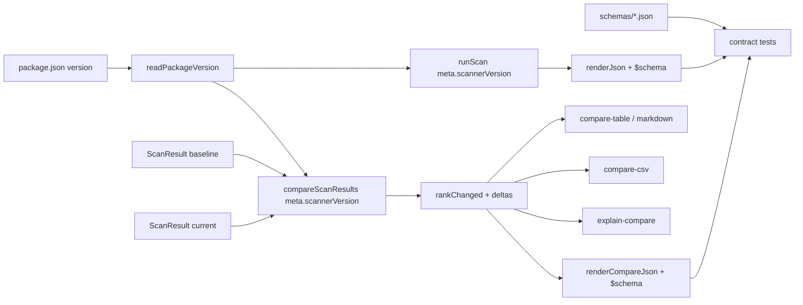

# Milestone 66 — Contract Enrich (Additive 3.0) Design

**Spec**: [`.specs/features/contract-enrich-additive/spec.md`](./spec.md)  
**Context**: [`.specs/features/contract-enrich-additive/context.md`](./context.md)  
**Status**: Planned  
**Depth**: Large  
**Sisters**: M13 scan-compare, M20 json-contract, M51 scan-observability (additive meta), M53 compare-interpretation, M56/M57 version history

---

## Architecture Overview

Additive enrichment under JSON **`version: "3.0"`**. No pipeline reorder. Changes touch: package-version helper → `runScan` meta → `compareScanResults` RankChange + CompareMeta → schemas/types → report JSON/table/markdown/CSV/explain → baseline parse tolerance → docs.



---

## Code Reuse Analysis

### Existing Components to Leverage

| Component                           | Location                                                    | How to Use                                                                       |
| ----------------------------------- | ----------------------------------------------------------- | -------------------------------------------------------------------------------- |
| `ScanMeta.timings` additive pattern | `src/types/domain.ts`, `schemas/scan-result.json`, M51      | Same optional-declare / always-emit pattern for `scannerVersion`                 |
| `compareRankedSections`             | `src/compare/compare.ts`                                    | When pushing `rankChanged`, also read current entity metrics for deltas          |
| `renderJson` / `renderCompareJson`  | `src/report/json.ts`, `compare-json.ts`                     | Inject `$schema` into payload object before stringify                            |
| `parseScanResult` optional timings  | `src/compare/load-baseline.ts`                              | Mirror for optional `scannerVersion`; ignore `$schema`                           |
| Schema `$id` URLs                   | `schemas/*.json`                                            | Constants for render-layer `$schema` values                                      |
| Doctor package.json read            | `src/doctor/index.ts`                                       | Extract/share pattern — prefer new small helper, do not couple compare to doctor |
| Report formatters                   | `compare-table.ts`, `compare-markdown.ts`, `compare-csv.ts` | Extend headers/rows only for rank-changed                                        |
| Explain compare                     | `src/report/explain-compare.ts`                             | Append delta fields to rank-changed blocks                                       |
| Contract suite                      | `tests/contract/json-schema.test.ts`                        | Assert new properties / validate fixtures                                        |

### Integration Points

| System          | Integration Method                                                                            |
| --------------- | --------------------------------------------------------------------------------------------- |
| JSON schemas    | Declare optional `scannerVersion`, optional `$schema`, required deltas on `RankChangeHotspot` |
| Baseline loader | Preserve optional meta; never require new fields; ignore `$schema`                            |
| Public types    | Export updated `ScanMeta`, `CompareMeta`, `RankChange` via `src/types`                        |

---

## Components

### 1. Package version helper

- **Purpose**: Cached read of `package.json` `"version"` for meta emission.
- **Location**: `src/package-meta.ts` (or equivalent under `src/`; STRUCTURE update if new file).
- **Interfaces**:
  - `readPackageVersion(): Promise<string>` and/or sync cached `getPackageVersion(): string` — pick one style consistent with call sites (`runScan` is async; `compareScanResults` is sync today).
- **Recommendation**: Provide **sync cached** `getPackageVersion()` so `compareScanResults` stays sync and pure aside from one module-level cache fill (readFileSync once). Alternatively pass `scannerVersion` into `compareScanResults` from async callers — prefer sync helper to avoid signature churn across bin/tests.
- **Dependencies**: `node:fs`, `node:url`, `node:path` (same pattern as doctor).
- **Reuses**: Doctor’s path-to-root package.json resolution approach.

### 2. Domain types + schemas

- **Purpose**: Contract SoT for additive fields.
- **Location**: `src/types/domain.ts`, `schemas/scan-result.json`, `schemas/compare-result.json`.
- **Changes**:
  - `ScanMeta.scannerVersion?: string` (always set on new scans; optional in type for old docs).
  - `CompareMeta.scannerVersion?: string` (always set on new compares).
  - `RankChange<T>` gains `scoreDelta`, `nclocDelta`, `commitCountDelta` (required on new compares).
  - Schema: declare properties; do not add `scannerVersion` to ScanMeta `required[]`; add deltas to RankChangeHotspot `required[]` (CompareResult not used as baseline input).
  - Root: optional `$schema` string property.

### 3. `runScan` meta emission

- **Purpose**: Always set `meta.scannerVersion` on successful scans.
- **Location**: `src/scan.ts`.
- **Interfaces**: unchanged `runScan` signature.
- **Reuses**: Existing meta assembly next to `timings` / `scannedAt`.

### 4. `compareScanResults` deltas + compare meta

- **Purpose**: Compute metric deltas; set `meta.scannerVersion`.
- **Location**: `src/compare/compare.ts`.
- **Logic** (in `compareRankedSections` or hotspot-specific path):
  - On rank change, use `baselineEntry.entity` as `entity` (unchanged).
  - `scoreDelta = currentEntry.entity.hotspotScore - baselineEntry.entity.hotspotScore`
  - `nclocDelta = currentEntry.entity.ncloc - baselineEntry.entity.ncloc`
  - `commitCountDelta = currentEntry.entity.commitCount - baselineEntry.entity.commitCount`
- **CompareMeta**: `{ baseline, current, warnings, scannerVersion: getPackageVersion() }`.
- **Fragile area**: CONCERNS compare/baseline — tests must lock exact deltas; do not change classification keys or sort order.

### 5. JSON `$schema` render

- **Purpose**: Emit schema URLs on serialized JSON only.
- **Location**: `src/report/json.ts`, `src/report/compare-json.ts`; optional shared constants `src/report/schema-urls.ts`.
- **Constants**:
  - `SCAN_RESULT_SCHEMA_URL = "https://vitals.dev/hotspot-scanner/schemas/scan-result.json"`
  - `COMPARE_RESULT_SCHEMA_URL = "https://vitals.dev/hotspot-scanner/schemas/compare-result.json"`

### 6. Human + CSV + explain surfaces

- **Purpose**: Show deltas everywhere operators look.
- **Location**: `compare-table.ts`, `compare-markdown.ts`, `compare-csv.ts`, `explain-compare.ts` (+ tests / fixtures).
- **Table/markdown headers**: Add columns after existing `Delta` (rank) — e.g. `ScoreΔ`, `NLOCΔ`, `CommitsΔ` (implementer may use ASCII `ScoreD` if Unicode problematic in tests — prefer Unicode Δ for markdown parity with existing `Δ` rank column).
- **CSV**: Extend `RANK_CHANGED_HOTSPOT_HEADER` and row builder.
- **Explain**: Include three deltas in rank-changed stderr blocks.
- **Unchanged**: `entity.*` absolute columns remain baseline values.

### 7. Baseline parse tolerance

- **Purpose**: Old and new baselines load.
- **Location**: `src/compare/load-baseline.ts`.
- **Changes**: Optional preserve `scannerVersion` when string; do not treat `$schema` as unsupported (unlike `coupling` / `functions`).

---

## Data Models

### ScanMeta (additive)

```ts
interface ScanMeta {
  since: string;
  scannedAt: string;
  warnings: ScanWarning[];
  timings?: ScanStageTimings;
  scannerVersion?: string; // always on new scans
}
```

### CompareMeta (additive)

```ts
interface CompareMeta {
  baseline: ScanMeta;
  current: ScanMeta;
  warnings: ScanWarning[];
  scannerVersion?: string; // always on new compares
}
```

### RankChange (additive deltas)

```ts
interface RankChange<HotspotScore> {
  entity: HotspotScore; // baseline metrics
  baselineRank: number;
  currentRank: number;
  rankDelta: number;
  scoreDelta: number; // current − baseline
  nclocDelta: number;
  commitCountDelta: number;
}
```

### JSON wire (scan)

```json
{
  "$schema": "https://vitals.dev/hotspot-scanner/schemas/scan-result.json",
  "version": "3.0",
  "meta": { "scannerVersion": "1.0.0", "...": "..." },
  "hotspots": []
}
```

---

## Error Handling

| Case                                          | Behavior                                                                                                                                                                                             |
| --------------------------------------------- | ---------------------------------------------------------------------------------------------------------------------------------------------------------------------------------------------------- |
| Missing `scannerVersion` on baseline          | Accept                                                                                                                                                                                               |
| Invalid type for `scannerVersion` on baseline | Prefer reject with clear `BaselineError` if present-but-wrong-type (parity with strict meta fields); if YAGNI cost high, ignore non-strings — **recommendation: reject non-string when key present** |
| Top-level `$schema` on baseline               | Ignore                                                                                                                                                                                               |
| Package version unreadable                    | Fail scan/compare with clear error (package.json must exist in published package layout)                                                                                                             |

---

## Decisions Needed

| ID  | Decision                            | Resolution                                |
| --- | ----------------------------------- | ----------------------------------------- |
| D1  | Version bump?                       | Locked: stay `"3.0"`                      |
| D2  | RankChange shape                    | Locked in context.md                      |
| D3  | `$schema` in domain types?          | Locked: render-layer only                 |
| D4  | entity side                         | Locked: baseline (current code)           |
| D5  | Sync vs inject version into compare | Design recommendation: sync cached helper |

No open decisions for Discuss.

---

## Risks & Trade-offs (CONCERNS)

| Risk                                 | Mitigation                                                                  |
| ------------------------------------ | --------------------------------------------------------------------------- |
| Schema/fixture drift                 | Update `tests/contract/json-schema.test.ts` + report fixtures in same tasks |
| Compare fragile classification       | Only add fields inside existing rankChanged push; keep sort/key logic       |
| Consumers assumed entity was current | Document baseline entity + reconstruction via deltas; do not flip entity    |
| Path conflicts on `src/report/`      | Single report task for table/markdown/CSV or strict sequential owners       |
| `loadBaseline` strips unknown meta   | Explicitly preserve `scannerVersion` like `timings`                         |

---

## Testing Strategy

| Layer       | Coverage                                                                                                                                                                                 |
| ----------- | ---------------------------------------------------------------------------------------------------------------------------------------------------------------------------------------- |
| Unit        | `compare.test.ts` delta arithmetic; `json`/`compare-json` `$schema`; table/markdown/csv/explain columns; load-baseline with/without `scannerVersion` / with `$schema`; scan meta version |
| Contract    | Schema validates fresh payloads with new fields; Ajv compile                                                                                                                             |
| Integration | Optional: fixture scan `--format json` asserts `$schema` + `scannerVersion` (if cheap in existing CLI tests)                                                                             |
| Gate        | `pnpm build && pnpm test`                                                                                                                                                                |

---

## Documentation Plan (Execute)

| Doc             | Update                                                                              |
| --------------- | ----------------------------------------------------------------------------------- |
| ARCHITECTURE.md | Additive `scannerVersion`, `$schema` on JSON render, rankChanged deltas under `3.0` |
| README.md       | JSON example + compare delta columns as needed                                      |
| STRUCTURE.md    | New helper module if added                                                          |
| TESTING.md      | Contract note if schema section lists fields                                        |
| CONCERNS.md     | Only if compare fragility note needs delta mention (optional)                       |

**Not in this planning session:** ROADMAP.md / STATE.md (mission lock).

---

## Implementation Notes for Tasks

1. Types + schemas first (unblocks parallel scan vs compare work).
2. Keep `src/report` pure (no `fs`) — `$schema` is a string constant; version lives in domain meta before render.
3. Do not change M53 triage formulas.
4. Update compare fixtures under `tests/fixtures/report/` when schema requires deltas.
