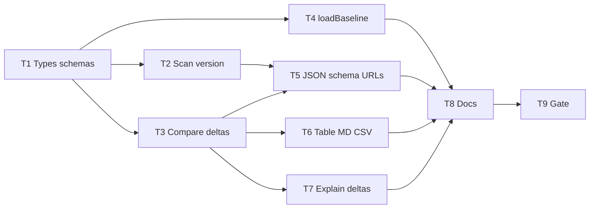

# Milestone 66 — Contract Enrich (Additive 3.0) Tasks

**Design**: [`.specs/features/contract-enrich-additive/design.md`](./design.md)  
**Spec**: [`.specs/features/contract-enrich-additive/spec.md`](./spec.md)  
**Context**: [`.specs/features/contract-enrich-additive/context.md`](./context.md)  
**Status**: Done  
**Note**: Large feature — types/schemas + scan + compare + report + baseline + docs. STOP at Planned; Execute in a separate session via `orchestrator-implementer` after Status promotion. Do **not** edit ROADMAP.md / STATE.md in planning.

---

## Execution Plan

### Phase 1: Contract foundation

```
T1 types + schemas
```

### Phase 2: Emit + compute (parallel-safe)

```
T1 ─┬─→ T2 package version + runScan scannerVersion [P]
    ├─→ T3 compare deltas + CompareMeta.scannerVersion [P]
    └─→ T4 loadBaseline tolerance [P]
```

### Phase 3: Report surfaces

```
T2 + T3 → T5 JSON $schema
T3 → T6 table / markdown / CSV deltas
T3 → T7 explain-compare deltas
```

### Phase 4: Docs + gate

```
T5 + T6 + T7 + T4 → T8 living docs → T9 project gate
```



### Diagram-Definition Cross-Check

| Task | Depends on (declared) | Diagram shows | Match |
| ---- | --------------------- | ------------- | ----- |
| T1   | None                  | Root          | ✅    |
| T2   | T1                    | T1→T2         | ✅    |
| T3   | T1                    | T1→T3         | ✅    |
| T4   | T1                    | T1→T4         | ✅    |
| T5   | T2, T3                | T2→T5, T3→T5  | ✅    |
| T6   | T3                    | T3→T6         | ✅    |
| T7   | T3                    | T3→T7         | ✅    |
| T8   | T4, T5, T6, T7        | all → T8      | ✅    |
| T9   | T8                    | T8→T9         | ✅    |

### Path Conflict Check (Check 5)

| Task | Module owner          | Paths                                                                                                                                                                                                                 | Conflict                                                                                                                                                                                                                                                                      |
| ---- | --------------------- | --------------------------------------------------------------------------------------------------------------------------------------------------------------------------------------------------------------------- | ----------------------------------------------------------------------------------------------------------------------------------------------------------------------------------------------------------------------------------------------------------------------------- |
| T1   | types + schemas       | `src/types/domain.ts`, `schemas/scan-result.json`, `schemas/compare-result.json`, `tests/contract/json-schema.test.ts` (schema declare / compile asserts)                                                             | Sole contract owner                                                                                                                                                                                                                                                           |
| T2   | scan (+ package-meta) | `src/package-meta.ts` (new), `src/scan.ts`, `src/scan.test.ts`; export from `src/index.ts` only if public API needs it (prefer internal)                                                                              | Sole scan owner; creates helper                                                                                                                                                                                                                                               |
| T3   | compare               | `src/compare/compare.ts`, `src/compare/compare.test.ts`; fixtures under `tests/fixtures/report/` if RankChange shape breaks fixture parse in compare tests                                                            | Sole compare-logic owner                                                                                                                                                                                                                                                      |
| T4   | compare loader        | `src/compare/load-baseline.ts`, `src/compare/load-baseline.test.ts`                                                                                                                                                   | Disjoint from T3 (`compare.ts` vs `load-baseline.ts`) — `[P]` OK                                                                                                                                                                                                              |
| T5   | report JSON           | `src/report/json.ts`, `src/report/json.test.ts`, `src/report/compare-json.ts`, `src/report/compare-json.test.ts`; optional `src/report/schema-urls.ts`                                                                | Sole JSON-render owner                                                                                                                                                                                                                                                        |
| T6   | report human/CSV      | `src/report/compare-table.ts`, `compare-table.test.ts`, `compare-markdown.ts`, `compare-markdown.test.ts`, `compare-csv.ts`, `compare-csv.test.ts`; update `tests/fixtures/report/*` as needed for CSV/table fixtures | Sole human/CSV owner; **after** T3; not parallel with T5 on overlapping fixtures — T5/T6/T7 sequential or non-overlapping files: T5 only `*json*`, T6 table/md/csv, T7 explain — `[P]` T5∥T6∥T7 OK if no shared fixture file edits; if fixture shared, serialize T6 before T7 |
| T7   | report explain        | `src/report/explain-compare.ts`, `explain-compare.test.ts`                                                                                                                                                            | Disjoint from T5/T6 file set                                                                                                                                                                                                                                                  |
| T8   | docs                  | `README.md`, `.specs/codebase/ARCHITECTURE.md`, `.specs/codebase/STRUCTURE.md` if helper added; optional TESTING.md                                                                                                   | After code                                                                                                                                                                                                                                                                    |
| T9   | gate                  | none (verify)                                                                                                                                                                                                         | After T8                                                                                                                                                                                                                                                                      |

T2 `[P]` with T3 `[P]` with T4 `[P]` — disjoint modules after T1.  
T5 `[P]` with T6 `[P]` with T7 `[P]` — disjoint report files after T2/T3 (T5 waits T2+T3; T6/T7 wait T3 only).

### Test Co-location Validation

| Task | Code layer                 | TESTING.md expectation | Task says                   | Match |
| ---- | -------------------------- | ---------------------- | --------------------------- | ----- |
| T1   | types + schemas + contract | Contract               | contract tests in same task | ✅    |
| T2   | `src/scan/` + helper       | Unit                   | unit in same task           | ✅    |
| T3   | `src/compare/`             | Unit                   | unit in same task           | ✅    |
| T4   | `src/compare/` load        | Unit                   | unit in same task           | ✅    |
| T5   | `src/report/`              | Unit                   | unit in same task           | ✅    |
| T6   | `src/report/`              | Unit                   | unit in same task           | ✅    |
| T7   | `src/report/`              | Unit                   | unit in same task           | ✅    |
| T8   | Docs                       | none                   | none                        | ✅    |
| T9   | Full project               | Gate                   | `pnpm build && pnpm test`   | ✅    |

### Granularity Check

| Task | Scope                                                           | Status                               |
| ---- | --------------------------------------------------------------- | ------------------------------------ |
| T1   | Types + schema declarations + contract compile/property asserts | ✅ Cohesive contract                 |
| T2   | Package version helper + scan emit                              | ✅ Cohesive scan meta                |
| T3   | RankChange deltas + CompareMeta.scannerVersion                  | ✅ Cohesive compare                  |
| T4   | Baseline parse tolerance                                        | ✅ Cohesive loader                   |
| T5   | JSON `$schema` emission                                         | ✅ Cohesive JSON render              |
| T6   | Table + markdown + CSV delta columns                            | ✅ Cohesive human/CSV compare report |
| T7   | Explain rank-changed deltas                                     | ✅ Cohesive explain                  |
| T8   | Living docs                                                     | ✅ Granular                          |
| T9   | Project gate                                                    | ✅ Granular                          |

### Requirement → Task Mapping

| Requirement ID                                                       | Task                       |
| -------------------------------------------------------------------- | -------------------------- |
| HOTSPOT-1162, HOTSPOT-1165, HOTSPOT-1168, HOTSPOT-1170, HOTSPOT-1174 | T1                         |
| HOTSPOT-1160                                                         | T2                         |
| HOTSPOT-1161, HOTSPOT-1171, HOTSPOT-1172, HOTSPOT-1173               | T3                         |
| HOTSPOT-1163, HOTSPOT-1164, HOTSPOT-1169                             | T4                         |
| HOTSPOT-1166, HOTSPOT-1167, HOTSPOT-1175                             | T5                         |
| HOTSPOT-1176, HOTSPOT-1177, HOTSPOT-1178, HOTSPOT-1179               | T6                         |
| HOTSPOT-1180                                                         | T7                         |
| HOTSPOT-1183, HOTSPOT-1184                                           | T8                         |
| (gate)                                                               | T9                         |
| HOTSPOT-1181–1182                                                    | Unused stretch (available) |
| HOTSPOT-1185–1199                                                    | Reserved — unused          |

---

## Task Breakdown

### T1: Domain types + JSON schemas (additive 3.0)

**What**: Extend `ScanMeta` / `CompareMeta` with optional `scannerVersion?: string`. Extend `RankChange<T>` with required `scoreDelta`, `nclocDelta`, `commitCountDelta`. Update `schemas/scan-result.json` and `schemas/compare-result.json`: declare `scannerVersion` on metas (not in ScanMeta `required`); declare optional root `$schema`; declare delta properties on `RankChangeHotspot` and add them to that def’s `required`. Keep `version` const `"3.0"`. Update contract tests for schema compile / property presence. Fix any in-repo compare fixtures that must satisfy new RankChange required fields.

**Where**: `src/types/domain.ts`, `schemas/scan-result.json`, `schemas/compare-result.json`, `tests/contract/json-schema.test.ts`, `tests/fixtures/report/*` as needed for schema-valid fixtures

**Depends on**: None

**Reuses**: M51 additive `timings` pattern; context locked shapes

**Done when**:

- [x] Types compile with new fields
- [x] Schemas declare `scannerVersion`, `$schema`, and RankChange deltas
- [x] `version` remains `"3.0"`
- [x] Contract tests green for schema compile / updated fixtures
- [x] No runtime emit logic yet required beyond types/schemas/fixtures

**Tests**: Contract (+ fixture validity) in same task

**Gate**: `pnpm exec vitest run tests/contract/json-schema.test.ts`

**Requirements**: HOTSPOT-1162, HOTSPOT-1165, HOTSPOT-1168, HOTSPOT-1170, HOTSPOT-1174

**Commit**: `feat(schemas): additive scannerVersion schema and rankChanged deltas under 3.0`

---

### T2: Package version helper + `runScan` `scannerVersion` [P]

**What**: Add cached package-version reader (`src/package-meta.ts` or equivalent). On successful `runScan`, set `meta.scannerVersion` from that helper. Unit-test scan result includes non-empty version matching `package.json`.

**Where**: `src/package-meta.ts` (new), `src/scan.ts`, `src/scan.test.ts`

**Depends on**: T1

**Reuses**: Doctor package.json path pattern; M51 always-on meta field pattern

**Done when**:

- [x] Helper returns `package.json` version string (cached)
- [x] Successful scan always includes `meta.scannerVersion`
- [x] Unit tests assert presence and equality to package version
- [x] No JSON `$schema` work in this task

**Tests**: Unit in `src/scan.test.ts` (+ helper test if colocated)

**Gate**: `pnpm exec vitest run src/scan.test.ts`

**Requirements**: HOTSPOT-1160

**Commit**: `feat(scan): emit meta.scannerVersion from package.json`

---

### T3: Compare metric deltas + `CompareMeta.scannerVersion` [P]

**What**: When building `rankChanged` entries, set `scoreDelta`, `nclocDelta`, `commitCountDelta` as current − baseline from rank maps; keep `entity` as baseline hotspot. Set `meta.scannerVersion` via package-version helper. Do not add deltas to `new`/`removed`. Unit-test exact deltas, negative deltas, and unchanged-rank omission.

**Where**: `src/compare/compare.ts`, `src/compare/compare.test.ts`

**Depends on**: T1

**Reuses**: Existing `compareRankedSections` / `compareHotspots`; context locked shape

**Done when**:

- [x] Every `rankChanged` item has the three deltas (current − baseline)
- [x] `entity` remains baseline `HotspotScore`
- [x] `new`/`removed` lack delta fields
- [x] `CompareResult.meta.scannerVersion` set
- [x] Unit tests cover deltas + sort/classification unchanged

**Tests**: Unit in `src/compare/compare.test.ts`

**Gate**: `pnpm exec vitest run src/compare/compare.test.ts`

**Requirements**: HOTSPOT-1161, HOTSPOT-1171, HOTSPOT-1172, HOTSPOT-1173

**Commit**: `feat(compare): add rankChanged score/ncloc/commit deltas and scannerVersion`

---

### T4: `loadBaseline` / `parseScanResult` tolerance [P]

**What**: Accept baselines without `scannerVersion`. When `meta.scannerVersion` is a string, preserve it. When present but wrong type, reject with clear `BaselineError` (design recommendation). Ignore top-level `$schema` (do not treat as unsupported). Keep rejecting `coupling` / `functions` / wrong versions.

**Where**: `src/compare/load-baseline.ts`, `src/compare/load-baseline.test.ts`

**Depends on**: T1

**Reuses**: Optional `timings` preserve pattern

**Done when**:

- [x] Baseline without `scannerVersion` loads
- [x] String `scannerVersion` preserved
- [x] Top-level `$schema` does not fail parse
- [x] Unit tests cover the three cases

**Tests**: Unit in `src/compare/load-baseline.test.ts`

**Gate**: `pnpm exec vitest run src/compare/load-baseline.test.ts`

**Requirements**: HOTSPOT-1163, HOTSPOT-1164, HOTSPOT-1169

**Commit**: `fix(compare): accept additive scannerVersion and ignore baseline $schema`

---

### T5: JSON `$schema` emission [P]

**What**: In `renderJson` / `renderCompareJson`, emit top-level `$schema` with exact URLs matching schema `$id`s. Assert in unit tests. Prefer shared URL constants. Domain objects remain without `$schema` field.

**Where**: `src/report/json.ts`, `src/report/json.test.ts`, `src/report/compare-json.ts`, `src/report/compare-json.test.ts`; optional `src/report/schema-urls.ts`

**Depends on**: T2, T3

**Reuses**: Existing payload construction; context URLs

**Done when**:

- [x] Scan JSON includes scan-result `$schema` URL
- [x] Compare JSON includes compare-result `$schema` URL
- [x] Unit tests assert exact strings
- [x] Rendered compare JSON still includes delta fields from T3 (smoke assert OK)

**Tests**: Unit in `src/report/json.test.ts`, `src/report/compare-json.test.ts`

**Gate**: `pnpm exec vitest run src/report/json.test.ts src/report/compare-json.test.ts`

**Requirements**: HOTSPOT-1166, HOTSPOT-1167, HOTSPOT-1175

**Commit**: `feat(report): emit $schema on scan and compare JSON`

---

### T6: Table, markdown, CSV rank-changed deltas [P]

**What**: Add delta columns to compare table and markdown rank-changed sections; add `scoreDelta`, `nclocDelta`, `commitCountDelta` columns to `hotspots.rank-changed.csv`. Keep existing absolute Score/NLOC/churn cells on `entity.*` (baseline). Update co-located tests and fixtures.

**Where**: `src/report/compare-table.ts`, `compare-table.test.ts`, `compare-markdown.ts`, `compare-markdown.test.ts`, `compare-csv.ts`, `compare-csv.test.ts`; fixtures under `tests/fixtures/report/` if referenced

**Depends on**: T3

**Reuses**: Existing rank-changed row helpers; context column guidance

**Done when**:

- [x] Table shows three metric delta columns for rank-changed
- [x] Markdown shows three metric delta columns
- [x] CSV header/rows include the three fields
- [x] Absolute entity columns unchanged (baseline)
- [x] Unit tests updated

**Tests**: Unit in the listed `src/report/*.test.ts`

**Gate**: `pnpm exec vitest run src/report/compare-table.test.ts src/report/compare-markdown.test.ts src/report/compare-csv.test.ts`

**Requirements**: HOTSPOT-1176, HOTSPOT-1177, HOTSPOT-1178, HOTSPOT-1179

**Commit**: `feat(report): show rankChanged score/ncloc/commit deltas in table md csv`

---

### T7: Explain compare includes deltas [P]

**What**: For rank-changed explain blocks, include `scoreDelta`, `nclocDelta`, and `commitCountDelta`. Update `explain-compare` unit tests. Do not change triage rules.

**Where**: `src/report/explain-compare.ts`, `src/report/explain-compare.test.ts`

**Depends on**: T3

**Reuses**: M53 explain-compare field formatting

**Done when**:

- [x] Rank-changed explain output includes the three deltas
- [x] New/removed explain unchanged aside from any shared helpers
- [x] Unit tests assert deltas
- [x] Triage untouched

**Tests**: Unit in `src/report/explain-compare.test.ts`

**Gate**: `pnpm exec vitest run src/report/explain-compare.test.ts`

**Requirements**: HOTSPOT-1180

**Commit**: `feat(report): include metric deltas in compare explain`

---

### T8: Living documentation

**What**: Document additive-under-`3.0` contract: `meta.scannerVersion`, JSON `$schema` URLs, rankChanged delta shape, `entity` = baseline reconstruction via deltas, baselines without new fields remain valid. Update ARCHITECTURE; README examples as needed; STRUCTURE if `package-meta` (or similar) added; optional TESTING contract blurb.

**Where**: `.specs/codebase/ARCHITECTURE.md`, `README.md`, `.specs/codebase/STRUCTURE.md` (if needed), optionally `.specs/codebase/TESTING.md`

**Depends on**: T4, T5, T6, T7

**Reuses**: Existing JSON contract / compare sections

**Done when**:

- [x] Docs state no version bump; additive fields listed
- [x] Delta shape and entity semantics documented
- [x] STRUCTURE lists new helper module if present
- [x] No ROADMAP/STATE edits required for this task (orchestrator may sync later per project policy)

**Tests**: None

**Gate**: none (docs only) — full gate in T9

**Requirements**: HOTSPOT-1183, HOTSPOT-1184

**Commit**: `docs: document additive 3.0 scannerVersion schema and compare deltas`

---

### T9: Project quality gate

**What**: Run full project gate; fix any incidental breakages from T1–T8 (fixture/CLI asserts). Mark feature tasks complete only if gate passes.

**Where**: repo root (verify only)

**Depends on**: T8

**Reuses**: AGENTS.md quality gate

**Done when**:

- [x] `pnpm build && pnpm test` passes
- [x] No failing contract/CLI tests related to JSON shape

**Tests**: Full suite via gate

**Gate**: `pnpm build && pnpm test`

**Requirements**: (gate)

**Commit**: none (verify) — or chore fixup only if gate forces fixes

---

## Parallelism Summary

| Wave | Tasks      | Notes                                            |
| ---- | ---------- | ------------------------------------------------ |
| 1    | T1         | Foundation                                       |
| 2    | T2, T3, T4 | `[P]` after T1                                   |
| 3    | T5, T6, T7 | `[P]` after deps (T5 needs T2+T3; T6/T7 need T3) |
| 4    | T8 → T9    | Sequential                                       |

---

## Handoff

```
Planning complete for contract-enrich-additive.

Artifacts: context.md, spec.md, design.md, tasks.md (Status: Planned)
Next step: review tasks.md, promote Status to Approved/Ready for Execute,
open a dev session, and invoke orchestrator-implementer.
Expected final gate: pnpm build && pnpm test
```
