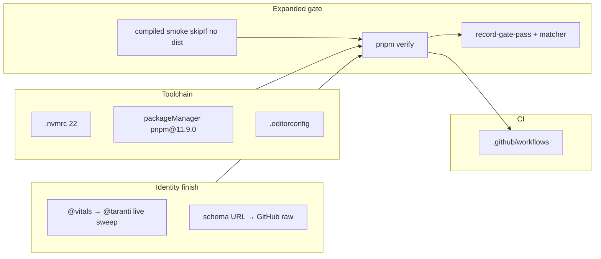

# Milestone 81 — Contributor DX Design

**Spec**: [`.specs/features/contributor-dx-ci/spec.md`](./spec.md)  
**Context**: [context.md](./context.md)  
**Status**: Done

---

## Architecture Overview

Maintainer/DX change set. No scan/trend/assess pipeline stage logic. Touches: toolchain files, schema URL constants, docs/Cursor identity prose, Vitest smoke skip policy, package scripts + quality-gate SoTs, Cursor gate hooks, and a new GitHub Actions workflow.

**Unchanged by design:** CLI bin, `.hotspot-scanner.json`, `vitals-*` skill directories, JSON contract `version` values, coverage thresholds, product scoring/CLI behavior.

---

## Brownfield map (Large)

| Area              | Evidence                                                                                                                      | Execute impact    |
| ----------------- | ----------------------------------------------------------------------------------------------------------------------------- | ----------------- |
| Toolchain         | No `.nvmrc` / `.editorconfig`; no `packageManager`; pnpm **11.9.0** locally                                                   | T1                |
| Smoke             | `tests/compiled-cli.smoke.test.ts` throws if `dist/` missing; CONCERNS + TESTING document must-build                          | T2 (+ docs in T7) |
| Schema URLs       | `vitals.dev` in `schemas/*.json`, `schema-urls.ts`, `exemplar.ts`, contract/config/doctor/bin tests, ARCHITECTURE             | T3                |
| Package leftovers | ~38 files still cite `@vitals/hotspot-scanner` (living docs, Cursor, some Done specs)                                         | T4–T6             |
| Gate SoTs         | `quality-gates.mdc`, CONTRIBUTING (“no CI in v1”, lint optional), TESTING, vitals-project, hooks matcher `pnpm (build\|test)` | T7–T8             |
| CI                | No `.github/workflows/`                                                                                                       | T9                |
| Fragile           | CONCERNS: compiled CLI smoke mitigation — update skipIf wording so risk stays covered when `dist/` exists                     | T2/T7             |

---

## Code Reuse Analysis

### Existing Components to Leverage

| Component            | Location                                               | How to Use                                             |
| -------------------- | ------------------------------------------------------ | ------------------------------------------------------ |
| Schema URL constants | `src/report/schema-urls.ts`                            | Change host/path only                                  |
| Config exemplar      | `src/config/exemplar.ts`                               | Same URL constant pattern                              |
| Compiled smoke       | `tests/compiled-cli.smoke.test.ts`                     | Replace throw with `describe.skipIf(!existsSync(...))` |
| Gate recording       | `.cursor/hooks/record-gate-pass.mjs` + `lib/state.mjs` | Extend regex + timestamps for lint/format:check/verify |
| Hooks smoke          | `.cursor/hooks/smoke/cases.mjs`                        | Assert matcher + allow-after-verify                    |
| M79 sweep pattern    | `.specs/features/package-scope-rename/`                | Exact-string live sweep; keep from→to narrative        |

### Integration Points

| System                      | Integration Method                                                     |
| --------------------------- | ---------------------------------------------------------------------- |
| JSON contracts (`schemas/`) | `$id` host change only — **no** `version` bump                         |
| Emitted `$schema`           | Reporter + exemplar constants                                          |
| `package.json` scripts      | Add `verify`; set `packageManager`                                     |
| GitHub Actions              | New workflow; Node 22 + frozen lockfile + `pnpm verify`                |
| Cursor hooks                | Matcher + freshness semantics for expanded gate                        |
| Living SoTs                 | quality-gates / TESTING / CONTRIBUTING / contributing-sot Allowed line |

---

## Components

### Toolchain pins

- **Purpose**: Align local Node/pnpm/editorconfig with CI
- **Location**: `.nvmrc`, `package.json` (`packageManager`), `.editorconfig`
- **Dependencies**: None
- **Risks**: Wrong pnpm pin → Corepack mismatch — pin **11.9.0** from planning-time `pnpm --version`

### Soft compiled-CLI smoke

- **Purpose**: Skip smoke when `dist/bin/hotspot-scanner.js` missing; run when present
- **Location**: `tests/compiled-cli.smoke.test.ts`
- **Interfaces**: Vitest `describe.skipIf` / `it.skipIf`
- **Risks**: Accidental permanent skip if CI omits build — mitigated by `verify` order build→test

### Schema URL migration

- **Purpose**: Point `$id` / `$schema` at GitHub raw schemas
- **Location**: `schemas/*`, `src/report/schema-urls.ts`, `src/config/exemplar.ts`, tests, ARCHITECTURE `$schema` line + other doc citations
- **Base URL**: `https://raw.githubusercontent.com/AlanTaranti/hotspot-scanner/main/schemas/`
- **Risks**: External consumers of old host; accepted. Raw URLs are not content-negotiated schema stores — fine for `$schema` hints

### Package-string live sweep

- **Purpose**: Finish `@taranti` identity on live surfaces
- **Location**: `.specs/codebase/*`, project titles, AGENTS, Cursor prose; Done specs only where they assert **current** package
- **Risks**: Incomplete sweep; over-editing historical from→to — follow context allowlist

### Expanded gate + hooks

- **Purpose**: Single longer gate + hook freshness
- **Location**: `package.json` `verify`; `.cursor/rules/quality-gates.mdc`; CONTRIBUTING; TESTING; vitals-project; contributing-sot; hooks (`record-gate-pass`, `gate-before-commit` messages, stop/subagent reminders, `hooks.json` matcher, smoke cases, README)
- **Freshness model**:
  - Combined: `pnpm verify` **or** full `build && test && lint && format:check` → `gatePassedAt` (+ component stamps)
  - Split: require `buildPassedAt` ∧ `testPassedAt` ∧ `lintPassedAt` ∧ `formatCheckPassedAt` all ≥ edit mtime
- **Matcher**: Expand `afterShellExecution` matcher so `verify`, `lint`, and `format:check` are observed (escape `:` carefully in regex)

### GitHub Actions

- **Purpose**: Minimal CI
- **Location**: `.github/workflows/ci.yml` (name flexible)
- **Job**: checkout → setup Node 22 + pnpm → `pnpm install --frozen-lockfile` → `pnpm verify`
- **Risks**: First-run format/lint failures — Execute must green locally first

---

## Data Models

No new domain types. URL string constants only.

---

## Error Handling

- Smoke: skip, not throw, when dist missing
- Hooks: failClosed commit deny unchanged; only freshness predicates expand
- CI: standard non-zero fail on any verify step

---

## Testing Strategy

| Layer       | Approach                                                                                                                 |
| ----------- | ------------------------------------------------------------------------------------------------------------------------ |
| Soft smoke  | Targeted Vitest on `tests/compiled-cli.smoke.test.ts` (with and without dist — document manual or temp rename in Verify) |
| Schema URLs | Existing contract + exemplar + config/doctor/bin assertions updated in same tasks                                        |
| Hooks       | `pnpm hooks:smoke` after hook edits (out-of-band vs product gate, still required after hook changes)                     |
| Final       | `pnpm verify`                                                                                                            |

---

## Implementation Notes

1. Prefer one workflow file; default branch name from repo (`main` per M80 URLs).
2. Do not add `typecheck` to `verify` (build covers emit).
3. Update CONCERNS mitigation sentence for smoke: skip-if-missing locally; gate/CI always build first.
4. STACK/CONVENTIONS: note `packageManager`, `.nvmrc`, `verify` script, CI presence in present tense (no M##).
5. STATE Deferred: replace blanket “CI recipes…” with remaining **fail-on / SARIF** only after planning sync.

---

## Risks / Trade-offs (from CONCERNS)

| Risk                                    | Mitigation                                                                                |
| --------------------------------------- | ----------------------------------------------------------------------------------------- |
| Soft skip hides broken compiled aliases | Gate/CI always `build` before `test`; CONCERNS keeps smoke as mitigation when dist exists |
| Hook freshness too loose                | Require all four components or combined verify                                            |
| Schema host change without version bump | Additive URL only; document in STATE Decisions                                            |
| Large docs sweep merge conflicts        | Path Conflict: serialize shared files (ARCHITECTURE, TESTING, CONTRIBUTING, package.json) |

---

## Living docs to sync on Execute Done

| Doc                                      | Why                                                |
| ---------------------------------------- | -------------------------------------------------- |
| ARCHITECTURE.md                          | `$schema` URL host                                 |
| TESTING.md                               | Gate + soft smoke iteration                        |
| CONCERNS.md                              | Smoke mitigation wording + package title if needed |
| STACK.md / CONVENTIONS.md                | Toolchain pins, `verify`, CI                       |
| CONTRIBUTING.md                          | Gate, CI, soft smoke                               |
| quality-gates.mdc / contributing-sot.mdc | Gate command                                       |
| AGENTS.md / vitals-project.md            | Gate pointer (lean)                                |
