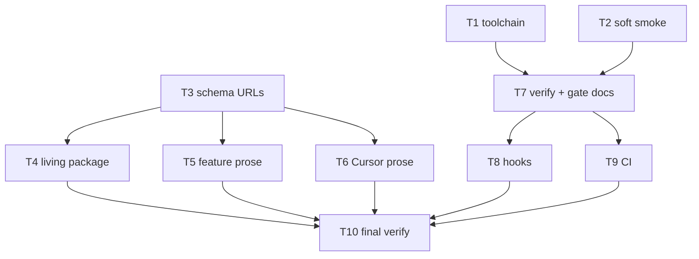

# Milestone 81 — Contributor DX Tasks

**Design**: [design.md](./design.md)  
**Spec**: [spec.md](./spec.md)  
**Context**: [context.md](./context.md)  
**Status**: Done  
**Note**: Large feature — Execute via `orchestrator-implementer`. Do **not** rename `vitals-*` skill folders, bin, or `.hotspot-scanner.json`. Do **not** bump JSON contract versions. Do **not** add SARIF / fail-on-score / publish. Expected final gate: `pnpm verify`.

---

## Execution Plan

### Phase 1: Foundation (parallel OK)

```
T1 [P] toolchain pin
T2 [P] soft compiled-CLI smoke
T3 [P] schema URL migration (+ ARCHITECTURE $schema)
```

### Phase 2: Identity prose (parallel after T3 for URL-in-features)

```
T3 ──┬→ T4 [P] living docs package sweep (excl. ARCHITECTURE — owned by T3)
     ├→ T5 [P] feature prose package + old schema URLs
     └→ T6 [P] Cursor package prose
```

### Phase 3: Expanded gate + hooks + CI

```
T1 + T2 → T7 verify script + gate SoTs/docs
T7 ──┬→ T8 [P] hooks freshness
     └→ T9 [P] GitHub Actions CI
```

### Phase 4: Final verify

```
T4 + T5 + T6 + T8 + T9 → T10 live rg + pnpm verify
```



### Diagram-Definition Cross-Check

| Task | Depends on (declared) | Diagram shows | Match |
| ---- | --------------------- | ------------- | ----- |
| T1   | None                  | Root `[P]`    | yes   |
| T2   | None                  | Root `[P]`    | yes   |
| T3   | None                  | Root `[P]`    | yes   |
| T4   | T3                    | T3→T4         | yes   |
| T5   | T3                    | T3→T5         | yes   |
| T6   | T3                    | T3→T6         | yes   |
| T7   | T1, T2                | T1/T2→T7      | yes   |
| T8   | T7                    | T7→T8         | yes   |
| T9   | T7                    | T7→T9         | yes   |
| T10  | T4, T5, T6, T8, T9    | all→T10       | yes   |

### Path Conflict Check (Check 5)

| Task   | Module owner              | Paths (primary)                                                                                                                                                                                     | Conflict with parallel peers  |
| ------ | ------------------------- | --------------------------------------------------------------------------------------------------------------------------------------------------------------------------------------------------- | ----------------------------- |
| T1 [P] | package root / toolchain  | `.nvmrc`, `.editorconfig`, `package.json` (`packageManager` **only**)                                                                                                                               | vs T7: serialize — T1 first   |
| T2 [P] | tests smoke               | `tests/compiled-cli.smoke.test.ts`                                                                                                                                                                  | None                          |
| T3 [P] | schemas + report + config | `schemas/*.json`, `src/report/schema-urls.ts`, `src/config/exemplar.ts` (+ tests listed), `ARCHITECTURE.md` (schema URL + package title if needed)                                                  | Owns ARCHITECTURE exclusively |
| T4 [P] | living docs               | `.specs/codebase/*` **except** `ARCHITECTURE.md`; `.specs/project/{PROJECT,STATE,STATE-ARCHIVE}.md` titles as needed                                                                                | No ARCHITECTURE               |
| T5 [P] | feature prose             | `.specs/features/**` (current-identity package + old schema URL citations; keep M79 from→to)                                                                                                        | Disjoint                      |
| T6 [P] | Cursor prose              | `.cursor/agents/**`, `.cursor/skills/**` prose, `session-context.mjs` (package string; gate command string may wait for T7/T8)                                                                      | Gate hooks owned by T8        |
| T7     | gate SoTs + scripts       | `package.json` (`verify` script), `quality-gates.mdc`, `contributing-sot.mdc`, `CONTRIBUTING.md`, `TESTING.md`, `vitals-project.md`, AGENTS gate pointer if any, CONCERNS smoke mitigation sentence | After T1/T2                   |
| T8 [P] | hooks                     | `record-gate-pass.mjs`, `lib/state.mjs`, `gate-before-commit.mjs`, stop/subagent reminders, `hooks.json`, `hooks/README.md`, `smoke/cases.mjs`                                                      | vs T9: disjoint               |
| T9 [P] | CI                        | `.github/workflows/*.yml`                                                                                                                                                                           | Disjoint from T8              |
| T10    | gate                      | none (verify only)                                                                                                                                                                                  | After peers                   |

> **`[P]`:** T1/T2/T3; T4/T5/T6 after T3; T8/T9 after T7. `package.json`: T1 then T7. `ARCHITECTURE.md`: T3 only. Hook scripts: T8 only (T6 may edit `session-context.mjs` package string only — if both need gate text, T8 updates gate strings after T6).

### Test Co-location Validation

| Task | Code layer              | Required tests (TESTING.md) | Co-located in task                                      |
| ---- | ----------------------- | --------------------------- | ------------------------------------------------------- |
| T1   | toolchain files         | none                        | n/a                                                     |
| T2   | compiled smoke          | compiled smoke              | yes — same file                                         |
| T3   | schemas + URL constants | contract + unit             | yes — contract/exemplar/config/doctor/bin tests in task |
| T4   | docs                    | none                        | n/a                                                     |
| T5   | docs                    | none                        | n/a                                                     |
| T6   | Cursor prose            | none                        | n/a                                                     |
| T7   | scripts + docs          | none                        | n/a (final gate later)                                  |
| T8   | hooks                   | hooks smoke                 | `pnpm hooks:smoke` in Gate                              |
| T9   | workflow YAML           | none                        | n/a                                                     |
| T10  | gate                    | full                        | `pnpm verify`                                           |

### Granularity Check (Check 1)

| Task | Scope                                      | Status         |
| ---- | ------------------------------------------ | -------------- |
| T1   | Three pin files / one packageManager field | ✅ Granular    |
| T2   | One smoke file skipIf                      | ✅ Granular    |
| T3   | Schema URL host one concern                | ✅ OK cohesive |
| T4   | Living package-string sweep                | ✅ OK cohesive |
| T5   | Feature prose sweep                        | ✅ OK cohesive |
| T6   | Cursor package prose                       | ✅ OK cohesive |
| T7   | verify script + gate documentation         | ✅ OK cohesive |
| T8   | Hooks freshness for expanded gate          | ✅ OK cohesive |
| T9   | One CI workflow                            | ✅ Granular    |
| T10  | Verify-only                                | ✅ Granular    |

---

## Requirement → Task Mapping

| IDs                                                    | Task            |
| ------------------------------------------------------ | --------------- |
| HOTSPOT-1730, HOTSPOT-1731, HOTSPOT-1732               | T1              |
| HOTSPOT-1733, HOTSPOT-1734                             | T2              |
| HOTSPOT-1735                                           | T7 (docs)       |
| HOTSPOT-1736–1741                                      | T3              |
| HOTSPOT-1742                                           | T4              |
| HOTSPOT-1743                                           | T5              |
| HOTSPOT-1744                                           | T6              |
| HOTSPOT-1745, HOTSPOT-1754                             | T10             |
| HOTSPOT-1746, HOTSPOT-1747, HOTSPOT-1748, HOTSPOT-1750 | T7              |
| HOTSPOT-1749                                           | T8              |
| HOTSPOT-1751, HOTSPOT-1752, HOTSPOT-1753               | T9              |
| HOTSPOT-1755–1759                                      | Reserved unused |

---

## Tasks

### T1: Toolchain pin — `.nvmrc`, `packageManager`, `.editorconfig` [P]

**What:** Add `.nvmrc` with `22`. Set `package.json` `"packageManager": "pnpm@11.9.0"`. Add `.editorconfig` with utf-8, lf, indent_size/indent_style matching Prettier (2 spaces). Do **not** add the `verify` script here (T7).  
**Where:** `.nvmrc`, `.editorconfig`, `package.json`  
**Reuses:** Existing Prettier defaults (no `tabWidth` → 2)  
**Depends on:** None  
**Done when:**

- [x] `.nvmrc` is `22`
- [x] `"packageManager"` is `pnpm@11.9.0`
- [x] `.editorconfig` present with charset/utf-8, lf, indent 2

**Tests:** none  
**Gate:** none beyond review (project gate in T10)  
**Verify:** `cat .nvmrc`; `node -e "console.log(require('./package.json').packageManager)"`; read `.editorconfig`

---

### T2: Soft compiled-CLI smoke — skipIf missing dist [P]

**What:** Change `tests/compiled-cli.smoke.test.ts` so missing `dist/bin/hotspot-scanner.js` **skips** the suite (clear message) instead of throwing. When the file exists, existing help smoke cases still run and assert. Remove `assertCompiledCliExists` throw path.  
**Where:** `tests/compiled-cli.smoke.test.ts`  
**Reuses:** Existing `existsSync` + help runners  
**Depends on:** None  
**Done when:**

- [x] No throw that fails the suite when dist is missing
- [x] `describe.skipIf` / equivalent used with a clear reason string
- [x] When dist exists, all four help smokes still execute

**Tests:** `tests/compiled-cli.smoke.test.ts`  
**Gate:** `pnpm exec vitest run tests/compiled-cli.smoke.test.ts` (after `pnpm build` so cases run; optionally confirm skip path by temporarily moving `dist/` — document in Verify)  
**Verify:** After build, smoke tests pass; with dist absent, suite reports skips and vitest exit 0 for that file alone.

---

### T3: Schema URL host → GitHub raw [P]

**What:** Replace `https://vitals.dev/hotspot-scanner/schemas/` with `https://raw.githubusercontent.com/AlanTaranti/hotspot-scanner/main/schemas/` in `schemas/*.json` `$id`, `src/report/schema-urls.ts`, `src/config/exemplar.ts`, and all tests/docs that assert or cite those URLs (including `ARCHITECTURE.md` `$schema` line). Do **not** bump JSON `version` fields. Update ARCHITECTURE package title to `@taranti` if still `@vitals`.  
**Where:** `schemas/*.json`, `src/report/schema-urls.ts`, `src/config/exemplar.ts`, `src/config/exemplar.test.ts`, `src/config/load-config.test.ts`, `src/doctor/index.test.ts`, `src/scan-result/parse-scan-result.test.ts`, `tests/contract/json-schema.test.ts`, `bin/hotspot-scanner.test.ts` (if asserting assess `$schema`), `.specs/codebase/ARCHITECTURE.md`  
**Reuses:** Existing URL constants / `$id` fields  
**Depends on:** None  
**Done when:**

- [x] All four schema `$id`s use the new base
- [x] Emitted constants match
- [x] Tests expect new URLs and pass
- [x] `rg 'https://vitals.dev/hotspot-scanner/schemas'` is zero under `schemas/`, `src/`, `tests/`, `bin/`, `ARCHITECTURE.md`
- [x] Contract versions unchanged

**Tests:** contract + exemplar + config/doctor/scan-result/bin assertions listed above  
**Gate:** `pnpm exec vitest run tests/contract/json-schema.test.ts src/config/exemplar.test.ts src/report/` (and other touched test files as needed)  
**Verify:** Grep old host on code paths = 0; targeted Vitest green.

---

### T4: Living docs package-string sweep [P]

**What:** Replace current-identity `@vitals/hotspot-scanner` with `@taranti/hotspot-scanner` across `.specs/codebase/*` **except** `ARCHITECTURE.md` (T3), plus `.specs/project/PROJECT.md` / STATE titles/headers as needed. Do not rewrite ROADMAP M79 from→to historical wording.  
**Where:** `.specs/codebase/{CONCERNS,CONVENTIONS,DOC-OWNERSHIP,INTEGRATIONS,STACK,STRUCTURE,TESTING}.md`, `.specs/project/PROJECT.md`, `.specs/project/STATE.md` / `STATE-ARCHIVE.md` as needed for **current** identity titles  
**Reuses:** M79 sweep pattern  
**Depends on:** T3  
**Done when:**

- [x] Living codebase docs (excl. ARCHITECTURE handled in T3) assert `@taranti/hotspot-scanner` for current identity
- [x] PROJECT/STATE current titles use `@taranti` where they asserted `@vitals`

**Tests:** none  
**Gate:** none beyond review (project gate in T10)  
**Verify:** `rg '@vitals/hotspot-scanner' .specs/codebase` → only acceptable if zero after T3+T4

---

### T5: Feature prose — package current-identity + schema URL citations [P]

**What:** In `.specs/features/**`, update prose that asserts **current** package `@vitals/hotspot-scanner` → `@taranti/hotspot-scanner`, and citations of old `vitals.dev` schema URLs → GitHub raw. Keep explicit rename-from / historical-before narrative (especially `package-scope-rename/` from→to).  
**Where:** `.specs/features/**`  
**Reuses:** context.md allowlist rules  
**Depends on:** T3  
**Done when:**

- [x] No Done feature spec claims current package is `@vitals/...` without being historical from→to
- [x] Old schema host citations in feature specs updated (or clearly historical-only if documenting a past contract — prefer update for consistency)

**Tests:** none  
**Gate:** none beyond review (project gate in T10)  
**Verify:** Spot-check `config-doctor-dx`, `contract-enrich-additive`, `api-trust-docs`, `readme-adoption-dx`

---

### T6: Cursor agents/skills prose package sweep [P]

**What:** Replace current-identity `@vitals/hotspot-scanner` with `@taranti/hotspot-scanner` in `.cursor/agents/**`, `.cursor/skills/**` prose, and `session-context.mjs` package citation. Do **not** rename `vitals-*` folders. Leave gate-command string updates to T7/T8 if still `pnpm build && pnpm test`.  
**Where:** `.cursor/agents/**`, `.cursor/skills/**`, `.cursor/hooks/session-context.mjs`  
**Reuses:** M79 Cursor sweep  
**Depends on:** T3  
**Done when:**

- [x] Cursor prose current package citations are `@taranti/hotspot-scanner`
- [x] Skill directories still named `vitals-*`

**Tests:** none  
**Gate:** none beyond review (project gate in T10)  
**Verify:** `rg '@vitals/hotspot-scanner' .cursor/agents .cursor/skills .cursor/hooks/session-context.mjs`

---

### T7: Expanded gate — `pnpm verify` + SoTs/docs

**What:** Add `"verify": "pnpm build && pnpm test && pnpm lint && pnpm format:check"` to `package.json`. Update `quality-gates.mdc`, `contributing-sot.mdc` Allowed gate line, `CONTRIBUTING.md` (required gate = verify; remove “no CI in v1” / move lint+format onto the gate; document soft-smoke iteration), `TESTING.md` (gate table + soft-smoke iteration), `vitals-project.md` gate snippet, AGENTS lean gate pointer if present, CONCERNS smoke mitigation sentence for skipIf + gate/CI build-first. Still **one** gate (no tiers).  
**Where:** `package.json`, `.cursor/rules/quality-gates.mdc`, `.cursor/rules/contributing-sot.mdc`, `CONTRIBUTING.md`, `.specs/codebase/TESTING.md`, `.specs/codebase/CONCERNS.md` (smoke row only), `.cursor/skills/vitals-common/references/vitals-project.md`, `AGENTS.md` (gate pointer only if it cites the old command)  
**Reuses:** Existing lint/format scripts  
**Depends on:** T1, T2  
**Done when:**

- [x] `pnpm verify` script exists and chains the four steps in order
- [x] quality-gates + CONTRIBUTING + TESTING document `pnpm verify` as the required gate
- [x] Soft-smoke iteration documented (HOTSPOT-1735)
- [x] No Quick/Full/Build gate tiers introduced

**Tests:** none  
**Gate:** `pnpm verify` (may be red until T3–T6/T8 complete — if too early, run `pnpm lint && pnpm format:check` only here and defer full verify to T10; prefer full verify if tree already green)  
**Verify:** `node -e "console.log(require('./package.json').scripts.verify)"`; read quality-gates.mdc

---

### T8: Hooks — expanded gate freshness [P]

**What:** Teach `record-gate-pass.mjs` + `lib/state.mjs` to treat `pnpm verify` and the full four-step chain as combined gate success; record lint/format:check component timestamps for split freshness; require all four (or combined) in `gateTimestampsCurrent`. Update `hooks.json` matcher, `gate-before-commit` / stop / subagent reminder strings, hooks README, and smoke cases (allow after verify; matcher covers verify/lint/format:check). Update `session-context.mjs` gate string if still old. Run `pnpm hooks:smoke`.  
**Where:** `.cursor/hooks/record-gate-pass.mjs`, `.cursor/hooks/lib/state.mjs`, `.cursor/hooks.json`, `.cursor/hooks/gate-before-commit.mjs`, `.cursor/hooks/stop-gate-reminder.mjs`, `.cursor/hooks/subagent-stop.mjs`, `.cursor/hooks/session-context.mjs`, `.cursor/hooks/README.md`, `.cursor/hooks/smoke/cases.mjs`  
**Reuses:** Existing gatePassedAt / buildPassedAt / testPassedAt pattern  
**Depends on:** T7  
**Done when:**

- [x] Successful `pnpm verify` records `gatePassedAt`
- [x] Split path requires build+test+lint+format:check
- [x] Matcher observes verify/lint/format:check
- [x] `pnpm hooks:smoke` exits 0

**Tests:** hooks smoke  
**Gate:** `pnpm hooks:smoke`  
**Verify:** Smoke cases for allow-after-verify / matcher wiring pass.

---

### T9: Minimal GitHub Actions CI [P]

**What:** Add `.github/workflows/ci.yml` (or equivalent) on `push` + `pull_request` to default branch (`main`). Job: checkout, Node 22, pnpm via Corepack or setup-node/pnpm, `pnpm install --frozen-lockfile`, `pnpm verify`. No SARIF, no fail-on-score, no product metric gates.  
**Where:** `.github/workflows/ci.yml`  
**Reuses:** `pnpm verify` from T7; `.nvmrc` / `packageManager` from T1  
**Depends on:** T7  
**Done when:**

- [x] Workflow triggers on push/PR to default branch
- [x] Node 22 + frozen lockfile + `pnpm verify`
- [x] No fail-on/SARIF steps

**Tests:** none  
**Gate:** none beyond YAML review (project gate in T10)  
**Verify:** Read workflow; confirm steps match context locks.

---

### T10: Live leftover verify + `pnpm verify`

**What:** Confirm live-path package-string and old schema-host greps per context; run full `pnpm verify`. Sync STACK/CONVENTIONS present-tense notes for pins/`verify`/CI if not already done in T7.  
**Where:** none (run + light living-doc touch if STACK/CONVENTIONS still stale)  
**Reuses:** Final gate pattern from M79/M80  
**Depends on:** T4, T5, T6, T8, T9  
**Done when:**

- [x] Live-path `rg '@vitals/hotspot-scanner'` zero per context rules
- [x] Code/docs `rg 'https://vitals.dev/hotspot-scanner/schemas'` zero (or only intentional historical from→to if any remain — prefer zero)
- [x] `pnpm verify` exits 0

**Tests:** full suite via verify  
**Gate:** `pnpm verify`  
**Verify:**

```bash
pnpm verify
rg '@vitals/hotspot-scanner' .specs/codebase AGENTS.md CONTRIBUTING.md README.md .cursor/agents .cursor/skills .cursor/hooks/session-context.mjs .specs/project/PROJECT.md || true
rg 'https://vitals.dev/hotspot-scanner/schemas' schemas src tests bin .specs/codebase || true
```

---

## Suggested execution order

1. T1 ∥ T2 ∥ T3
2. T4 ∥ T5 ∥ T6
3. T7 → (T8 ∥ T9)
4. T10
