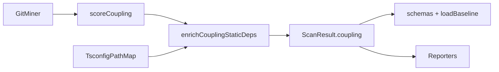

# Milestone 27 — Coupling Enrichment Design

**Spec**: [`.specs/features/coupling-enrichment/spec.md`](./spec.md)  
**Context**: [`.specs/features/coupling-enrichment/context.md`](./context.md)  
**Status**: Done  
**Sister designs**: [enriched-coupling (M14)](../enriched-coupling/design.md), [json-contract (M20)](../json-contract/design.md)

---

## Architecture Overview

M27 **extends** the M14 post-score enricher. Temporal coupling ranking stays identical. Each surviving `CouplingPair` gains richer static-edge metadata: direction, runtime vs type-only, re-export annotation, and alias-aware resolution via nearest tsconfig/jsconfig `paths`/`baseUrl`.



**Baseline code:** `src/scoring/enrich-coupling-static.ts` (relative-only today), `CouplingPair` in `src/types/domain.ts`, reporters under `src/report/`, schemas under `schemas/`.

**Hard boundary:** Do not touch `src/git/rename.ts` / `PathAliasMap` / M26 RT-003 warnings.

---

## Code Reuse Analysis

### Existing Components to Leverage

| Component                        | Location                                | How to Use                                                           |
| -------------------------------- | --------------------------------------- | -------------------------------------------------------------------- |
| `enrichCouplingStaticDeps`       | `src/scoring/enrich-coupling-static.ts` | Extend: structured edges + alias resolve; keep export name           |
| Relative resolution helpers      | same file                               | Keep `buildResolutionCandidates` / extension fallbacks               |
| `scoreCoupling`                  | `src/scoring/coupling-scorer.ts`        | Untouched formulas                                                   |
| `runScan` wiring                 | `src/scan.ts`                           | Already calls enricher — may only pass through unless options needed |
| Reporters                        | `src/report/*`                          | Add Direction / Kinds columns; CSV headers                           |
| `assertCouplingPair`             | `src/compare/load-baseline.ts`          | Require + type-check new fields (M14 pattern)                        |
| JSON Schema `$defs/CouplingPair` | `schemas/scan-result.json`              | Additive required properties                                         |
| M14 unit tests / fixtures        | `enrich-coupling-static.test.ts`        | Extend cases; do not delete relative-resolution coverage             |

### Integration Points

| Consumer                         | Impact                                                   |
| -------------------------------- | -------------------------------------------------------- |
| `src/types/domain.ts`            | New fields + `StaticDependencyDirection` type            |
| `src/scoring/`                   | New path-map helper + enricher rewrite of edge detection |
| `schemas/` + `tests/contract/`   | Required fields; contract fixtures                       |
| `src/compare/load-baseline.ts`   | Reject missing new fields                                |
| `src/report/`                    | Table/markdown/CSV/compare surfaces                      |
| Report/scan fixtures             | Sample coupling objects include new fields               |
| ARCHITECTURE / CONCERNS / README | Document enriched fields + paths mitigation              |

### Fragile areas (CONCERNS.md)

| Area                                      | Mitigation                                                            |
| ----------------------------------------- | --------------------------------------------------------------------- |
| Scoring formulas                          | Do **not** edit `couplingStrength`; enrich metadata only              |
| Enriched coupling false negatives (paths) | This milestone — alias resolution                                     |
| Renamed-unlinked → false                  | Document only; no PathAliasMap in scoring                             |
| ts-morph boundary                         | No ts-morph in `src/scoring/`; literal extract + JSONC tsconfig parse |
| JSON contract / baselines                 | Strict required fields + re-scan hint (M20 pattern)                   |

---

## Components

### CouplingPair + StaticDependencyDirection

- **Purpose**: Domain contract for enriched static-edge metadata
- **Location**: `src/types/domain.ts`
- **Interfaces**:
  - `type StaticDependencyDirection = "none" | "a-to-b" | "b-to-a" | "both"`
  - `CouplingPair` fields per [context.md](./context.md)
- **Dependencies**: None
- **Reuses**: Existing coupling fields; keep `hasStaticDependency`

### TsconfigPathMap (new)

- **Purpose**: Load nearest `tsconfig.json`/`jsconfig.json`, honor shallow `extends` for `baseUrl`/`paths`, map a non-relative specifier + importer path → resolved repo-relative candidate paths
- **Location**: `src/scoring/tsconfig-path-map.ts` (name flexible; must stay under `src/scoring/`)
- **Interfaces** (illustrative):
  - `loadPathMapForImporter(repoPath: string, importerRepoRelative: string): PathAliasResolver | null`
  - `resolveAliasSpecifier(resolver, importerRepoRelative, specifier): string[]` — candidates (may be empty)
  - Cache maps by config file path within a single enricher pass (pairs share configs)
- **Dependencies**: `node:fs`, `node:path`; JSONC strip helper (local)
- **Reuses**: Same repo-relative path normalization as enricher (`normalizeRepoPath`)
- **Does not**: parse `package.json` exports; use TypeScript compiler API; touch git rename map

### Edge extractor + enrichCouplingStaticDeps (extend)

- **Purpose**: For each pair, discover static edges in both directions with kind flags; set all CouplingPair static fields
- **Location**: `src/scoring/enrich-coupling-static.ts` (+ tests)
- **Interfaces**:
  - Keep `enrichCouplingStaticDeps(pairs, repoPath): CouplingPair[]`
  - Internal: extract structured references `{ specifier, isTypeOnly, isReExport }` from source text
  - Resolve specifier: if relative → existing M14 path; else → TsconfigPathMap candidates; then extension/index candidates; match peer
- **Dependencies**: TsconfigPathMap; `node:fs`
- **Reuses**: M14 relative patterns; extend regexes to capture non-relative string literals in the same construct positions; classify `import type` / `export type` / `export … from`

### Schema + baseline validation

- **Purpose**: Publish and enforce additive contract
- **Location**: `schemas/scan-result.json`, `src/compare/load-baseline.ts`, `tests/contract/`
- **Interfaces**: enum for `staticDependencyDirection`; booleans for kind flags; required arrays updated
- **Dependencies**: Domain field names from context
- **Reuses**: M14 `hasStaticDependency` rejection message pattern

### Reporters

- **Purpose**: Human/pipeline surfaces for new fields
- **Location**: `src/report/table.ts`, `markdown.ts`, `csv.ts`, `compare-*.ts`, related tests/fixtures
- **Interfaces**: Direction display map (`a-to-b` → `a→b`); Kinds from flags; CSV snake/camel headers matching JSON property names for the four new fields
- **Dependencies**: Updated `CouplingPair`
- **Reuses**: Existing `formatStaticDep`

---

## Data Models

```typescript
type StaticDependencyDirection = "none" | "a-to-b" | "b-to-a" | "both";

interface CouplingPair {
  fileA: string;
  fileB: string;
  coChangeCount: number;
  couplingStrength: number;
  hasStaticDependency: boolean;
  staticDependencyDirection: StaticDependencyDirection;
  hasRuntimeStaticDependency: boolean;
  hasTypeOnlyStaticDependency: boolean;
  hasReExportStaticDependency: boolean;
}

/** Internal edge used only inside the enricher */
interface StaticEdge {
  from: string; // importer repo-relative path
  to: string; // resolved peer path
  isTypeOnly: boolean;
  isReExport: boolean;
}
```

**Relationships**: Compare identity remains canonical `(fileA, fileB)` pair key — direction fields are metadata, not identity. Ranking arrays unchanged.

**Aggregation**: For a pair `(fileA, fileB)`:

- Collect edges A→B and B→A
- Direction from which sides have ≥1 edge
- Kind flags = OR across all edges
- `hasStaticDependency` = OR of runtime/type-only flags

---

## Error Handling Strategy

| Error Scenario                 | Handling                                 | User Impact                    |
| ------------------------------ | ---------------------------------------- | ------------------------------ |
| Missing/unreadable source      | No edges from that file                  | Pair may still have other side |
| Missing/invalid tsconfig       | Alias resolve unavailable; relative-only | Possible false negatives       |
| Broken `extends` target        | Use partial options; no throw            | Best-effort aliases            |
| Alias resolves but not to peer | Ignore (no edge)                         | Correct for that pair          |
| Malformed import line          | Skip line                                | Best-effort                    |
| Baseline missing new fields    | `BaselineError` + re-scan hint           | User regenerates baseline      |
| Empty coupling list            | No-op enrich                             | None                           |

---

## Tech Decisions

| Decision                | Choice                            | Rationale                                      |
| ----------------------- | --------------------------------- | ---------------------------------------------- |
| Flat additive fields    | Four new fields + keep boolean    | CSV/table friendly; clear invariants           |
| Version                 | Stay `"1.0"`                      | Additive precedent                             |
| Paths scope             | tsconfig/jsconfig paths + baseUrl | ROADMAP; package exports deferred              |
| Nearest config walk     | Up from importer to repo root     | Monorepo packages often have local tsconfigs   |
| No ts-morph in scoring  | Literal extract + JSONC           | INTEGRATIONS.md                                |
| Separate PathMap module | `tsconfig-path-map.ts`            | Testable; path-conflict isolation from reports |
| M26 boundary            | Zero PathAliasMap coupling        | Explicit ROADMAP boundary                      |
| Schema required         | New fields required               | Same strictness as M14 boolean                 |

---

## Risks

| Risk                                            | Mitigation                                                                  |
| ----------------------------------------------- | --------------------------------------------------------------------------- |
| Over-broad regex false positives on strings     | Anchor on `import`/`from`/`require`/`export` constructs; unit fixtures      |
| Complex `paths` patterns (`*` count mismatches) | Support single `*` segment patterns first; document unsupported as no-match |
| Fixture explosion for monorepos                 | Prefer temp dirs in unit tests; one small fixture tree if integration needs |
| Reporter column width                           | Compact Direction + Kinds; keep StaticDep                                   |
| Baseline churn for users                        | Clear re-scan error; document in ARCHITECTURE / README                      |
