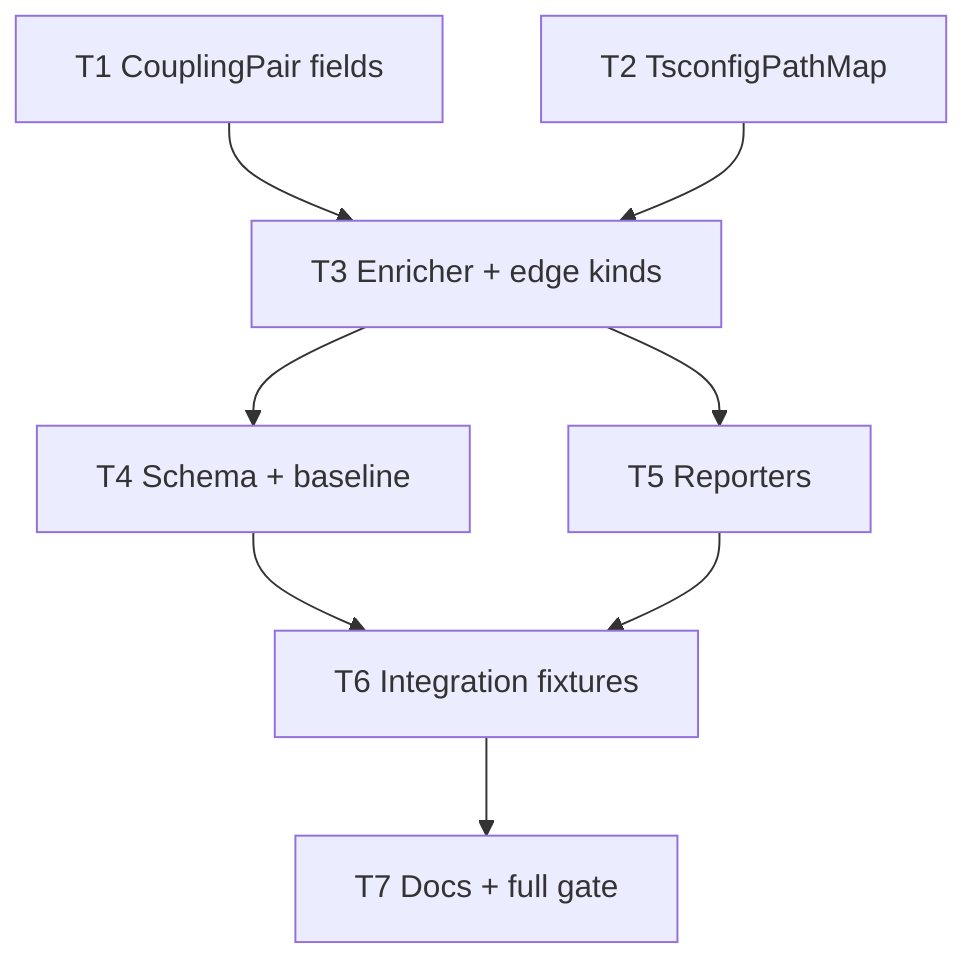

# Milestone 27 — Coupling Enrichment Tasks

**Design**: [`.specs/features/coupling-enrichment/design.md`](./design.md)  
**Spec**: [`.specs/features/coupling-enrichment/spec.md`](./spec.md)  
**Context**: [`.specs/features/coupling-enrichment/context.md`](./context.md)  
**Status**: Done

---

## Execution Plan

### Phase 1: Domain + path map (parallel after types if needed)

```
T1 domain types → T2 tsconfig-path-map [P after T1 optional; T2 does not need domain]
```

Prefer: T1 and T2 can start together (T2 has no type dependency). Diagram treats T2 as independent root; T3 depends on both.

### Phase 2: Enricher (Sequential)

```
T1, T2 → T3 enrichCouplingStaticDeps extension + unit tests
```

### Phase 3: Contract + reporters (Parallel)

```
T3 → T4 schemas/baseline [P]
T3 → T5 reporters [P]
```

### Phase 4: Integration + docs/gate (Sequential)

```
T4, T5 → T6 integration/fixtures → T7 docs + full gate
```



### Diagram-Definition Cross-Check

| Task | Depends on (declared) | Diagram shows | Match |
| ---- | --------------------- | ------------- | ----- |
| T1   | None                  | Root          | ✅    |
| T2   | None                  | Root          | ✅    |
| T3   | T1, T2                | T1→T3, T2→T3  | ✅    |
| T4   | T3                    | T3→T4         | ✅    |
| T5   | T3                    | T3→T5         | ✅    |
| T6   | T4, T5                | T4→T6, T5→T6  | ✅    |
| T7   | T6                    | T6→T7         | ✅    |

### Path Conflict Check

| Task | Module owner         | Paths                                                                                   | Conflict with parallel peers                   |
| ---- | -------------------- | --------------------------------------------------------------------------------------- | ---------------------------------------------- |
| T1   | `src/types/`         | `domain.ts` (+ export if needed)                                                        | Disjoint from T2                               |
| T2   | `src/scoring/`       | `tsconfig-path-map.ts`, `tsconfig-path-map.test.ts`, optional `scoring/index.ts` export | Disjoint from T1; **do not** edit enricher yet |
| T3   | `src/scoring/`       | `enrich-coupling-static.ts`, `enrich-coupling-static.test.ts`                           | After T2 — sole enricher owner                 |
| T4   | `schemas/` + compare | `schemas/scan-result.json`, `src/compare/load-baseline.ts`, contract/baseline tests     | Disjoint from T5                               |
| T5   | `src/report/`        | table/markdown/csv/compare-* + report fixtures/tests                                    | Disjoint from T4 — **[P] OK**                  |
| T6   | fixtures + scan      | `tests/fixtures/**` as needed, scan/integration tests                                   | After T4+T5                                    |
| T7   | docs                 | ARCHITECTURE, CONCERNS, README/STRUCTURE as needed                                      | After T6                                       |

> **[P]**: T1∥T2 (phase 1); T4∥T5 (phase 3). T3 owns all enricher edits alone.

### Test Co-location Validation

| Task | Code layer created/modified             | Matrix / TESTING.md expectation | Task Tests field                                    | Match |
| ---- | --------------------------------------- | ------------------------------- | --------------------------------------------------- | ----- |
| T1   | `src/types/`                            | none (excluded from coverage)   | none                                                | ✅    |
| T2   | `src/scoring/tsconfig-path-map.ts`      | unit required                   | unit — `tsconfig-path-map.test.ts`                  | ✅    |
| T3   | `src/scoring/enrich-coupling-static.ts` | unit required                   | unit — `enrich-coupling-static.test.ts`             | ✅    |
| T4   | `schemas/` + `src/compare/`             | unit + contract                 | unit + contract — load-baseline + json-schema tests | ✅    |
| T5   | `src/report/`                           | unit required                   | unit — affected `src/report/*.test.ts`              | ✅    |
| T6   | scan / fixtures                         | integration                     | integration — scan/enrich fixture asserts           | ✅    |
| T7   | docs                                    | full gate                       | gate — `pnpm build && pnpm test`                    | ✅    |

### Requirement → Task Mapping

| Requirement ID | Task(s)    |
| -------------- | ---------- |
| HOTSPOT-231    | T1, T3     |
| HOTSPOT-232    | T1, T3     |
| HOTSPOT-233    | T2, T3     |
| HOTSPOT-234    | T3         |
| HOTSPOT-235    | T3         |
| HOTSPOT-236    | T3         |
| HOTSPOT-237    | T2, T3     |
| HOTSPOT-238    | T4         |
| HOTSPOT-239    | T4         |
| HOTSPOT-240    | T5         |
| HOTSPOT-241    | T3, T6, T7 |
| HOTSPOT-242    | T7         |

**Coverage:** 12 total, 12 mapped, 0 unmapped

---

## Task Breakdown

### T1: Extend CouplingPair domain types [P with T2]

**What**: Add `StaticDependencyDirection` and the four additive fields on `CouplingPair` per context.md. Fix compile breakages with temporary placeholders only where unavoidable (prefer T3 as sole producer of complete pairs; scorer may keep setting enrichment defaults if it currently constructs pairs — today enricher overwrites `hasStaticDependency`; extend that pattern).

**Where**: `src/types/domain.ts` (and `src/types/index.ts` only if re-exports need touch)

**Depends on**: None

**Reuses**: Existing `CouplingPair`; [context.md](./context.md) field names exactly

**Requirement**: HOTSPOT-231, HOTSPOT-232

**Tools**:

- MCP: NONE
- Skill: NONE

**Done when**:

- [x] `StaticDependencyDirection` exported
- [x] `CouplingPair` includes all four new fields with correct types
- [x] `pnpm exec tsc --noEmit` succeeds **or** only expected breakages are in scoring/report/compare until T3–T5 (document in task notes if temporary `as` casts are used — remove by T6)

**Tests**: none (types layer)

**Gate**: `pnpm exec tsc --noEmit` (or `pnpm build` if placeholders keep build green)

---

### T2: Implement TsconfigPathMap [P with T1]

**What**: Add `src/scoring/tsconfig-path-map.ts` that walks up from importer to repo root for `tsconfig.json`/`jsconfig.json`, parses JSONC, applies shallow `extends` merge for `compilerOptions.baseUrl`/`paths`, and resolves non-relative specifiers to candidate repo-relative paths (single `*` patterns). Cache by config path within a helper instance/pass. Unit tests with temp dirs: hit, miss, missing config, broken extends, nested package config wins.

**Where**: `src/scoring/tsconfig-path-map.ts`, `src/scoring/tsconfig-path-map.test.ts`, optionally export from `src/scoring/index.ts`

**Depends on**: None

**Reuses**: Path normalization style from `enrich-coupling-static.ts` (`normalizeRepoPath` — extract shared tiny helper only if needed without circular imports)

**Requirement**: HOTSPOT-233, HOTSPOT-237

**Tools**:

- MCP: NONE
- Skill: `vitals-pipeline-domain`

**Done when**:

- [x] Nearest-config walk + `paths`/`baseUrl` resolution covered by unit tests
- [x] Missing/invalid config → empty/null resolve (no throw)
- [x] No `typescript` / `ts-morph` runtime imports
- [x] No imports from `src/git/rename` / PathAliasMap
- [x] Gate check passes: targeted vitest
- [x] Test count: new path-map tests pass (no silent deletions elsewhere)

**Tests**: unit — `tsconfig-path-map.test.ts`

**Gate**: `pnpm exec vitest run src/scoring/tsconfig-path-map.test.ts`

---

### T3: Enrich static edges with direction, kinds, and aliases

**What**: Extend `enrichCouplingStaticDeps` to (1) extract structured edges including non-relative specifiers, (2) resolve via relative M14 logic **or** T2 path map, (3) set `staticDependencyDirection` and kind flags + keep `hasStaticDependency` consistent with invariants. Cover directions, type-only, runtime, re-export, mixed, alias hit/miss, missing file. Preserve pair order and strength fields by shallow copy.

**Where**: `src/scoring/enrich-coupling-static.ts`, `src/scoring/enrich-coupling-static.test.ts`

**Depends on**: T1, T2

**Reuses**: T2 resolver; existing relative resolution; M14 true/false cases must remain green

**Requirement**: HOTSPOT-231, HOTSPOT-232, HOTSPOT-233, HOTSPOT-234, HOTSPOT-235, HOTSPOT-236, HOTSPOT-237, HOTSPOT-241

**Tools**:

- MCP: NONE
- Skill: `vitals-pipeline-domain`, `coding-guidelines`

**Done when**:

- [x] All four direction values tested
- [x] Type-only-only / runtime / re-export / mixed cases tested
- [x] Alias path sets edge when peer matches; bare package without paths does not
- [x] Invariants from context.md asserted in tests
- [x] Ranking fields (`coChangeCount`, `couplingStrength`) and input order preserved
- [x] No PathAliasMap / ts-morph imports
- [x] Gate check passes: enricher + path-map tests
- [x] Test count: enricher suite grows; prior relative cases still pass

**Tests**: unit — `enrich-coupling-static.test.ts` (and path-map still green)

**Gate**: `pnpm exec vitest run src/scoring/enrich-coupling-static.test.ts src/scoring/tsconfig-path-map.test.ts`

---

### T4: Schema + baseline validation [P with T5 after T3]

**What**: Update `schemas/scan-result.json` `$defs/CouplingPair` with new properties + `required` entries (`staticDependencyDirection` enum; three booleans). Keep `version` `"1.0"`. Extend `assertCouplingPair` in `load-baseline.ts` to require and type-check new fields with re-scan hint on missing. Update contract tests and any baseline fixtures.

**Where**: `schemas/scan-result.json`, `src/compare/load-baseline.ts`, `src/compare/load-baseline.test.ts`, `tests/contract/json-schema.test.ts` (and fixtures under `tests/fixtures/` / report JSON samples that participate in contract)

**Depends on**: T3

**Reuses**: M14 `hasStaticDependency` rejection message pattern

**Requirement**: HOTSPOT-238, HOTSPOT-239

**Tools**:

- MCP: NONE
- Skill: NONE

**Done when**:

- [x] Schema requires all new fields; compare schema still `$ref`s CouplingPair
- [x] Missing any new field → BaselineError with re-scan hint
- [x] Wrong types rejected
- [x] Contract tests green against updated fixtures
- [x] Gate check passes: compare + contract vitest

**Tests**: unit + contract — `load-baseline.test.ts`, `tests/contract/`

**Gate**: `pnpm exec vitest run src/compare/load-baseline.test.ts tests/contract/`

---

### T5: Reporter surfaces for enrichment fields [P with T4 after T3]

**What**: Show Direction + Kinds (and keep StaticDep) in table/markdown; add CSV columns for the four new fields; ensure JSON passthrough and compare renderers include them. Update report fixtures and unit tests.

**Where**: `src/report/table.ts`, `markdown.ts`, `csv.ts`, `compare-table.ts`, `compare-markdown.ts`, `compare-csv.ts`, related `*.test.ts`, `tests/fixtures/report/*` as needed

**Depends on**: T3

**Reuses**: [context.md](./context.md) display mapping (`a-to-b` → `a→b`; kinds list)

**Requirement**: HOTSPOT-240

**Tools**:

- MCP: NONE
- Skill: NONE

**Done when**:

- [x] Table/markdown include Direction and Kinds
- [x] CSV headers include the four new field names
- [x] Compare coupling rows include new columns/fields
- [x] Reporter unit tests updated and green

**Tests**: unit — `src/report/` tests touching coupling

**Gate**: `pnpm exec vitest run src/report/`

---

### T6: Integration fixture + scan wiring verification

**What**: Ensure `runScan()` output always includes complete enrichment fields. Add or extend a fixture (temp dir or `tests/fixtures/repos/…`) with tsconfig `paths` alias between co-changing files and assert JSON coupling fields. Confirm no scan.ts API change unless necessary (enricher already wired). Update any scan/integration tests that construct `CouplingPair` literals.

**Where**: `src/scan.ts` only if needed; `src/scan*.test.ts` / integration tests; `tests/fixtures/` as needed (`fixture-builder` OK)

**Depends on**: T4, T5

**Reuses**: Existing `runScan` enrich call; `vitals-cli-validation` for optional CLI JSON spot-check

**Requirement**: HOTSPOT-241 (integration evidence), HOTSPOT-232

**Tools**:

- MCP: NONE
- Skill: `vitals-cli-validation` (optional CLI assert), `fixture-builder` if new repo fixture

**Done when**:

- [x] Integration/unit scan assert: alias-linked pair → `hasStaticDependency: true` + expected direction
- [x] All coupling objects in scan JSON include new required fields
- [x] No edits to `src/git/rename.ts` / PathAliasMap
- [x] Targeted tests pass

**Tests**: integration (+ unit updates for CouplingPair fixtures)

**Gate**: `pnpm exec vitest run src/scoring/ src/scan.integration.test.ts src/compare/load-baseline.test.ts` (adjust to actual integration file names present)

---

### T7: Documentation + full quality gate

**What**: Update ARCHITECTURE enriched-coupling section (fields, paths resolution, direction/kinds). Update CONCERNS: move/resolve “no tsconfig paths” unmitigated row for the paths portion; note `package.json` exports still deferred. Brief README mention if coupling output columns are documented. Sync STRUCTURE only if new file listing needed. Do **not** edit ROADMAP/STATE in this task if parent owns sync — but feature docs under `.specs/codebase/` are in scope.

**Where**: `.specs/codebase/ARCHITECTURE.md`, `.specs/codebase/CONCERNS.md`, `.specs/codebase/STRUCTURE.md` (if needed), `README.md` (if coupling columns documented)

**Depends on**: T6

**Reuses**: M14 doc style in ARCHITECTURE

**Requirement**: HOTSPOT-242, HOTSPOT-241 (docs boundary note)

**Tools**:

- MCP: NONE
- Skill: NONE

**Done when**:

- [x] ARCHITECTURE documents new CouplingPair fields + paths alias behavior
- [x] CONCERNS reflects paths mitigation (exports gap may remain)
- [x] Gate check passes: `pnpm build && pnpm test`
- [x] Test count: no silent deletions vs pre-task baseline

**Tests**: full suite via gate

**Gate**: `pnpm build && pnpm test`

**Commit** (propose only): `feat(scoring): enrich coupling with paths, direction, and edge kinds`

---

## Parallel Execution Map

```
Phase 1 (Parallel):
  ├── T1 [P]
  └── T2 [P]

Phase 2 (Sequential):
  T1 ∧ T2 complete → T3

Phase 3 (Parallel):
  T3 complete, then:
    ├── T4 [P]
    └── T5 [P]

Phase 4 (Sequential):
  T4 ∧ T5 complete → T6 → T7
```

**Parallelism constraint:** T4 and T5 touch disjoint prefixes (`schemas/`+`compare` vs `report`). T1 and T2 touch `types` vs new scoring file (not enricher). Unit tests are parallel-safe per TESTING.md (Vitest file isolation).

---

## Task Granularity Check

| Task | Scope                                     | Status      |
| ---- | ----------------------------------------- | ----------- |
| T1   | Domain type fields                        | ✅ Granular |
| T2   | One path-map module + tests               | ✅ Granular |
| T3   | Enricher behavior + tests (cohesive file) | ✅ OK       |
| T4   | Schema + baseline contract                | ✅ Granular |
| T5   | Reporter surfaces                         | ✅ Granular |
| T6   | Integration wiring/fixtures               | ✅ Granular |
| T7   | Docs + full gate                          | ✅ Granular |

---

## Validate Before Presenting (planning checks)

| Check                   | Result      |
| ----------------------- | ----------- |
| 1. Task granularity     | ✅          |
| 2. Diagram ↔ Depends on | ✅          |
| 3. Test co-location     | ✅          |
| 4. Path conflict        | ✅          |
| 5. Status               | **Planned** |

---

## Handoff

Planning complete for `coupling-enrichment`. Promote Status to `Approved` / `Ready for Execute` in a **new** development session, then invoke `orchestrator-implementer`.

Final gate expected: `pnpm build && pnpm test`
