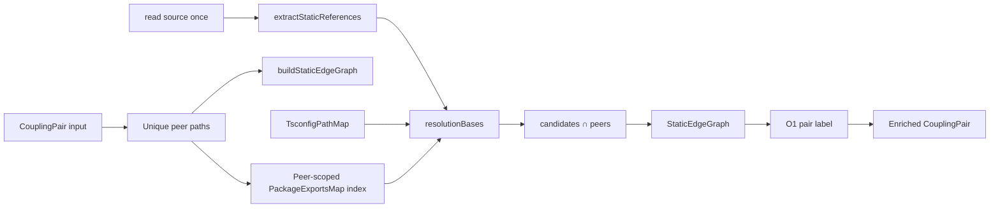

# Milestone 44 — Coupling Package Exports Design

**Spec**: [`.specs/features/coupling-package-exports/spec.md`](./spec.md)  
**Context**: [`.specs/features/coupling-package-exports/context.md`](./context.md)  
**Status**: Planned  
**Sister designs**: [coupling-enrichment (M27)](../coupling-enrichment/design.md), [static-enrich-cache (M33)](../static-enrich-cache/design.md)

---

## Architecture Overview

M44 **extends** the M33 peer-scoped static enricher with a third resolution family: in-repo `package.json` `"imports"` / `"exports"` (plus `"main"` fallback). Temporal ranking and CouplingPair field shape stay identical. Resolution plugs into the existing `resolutionBases` → `buildResolutionCandidates` → peer equality path inside `buildStaticEdgeGraph`.



**Baseline code:** `src/scoring/enrich-coupling-static.ts`, `src/scoring/tsconfig-path-map.ts`  
**Hard boundaries:** no PathAliasMap; no ts-morph in scoring; no `node_modules` walk; no ranking/schema field changes; no M45 package publish exports map.

---

## Code Reuse Analysis

### Existing Components to Leverage

| Component | Location | How to Use |
| --------- | -------- | ---------- |
| `buildStaticEdgeGraph` / `getStaticEdge` | `enrich-coupling-static.ts` | Keep; extend `resolutionBases` only |
| `buildResolutionCandidates` | same | Reuse after package target → base path |
| `extractStaticReferences` + kind merge | same | Unchanged classification |
| `TsconfigPathMap` | `tsconfig-path-map.ts` | Keep order: try before package name exports; pattern helpers inspirational for single-`*` |
| `normalizeRepoPath` | enricher / path-map | Share for package-relative targets |
| M33 read-once tests | `enrich-coupling-static.test.ts` | Extend; do not delete |
| M14/M27 enrich cases | same | Regression oracle |

### Integration Points

| Consumer | Impact |
| -------- | ------ |
| `src/scoring/package-exports-map.ts` (new) | Parse + resolve + peer package index |
| `src/scoring/enrich-coupling-static.ts` | Wire map into `resolutionBases` / graph build |
| `src/scan.ts` | **No change** — already calls enricher |
| `schemas/` / reporters / compare | **No shape change** — behavior-only |
| `tests/fixtures/repos/` | New slug for exports/imports |
| `tests/contract/` | Regression only (fields still required) |
| ARCHITECTURE / CONCERNS / STRUCTURE | Document resolution; close unmitigated gap on Done |

### Fragile areas (CONCERNS.md)

| Area | Mitigation |
| ---- | ---------- |
| Scoring formulas / ranking | Do not edit `coupling-scorer`; enrich metadata only |
| Enriched coupling false negatives (`exports`/`imports`) | **This milestone** — in-repo package resolution |
| M33 hub I/O regression | Peer-scoped caches for package.json; keep one source read per peer |
| Renamed-unlinked → false | Document only; no PathAliasMap |
| ts-morph boundary | Regex extract + `JSON.parse` only |
| External package false confidence | Explicit miss for non-indexed / node_modules-only names |
| Residual source↔dist misses | Document; no invent mapping |

---

## Components

### PackageExportsMap (new)

- **Purpose**: Peer-scoped discovery of in-repo `package.json` scopes; resolve `#` imports and package-name/`exports`/`main` specifiers to repo-relative base paths
- **Location**: `src/scoring/package-exports-map.ts` (+ `package-exports-map.test.ts`)
- **Interfaces** (illustrative):

```typescript
interface PackageScope {
  packageDirRepoRelative: string;
  name: string | null;
  exports: unknown; // raw JSON value
  imports: unknown;
  main: string | null;
}

class PackageExportsMap {
  constructor(repoPath: string);
  /** Walk up from importer; cache by package.json path. */
  loadScopeForImporter(importerRepoRelative: string): PackageScope | null;
  /** Index peers: walk each peer → owning package; map name → scope. */
  indexPeers(peerPaths: ReadonlySet<string>): void;
  /** `#…` → candidate bases (repo-relative, may be extensionless). */
  resolveImportSpecifier(
    importerRepoRelative: string,
    specifier: string,
  ): string[];
  /** package name / name/subpath via peer index + exports/main. */
  resolvePackageSpecifier(
    importerRepoRelative: string,
    specifier: string,
  ): string[];
}
```

- **Dependencies**: `node:fs`, `node:path`; no new runtime deps
- **Reuses**: Path walk pattern from `TsconfigPathMap.findNearestConfigPath`; single-`*` match/substitute similar to `matchPathPattern` / `substituteTarget` (extract shared helper only if trivial duplication hurts — YAGNI otherwise copy small helpers)
- **Does not**: read `node_modules`; implement full Node condition precedence; use TypeScript APIs

### Condition / pattern expansion (internal)

- **Purpose**: Turn `exports`/`imports` JSON into ordered string targets per [context.md](./context.md)
- **Location**: same module (private functions)
- **Rules**:
  - Expand `"default" | "import" | "require" | "types" | "node"` branches; union targets
  - Single-`*` only; arrays flatten in order
  - Targets normalized relative to package directory → repo-relative bases
- **Reuses**: None required

### enrichment wiring (`resolutionBases`)

- **Purpose**: Insert package resolution into existing candidate pipeline without changing graph labeling
- **Location**: `src/scoring/enrich-coupling-static.ts`
- **Logic**:

```text
resolutionBases(importer, specifier, pathMap, packageMap):
  if relative → [join(importerDir, specifier)]
  else:
    aliasBases = pathMap.resolveAliasSpecifier(...)
    if aliasBases.length → return aliasBases
    if specifier starts with '#' → return packageMap.resolveImportSpecifier(...)
    return packageMap.resolvePackageSpecifier(...)
```

- **Graph build**: construct `PackageExportsMap`, `indexPeers(peerSet)` once before the peer loop; pass into resolve
- **Dependencies**: `TsconfigPathMap`, `PackageExportsMap`
- **Reuses**: `buildStaticEdgeGraph`, `resolvesToPeer`, kind aggregation

### Fixtures

- **Purpose**: Stable trees for exports entry + `#` imports true-positives
- **Location**: `tests/fixtures/repos/package-exports-coupling/` (recommended slug) and/or temp-dir unit trees (prefer unit temp dirs for pure resolution; mini git repo only if integration/CLI needed)
- **Reuses**: `fixture-builder` patterns from other repos; enrich unit tests can use `mkdtemp` like existing enrich suite (sufficient for P1; fixture repo strengthens P2)

---

## Data Models

No new public domain types. Internal:

```typescript
interface PackageScope {
  packageDirRepoRelative: string;
  name: string | null;
  exports: unknown;
  imports: unknown;
  main: string | null;
}
```

`CouplingPair` / schemas unchanged.

---

## Error Handling Strategy

| Error Scenario | Handling | User Impact |
| -------------- | -------- | ----------- |
| Missing / unreadable package.json | Scope null; miss | No edge; scan continues |
| Invalid JSON | Scope null; miss | No edge; scan continues |
| Exports present, no matching key | Miss for package path | No edge |
| External package name not in peer index | Miss | No edge (may still hit tsconfig) |
| Exports → dist, peer is src | Miss unless candidates equal | Documented residual FN |

No new `ScanWarning` codes (YAGNI).

---

## Tech Decisions

| Decision | Choice | Rationale |
| -------- | ------ | --------- |
| Scope | Peer-indexed in-repo packages only | Closes monorepo gap; avoids node_modules cost/YAGNI |
| Condition strategy | Union of import/require/default/types/node targets | Peer matching ≠ runtime load |
| Order vs tsconfig | Relative → tsconfig → `#` imports → package exports | Preserve M27 wins; package fills remaining gaps |
| Cache | Per enrich call on PackageExportsMap | Aligns with TsconfigPathMap + M33 |
| Schema | No change | Behavior-only enrichment |
| main fallback | Only when exports absent | Matches Node-ish entry without defeating exports encapsulation |

---

## Research Notes

- Node documents `"exports"` / `"imports"` and conditions (`import` / `require` / `default`) in [Modules: Packages](https://nodejs.org/api/packages.html). M44 implements a **pragmatic subset** for coupling peer labeling, not ESM_RESOLVE.
- Existing enricher already extracts non-relative specifiers (M27); wiring is resolution-side only.
- This repo’s own Vitest `#scoring` aliases are test harness — not a substitute for package `"imports"` resolution in scanned trees.

---

## Testing Strategy

| Layer | What |
| ----- | ---- |
| Unit `package-exports-map.test.ts` | imports `#`, exports entry/subpath/`*`, conditions, main fallback, malformed JSON, no node_modules |
| Unit `enrich-coupling-static.test.ts` | end-to-end enrich flags; ranking fields untouched; M14/M27 regression; M33 read-once + package.json read-once |
| Contract | Existing `tests/contract/json-schema.test.ts` still passes (no schema edit expected) |
| Integration / fixture | Optional mini repo under `tests/fixtures/repos/package-exports-coupling/`; assert enrich true on package-entry pair |
| Gate | `pnpm build && pnpm test` |

Coverage: new `src/scoring/package-exports-map.ts` must meet per-file thresholds (TESTING.md).

---

## Docs Sync (Execute)

1. ARCHITECTURE § Enriched coupling — add exports/imports bullets; remove deferred line for package.json  
2. CONCERNS — move mitigation into enriched-coupling table; **remove** Unmitigated matrix row for package exports  
3. STRUCTURE.md — list `package-exports-map` under `src/scoring/`  
4. Planning note: CONCERNS backlog already points at M44 Planned; final removal is Execute T-final

---

## Open Questions

None — locked in [context.md](./context.md). Residual source↔dist false negatives accepted.
