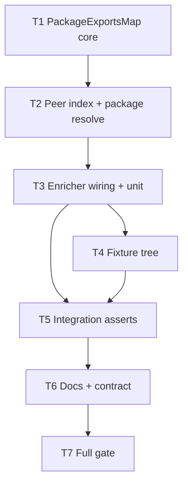

# Milestone 44 — Coupling Package Exports Tasks

**Design**: [`.specs/features/coupling-package-exports/design.md`](./design.md)  
**Spec**: [`.specs/features/coupling-package-exports/spec.md`](./spec.md)  
**Context**: [`.specs/features/coupling-package-exports/context.md`](./context.md)  
**Status**: Planned

---

## Execution Plan

### Phase 1: Package map foundation (Sequential)

```
T1 PackageExportsMap core → T2 Peer package index + resolvePackageSpecifier
```

### Phase 2: Enricher wiring (Sequential)

```
T2 → T3 Wire resolutionBases + enrich unit tests (M14/M27/M33 + exports/imports)
```

### Phase 3: Fixtures + integration (Parallel-safe after T3)

```
T3 → T4 Fixture tree [P with nothing else editing scoring]
T3, T4 → T5 Integration / fixture asserts
```

### Phase 4: Docs + contract + gate (Sequential)

```
T5 → T6 Docs (ARCHITECTURE, CONCERNS gap removal, STRUCTURE) + contract regression
T6 → T7 Full gate
```



### Diagram-Definition Cross-Check

| Task | Depends on (declared) | Diagram shows | Match |
| ---- | --------------------- | ------------- | ----- |
| T1 | None | Root | ✅ |
| T2 | T1 | T1→T2 | ✅ |
| T3 | T2 | T2→T3 | ✅ |
| T4 | T3 | T3→T4 | ✅ |
| T5 | T3, T4 | T3→T5, T4→T5 | ✅ |
| T6 | T5 | T5→T6 | ✅ |
| T7 | T6 | T6→T7 | ✅ |

### Path Conflict Check (Check 5)

| Task | Module owner | Paths | Conflict with parallel peers |
| ---- | ------------ | ----- | ---------------------------- |
| T1 | `src/scoring/` | `package-exports-map.ts`, `package-exports-map.test.ts` | Sole owner of new module |
| T2 | `src/scoring/` | same `package-exports-map.ts` (+ test) | After T1 — sole owner |
| T3 | `src/scoring/` | `enrich-coupling-static.ts`, `enrich-coupling-static.test.ts`; may import package-exports-map only | After T2 — sole enricher owner; **do not** edit package-exports-map except import |
| T4 | `tests/fixtures/` | `tests/fixtures/repos/package-exports-coupling/**` (+ README) | Disjoint from T3 scoring files — may start after T3 API stable; **not [P] with T3** (depends on resolution behavior for fixture design). No parallel peer. |
| T5 | scoring + scan tests | `enrich-coupling-static.test.ts` and/or `src/scan.integration.test.ts` | After T3+T4; sole test owner for this slice |
| T6 | docs + contract | `.specs/codebase/ARCHITECTURE.md`, `CONCERNS.md`, `STRUCTURE.md`; `tests/contract/` only if assert tweaks needed | After T5 |
| T7 | gate | none (run only) | After T6 |

> **[P]**: None required. T1→T2→T3 are sequential on overlapping/adjacent scoring files. T4 is fixtures-only but depends on T3 for known resolution rules — keep sequential. Check 5: one module owner per in-flight task.

### Test Co-location Validation

| Task | Code layer created/modified | Matrix / TESTING.md expectation | Task Tests field | Match |
| ---- | --------------------------- | ------------------------------- | ---------------- | ----- |
| T1 | `src/scoring/package-exports-map.ts` | unit required | unit — `package-exports-map.test.ts` | ✅ |
| T2 | same module | unit required | unit — extend same test file | ✅ |
| T3 | `src/scoring/enrich-coupling-static.ts` | unit required | unit — `enrich-coupling-static.test.ts` | ✅ |
| T4 | fixtures only | none / fixture-builder | none (tree + README expectations) | ✅ |
| T5 | integration / enrich asserts | integration or unit on fixture | unit and/or integration | ✅ |
| T6 | docs + optional contract | contract regression | contract — `pnpm test -- tests/contract` (or full) | ✅ |
| T7 | gate | full gate | gate — `pnpm build && pnpm test` | ✅ |

### Requirement → Task Mapping

| Requirement ID | Task(s) |
| -------------- | ------- |
| HOTSPOT-590 | T3, T5 |
| HOTSPOT-591 | T3 |
| HOTSPOT-592 | T3 |
| HOTSPOT-593 | T3 |
| HOTSPOT-594 | T1, T3, T5 |
| HOTSPOT-595 | T1, T2, T3 |
| HOTSPOT-596 | T2, T3 |
| HOTSPOT-597 | T1, T3 |
| HOTSPOT-598 | T1, T3 |
| HOTSPOT-599 | T2, T3 |
| HOTSPOT-600 | T3 |
| HOTSPOT-601 | T1, T2, T3 |
| HOTSPOT-602 | T3, T6 |
| HOTSPOT-603 | T6 |
| HOTSPOT-604 | T4, T5 |
| HOTSPOT-605 | T4, T5 |
| HOTSPOT-606 | T3 |
| HOTSPOT-607 | T1, T3 |
| HOTSPOT-608 | T6 |
| HOTSPOT-609 | T6 |
| HOTSPOT-610 | T1, T3 |
| HOTSPOT-611 | T1, T3 |
| HOTSPOT-612 | T1, T3 |
| HOTSPOT-613 | T3 |
| HOTSPOT-614 | T7 |

**Coverage:** 25 total, 25 mapped, 0 unmapped

---

## Task Breakdown

### T1: PackageExportsMap core — parse, imports, exports expansion

**What**: Create `PackageExportsMap` with nearest-`package.json` load (cached), `#` `imports` resolution (exact + single-`*`), and `exports` target expansion (string/object/conditions/array/single-`*`) plus `"main"` fallback when `exports` absent — returning repo-relative base path candidates. No peer name index yet (stubs OK only if unused).
**Where**: `src/scoring/package-exports-map.ts`, `src/scoring/package-exports-map.test.ts`
**Depends on**: None
**Reuses**: Walk-up pattern from `tsconfig-path-map.ts`; single-`*` match ideas from M27
**Requirement**: HOTSPOT-594, HOTSPOT-595, HOTSPOT-597, HOTSPOT-598, HOTSPOT-601, HOTSPOT-607, HOTSPOT-610, HOTSPOT-611, HOTSPOT-612
**Module owner**: `src/scoring/`

**Tools**:

- MCP: NONE
- Skill: `vitals-pipeline-domain`, `coding-guidelines`

**Done when**:

- [ ] `loadScopeForImporter` / `resolveImportSpecifier` / exports expansion helpers implemented per context.md
- [ ] Unit tests: `#` exact + `*`, conditional exports union, main fallback, malformed JSON → null/miss
- [ ] No ts-morph; no `node_modules` reads
- [ ] `pnpm test -- src/scoring/package-exports-map.test.ts` passes

**Tests**: unit  
**Gate**: `pnpm test -- src/scoring/package-exports-map.test.ts`

---

### T2: Peer-scoped package name index + resolvePackageSpecifier

**What**: Add `indexPeers(peerPaths)` and `resolvePackageSpecifier` so bare/scoped package names (and `name/subpath`) resolve via peer-owned in-repo packages’ `exports`/`main`. External names not in the index miss. Still no enricher wiring.
**Where**: `src/scoring/package-exports-map.ts`, `src/scoring/package-exports-map.test.ts`
**Depends on**: T1
**Reuses**: T1 scope cache; peer walk-up to package.json
**Requirement**: HOTSPOT-595, HOTSPOT-596, HOTSPOT-599, HOTSPOT-601
**Module owner**: `src/scoring/`

**Tools**:

- MCP: NONE
- Skill: `vitals-pipeline-domain`, `coding-guidelines`

**Done when**:

- [ ] Peers index by package directory + `name`
- [ ] `resolvePackageSpecifier` matches `@scope/pkg` and subpaths to candidates under that package
- [ ] Names not in index → `[]` (no node_modules fallback)
- [ ] Self-package name from importer scope works when indexed
- [ ] Unit tests cover index + miss + subpath
- [ ] `pnpm test -- src/scoring/package-exports-map.test.ts` passes

**Tests**: unit  
**Gate**: `pnpm test -- src/scoring/package-exports-map.test.ts`

---

### T3: Wire into enricher + unit coverage (exports/imports + regressions)

**What**: Construct `PackageExportsMap`, `indexPeers` once in `buildStaticEdgeGraph` / `enrichCouplingStaticDeps`; extend `resolutionBases` order (relative → tsconfig → `#` imports → package exports). Preserve M33 one-read-per-peer source behavior; cache package.json reads. Add enrich unit cases for exports entry, `#` imports, external miss, kind/direction, ranking fields unchanged, M14/M27 regression, read-once for sources + package.json.
**Where**: `src/scoring/enrich-coupling-static.ts`, `src/scoring/enrich-coupling-static.test.ts`
**Depends on**: T2
**Reuses**: Existing graph build, `buildResolutionCandidates`, M33 tests
**Requirement**: HOTSPOT-590–593, HOTSPOT-594–602, HOTSPOT-606–607, HOTSPOT-610–613
**Module owner**: `src/scoring/`

**Tools**:

- MCP: NONE
- Skill: `vitals-pipeline-domain`, `coding-guidelines`, `task-implementer`

**Done when**:

- [ ] Package resolution wired; public `enrichCouplingStaticDeps(pairs, repoPath)` signature unchanged
- [ ] Temp-repo unit: exports + imports → `hasStaticDependency: true` + correct direction/kinds
- [ ] External-only package name → false (given no tsconfig hit)
- [ ] `couplingStrength` / order untouched assertions
- [ ] Existing relative/alias/read-once tests still pass; package.json read-once across multi-pair hub
- [ ] `pnpm test -- src/scoring/enrich-coupling-static.test.ts src/scoring/package-exports-map.test.ts` passes

**Tests**: unit  
**Gate**: `pnpm test -- src/scoring/enrich-coupling-static.test.ts src/scoring/package-exports-map.test.ts`

---

### T4: Fixture tree for exports + imports cases

**What**: Add `tests/fixtures/repos/package-exports-coupling/` (or agreed slug) with workspace-style packages demonstrating (1) cross-package `exports` entry import and (2) `#` `imports` mapping to a peer file. Include README with expected static-edge outcomes. Prefer minimal git history only if integration scan needs churn pairs; otherwise document that enrich unit/integration injects pairs — fixture-builder may create sources + package.json without full git if tests use enrich API directly. If scan integration is required in T5, include enough commits for a coupling pair above `--min-cochange` default or test with injected pairs.
**Where**: `tests/fixtures/repos/package-exports-coupling/**`
**Depends on**: T3
**Reuses**: Existing fixture repo patterns; prefer `fixture-builder` agent
**Requirement**: HOTSPOT-604, HOTSPOT-605
**Module owner**: `tests/fixtures/`

**Tools**:

- MCP: NONE
- Skill: (agent) `fixture-builder`

**Done when**:

- [ ] Tree contains package.json `exports` and `imports` examples under repoPath
- [ ] README documents expected enrich outcomes for key pairs
- [ ] No edits to `src/scoring/` in this task

**Tests**: none  
**Gate**: N/A (tree review) — verify paths exist

---

### T5: Integration / fixture asserts

**What**: Assert fixture (or enrich against fixture paths) yields static edges for exports and imports cases; keep external miss covered. Prefer co-located enrich tests loading fixture files; add `scan.integration` only if full pipeline needed for confidence.
**Where**: `src/scoring/enrich-coupling-static.test.ts` and/or `src/scan.integration.test.ts`
**Depends on**: T3, T4
**Reuses**: Fixture README expectations
**Requirement**: HOTSPOT-590, HOTSPOT-594, HOTSPOT-604, HOTSPOT-605
**Module owner**: `src/scoring/` (or scan tests if integration)

**Tools**:

- MCP: NONE
- Skill: `vitals-cli-validation` (only if CLI scan assert added), `coding-guidelines`

**Done when**:

- [ ] Exports case → `hasStaticDependency: true`
- [ ] Imports `#` case → `hasStaticDependency: true`
- [ ] Documented direction/kinds match README where specified
- [ ] Targeted vitest passes

**Tests**: unit and/or integration  
**Gate**: `pnpm test -- src/scoring/enrich-coupling-static.test.ts` (and integration file if touched)

---

### T6: Docs sync + CONCERNS gap removal + contract regression

**What**: Update ARCHITECTURE § Enriched coupling (document exports/imports; remove deferred package.json line). Update CONCERNS enriched-coupling mitigation table; **remove** Unmitigated matrix row for `package.json` `exports`/`imports` and adjust the ASCII risk grid if needed. Update STRUCTURE.md scoring file list. Confirm contract tests still pass without schema property changes. Note: planning already marked the gap Planned (M44) — this task completes removal on Execute.
**Where**: `.specs/codebase/ARCHITECTURE.md`, `.specs/codebase/CONCERNS.md`, `.specs/codebase/STRUCTURE.md`; `tests/contract/` only if needed
**Depends on**: T5
**Reuses**: M27/M33 doc style
**Requirement**: HOTSPOT-602, HOTSPOT-603, HOTSPOT-608, HOTSPOT-609
**Module owner**: docs (+ contract)

**Tools**:

- MCP: NONE
- Skill: `vitals-spec-driven` docs norms / none

**Done when**:

- [ ] ARCHITECTURE documents package resolution + in-repo boundary
- [ ] CONCERNS unmitigated `exports`/`imports` row **gone**; mitigation listed under enriched coupling
- [ ] STRUCTURE lists `package-exports-map`
- [ ] `pnpm test -- tests/contract` (or equivalent) passes

**Tests**: contract  
**Gate**: `pnpm test -- tests/contract`

---

### T7: Full quality gate

**What**: Run project gate; fix only regressions introduced by M44 if any.
**Where**: repo root (no feature code unless gate fails)
**Depends on**: T6
**Reuses**: N/A
**Requirement**: HOTSPOT-614
**Module owner**: gate

**Tools**:

- MCP: NONE
- Skill: (agent) `verifier-quality-gates`

**Done when**:

- [ ] `pnpm build && pnpm test` exits 0
- [ ] Coverage thresholds still met for new scoring files
- [ ] tasks.md checkboxes complete; Status → Done (orchestrator Phase F)
- [ ] ROADMAP M44 marked Done (orchestrator)

**Tests**: gate  
**Gate**: `pnpm build && pnpm test`

---

## Parallelism notes

- No `[P]` flags: T1–T3 share or sequentially own `src/scoring/` paths; T4 depends on T3 semantics; T5–T7 sequential.
- If a future split extracts shared `*` helpers into a tiny util, keep ownership under `src/scoring/` and avoid parallel edits with T1–T3.

---

## Handoff

Status **Planned**. Promote to `Approved` / `Ready for Execute`, then in a **new** session invoke `orchestrator-implementer`.

Suggested implementer routing: T1–T3 + T5 → `implementer` (`src/scoring/`); T4 → `fixture-builder`; T6 docs in implementer or orchestrator; T7 → `verifier-quality-gates`.
