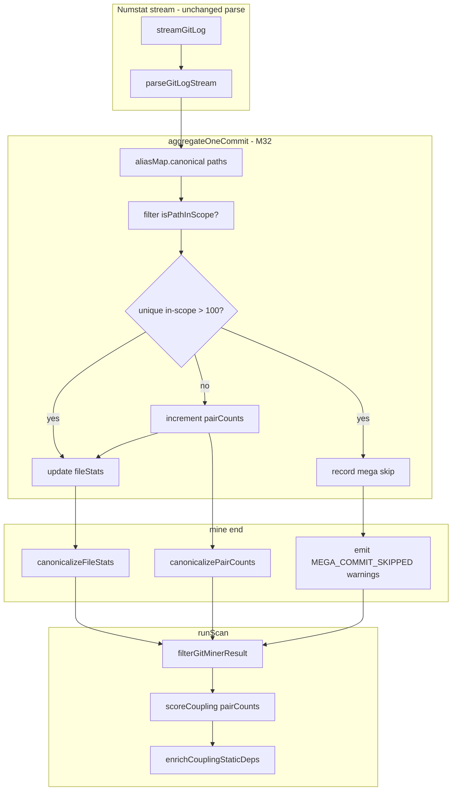

# Milestone 32 — Coupling Stream Aggregation Design

**Spec**: [`.specs/features/coupling-stream-aggregate/spec.md`](./spec.md)  
**Status**: Draft (planning)  
**Design SoT**: [ARCHITECTURE.md](../../codebase/ARCHITECTURE.md), [CONCERNS.md](../../codebase/CONCERNS.md)

---

## Architecture Overview

Replace the dual-structure git coupling feed (`CoChangeEvent[]` retained for a second pass) with **stream-time pair aggregation**. During each parsed commit, after rename canonicalization of paths and optional path-scope filtering, either:

1. **Skip** coupling increments when unique in-scope file count `> 100` (mega-commit), emit `MEGA_COMMIT_SKIPPED` warning accounting, still update `FileChangeStats`; or  
2. **Increment** `coChangeCount` for every unordered pair among in-scope unique paths.

`scoreCoupling` consumes the pair map directly. `filterGitMinerResult` filters `fileStats` and pair entries (both endpoints in scope). Line-by-line numstat streaming is unchanged (RT-001).



---

## Code Reuse Analysis

### Existing Components to Leverage

| Component | Location | How to Use |
| --------- | -------- | ---------- |
| `aggregateOneCommit` / accumulators | `src/git/aggregate.ts` | Replace `coChangeEvents[]` push with pair-count increments + mega-guard |
| `PathAliasMap` + canonicalize | `src/git/rename.ts`, `canonicalize.ts` | Add `canonicalizePairCounts`; keep `canonicalizeFileStats` |
| `createGitMiner` | `src/git/index.ts` | Wire optional `isPathInScope`; return pair counts + mega warnings |
| `filterGitMinerResult` | `src/paths/filter-git.ts` | Filter pair map instead of `coChangeEvents` |
| `scoreCoupling` | `src/scoring/coupling-scorer.ts` | Drop `aggregateCoChangeCounts` over events; score from map |
| `createTemporalCouplingScorer` | `src/scoring/index.ts` | Update `score` signature |
| `createScanWarning` | `src/diagnostics/logger.ts` | Build `MEGA_COMMIT_SKIPPED` warnings |
| Rename warning capping pattern | `src/git/rename-warnings.ts` | Mirror max-5 detail + summary for mega skips |
| Path scope | `src/paths/scope.ts` | Predicate from `runScan` — **callback** into git to avoid `git ↔ paths` cycle |

### Integration Points

| System | M32 behavior |
| ------ | ------------ |
| `src/git/aggregate.ts` | Owns pair map + mega threshold constant |
| `src/git/canonicalize.ts` | Remap/merge pair keys after full alias map |
| `src/git/index.ts` | Options + result shape; warning emission |
| `src/paths/filter-git.ts` | Filter `pairCounts` / `fileStats` |
| `src/scoring/coupling-scorer.ts` | Consume pair counts |
| `src/scan.ts` | Pass `isPathInScope`; wire pair counts to scorer |
| `src/index.ts` | Export any new public types if needed; `CoChangeEvent` may remain |
| JSON schemas | **No** ranking/schema field changes; warnings already `ScanWarning[]` |
| README / ARCHITECTURE / CONCERNS | Document aggregation + `MEGA_COMMIT_SKIPPED` |

---

## Design Decisions

| # | Decision | Rationale |
| - | -------- | --------- |
| D1 | **Skip** mega-commits for coupling (do not cap/truncate file lists) | Cap would arbitrarily choose which pairs count; skip is deterministic and matches “preserve ranking below guard” |
| D2 | Threshold = **`MEGA_COMMIT_UNIQUE_FILE_THRESHOLD = 100`** (strictly `>` skips) | `C(100,2)=4950` bounded; not a CLI flag (YAGNI). Document in CONCERNS |
| D3 | Mega-guard counts **in-scope unique** canonical paths only | ROADMAP: scope before/during aggregation; avoids false skips when `--include` is narrow |
| D4 | Churn (`FileChangeStats`) **not** gated by mega-commit | Coupling memory guard only; hotspot churn still sees the commit |
| D5 | Pass `isPathInScope?: (path: string) => boolean` into mine/aggregate — not `PathScope` type | Avoids circular import (`paths` already imports `GitMinerResult`) |
| D6 | Replace production `coChangeEvents[]` with `Map` (or equivalent) of pair counts | Core memory win; second pass removed |
| D7 | `canonicalizePairCounts` at mine end | Same rename-finalization need as today's `canonicalizeCoChangeEvents` |
| D8 | Warning code **`MEGA_COMMIT_SKIPPED`**; max **5** detail lines + **1** summary | Matches M26/M28 noise control; additive to `meta.warnings` only intentional JSON-visible change |
| D9 | `filterGitMinerResult` keeps defense-in-depth filtering | Miner tests may omit predicate; scan always passes predicate |
| D10 | Keep exporting `CoChangeEvent` type | No forced public type deletion; production path stops retaining event arrays |

---

## Components

### Pair-count accumulators (`src/git/aggregate.ts`)

- **Purpose**: Stream-time `pair → { fileA, fileB, coChangeCount }` + mega-guard.
- **Interfaces** (illustrative):
  - `MEGA_COMMIT_UNIQUE_FILE_THRESHOLD = 100`
  - `AggregateAccumulators`: `{ fileStats, pairCounts, megaCommitSkips }`
  - `aggregateOneCommit(commit, aliasMap, acc, options?: { isPathInScope?: (p: string) => boolean })`
- **Pair key**: lexicographic `fileA|fileB` with `fileA < fileB` (reuse scorer helpers or shared util — prefer single canonical helper to avoid drift).
- **Dependencies**: `PathAliasMap`, parse types; optional scope callback.
- **Reuses**: Existing file-stats update loop; remove `coChangeEvents.push`.

### Canonicalize pair counts (`src/git/canonicalize.ts`)

- **Purpose**: After full rename map, remap both endpoints and **merge** counts for identical canonical pairs.
- **Interfaces**: `canonicalizePairCounts(pairCounts, aliasMap): Map<...>`
- **Note**: Events that shrink to `< 2` unique canonical paths after remap contribute nothing (drop degenerate pairs). Prefer remapping at pair level; if implementers need commit-level remap fidelity, document any residual edge in tests — target parity with “canonicalize events then expand pairs”.

### Mega-commit warnings (`src/git/` — e.g. `mega-commit-warnings.ts` or beside rename-warnings)

- **Purpose**: Build capped `ScanWarning[]` with `code: "MEGA_COMMIT_SKIPPED"`.
- **Message shape** (normative intent):
  - Detail: `Mega-commit skipped for coupling (N unique in-scope files > 100): <hash>`
  - Summary: `Mega-commit coupling skips: <total> commit(s) exceeded 100 unique in-scope files`
- **Severity**: `warning`
- **Reuses**: `createScanWarning` from diagnostics.

### GitMiner result / options (`src/git/index.ts`)

- **`GitMinerOptions`**: add optional `isPathInScope?: (path: string) => boolean`
- **`GitMinerResult`**: `{ fileStats, pairCounts, warnings }` — **remove** production dependence on `coChangeEvents`
- Emit mega warnings after stream alongside existing rename / empty-since warnings

### Path filter (`src/paths/filter-git.ts`)

- Filter `fileStats` unchanged
- Map/filter `pairCounts`: keep entry iff both `fileA` and `fileB` are in scope
- Pass through `warnings`

### Coupling scorer (`src/scoring/coupling-scorer.ts`)

- **`scoreCoupling(pairCounts, fileStats, minCochange)`** — iterate map values; apply `minCochange`, denominator, sort
- Delete (or stop using) `aggregateCoChangeCounts(CoChangeEvent[])`
- Update `createTemporalCouplingScorer` deps injection accordingly

### Scan wiring (`src/scan.ts`)

```ts
const rawGit = await miner.mine({
  repoPath,
  since,
  onProgress,
  isPathInScope: (p) => isPathInScope(p, scope),
});
const { fileStats, pairCounts, warnings } = filterGitMinerResult(rawGit, scope);
const scoredCoupling = createTemporalCouplingScorer().score(
  pairCounts,
  fileStats,
  minCochange,
);
```

---

## Data Models

```ts
/** Unordered co-change pair tally (production coupling feed). */
interface CoChangePairCount {
  fileA: string;
  fileB: string;
  coChangeCount: number;
}

interface AggregateAccumulators {
  fileStats: Map<string, FileChangeStats>;
  pairCounts: Map<string, CoChangePairCount>; // key: `${fileA}|${fileB}`
  megaCommitSkips: { hash: string; uniqueFileCount: number }[];
}

interface GitMinerResult {
  fileStats: Map<string, FileChangeStats>;
  pairCounts: Map<string, CoChangePairCount>;
  warnings: ScanWarning[];
}
```

`CoChangeEvent` may remain in `src/types/domain.ts` for compatibility; not required on `GitMinerResult` after M32.

### Warning catalog addition

| Code | Emitter | Operator interpretation |
| ---- | ------- | ----------------------- |
| `MEGA_COMMIT_SKIPPED` | git miner | One or more commits exceeded 100 unique in-scope files; those commits did not contribute to coupling pair counts. Churn still counted. Consider splitting bulk commits or narrowing scope. |

---

## Ranking / formula invariants

| Invariant | M32 stance |
| --------- | ---------- |
| `couplingStrength = coChangeCount / min(commitsA, commitsB)` | Unchanged |
| Sort: strength desc, then `fileA` localeCompare | Unchanged |
| `--min-cochange` | Unchanged |
| Static enrich fields / ranking | Unchanged |
| Published hotspot/coupling JSON item shapes | Unchanged |
| Coupling **values** when any mega-commit skipped | **May differ** from pre-M32 — documented exception only |

---

## Risks (CONCERNS)

| Risk | Mitigation |
| ---- | ---------- |
| Git streaming / dual-output fragility | Unit tests: fileStats + pairCounts from same stream; keep large-synthetic streaming fixture |
| Rename canonicalize drift vs old event remap | Golden tests: rename fixtures → same pairs as expand-after-canonicalize reference |
| Scope/mega interaction regression | Explicit tests: large out-of-scope + small in-scope still couples |
| Warning flood | Cap 5 + summary |
| Accidental formula change | Parity tests from existing coupling-scorer fixtures |
| Import cycle git↔paths | Callback predicate only |

---

## Testing Strategy

| Layer | What |
| ----- | ---- |
| Unit `aggregate.test.ts` | Pair increments; threshold 100 vs 101; churn on mega skip; scope callback |
| Unit `canonicalize.test.ts` | Pair key remap + merge |
| Unit mega warnings | Cap 5 + summary; code/severity |
| Unit `filter-git.test.ts` | Pair map filtering; `<2` equivalent (no single-file pairs) |
| Unit `coupling-scorer.test.ts` | Same expected rankings from pair-count inputs |
| Unit / integration miner + scan | Wire `isPathInScope`; warnings in `meta.warnings` |
| Fixture | Optional synthetic numstat with >100 files for miner integration — prefer unit-constructed `ParsedCommit` to avoid huge fixtures |

**Gate**: `pnpm build && pnpm test`

---

## Implementation Notes (non-goals)

- Do **not** add CLI `--mega-commit-threshold`
- Do **not** change McCabe / function-churn / enrich graph cache
- Do **not** buffer full git log
- Prefer shared `canonicalPair` / `pairKey` helper if both git aggregate and scorer need it (extract to small util under `src/git/` or `src/scoring/` with one owner — avoid duplication drift)
