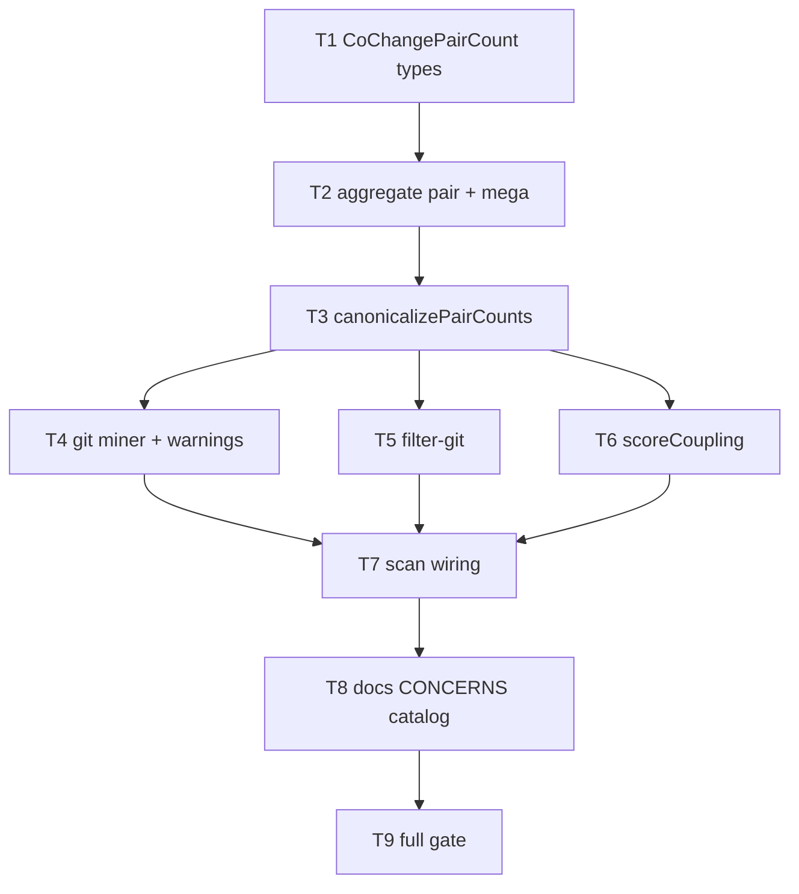

# Milestone 32 — Coupling Stream Aggregation Tasks

**Design**: [`.specs/features/coupling-stream-aggregate/design.md`](./design.md)  
**Spec**: [`.specs/features/coupling-stream-aggregate/spec.md`](./spec.md)  
**Status**: Done

---

## Execution Plan

### Phase 1: Types + pair aggregation core

```
T1 types ──→ T2 aggregate pairCounts + mega-guard ──→ T3 canonicalizePairCounts
```

### Phase 2: Miner warnings + path filter + scorer (parallel after T3)

```
T3 ──┬→ T4 git miner wiring + mega warnings ──┐
     ├→ T5 filter-git pairCounts [P]          ├──→ T7 scan wiring
     └→ T6 scoreCoupling pairCounts [P] ──────┘
```

### Phase 3: Docs + full gate

```
T7 → T8 docs → T9 full gate
```



### Diagram-Definition Cross-Check

| Task | Depends on (task body) | Diagram shows | Match |
| ---- | ---------------------- | ------------- | ----- |
| T1   | None                   | Root          | ✅    |
| T2   | T1                     | T1→T2         | ✅    |
| T3   | T2                     | T2→T3         | ✅    |
| T4   | T3                     | T3→T4         | ✅    |
| T5   | T3                     | T3→T5         | ✅    |
| T6   | T3                     | T3→T6         | ✅    |
| T7   | T4, T5, T6             | T4/T5/T6→T7   | ✅    |
| T8   | T7                     | T7→T8         | ✅    |
| T9   | T8                     | T8→T9         | ✅    |

### Path Conflict Check (Check 5)

| Task | Module owner                  | Paths                                                                                                          | Conflict                                           |
| ---- | ----------------------------- | -------------------------------------------------------------------------------------------------------------- | -------------------------------------------------- |
| T1   | `src/types/`                  | `src/types/domain.ts`, `src/types/index.ts`                                                                    | Sole owner                                         |
| T2   | `src/git/` (aggregate)        | `src/git/aggregate.ts`, `src/git/aggregate.test.ts`                                                            | Sole aggregate owner; not `[P]` with T3/T4         |
| T3   | `src/git/` (canonicalize)     | `src/git/canonicalize.ts`, `src/git/canonicalize.test.ts`                                                      | After T2; sequential with other git                |
| T4   | `src/git/` (miner + warnings) | `src/git/index.ts`, mega-warning helper, related `*.test.ts`, `src/git/index.test.ts`                          | Sole remaining git owner; **not** `[P]` with T2/T3 |
| T5   | `src/paths/`                  | `src/paths/filter-git.ts`, `src/paths/filter-git.test.ts`                                                      | Sole paths owner; `[P]` vs T4/T6                   |
| T6   | `src/scoring/`                | `src/scoring/coupling-scorer.ts`, `coupling-scorer.test.ts`, `src/scoring/index.ts`, `index.test.ts` as needed | Sole scoring owner; `[P]` vs T4/T5                 |
| T7   | `src/scan.ts`                 | `src/scan.ts`, `src/scan.test.ts`, `src/scan.integration.test.ts` as needed                                    | Sole scan owner — **no `[P]`**                     |
| T8   | docs                          | README, `.specs/codebase/CONCERNS.md`, `ARCHITECTURE.md` (+ TESTING if needed)                                 | Docs only                                          |
| T9   | verification                  | no module ownership edits                                                                                      | After T8                                           |

### Test Co-location Validation

| Task | Code layer             | TESTING.md expectation        | Task `Tests`                                 | Match |
| ---- | ---------------------- | ----------------------------- | -------------------------------------------- | ----- |
| T1   | `src/types/`           | none (excluded from coverage) | none                                         | ✅    |
| T2   | `src/git/aggregate`    | unit                          | unit                                         | ✅    |
| T3   | `src/git/canonicalize` | unit                          | unit                                         | ✅    |
| T4   | `src/git/` miner       | unit / git-log fixtures       | unit                                         | ✅    |
| T5   | `src/paths/`           | unit                          | unit                                         | ✅    |
| T6   | `src/scoring/`         | unit                          | unit                                         | ✅    |
| T7   | `src/scan.ts`          | unit / integration            | unit (+ integration if existing cases break) | ✅    |
| T8   | docs                   | none                          | none                                         | ✅    |
| T9   | gate                   | full                          | full gate                                    | ✅    |

### Requirement → Task Mapping

| Requirement ID | Task(s) |
| -------------- | ------- |
| HOTSPOT-320    | T2      |
| HOTSPOT-321    | T1, T4  |
| HOTSPOT-322    | T3      |
| HOTSPOT-323    | T6      |
| HOTSPOT-324    | T6      |
| HOTSPOT-325    | T2      |
| HOTSPOT-326    | T2      |
| HOTSPOT-327    | T4      |
| HOTSPOT-328    | T4, T7  |
| HOTSPOT-329    | T2, T4  |
| HOTSPOT-330    | T5      |
| HOTSPOT-331    | T6      |
| HOTSPOT-332    | T7      |
| HOTSPOT-333    | T8      |
| HOTSPOT-334    | T8      |

---

## Task Breakdown

### T1: Domain type `CoChangePairCount` + export

**What**: Add `CoChangePairCount` (`fileA`, `fileB`, `coChangeCount`) to domain types and export from `src/types/index.ts`. Keep `CoChangeEvent` exported for compatibility. Do not change `ScanResult` JSON shapes.

**Where**: `src/types/domain.ts`, `src/types/index.ts`

**Depends on**: None

**Reuses**: Existing domain type patterns next to `CoChangeEvent`

**Requirement**: HOTSPOT-321

**Module owner**: `src/types/`

**Tools**:

- Skill: `coding-guidelines`

**Done when**:

- [x] `CoChangePairCount` defined and exported
- [x] `CoChangeEvent` still exported
- [x] Typecheck consumers can import the new type (later tasks compile against it)

**Tests**: none (types excluded from coverage)

**Gate**: `pnpm exec tsc --noEmit -p tsconfig.json` (or project equivalent) — prefer deferred until T2 if types-only change is unused; minimum: no TS errors when T2 lands

**Commit** (propose only): `feat(types): add CoChangePairCount for stream coupling`

---

### T2: Aggregate pair counts + mega-commit guard

**What**: Change `AggregateAccumulators` / `AggregateResult` to accumulate `pairCounts: Map<string, CoChangePairCount>` instead of `coChangeEvents[]`. In `aggregateOneCommit`: canonicalize paths → optional `isPathInScope` filter → if unique in-scope count `> MEGA_COMMIT_UNIQUE_FILE_THRESHOLD` (100), record skip metadata and **do not** increment pairs; else increment all unordered pairs. Always update `fileStats` for paths that participate in stats policy (in-scope when predicate provided; all paths when omitted — match design D5/D9). Export the threshold constant.

**Where**: `src/git/aggregate.ts`, `src/git/aggregate.test.ts`

**Depends on**: T1

**Reuses**: Existing file-stats loop; lexicographic pair ordering (extract small helper if needed, owned here until T6 reuses)

**Requirement**: HOTSPOT-320, HOTSPOT-325, HOTSPOT-326, HOTSPOT-329

**Module owner**: `src/git/` (aggregate only)

**Tools**:

- Skill: `coding-guidelines`, `vitals-pipeline-domain`

**Done when**:

- [x] No scoring-path retention of `coChangeEvents[]` in accumulators
- [x] Commit with 100 unique in-scope files increments pairs; 101 skips pairs
- [x] Mega skip still increments `fileStats.commitCount` / lines / authors
- [x] Scope callback reduces unique set before mega-guard and pair increments
- [x] Unit tests cover pair math, threshold boundary, scope+mega interaction

**Tests**: unit (`src/git/aggregate.test.ts`)

**Gate**: `pnpm test -- src/git/aggregate.test.ts`

**Commit** (propose only): `feat(git): aggregate coupling pairs during numstat stream`

---

### T3: `canonicalizePairCounts`

**What**: Implement `canonicalizePairCounts` to remap both endpoints through final `PathAliasMap`, merge counts for identical canonical pairs, drop degenerate pairs (`fileA === fileB` after remap). Update/remove `canonicalizeCoChangeEvents` usage from production path (helper may remain only if still needed by tests — prefer delete dead production path). Update canonicalize tests.

**Where**: `src/git/canonicalize.ts`, `src/git/canonicalize.test.ts`

**Depends on**: T2

**Reuses**: `canonicalizeFileStats` merge mindset; `PathAliasMap.canonical`

**Requirement**: HOTSPOT-322

**Module owner**: `src/git/` (canonicalize)

**Tools**:

- Skill: `coding-guidelines`, `vitals-pipeline-domain`

**Done when**:

- [x] Rename-chain fixtures yield merged pair keys under final canonical paths
- [x] Counts sum when two pre-canonical keys collapse
- [x] Unit tests assert remap + merge

**Tests**: unit (`src/git/canonicalize.test.ts`)

**Gate**: `pnpm test -- src/git/canonicalize.test.ts`

**Commit** (propose only): `feat(git): canonicalize coupling pair counts after renames`

---

### T4: GitMiner result shape + mega warnings + scope option

**What**: Update `GitMinerOptions` with optional `isPathInScope`. Change `GitMinerResult` to return `pairCounts` (not `coChangeEvents`). After stream: `canonicalizeFileStats` + `canonicalizePairCounts`; emit `MEGA_COMMIT_SKIPPED` warnings (max 5 detail + summary) via `createScanWarning`. Update `src/git/index.ts` exports and miner unit tests / fixtures expectations. Do not invent new RT-003 rename warning families.

**Where**: `src/git/index.ts`, `src/git/index.test.ts`, new or extended warning helper under `src/git/` (e.g. `mega-commit-warnings.ts` + test), barrel exports as needed

**Depends on**: T3

**Reuses**: `createScanWarning`, rename-warning capping pattern

**Requirement**: HOTSPOT-321, HOTSPOT-327, HOTSPOT-328, HOTSPOT-329

**Module owner**: `src/git/` (miner)

**Tools**:

- Skill: `coding-guidelines`, `vitals-pipeline-domain`

**Done when**:

- [x] `mine()` returns `pairCounts` + structured warnings including mega skips when applicable
- [x] Empty mega case emits no `MEGA_COMMIT_SKIPPED`
- [x] Existing rename / empty-since warning tests still pass
- [x] Large-synthetic / basic miner tests updated for pairCounts

**Tests**: unit

**Gate**: `pnpm test -- src/git/`

**Commit** (propose only): `feat(git): expose pairCounts and MEGA_COMMIT_SKIPPED warnings`

---

### T5: `filterGitMinerResult` for pair counts [P]

**What**: Change `filterGitMinerResult` to filter `pairCounts` (keep pair iff both endpoints in scope) instead of mapping/filtering `coChangeEvents`. Keep `fileStats` + `warnings` behavior. Update `filter-git.test.ts`.

**Where**: `src/paths/filter-git.ts`, `src/paths/filter-git.test.ts`

**Depends on**: T3 (type/shape available; may stub against `CoChangePairCount`)

**Reuses**: `isPathInScope`

**Requirement**: HOTSPOT-330

**Module owner**: `src/paths/`

**Tools**:

- Skill: `coding-guidelines`

**Done when**:

- [x] Out-of-scope endpoints drop pairs
- [x] Warnings pass through unchanged
- [x] Unit tests rewritten for pair map

**Tests**: unit

**Gate**: `pnpm test -- src/paths/filter-git.test.ts`

**Commit** (propose only): `feat(paths): filter coupling pairCounts by path scope`

---

### T6: `scoreCoupling` consumes pair counts [P]

**What**: Change `scoreCoupling` (and `createTemporalCouplingScorer`) to accept `Map<string, CoChangePairCount>` or `Iterable<CoChangePairCount>` — **not** `CoChangeEvent[]` as production input. Remove event-expansion aggregation. Preserve formula, `minCochange`, sort, static-field defaults. Migrate all coupling-scorer tests to pair-count inputs with **identical** expected rankings for prior non-mega cases.

**Where**: `src/scoring/coupling-scorer.ts`, `src/scoring/coupling-scorer.test.ts`, `src/scoring/index.ts`, `src/scoring/index.test.ts` as needed

**Depends on**: T3 (shape); logically independent of T4/T5 implementation details

**Reuses**: Existing comparison / static default field construction

**Requirement**: HOTSPOT-323, HOTSPOT-324, HOTSPOT-331

**Module owner**: `src/scoring/`

**Tools**:

- Skill: `coding-guidelines`, `vitals-pipeline-domain`

**Done when**:

- [x] No production dependence on `CoChangeEvent[]` inside `scoreCoupling`
- [x] Prior fixture expectations still hold
- [x] Zero-denominator and min-cochange boundary tests still pass

**Tests**: unit

**Gate**: `pnpm test -- src/scoring/coupling-scorer.test.ts src/scoring/index.test.ts`

**Commit** (propose only): `feat(scoring): score coupling from pre-aggregated pair counts`

---

### T7: `runScan` wiring — scope predicate + pairCounts

**What**: Pass `isPathInScope: (p) => isPathInScope(p, scope)` into `createGitMiner().mine`. Thread `pairCounts` through `filterGitMinerResult` into `createTemporalCouplingScorer().score`. Ensure mega-commit warnings flow into `meta.warnings` / `onWarning` like other git warnings. Update scan unit/integration tests that asserted `coChangeEvents`.

**Where**: `src/scan.ts`, `src/scan.test.ts`, `src/scan.integration.test.ts` (only as needed)

**Depends on**: T4, T5, T6

**Reuses**: Existing warning aggregation / forward helpers

**Requirement**: HOTSPOT-328, HOTSPOT-332

**Module owner**: `src/scan.ts`

**Tools**:

- Skill: `coding-guidelines`, `vitals-pipeline-domain`, `vitals-cli-validation` (if CLI fixture assertions break)

**Done when**:

- [x] Scan path compiles and uses pairCounts end-to-end
- [x] Mega warnings appear in `ScanResult.meta.warnings` when fixture triggers skip
- [x] Existing integration scans still exit `0` with coherent coupling

**Tests**: unit (+ integration if existing cases require updates)

**Gate**: `pnpm test -- src/scan.test.ts src/scan.integration.test.ts`

**Commit** (propose only): `feat(scan): wire scoped pairCounts into coupling score`

---

### T8: Docs — CONCERNS, ARCHITECTURE, README catalog

**What**: Document stream pair aggregation (no full `coChangeEvents[]` for scoring), mega-commit skip at unique in-scope `> 100`, churn still counted, and add `MEGA_COMMIT_SKIPPED` to the warning catalog (ARCHITECTURE + README). Update CONCERNS Git + Performance rows (replace “Single-pass produces CoChangeEvent[]” mitigation with pair-count aggregation + mega-guard). Touch TESTING.md only if fixture guidance must mention mega-commit cases.

**Where**: `.specs/codebase/CONCERNS.md`, `.specs/codebase/ARCHITECTURE.md`, `README.md` (warning catalog section); optional `.specs/codebase/TESTING.md`

**Depends on**: T7

**Reuses**: M28 catalog table format

**Requirement**: HOTSPOT-333, HOTSPOT-334

**Module owner**: docs

**Tools**:

- Skill: none required

**Done when**:

- [x] CONCERNS documents mega-guard + stream pair aggregation
- [x] ARCHITECTURE + README list `MEGA_COMMIT_SKIPPED`
- [x] Pipeline prose no longer claims scoring depends on retained `CoChangeEvent[]`

**Tests**: none

**Gate**: none (docs); verified by T9 review

**Commit** (propose only): `docs: document coupling stream aggregate and MEGA_COMMIT_SKIPPED`

---

### T9: Full quality gate

**What**: Run the project gate and fix any remaining breakages from M32 (export barrels, public `src/index.ts` if `GitMinerResult` re-exported, stray `coChangeEvents` references).

**Where**: repo-wide as needed for compile/test fixes only — no new features

**Depends on**: T8

**Reuses**: n/a

**Requirement**: (gate for HOTSPOT-320–334)

**Module owner**: verification

**Tools**:

- Agent (dev session): `verifier-quality-gates`
- Skill: `vitals-cli-validation` if CLI smoke needed

**Done when**:

- [x] `pnpm build && pnpm test` passes
- [x] No production path retains full `coChangeEvents[]` for coupling scoring
- [x] All tasks T1–T8 Done when checked

**Tests**: full suite

**Gate**: `pnpm build && pnpm test`

**Commit** (propose only): only if gate fixes needed; otherwise no extra commit

---

## Parallelism notes

- **T5 ∥ T6 ∥ T4** after T3 — disjoint module owners (`paths`, `scoring`, `git` miner)
- Do **not** parallelize T2/T3/T4 (same `src/git/` ownership chain)
- T7 is sole `src/scan.ts` editor

---

## Handoff

Planning session ends here (**Status: Planned**).

1. Review `spec.md` / `design.md` / `tasks.md`
2. Promote Status → `Approved` or `Ready for Execute`
3. **New development session** → `orchestrator-implementer`
4. Expected final gate: `pnpm build && pnpm test`

**ROADMAP / STATE sync**: deferred to parent agent (per planning request — do not edit in this session).
